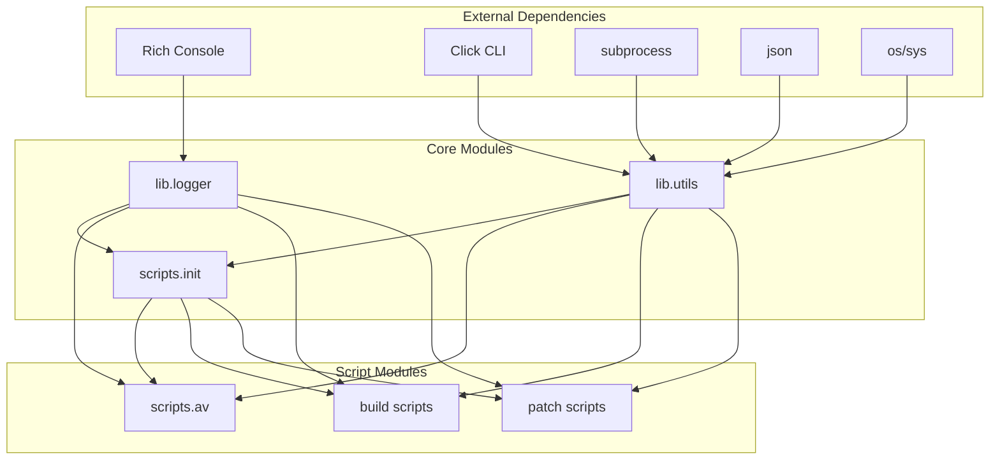

# API Reference

## Python Module Documentation

This document provides comprehensive API documentation for all Python modules in the Custom Browser project.

## Module Dependencies



## lib.logger Module

### Logger Class

Main logging class providing rich console output with colors, icons, and formatting.

```python
from lib.logger import Logger, logger

# Use singleton instance
logger.info("Message")

# Or create new instance
custom_logger = Logger()
```

#### Methods

##### `__init__(self)`
Initializes the Logger with Rich console support.

##### `info(self, message: str) -> None`
Logs an informational message with cyan info icon.
- **Parameters**: `message` - String message to log
- **Output**: `[HH:MM:SS] ℹ message`

##### `status(self, message: str) -> None`
Logs a status update with blue status indicator.
- **Parameters**: `message` - Status message
- **Output**: `[HH:MM:SS] ◦ message`

##### `success(self, message: str) -> None`
Logs a success message with green checkmark.
- **Parameters**: `message` - Success message
- **Output**: `[HH:MM:SS] ✓ message`

##### `error(self, message: str) -> None`
Logs an error message with red X indicator.
- **Parameters**: `message` - Error message
- **Output**: `[HH:MM:SS] ✗ message`

##### `warning(self, message: str) -> None`
Logs a warning message with yellow warning icon.
- **Parameters**: `message` - Warning message
- **Output**: `[HH:MM:SS] ⚠ message`

##### `debug(self, message: str) -> None`
Logs a debug message with dimmed output.
- **Parameters**: `message` - Debug message
- **Output**: `[HH:MM:SS] ◦ message` (dimmed)

##### `progress(self, message: str) -> None`
Logs a progress update with cyan indicator.
- **Parameters**: `message` - Progress message
- **Output**: `[HH:MM:SS] ◦ message`

##### `step(self, current: int, total: int, message: str) -> None`
Logs step progress in multi-step operations.
- **Parameters**: 
  - `current` - Current step number
  - `total` - Total number of steps
  - `message` - Step description
- **Output**: `[HH:MM:SS] [current/total] message`

##### `title(self, message: str) -> None`
Logs a section title with bold formatting.
- **Parameters**: `message` - Title text
- **Output**: `=== message ===` (bold cyan)

##### `subtitle(self, message: str) -> None`
Logs a subtitle with blue formatting.
- **Parameters**: `message` - Subtitle text
- **Output**: `--- message ---` (bold blue)

##### `command(self, cwd: str, cmd: str, args: list) -> None`
Logs command execution with directory context.
- **Parameters**:
  - `cwd` - Working directory (optional)
  - `cmd` - Command being executed
  - `args` - Command arguments list
- **Output**: Directory path and command with arguments

##### `list(self, items: list, style: str = "info") -> None`
Logs multiple items as a formatted list.
- **Parameters**:
  - `items` - List of items to display
  - `style` - Display style ("info", "success", "warning")

##### `spinner_context(self, message: str) -> SpinnerContext`
Creates a context manager for spinner operations.
- **Parameters**: `message` - Spinner description
- **Returns**: SpinnerContext object
- **Usage**:
```python
with logger.spinner_context("Processing..."):
    long_running_operation()
```

##### `progress_context(self, description: str) -> ProgressContext`
Creates a context manager for progress operations.
- **Parameters**: `description` - Progress description
- **Returns**: ProgressContext object
- **Usage**:
```python
with logger.progress_context("Downloading") as progress:
    for item in items:
        progress.update(f"Processing {item}")
```

### Context Managers

#### SpinnerContext Class

Context manager for displaying spinners during operations.

##### `__enter__(self) -> SpinnerContext`
Starts the spinner display.

##### `__exit__(self, exc_type, exc_val, exc_tb) -> None`
Stops the spinner display.

##### `update(self, message: str) -> None`
Updates the spinner message.
- **Parameters**: `message` - New message to display

#### ProgressContext Class

Context manager for progress operations.

##### `__enter__(self) -> ProgressContext`
Starts the progress display.

##### `__exit__(self, exc_type, exc_val, exc_tb) -> None`
Stops the progress display.

##### `update(self, description: str = None, advance: int = 1) -> None`
Updates the progress display.
- **Parameters**:
  - `description` - New description (optional)
  - `advance` - Progress increment amount

### Global Functions

Module-level convenience functions for backward compatibility:

```python
from lib.logger import info, status, success, error, warning, debug
from lib.logger import progress, step, title, subtitle, command
```

## lib.utils Module

### Configuration Functions

#### `get_npm_config(path: list) -> Any`
Retrieves NPM configuration values from environment or package.json.
- **Parameters**: `path` - List of configuration keys to traverse
- **Returns**: Configuration value or None
- **Example**:
```python
repo_url = get_npm_config(['projects', 'custom-core', 'repository', 'url'])
branch = get_npm_config(['projects', 'custom-core', 'branch'])
```

#### `get_npm_config_from_env(path: list) -> str | None`
Retrieves configuration from environment variables (NPM <= 6 style).
- **Parameters**: `path` - List of configuration keys
- **Returns**: String value or None

#### `get_npm_config_from_package_json(path: list) -> Any`
Retrieves configuration from package.json file (NPM >= 8 style).
- **Parameters**: `path` - List of configuration keys
- **Returns**: Configuration value or None

#### `get_project_version(project_name: str) -> str | None`
Gets the version (tag or branch) for a specified project.
- **Parameters**: `project_name` - Name of the project
- **Returns**: Version string or None
- **Example**:
```python
version = get_project_version('custom-core')  # Returns 'master' or tag name
```

### Command Execution Functions

#### `run(cmd: str, args: list = None, **options) -> subprocess.CompletedProcess | None`
Executes commands with comprehensive error handling and logging.
- **Parameters**:
  - `cmd` - Command to execute
  - `args` - Command arguments (optional)
  - `**options` - Additional subprocess options
- **Returns**: CompletedProcess object or None on failure
- **Options**:
  - `cwd` - Working directory
  - `env` - Environment variables
  - `timeout` - Command timeout in seconds
  - `stream_output` - Enable real-time output streaming
  - `shell` - Use shell execution

**Example**:
```python
result = run('git', ['clone', repo_url], cwd='/path/to/dir', timeout=300)
if result and result.returncode == 0:
    print("Command succeeded")
```

#### `run_with_retry(cmd: str, args: list = None, max_retries: int = 3, base_timeout: int = 7200, backoff_factor: float = 1.5, **options) -> subprocess.CompletedProcess | None`
Executes commands with automatic retry logic for timeout and failure scenarios.
- **Parameters**:
  - `cmd` - Command to execute
  - `args` - Command arguments (optional)
  - `max_retries` - Maximum number of retry attempts (default: 3)
  - `base_timeout` - Initial timeout in seconds (default: 7200 = 2 hours)
  - `backoff_factor` - Timeout multiplier for each retry (default: 1.5)
  - `**options` - Additional subprocess options
- **Returns**: CompletedProcess object or None after all retries fail
- **Retry Logic**: Each retry uses progressively longer timeouts with brief delays
- **Use Cases**: Long-running operations like gclient sync, large downloads, network-dependent tasks

**Example**:
```python
# Sync operation with retry: 2h → 3h → 4.5h timeouts
result = run_with_retry(
    'npm', ['run', 'sync'], 
    max_retries=2,
    base_timeout=7200,
    cwd=project_dir,
    stream_output=True
)
if result and result.returncode == 0:
    print("Sync succeeded (possibly after retries)")
```

#### `run_git(directory: Path, args: list) -> str | None`
Executes Git commands in specified directory.
- **Parameters**:
  - `directory` - Working directory path
  - `args` - Git command arguments
- **Returns**: Command output string or None
- **Example**:
```python
sha = run_git(repo_path, ['rev-parse', 'HEAD'])
status = run_git(repo_path, ['status', '--porcelain'])
```

### Validation Functions

#### `validate_git_available() -> bool`
Validates Git installation and availability.
- **Returns**: True if Git is available, False otherwise
- **Checks**:
  - Git command existence in PATH
  - Git version compatibility
  - Basic Git functionality

#### `validate_npm_available() -> str | None`
Validates NPM installation and returns command to use.
- **Returns**: NPM command string or None if not available
- **Detection Order**:
  1. `npm` command
  2. `npm.cmd` (Windows)
  3. Platform-specific variations

#### `validate_python_available() -> bool`
Validates Python installation and configuration.
- **Returns**: True if Python is properly configured
- **Checks**:
  - Python 3.8+ requirement
  - Module import capabilities
  - PATH configuration

### File System Functions

#### `ensure_directory_exists(path: Path, description: str) -> bool`
Creates directory if it doesn't exist with error handling.
- **Parameters**:
  - `path` - Directory path to create
  - `description` - Human-readable description for error messages
- **Returns**: True if directory exists or was created successfully
- **Example**:
```python
success = ensure_directory_exists(Path('build/output'), 'build output directory')
```

### Internal Utility Functions

#### `_handle_timeout(process: subprocess.Popen, timeout: int) -> None`
Handles process timeout with graceful termination.
- **Parameters**:
  - `process` - Subprocess.Popen object
  - `timeout` - Timeout in seconds

#### `_stream_output(process: subprocess.Popen) -> tuple[str, str]`
Streams process output in real-time.
- **Parameters**: `process` - Subprocess.Popen object
- **Returns**: Tuple of (stdout, stderr) strings

## Type Hints and Annotations

### Common Type Imports
```python
from typing import Any, Dict, List, Optional, Tuple, Union
from pathlib import Path
import subprocess
```

### Function Signature Examples
```python
def get_npm_config(path: List[str]) -> Optional[Any]:
    """Get NPM configuration value."""
    pass

def run(
    cmd: str, 
    args: Optional[List[str]] = None, 
    cwd: Optional[Union[str, Path]] = None,
    timeout: Optional[int] = None,
    **options: Any
) -> Optional[subprocess.CompletedProcess]:
    """Execute command with options."""
    pass

def validate_git_available() -> bool:
    """Validate Git availability."""
    pass
```

## Error Handling

### Exception Types

#### Standard Exceptions
- `FileNotFoundError` - File or command not found
- `PermissionError` - Permission denied
- `subprocess.TimeoutExpired` - Command timeout
- `subprocess.CalledProcessError` - Command failed
- `json.JSONDecodeError` - Invalid JSON in configuration

#### Custom Error Handling Patterns
```python
try:
    result = run(command, args, timeout=300)
    if not result or result.returncode != 0:
        logger.error(f"Command failed: {command}")
        return False
except subprocess.TimeoutExpired:
    logger.error("Command timed out")
    return False
except FileNotFoundError:
    logger.error(f"Command not found: {command}")
    return False
except Exception as e:
    logger.error(f"Unexpected error: {e}")
    return False
```

## Usage Examples

### Complete Initialization Example
```python
from lib import logger, utils
from pathlib import Path

def initialize_project():
    """Complete project initialization example."""
    try:
        logger.title("Project Initialization")
        
        # Validate prerequisites
        if not utils.validate_python_available():
            logger.error("Python not available")
            return False
            
        if not utils.validate_git_available():
            logger.error("Git not available") 
            return False
            
        npm_cmd = utils.validate_npm_available()
        if not npm_cmd:
            logger.error("NPM not available")
            return False
        
        logger.success("Prerequisites validated")
        
        # Get configuration
        repo_url = utils.get_npm_config(['projects', 'custom-core', 'repository', 'url'])
        branch = utils.get_project_version('custom-core')
        
        if not repo_url or not branch:
            logger.error("Configuration incomplete")
            return False
            
        logger.info(f"Repository: {repo_url}")
        logger.info(f"Branch: {branch}")
        
        # Clone repository
        target_dir = Path('src/custom')
        if not utils.ensure_directory_exists(target_dir, 'custom core directory'):
            return False
            
        with logger.spinner_context("Cloning repository..."):
            clone_result = utils.run_git(target_dir, ['clone', repo_url, '.'])
            
        if not clone_result:
            logger.error("Clone failed")
            return False
            
        # Install dependencies
        with logger.spinner_context("Installing dependencies..."):
            install_result = utils.run(npm_cmd, ['install'], cwd=target_dir, timeout=600)
            
        if not install_result or install_result.returncode != 0:
            logger.error("Dependency installation failed")
            return False
            
        logger.success("Project initialized successfully")
        return True
        
    except Exception as e:
        logger.error(f"Initialization failed: {e}")
        return False
```

### Configuration Management Example
```python
from lib.utils import get_npm_config, get_project_version

# Get repository configuration
projects_config = get_npm_config(['projects'])
if projects_config:
    for project_name, config in projects_config.items():
        version = get_project_version(project_name)
        repo_url = get_npm_config(['projects', project_name, 'repository', 'url'])
        logger.info(f"Project {project_name}: {repo_url} @ {version}")
```

### Logging Demonstration Example
```python
from lib.logger import logger

def demonstrate_logging():
    """Demonstrate all logging capabilities."""
    logger.title("Logging Demonstration")
    
    logger.info("This is an informational message")
    logger.status("This is a status update") 
    logger.success("This is a success message")
    logger.warning("This is a warning")
    logger.error("This is an error message")
    logger.debug("This is debug output")
    
    # Step progress
    for i in range(1, 4):
        logger.step(i, 3, f"Processing step {i}")
    
    # List display
    logger.list(['Item 1', 'Item 2', 'Item 3'], style='success')
    
    # Context managers
    with logger.spinner_context("Long operation..."):
        time.sleep(2)
        
    with logger.progress_context("Processing files") as progress:
        for i in range(5):
            progress.update(f"File {i+1}")
            time.sleep(0.5)
```

## RSS Backend API (C++)

The RSS backend provides a comprehensive C++ API for RSS feed management and processing.

### RSSBackend Class

**File**: `src/custom/browser/rss/rss_backend.h/.cc`

Modern async RSS backend with thread-safe database operations and proper callback management.

#### Key Methods

```cpp
class RSSBackend : public base::RefCountedThreadSafe<RSSBackend> {
public:
  using GetRSSDataCallback = base::OnceCallback<void(const scoped_refptr<RSSData>&)>;
  
  // Initialize database with given path
  void Init(const base::FilePath& path);
  
  // Async RSS data retrieval with proper callback handling
  void GetRSSData(GetRSSDataCallback callback, 
                  base::CancelableTaskTracker* tracker);
  
  // RSS channel management
  void SetRSSChannel(const RSSChannelDelta& channel_delta);
  void SetRSSItem(const RSSItemDelta& item_delta);
  void SetRSSGroup(const RSSGroupDelta& group_delta);
  
  // Bulk operations for read status
  void SetRSSItemReadWithChannelURL(const GURL& channel_url);
  void SetRSSItemReadWithGroupID(int64_t group_id);
  
  // Database lifecycle
  void Shutdown();
  void ResetDatabase();
};
```

**Recent Improvements (March 2026)**:
- Fixed `GetRSSData` implementation with proper async callback pattern
- Added `GetRSSDataOnDBThreadWithResult()` for PostTaskAndReplyWithResult pattern
- Modern C++ memory management with `base::MakeRefCounted`

### RSSDatabase Class

**File**: `src/custom/browser/rss/rss_database.h/.cc`

Direct database interface with optimized SQL operations.

#### Key Methods

```cpp
class RSSDatabase {
public:
  // Database lifecycle
  sql::InitStatus Init(const base::FilePath& db_name);
  void BeginTransaction();
  void CommitTransaction();
  void RollbackTransaction();
  
  // RSS data operations (fixed SQL implementations)
  bool GetRSSData(RSSChannelList* channels, RSSItemList* items, RSSGroupList* groups);
  bool AddRSSChannel(const RSSChannelInfo& channel_info);
  bool RemoveRSSChannel(const RSSChannelInfo& channel_info);
  bool UpdateRSSChannel(const RSSChannelInfo& channel_info);
  
  // RSS item operations (fixed table references)
  bool AddRSSItem(const RSSItemInfo& item_info);
  bool RemoveRSSItem(const RSSItemInfo& item_info);  // Fixed: now targets 'items' table
  bool UpdateRSSItem(const RSSItemInfo& item_info);  // Fixed: now targets 'items' table
  
  // RSS group operations (fixed SQL syntax)
  bool AddRSSGroup(const RSSGroupInfo& group_info);
  bool RemoveRSSGroup(const RSSGroupInfo& group_info);
  bool UpdateRSSGroup(const RSSGroupInfo& group_info);
};
```

**Critical Bug Fixes**:
- **SQL Syntax**: Fixed `"SET sort = sort  1"` → `"SET sort = sort + 1"`
- **Table References**: Fixed `RemoveRSSItem()` and `UpdateRSSItem()` to target correct tables
- **Code Cleanup**: Removed obsolete commented code and unused methods

### RSS Extension API

**File**: `src/custom/browser/extensions/api/rss/rss_api.h/.cc`

Modern extension API providing RSS data access to browser extensions with real-time event notifications.

#### Key Classes

```cpp
class RssAPI : public BrowserContextKeyedAPI, public EventRouter::Observer {
public:
  // Modern factory pattern with NoDestructor
  static BrowserContextKeyedAPIFactory<RssAPI>* GetFactoryInstance();
  
  // Extension event management
  void OnListenerAdded(const EventListenerInfo& details) override;
  void Shutdown() override;
  
private:
  std::unique_ptr<RssEventRouter> rss_event_router_;
};

class RssEventRouter : public RssServiceObserver {
public:
  // Modern event dispatching with base::Value API
  void DispatchEvent(const std::string& event_name, const base::Value& event_args);
  
  // RSS service change notifications
  void OnRssChanged() override;
  void OnChanged(const RSSChannelList& channels, 
                 const RSSItemList& items, 
                 const RSSGroupList& groups);
};

// Extension functions for RSS data access
class RssGetAllFunction : public RssFunction {
  ExtensionFunction::ResponseAction Run() override;
};

class RssGetItemsFunction : public RssFunction {
  ExtensionFunction::ResponseAction Run() override;
};
```

**Recent Modernization (March 2026)**:
- **Factory Pattern**: Updated to use `base::NoDestructor` for thread-safe singleton management
- **Event System**: Implemented proper extension event broadcasting with `base::Value` API
- **Time API**: Updated to use `InMillisecondsFSinceUnixEpoch()` for modern timestamp handling
- **Value API**: All extension data serialization uses modern `base::Value::Dict` and `base::Value::List`
- **Optional Handling**: Proper null-checking for optional API fields before serialization
- **Memory Management**: Modern smart pointer usage throughout

#### Extension API Methods

```javascript
// Get all RSS channels and groups
chrome.rss.getAll(function(info) {
  console.log('RSS Groups:', info.groups);
  console.log('RSS Channels:', info.channels);
});

// Get items for specific channel
chrome.rss.getItems(channelUrl, function(items) {
  items.forEach(item => {
    console.log('Title:', item.title);
    console.log('Link:', item.link);
    console.log('Read:', item.read);
  });
});

// Listen for RSS changes
chrome.rss.onChanged.addListener(function(data) {
  console.log('RSS data changed:', data);
});
```

#### Event Data Format

```typescript
interface RssChangedEvent {
  groups: Array<{
    id: string;
    title?: string;
  }>;
  channels: Array<{
    id: string;
    title?: string;
    url?: string;
    unread_num?: number;
  }>;
}
```

**Security Features**:
- **Extension Context Isolation**: All RSS operations run in isolated extension context
- **Permission Model**: Requires appropriate extension permissions for RSS access
- **Data Validation**: Input validation for all extension function parameters

### RSSOPML Class

**File**: `src/custom/browser/rss/rss_opml.h/.cc`

OPML import/export functionality with modern threading patterns and state management.

#### Key Methods

```cpp
class RSSOPML : public ui::SelectFileDialog::Listener {
public:
  enum class Operation {
    NONE,
    IMPORT,
    EXPORT
  };

  explicit RSSOPML(content::WebContents* web_contents, RSSImpl* delegate);

  // OPML operations with modern state tracking
  void Import();
  void Export(RSSCache* cache);
  
  // File handling with proper task posting
  void ReadFromFile(const base::FilePath& path);
  void WriteToFile(const base::FilePath& path, RSSCache* cache);

private:
  // State management for operation tracking
  Operation current_operation_ = Operation::NONE;
  raw_ptr<RSSCache> current_cache_ = nullptr;
};
```

**Recent Modernization (March 2026)**:
- Removed unnecessary BrowserThread::IO checks and threading complexity
- Added modern operation state tracking with enum class
- Fixed file selection callback implementation 
- Updated task posting to use proper UI thread patterns
- Cleaned up all commented dead code

### RSSInfoseekFetcher Class

**File**: `src/custom/browser/rss/rss_infoseek_fetcher.h/.cc`

Specialized RSS fetcher for InfoSeek format feeds with minimal dependencies.

#### Key Methods

```cpp
class RSSInfoseekFetcher : public RSSFetcher {
public:
  explicit RSSInfoseekFetcher(Profile* profile, 
                              scoped_refptr<network::SharedURLLoaderFactory> url_loader_factory);
  
  // InfoSeek-specific RSS parsing
  bool ParseRSS(const std::string& rss_string,
                RSSChannelInfo* channel,
                RSSItemList* items) override;
};
```

**Recent Modernization (March 2026)**:
- Removed unused forward declarations for `net::URLFetcher` and `net::SimpleURLLoader`
- Added proper `public:` access specifier for constructor
- Eliminated commented debug code (VLOG statements)
- Streamlined header dependencies for faster compilation

### RSSFetcher Class

**File**: `src/custom/browser/rss/rss_fetcher.h/.cc`

Network layer for RSS feed downloading and parsing with security protections.

#### Key Methods

```cpp
class RSSFetcher : public RssServiceObserver {
public:
  enum STATUS {
    STATUS_NONE,
    STATUS_LOADING, 
    STATUS_COMPLETE_OK,
    STATUS_COMPLETE_NG,
  };
  
  using RequestCallback = base::OnceCallback<void(RSSFetcher*,
                                                 const RSSChannelInfo&,
                                                 const RSSItemList&)>;
  
  // Network operations (fully implemented)
  void StartRequest(const RSSChannelInfo& channel, RequestCallback callback);
  bool ParseRSS(const std::string& rss_string, 
                RSSChannelInfo* channel, 
                RSSItemList* items);
  
  // Status and lifecycle
  STATUS GetStatus();
  
protected:
  // Service change handling (improved cleanup)
  void OnRssChanged() override;
  
private:
  // Network implementation (uncommented and functional)
  void Download(const GURL& url);
  void OnDownloadCompleted(std::unique_ptr<std::string> response);
  int GetDownloadStatus();  // Returns real HTTP status codes
};
```

**Security Features**:
- **UXSS Protection**: `ConvertToSafeURL()` validates protocols
- **Input Validation**: Comprehensive RSS/Atom/JSON feed parsing
- **Encoding Safety**: Automatic character encoding detection and conversion

### RSS Service Integration

**Files**: `src/custom/browser/rss/rss_service.h/.cc`, `rss_service_factory.h/.cc`

High-level RSS service using KeyedService pattern for profile-based RSS management.

#### Integration Pattern

```cpp
// Service factory registration
class RSSServiceFactory : public BrowserContextKeyedServiceFactory {
  // Per-profile service instantiation
  KeyedService* BuildServiceInstanceFor(
      content::BrowserContext* context) const override;
};

// Service usage
RSSService* rss_service = RSSServiceFactory::GetForProfile(profile);
if (rss_service) {
  rss_service->SetShowInfoBar(true);  // Fixed implementation
  bool show_info = rss_service->IsShowInfoBar();  // Fixed implementation
}
```

### Error Handling Patterns

The RSS backend implements comprehensive error handling:

```cpp
// Async operation with error handling
void GetRSSData(GetRSSDataCallback callback, base::CancelableTaskTracker* tracker) {
  tracker->PostTaskAndReplyWithResult(
      db_task_runner_.get(), FROM_HERE,
      base::BindOnce(&RSSBackend::GetRSSDataOnDBThreadWithResult, this),
      std::move(callback));
}

// Service state change cleanup
void RSSFetcher::OnRssChanged() {
  if (downloader_) {
    downloader_.reset();  // Cancel ongoing downloads
    status_ = STATUS_COMPLETE_NG;
  }
  callbacks.clear();  // Clear invalid callbacks
  channel_ = RSSChannelInfo();  // Reset state
  status_ = STATUS_NONE;
}
```

## Modernized Browser Features C++ API (v1.1.0)

The modernized browser features provide enhanced functionality through a collection of singleton-based managers that integrate with Chromium's core systems. These features modernize the original patch's hardcoded implementations with configurable, professional architectures.

### CustomFeatureManager Class

**File**: `src/custom/chrome/browser/features/custom_feature_manager.h/.cc`

Centralized management of Chromium feature flags through build-time configuration.

#### Key Methods

```cpp
class CustomFeatureManager {
public:
  // Singleton access
  static CustomFeatureManager* GetInstance();
  
  // Lifecycle management
  void Initialize();
  
  // Feature flag queries
  bool IsFeatureManagementEnabled() const;
  bool IsTabHoverCardsDisabled() const;
  bool IsReaderModeEnabled() const;
  
  // Configuration updates (if runtime changes supported)
  void UpdateConfiguration(const FeatureConfig& config);
  
private:
  struct FeatureConfig {
    bool feature_management_enabled;
    bool tab_hover_cards_enabled;
    bool reader_mode_enabled;
    bool enhanced_scrolling_enabled;
    bool javascript_controls_enabled;
    bool download_options_enabled;
  };
};
```

**Build Configuration Integration**:
```gn
# custom_browser_config.gni
custom_feature_management_enabled = true
custom_disable_tab_hover_cards = true
custom_enable_reader_mode = true
```

### CustomScrollManager Class

**File**: `src/custom/chrome/browser/features/custom_scroll_manager.h/.cc`

Enhanced scroll animation system with configurable parameters and animation curves.

#### Key Methods

```cpp
class CustomScrollManager {
public:
  struct ScrollAnimationConfig {
    double min_duration_ms = 10.0;
    double max_duration_ms = 30.0;
    double ramp_start_px = 680.0;
    double ramp_end_px = 700.0;
    gfx::Tween::Type curve_type = gfx::Tween::EASE_IN_OUT;
    bool enhanced_scrolling_enabled = true;
  };

  // Singleton access
  static CustomScrollManager* GetInstance();
  
  // Configuration management
  const ScrollAnimationConfig& GetConfig() const;
  void UpdateConfig(const ScrollAnimationConfig& new_config);
  
  // Animation calculations
  base::TimeDelta CalculateAnimationDuration(const gfx::Vector2dF& delta);
  
  // Feature state
  bool IsEnhancedScrollingEnabled() const;
  
  // Parameter application
  void ApplyCustomCurveParameters(double* inverse_delta_min_duration,
                                  double* inverse_delta_max_duration,
                                  double* inverse_delta_ramp_start_px,
                                  double* inverse_delta_ramp_end_px);
};
```

### CustomJavaScriptController Class

**File**: `src/custom/chrome/browser/features/custom_javascript_controller.h/.cc`

Per-page JavaScript controls with content settings integration and browser command support.

#### Key Methods

```cpp
class CustomJavaScriptController : public content::WebContentsObserver {
public:
  enum class JavaScriptPermission {
    kDefault = 0, kBlock = 1, kAllow = 2,
  };
  
  enum CommandIds {
    kPageBlockJavaScript = 35080,
    kPageDefaultJavaScript = 35081,
    kPageAllowJavaScript = 35082,
  };

  // Singleton access
  static CustomJavaScriptController* GetInstance();
  
  // Permission management
  void SetJavaScriptPermissionForPage(content::WebContents* web_contents,
                                      JavaScriptPermission permission);
  void SetJavaScriptPermissionForURL(const GURL& url, Profile* profile,
                                     JavaScriptPermission permission);
  JavaScriptPermission GetJavaScriptPermissionForURL(const GURL& url,
                                                       Profile* profile);
  
  // Browser command integration
  bool ExecuteCommand(int command_id, content::WebContents* web_contents);
  bool IsCommandSupported(int command_id) const;
  std::u16string GetCommandLabel(int command_id) const;
};
```

### CustomDownloadManager Class

**File**: `src/custom/chrome/browser/features/custom_download_manager.h/.cc`

Advanced download management with enhanced shelf behavior and download options.

#### Key Methods

```cpp
class CustomDownloadManager {
public:
  struct DownloadOptions {
    bool auto_hide_shelf = false;
    bool show_in_shelf = true;
    bool show_notifications = true;
    bool use_custom_download_path = false;
    std::string custom_download_path;
  };

  class Observer {
   public:
    virtual ~Observer() = default;
    virtual void OnDownloadOptionsRequested(download::DownloadItem* item) {}
    virtual void OnDownloadShelfStateChanged(bool visible) {}
    virtual void OnDownloadCompleted(download::DownloadItem* item) {}
  };

  // Singleton access
  static CustomDownloadManager* GetInstance();
  
  // Download options management
  const DownloadOptions& GetDownloadOptions() const;
  void SetDownloadOptions(const DownloadOptions& options);
  
  // Download shelf management
  void ShowDownloadShelf(Profile* profile, bool show);
  bool IsDownloadShelfVisible(Profile* profile) const;
  void ToggleDownloadShelf(Profile* profile);
  
  // Download item management
  void ShowDownloadOptionsDialog(download::DownloadItem* item, 
                                content::WebContents* web_contents);
  void HandleDownloadCompletion(download::DownloadItem* item);
};
```

### CustomReaderModeManager Class

**File**: `src/custom/chrome/browser/features/custom_reader_mode_manager.h/.cc`

Reader mode integration with automatic article detection and content distillation.

#### Key Methods

```cpp
class CustomReaderModeManager : public content::WebContentsObserver {
public:
  enum class ReaderModeState {
    kNotAvailable = 0, kAvailable = 1, kActive = 2, kDistilling = 3, kError = 4,
  };
  
  enum CommandIds {
    kPageDistill = 35083,  // IDC_PAGE_DISTILL from original patch
  };

  class Observer {
   public:
    virtual ~Observer() = default;
    virtual void OnReaderModeAvailabilityChanged(content::WebContents* web_contents,
                                                  bool available) {}
    virtual void OnReaderModeStateChanged(content::WebContents* web_contents,
                                          ReaderModeState state) {}
    virtual void OnDistillationCompleted(content::WebContents* web_contents,
                                         bool success) {}
  };

  // Singleton access
  static CustomReaderModeManager* GetInstance();
  
  // Content analysis
  bool IsReaderModeAvailable(const GURL& url) const;
  bool IsSuitableForReaderMode(const GURL& url) const;
  
  // Reader mode state management
  ReaderModeState GetReaderModeState(content::WebContents* web_contents) const;
  void SetReaderModeState(content::WebContents* web_contents, ReaderModeState state);
  
  // Reader mode operations
  void DistillPage(content::WebContents* web_contents);
  void ExitReaderMode(content::WebContents* web_contents);
  void ToggleReaderMode(content::WebContents* web_contents);
  
  // Browser command integration
  bool ExecuteCommand(int command_id, content::WebContents* web_contents);
  bool IsCommandSupported(int command_id) const;
  std::u16string GetCommandLabel(int command_id) const;
};
```

### Build System Integration

All modernized features integrate through a unified build system in `src/custom/chrome/browser/features/BUILD.gn` with feature-specific compilation defines based on GN configuration arguments from `custom_browser_config.gni`.