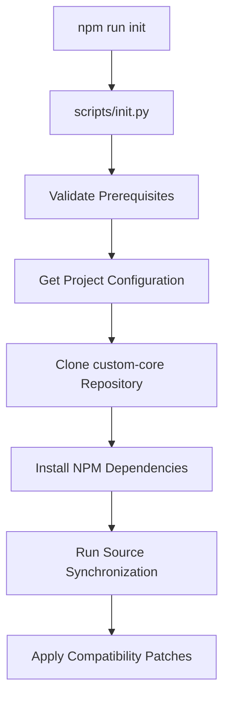
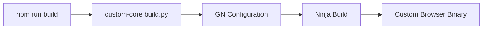
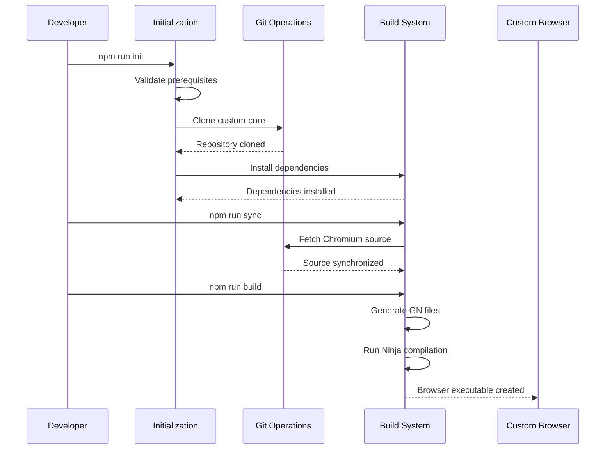
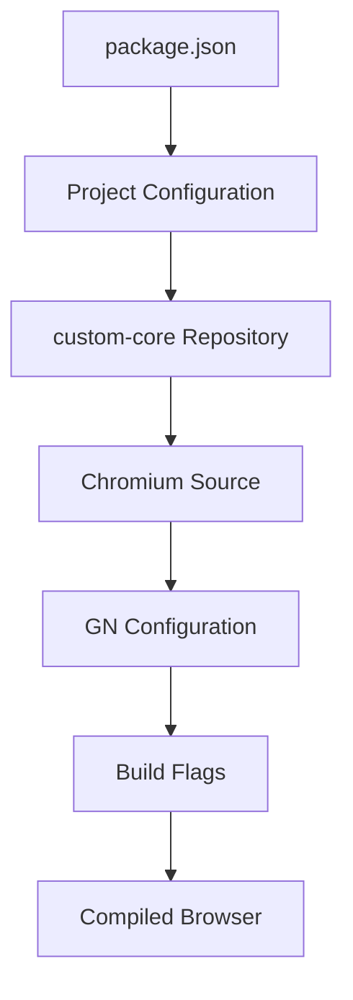
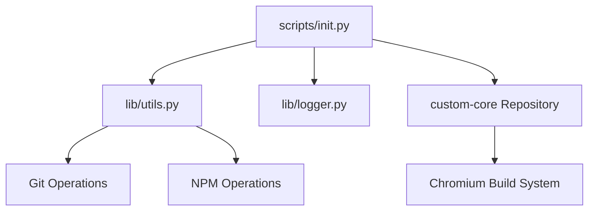

# Custom Browser Architecture Guide

## System Architecture

The Custom Browser project follows a modular architecture with clear separation of concerns between environment setup, build automation, logging, and the custom Chromium core.

## Component Architecture

### 1. Environment Management Layer

#### Core Components
- **lib/utils.py**: System utilities and validation
- **lib/logger.py**: Unified logging and console output
- **scripts/init.py**: Environment initialization and setup

#### Responsibilities
- System prerequisite validation (Python, Git, NPM)
- NPM configuration retrieval and management
- Git repository operations and validation
- Cross-platform command execution

### 2. Project Initialization Layer

#### Initialization Flow


#### Key Operations
1. **Prerequisite Check**: Validate Python, Git, NPM availability
2. **Configuration Retrieval**: Extract project settings from package.json
3. **Repository Management**: Clone/update custom-core repository
4. **Dependency Installation**: NPM package installation with timeout handling
5. **Source Synchronization**: Chromium source fetching via gclient

### 3. Custom Chromium Core Layer

#### Directory Structure
```
src/custom/                          # Custom Chromium core
├── branding/                        # Brand customization scripts
├── build/                          # Build system configuration
├── chrome/                         # Chrome-specific modifications
├── components/                     # Component customizations
├── patches/                        # Custom patches for Chromium
└── vendor/                         # Third-party customizations
```

#### Core Components
- **BUILD.gn**: Main build configuration
- **custom_browser_config.gni**: Browser-specific build flags
- **custom_browser_constants.h**: C++ constants and definitions
- **sources.gni**: Source file inclusions and exclusions

### 4. Build System Layer

#### Build Process Flow


#### Build Components
- **build/commands/**: Build automation scripts
- **build/commands/lib/build.py**: Main build orchestration
- **build/commands/scripts/sync.py**: Source synchronization
- **custom_browser_config.gni**: Build flag configuration

### 5. Logging and Output Layer

#### Logging Architecture
```python
class Logger:
    ├── Timestamped Messages
    ├── Colored Console Output  
    ├── Progress Indicators
    ├── Command Execution Logging
    └── Context Managers (Spinners, Progress)
```

#### Output Types
- **info()**: Informational messages with blue indicators
- **status()**: Status updates with progress indicators  
- **success()**: Success messages with green checkmarks
- **error()**: Error messages with red X indicators
- **warning()**: Warning messages with yellow warning icons
- **debug()**: Debug messages (dimmed output)

### 6. Patch Management Layer

#### Patch System Overview
- **patches/**: Repository for compatibility patches
- **build/commands/lib/applyPatches.py**: Patch application automation
- **depot_tools compatibility**: Patches for build tool integration

#### Patch Categories
1. **depot_tools patches**: Compatibility fixes for depot_tools integration
2. **Build system patches**: GN/Ninja configuration modifications
3. **Source patches**: Direct Chromium source modifications (when necessary)

## Data Flow Architecture

### Development Workflow Data Flow


### Configuration Flow


## Module Dependencies

### External Dependencies
- **depot_tools**: Google's repository and build management tools
- **Python 3.8+**: Core scripting and automation
- **Node.js/NPM**: Package management and script execution
- **Git**: Version control and repository operations
- **Visual Studio Build Tools**: Windows C++ compilation

### Internal Dependencies


## Security Architecture

### Repository Security
- **Git validation**: Repository URL and branch validation
- **Patch verification**: Checksum validation for applied patches
- **Dependency isolation**: NPM package sandbox and validation

### Build Security
- **Source integrity**: Chromium source verification via depot_tools
- **Build isolation**: Separate build directories and environments
- **Binary verification**: Output verification and signing (when configured)

## Performance Optimization

### Build Performance
- **Parallel processing**: Multi-core compilation via Ninja
- **Incremental builds**: Smart dependency tracking
- **Binary caching**: Shared build artifacts and ccache integration
- **Windows Defender**: Automated exclusion setup for build performance

### Script Performance
- **Async operations**: Non-blocking I/O for network operations
- **Progress tracking**: Real-time status updates and feedback
- **Error recovery**: Automatic retry mechanisms with backoff
- **Resource monitoring**: Memory and disk usage optimization

## Extension Points

### Customization Interfaces
1. **Branding System**: Configurable browser branding and identity
2. **Feature Flags**: Runtime feature enablement/disablement
3. **Build Configuration**: Custom GN args and build flags
4. **Patch System**: Custom source modifications and fixes

### Plugin Architecture
- **Component isolation**: Modular component design
- **Service interfaces**: Well-defined service boundaries
- **Event system**: Observer patterns for component communication

## Maintenance and Updates

### Update Strategy
1. **Chromium Updates**: Regular sync with upstream Chromium releases
2. **Dependency Updates**: NPM and Python package maintenance
3. **Patch Maintenance**: Regular review and update of custom patches
4. **Build Optimization**: Continuous improvement of build performance

### Monitoring and Diagnostics
- **Build metrics**: Compilation time and success rate tracking
- **Error reporting**: Comprehensive error logging and reporting
- **Performance monitoring**: Build time analysis and optimization

## Related Documentation

- **[Development Guide](../development/custom-browser-development.md)** - Setup and development workflow
- **[Build System Guide](../development/custom-browser-build-system.md)** - Build process deep dive
- **[API Reference](../apis/custom-browser-api-reference.md)** - Python API documentation
- **[Feature Documentation](../features/custom-browser/)** - Individual feature architecture