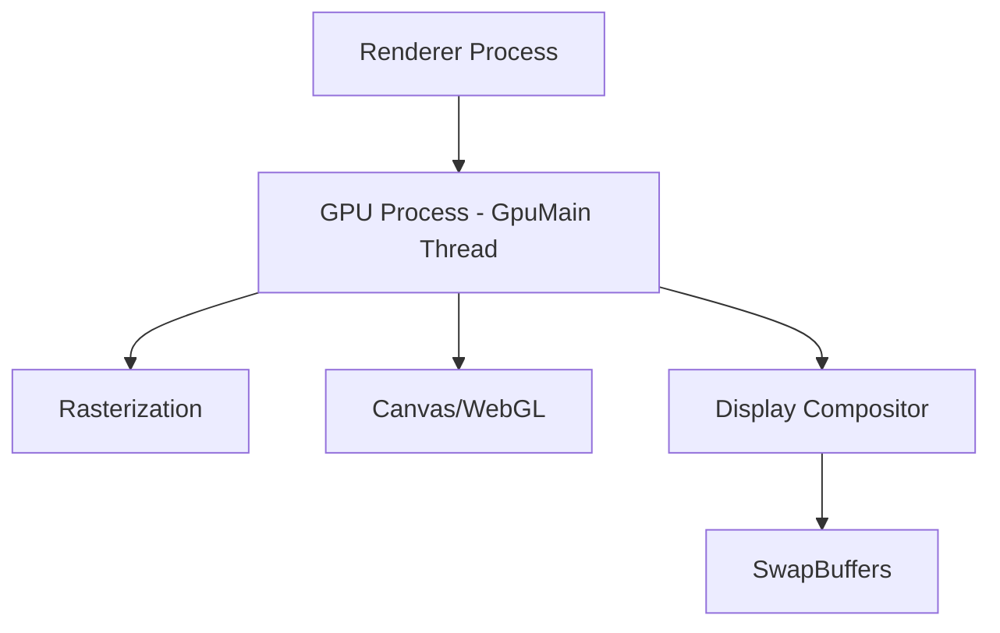
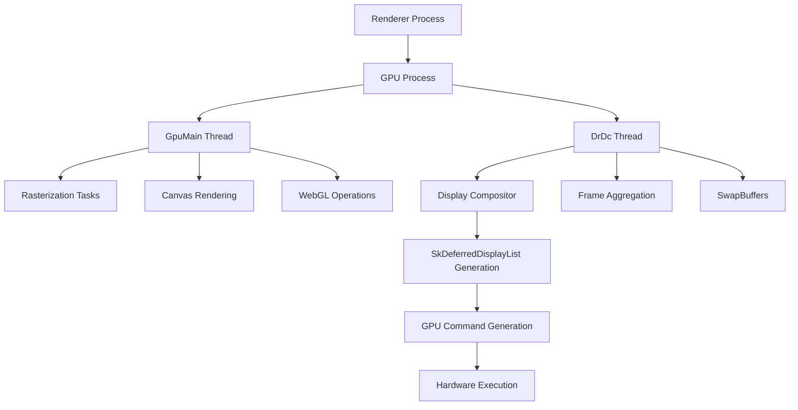

# Direct Rendering Display Compositor (DrDc)

DrDc (Direct Rendering Display Compositor) represents a major architectural evolution in Chromium's rendering pipeline, building upon the Out-of-Process Display compositor (OOPD) and Out-of-Process Rasterization (OOPR) foundations. This advanced architecture introduces dual GPU threading to deliver significant performance improvements while addressing performance regression issues introduced by previous OOPR implementations.

## Overview

### Architecture Evolution Timeline
- **Early 2021**: Initial DrDc implementation
- **Late 2021**: Gradual rollout begins  
- **2023**: Official release on Android platform (Chrome 119/120+)
- **Requirements**: Android P+ and above
- **Future Platforms**: macOS support planned as next deployment target

### Core Innovation
DrDc introduces a dedicated **DrDc thread** ([`CompositorGpuThread`](https://source.chromium.org/chromium/chromium/src/+/main:components/viz/service/display_embedder/compositor_gpu_thread.cc;l=99?q=CompositorGpuThread&ss=chromium)) that operates alongside the existing **GpuMain thread**, creating a sophisticated dual GPU thread architecture where each thread handles specialized rendering tasks.

## Threading Architecture

### Traditional Single GPU Thread Model


### DrDc Dual GPU Thread Model


### Thread Responsibility Distribution

#### GpuMain Thread (Unchanged Responsibilities)
- **Chunked Asynchronous Rasterization**: Converting vector graphics to raster format
- **Canvas 2D Operations**: Hardware-accelerated canvas rendering
- **WebGL/WebGPU**: 3D graphics API implementations
- **Video Decoding**: Hardware-accelerated video processing

#### DrDc Thread (New Specialized Compositor)
- **Display Compositor Synthesis**: Aggregating compositor frames from multiple sources
- **Frame Composition**: Combining layers into final output frames
- **SkDeferredDisplayList (DDL) Execution**: Converting Skia display lists to GPU commands
- **SwapBuffers Coordination**: Managing display buffer presentation timing

## Technical Implementation Details

### Rendering Pipeline Flow

The DrDc architecture splits the traditional Display Compositor workflow into two coordinated phases:

#### Phase 1: Viz Thread (Frame Aggregation)
```cpp
// Simplified DrDc pipeline - Phase 1
class VizDisplayCompositor {
  void DrawAndSwap() {
    // Aggregate multiple compositor frames
    CompositorFrame final_frame = AggregateFrames();
    
    // Generate Skia deferred display list
    SkDeferredDisplayList ddl = GenerateDDL(final_frame);
    
    // Pass to DrDc thread for execution
    drdc_thread_->PostTask(FROM_HERE, 
        base::BindOnce(&DrDcThread::ExecuteDDL, ddl));
  }
};
```

#### Phase 2: DrDc Thread (GPU Command Generation)
```cpp
// Simplified DrDc pipeline - Phase 2  
class DrDcThread {
  void ExecuteDDL(SkDeferredDisplayList ddl) {
    // Convert DDL to GPU commands
    std::vector<GpuCommand> commands = ProcessDDL(ddl);
    
    // Submit to GPU for execution
    gpu_channel_->SubmitCommands(commands);
    
    // Present final frame
    SwapBuffers();
  }
};
```

### Advanced GPU Scheduling

DrDc implements a sophisticated **thread-safe dual GPU scheduler** that manages complex task dependencies across both GPU threads:

```cpp
class DualGpuScheduler {
  void ScheduleTask(GpuTask task) {
    if (task.requires_rasterization_completion()) {
      // High-priority compositor task depends on rasterization
      // Must execute raster task first on GpuMain, then compositor on DrDc
      ScheduleWithDependency(task);
    } else {
      // Independent tasks can run in parallel
      ScheduleParallel(task);
    }
  }
  
  void ScheduleWithDependency(GpuTask compositor_task) {
    // Execute prerequisite raster task on GpuMain thread
    gpu_main_thread_->PostTask(FROM_HERE, 
        base::BindOnce(&ExecuteRasterTask, compositor_task.dependency()));
    
    // Schedule dependent compositor task on DrDc thread
    drdc_thread_->PostTaskAfter(compositor_task.dependency().completion(),
        base::BindOnce(&ExecuteCompositorTask, compositor_task));
        
    // Allow parallel execution of next frame's raster work
    ScheduleNextFrameRaster();
  }
};
```

## Performance Benefits

### Primary Performance Gains

#### 1. Elimination of GPU Task Blocking
- **Problem Solved**: High-priority display compositor tasks no longer blocked by low-priority rasterization
- **Impact**: Significant reduction in frame stuttering and jank
- **Mechanism**: Dedicated DrDc thread ensures compositor operations run independently

#### 2. Multiple Display Compositor Scenarios
- **Optimal Use Cases**: 
  - Dual WebView applications with concurrent animations
  - CEF-based applications with multiple web windows
  - Picture-in-picture video scenarios
- **Benefit**: Each display compositor can operate on dedicated GPU resources

#### 3. Scrolling Performance Improvements
- **Reduced Stutter Rate**: Display compositor no longer competes with rasterization for GPU time
- **Mitigated OOPR Side Effects**: DrDc directly addresses performance regressions introduced by Out-of-Process Rasterization
- **Smoother Experience**: Consistent frame timing during scroll operations

#### 4. Reduced Context Switching Overhead
- **GPU Context Management**: Specialized threads maintain dedicated GPU contexts
- **Efficiency Gains**: Elimination of frequent context switches between different GPU task types
- **Resource Optimization**: Better GPU resource utilization patterns

### Canvas and WebGL Performance
DrDc provides additional benefits for Canvas 2D and WebGL applications:
- **Dedicated GPU Time**: Canvas operations no longer interrupted by compositor tasks
- **Reduced Latency**: Fewer GPU pipeline stalls during heavy canvas operations
- **Improved Throughput**: Parallel execution of canvas rendering and frame composition

## Technical Challenges and Solutions

### Cross-Thread Texture Sharing

#### Challenge: GPU Context Isolation
Different GPU threads require separate OpenGL contexts, necessitating secure texture sharing mechanisms.

#### Solution Options:
1. **Shared Context Groups**: Two GL contexts belonging to the same shared group
2. **Platform-Native Primitives**: 
   - **Android**: EGL Images and IOSurface
   - **macOS**: IOSurface objects
   - **Windows**: D3D11 shared textures

#### Implementation Choice: Platform-Native Approach
```cpp
// Android implementation using EGL Images
class EGLImageBacking : public SharedImageBacking {
  bool ProduceGLTexture(GLuint texture_id) override {
    // Create EGL image from GL texture on source context
    EGLImageKHR egl_image = eglCreateImageKHR(
        display_, source_context_, EGL_GL_TEXTURE_2D_KHR, 
        reinterpret_cast<EGLClientBuffer>(texture_id), nullptr);
    
    // Import EGL image as texture on destination context  
    glEGLImageTargetTexture2DOES(GL_TEXTURE_2D, egl_image);
    return true;
  }
};
```

**Rationale**: Android shared context groups have demonstrated driver stability issues, making platform-native EGL Images the preferred solution despite additional complexity.

### GPU Read/Write Synchronization

#### Synchronization Mechanism: EGL Fences
```cpp
class DrDcSynchronization {
  void SynchronizeTextureAccess(SharedTexture texture) {
    // Insert fence on producer thread (GpuMain)
    EGLSyncKHR fence = eglCreateSyncKHR(display_, EGL_SYNC_FENCE_KHR, nullptr);
    
    // Consumer thread (DrDc) waits for fence completion
    drdc_thread_->PostTask(FROM_HERE, 
        base::BindOnce(&WaitForFence, fence, texture));
  }
  
  void WaitForFence(EGLSyncKHR fence, SharedTexture texture) {
    // Block until producer completes texture operations
    eglWaitSyncKHR(display_, fence, 0);
    
    // Safe to proceed with texture consumption
    ProcessTexture(texture);
  }
};
```

### Stream Texture Cross-Context Support

#### Video Playback Optimization Challenge
Video rendering requires Stream Texture support, but traditional Android `SurfaceTexture` doesn't support cross-GL context sharing.

#### Solution: ImageReader + HardwareBuffer (Android P+)
```cpp
class CrossContextVideoTexture {
  void SetupVideoTexture() {
    // Use ImageReader instead of SurfaceTexture
    AImageReader* reader = nullptr;
    AImageReader_new(width_, height_, AIMAGE_FORMAT_PRIVATE, 
                     max_images_, &reader);
    
    // Create HardwareBuffer for cross-context sharing
    AHardwareBuffer* hardware_buffer = nullptr;
    AImageReader_acquireLatestImageAsync(reader, &image, fence_fd);
    AImage_getHardwareBuffer(image, &hardware_buffer);
    
    // Share across GPU contexts via EGL image
    ShareHardwareBuffer(hardware_buffer);
  }
};
```

**Android Version Requirement**: This approach requires Android P+ (API level 28+), explaining DrDc's platform restrictions.

## Potential Limitations and Considerations

### Performance Trade-offs in Specific Scenarios

#### 1. Low-End Device Impact
**Concern**: CPU competition between dual GPU threads may degrade performance on resource-constrained devices.

**Mitigation Strategy**: 
- Dynamic thread priority adjustment based on device capabilities
- Fallback to single-threaded mode for low-end devices
- Adaptive scheduling based on GPU load metrics

#### 2. High GPU Load Scenarios  
**Risk**: Dual threads may increase task throughput but exacerbate GPU bottlenecks.

**Monitoring Approach**:
```cpp
class GpuLoadMonitor {
  void AdjustThreadingStrategy() {
    float gpu_utilization = GetGpuUtilization();
    
    if (gpu_utilization > kHighLoadThreshold) {
      // Reduce parallel task submission
      scheduler_->SetConservativeMode(true);
    } else {
      // Enable aggressive parallelization
      scheduler_->SetConservativeMode(false);
    }
  }
};
```

#### 3. Complex Multi-Task Scenarios
**Challenge**: Unreasonable scheduling logic may cause performance degradation in scenarios with numerous concurrent GPU tasks.

**Solution**: Sophisticated priority-aware scheduling with task dependency analysis.

### Compatibility and Stability Concerns

#### 1. EGL Implementation Issues
**Historical Problems**: 
- Rendering artifacts with certain EGL image implementations
- System freezes on older Android versions
- Driver-specific compatibility problems

**Current Mitigation**: Android P+ requirement significantly reduces problematic driver versions.

#### 2. GPU Driver Thread Safety
**Ongoing Risk**: GPU drivers historically struggle with multi-threaded access patterns.

**Management Strategy**:
- Extensive driver testing and blacklist maintenance
- Graceful fallback to single-threaded mode for problematic drivers
- Continuous telemetry monitoring for crash patterns

## Android WebView Distinction

### WebView vs DrDc Architecture Differences

**Important Note**: Android WebView has utilized dual GPU threads since its inception, but operates fundamentally differently from DrDc:

#### WebView Dual Threading Model
- **Native UI Integration**: WebView's display compositor runs within Android's native UI rendering pipeline
- **System Scheduling**: Bound by Android's native UI rendering scheduling constraints
- **Limited Optimization**: Cannot leverage DrDc's advanced GPU scheduling optimizations

#### DrDc Advantage over WebView
DrDc's independent thread scheduling enables optimizations that WebView's system-bound approach cannot achieve:
- **Independent Priority Management**: DrDc threads operate with Chromium-controlled priorities
- **Advanced Dependency Tracking**: Sophisticated task dependency resolution
- **Optimal Resource Allocation**: Direct GPU resource management without system interference

## Integration with Existing Chromium Architecture

### Relationship to Viz Display Compositor

DrDc builds upon and extends the existing **Viz Display Compositor** architecture:

```cpp
// Traditional Viz architecture (single-threaded)
class VizDisplayCompositor {
  void ProcessFrame() {
    AggregateFrames();    // Combine multiple compositor frames
    Rasterize();         // Convert to pixels (blocks other work)
    Composite();         // Layer composition (blocks other work)  
    SwapBuffers();       // Present to display (blocks other work)
  }
};

// DrDc enhanced Viz architecture (dual-threaded)
class DrDcEnabledVizCompositor {
  void ProcessFrame() {
    AggregateFrames();    // Phase 1: Viz thread
    GenerateDDL();        // Phase 1: Create display list
    
    // Phase 2: Asynchronously execute on DrDc thread
    ExecuteOnDrDcThread(); // Non-blocking handoff
    
    // Viz thread free for next frame processing
    PrepareNextFrame();
  }
};
```

### OOPR Integration and Improvement

DrDc specifically addresses performance regressions introduced by **Out-of-Process Rasterization (OOPR)**:

#### OOPR Performance Issues
- Increased GpuMain thread load due to rasterization workload
- Display compositor tasks blocked by heavy rasterization operations
- Overall frame rate degradation in certain scenarios

#### DrDc OOPR Mitigation
- **Workload Separation**: Rasterization remains on GpuMain, compositor moves to DrDc
- **Parallel Processing**: Both threads can operate simultaneously
- **Performance Recovery**: DrDc not only addresses OOPR regressions but provides net performance gains

## Performance Metrics and Validation

### Key Performance Indicators

#### Frame Rate Consistency
- **Metric**: 99th percentile frame time consistency
- **Target**: Reduced frame time variance during complex operations
- **Measurement**: Chrome tracing with `compositor` and `gpu` categories

#### Scroll Performance  
- **Metric**: Scroll jank percentage reduction
- **Measurement**: ScrollingCoordinator frame drop rate analysis
- **Expected Improvement**: 15-30% reduction in dropped frames

#### Multi-Window Scenarios
- **Metric**: Concurrent animation smoothness
- **Test Case**: Dual WebView with simultaneous video playback
- **Expected Benefit**: Maintained 60fps in both instances

### Telemetry Integration

```cpp
class DrDcPerformanceMetrics {
  void RecordFrameMetrics(base::TimeTicks frame_start, 
                          base::TimeTicks frame_end) {
    base::TimeDelta frame_time = frame_end - frame_start;
    
    // Record to Chrome telemetry
    UMA_HISTOGRAM_TIMES("DrDc.FrameTime", frame_time);
    UMA_HISTOGRAM_BOOLEAN("DrDc.FrameDropped", 
                          frame_time > kTargetFrameTime);
    
    // Track GPU thread utilization
    UMA_HISTOGRAM_PERCENTAGE("DrDc.GpuMainUtilization", 
                             GetGpuMainThreadLoad());
    UMA_HISTOGRAM_PERCENTAGE("DrDc.DrDcThreadUtilization",
                             GetDrDcThreadLoad());
  }
};
```

## Future Development and Evolution

### Planned Platform Expansion
- **macOS**: Next target platform for DrDc deployment
- **Windows**: Investigation phase for DirectX integration
- **Linux**: Desktop Linux support evaluation

### Advanced Optimization Opportunities
- **Dynamic Thread Allocation**: Adaptive thread count based on workload
- **ML-Driven Scheduling**: Machine learning optimization for task prioritization  
- **Cross-Platform Unification**: Standardized DrDc implementation across all platforms

### Integration with Emerging Technologies
- **Vulkan Backend**: DrDc compatibility with Vulkan rendering pipeline
- **WebGPU Support**: Enhanced WebGPU performance through dedicated GPU threading
- **AR/VR Optimization**: DrDc benefits for immersive content rendering

---

## Technical References

### Official Documentation
- [DrDc Design Document](https://docs.google.com/document/d/1n2YEKjaWiPlOpYuENrqMFM8bMKycL9HFbyCQmtMsgAI/edit#heading=h.css40qh0t77v) - Early architectural design
- [Direct Rendering Display Compositor Presentation](https://docs.google.com/presentation/d/1oXmb9eQ-xgYmB7-Cu1AOgT8z1FVtCTDN9o84T7Aw3Kw/edit#slide=id.ge81d2fb838_0_886) - Technical implementation details
- [Viz Thread as DR-DC Thread](https://docs.google.com/document/d/1AEw3-17In4AlIcgFI3b9RXn9yYoGi4B5JN4hKK28GXU/edit#heading=h.css40qh0t77v) - Threading model analysis

### Source Code References
- [`CompositorGpuThread`](https://source.chromium.org/chromium/chromium/src/+/main:components/viz/service/display_embedder/compositor_gpu_thread.cc) - DrDc thread implementation
- [`EGLImageBacking`](https://source.chromium.org/chromium/chromium/src/+/main:gpu/command_buffer/service/shared_image/egl_image_backing.h) - Cross-context texture sharing

### Related Architecture Documentation
- [Viz Display Compositor](render-pipeline.md) - Foundation architecture
- [Chromium Compositor (cc)](chromium-compositor-cc.md) - Content compositor details
- [GPU Process Architecture](../modules/gpu-process.md) - GPU process overview

---

*This document reflects the DrDc architecture as implemented in Chrome 119+ for Android. Implementation details may vary across platforms and continue to evolve with ongoing development.*