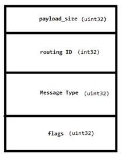

# Chromium IPC Internals

Chromium's Inter-Process Communication (IPC) mechanism is a critical part of its multi-process architecture. It allows processes with different trust levels (e.g., browser and renderer processes) to communicate securely and efficiently. This document provides an overview of Chromium's IPC implementation, key components, and platform-specific details.

---

## Overview of Chromium IPC

Chromium's IPC mechanism enables communication between processes by splitting code into different trust levels. This separation improves security and stability by isolating sensitive operations.

### Key Features:
1. **Main Communication Mechanisms**:
   - **PIPE** (Windows)
   - **Socketpair** (POSIX)

2. **Platform-Specific Implementations**:
   - **Windows**: Named pipes are used for communication.
   - **POSIX**: Socketpair or UNIX domain sockets are used.

3. **Named Channels**:
   - On Windows, channels are named by default and accessible from other processes.
   - On POSIX, channels are anonymous by default and not accessible from other processes.

---

## Key Components of Chromium IPC

### 1. **IPC::Channel**
- Handles communication between the client and server.
- Platform-specific implementations:
  - `ipc_channel_win.h/.cc` (Windows)
  - `ipc_channel_posix.h/.cc` (POSIX)
  - `ipc_channel_nacl.h/.cc` (NaCl)

### 2. **IPC::ChannelProxy**
- Runs an IPC channel on a background thread.
- Can have an associated `IPC::ChannelProxy::MessageFilter` to handle incoming messages on the IPC channel's thread.

### 3. **IPC::Message**
- Represents the message being sent or received.
- Inherits from `base::Pickle`, which provides binary value packing and unpacking.
- Each message has a header (`IPC::Message::Header`) and a payload.

### 4. **IPC::Listener**
- Listens for events on the channel. Key events include:
  - `OnMessageReceived()`: Triggered when a message is received.
  - `OnChannelConnected()`: Triggered when the channel is connected.
  - `OnChannelError()`: Triggered when an error causes the channel to close.

### 5. **IPC::Sender**
- A pure virtual class with a single `Send()` function for sending messages.

---

## Message Handling in Chromium IPC

### Message Lifecycle:
1. **HELLO Message**:
   - The first message exchanged between processes.
   - Contains the process ID (PID) and, if client validation is enabled, a shared secret.

2. **Message Priority**:
   - Messages can have the following priorities:
     - `PRIORITY_LOW`
     - `PRIORITY_NORMAL`
     - `PRIORITY_HIGH`

3. **Message Iteration**:
   - Multiple messages can be received in a single read.
   - The `payload_size` field in the message header is used to iterate over messages.

4. **Message Map**:
   - Use `IPC_BEGIN_MESSAGE_MAP()`, `IPC_MESSAGE_HANDLER()`, and `IPC_END_MESSAGE_MAP()` to define callbacks for different message types.
   - Internally, these macros create a `switch` statement to handle various message types.

---

## Platform-Specific Details

### Windows:
- **Named Pipes**:
  - Default pipe name: `\\.\pipe\chrome.<channel_name>`
  - Supports client validation using a shared secret appended to the pipe name.

- **Asynchronous Reads**:
  - Uses `base::MessagePumpForIO::IOHandler` for asynchronous read operations.
  - Reads data in `OVERLAPPED` mode and passes it to the `IPC::Listener`.

### POSIX:
- **Socketpair or UNIX Domain Sockets**:
  - Channels are anonymous by default.
  - Named channels use UNIX domain sockets.

---

## Advanced Features

### 1. **Message Filters**:
- `IPC::ChannelProxy::MessageFilter` allows filtering and processing of messages on a background thread.

### 2. **Message Packing**:
- `base::Pickle` provides facilities for packing and unpacking binary values in messages.

### 3. **Client Validation**:
- A shared secret can be used to validate clients during the connection process.

---

## Example: IPC Message Header Format

Each message has a header defined in `IPC::Message::Header`, which inherits from `base::Pickle::Header`. The header includes metadata such as the message type, routing ID, and payload size.

### Header Format:

The payload follows the header and contains the actual data being transmitted.

---

## References

1. [Chromium IPC Design Document](http://www.chromium.org/developers/design-documents/inter-process-communication)
2. [Chrome Sandbox Overview (Part 1)](http://blog.azimuthsecurity.com/2010/05/chrome-sandbox-part-1-of-3-overview.html)
3. [Chrome Sandbox IPC (Part 2)](http://blog.azimuthsecurity.com/2010/08/chrome-sandbox-part-2-of-3-ipc.html)

---

## Summary

Chromium's IPC mechanism is a robust and flexible system that enables secure and efficient communication between processes. By leveraging platform-specific implementations and advanced features like message filters and client validation, Chromium ensures high performance and security in its multi-process architecture.