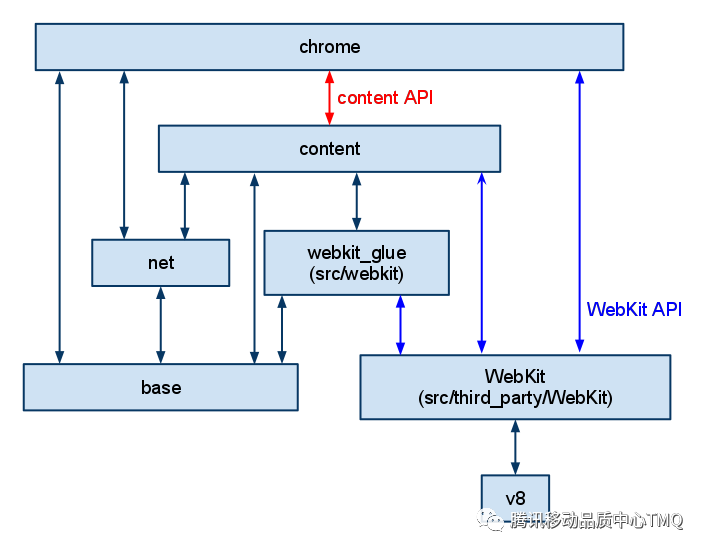
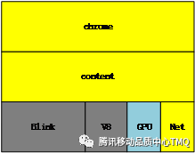

## **1 Module layering**

Chromium is divided into three parts: Browser, Renderer, and Webkit. Where Browser is the main process, representing all UI and I/O. Renderer is the child process of each tab in the browser. Renderer embeds Webkit for rendering and layout. (The process model can be found in Section 1.2 and the official Chromium documentation.)

The following figure is the official module hierarchy diagram:

The following diagram is a simplified version of the module hierarchy:

Among them, Content is only responsible for loading the core code of the web page to provide WebPlatformFeatures (the ability to parse and render the page under multiple processes. The other is HTML/HTML5/CSS3), on which a complete browser application can be constructed. Chrome is the application layer, which provides ApplicationFeatures (application-like requirements). For example, the Extensions extension, ChromeFrame (chrome's client box UI), Pre-render preloading, SpellCheck spell checking, Autofill autofill and other features.

Different applications have different needs for different user scenarios. In addition to the typical browser, there are other built-in page browsing features such as help, preview, and even games. They will all have different application class requirements (ApplicationFeatures).

The Chromium Embedded Framework (CEF) is an open source Webbrowser control based on the Google Chromium project, which supports Windows, Linux, and Mac platforms. CEF is based on the better layering of Chromium, no unreasonable dependencies and other factors, based on the Content API implementation.

For module layering, please refer to the official chromium documentation:

[https://www.chromium.org/developers/content-module](https://www.chromium.org/developers/content-module)