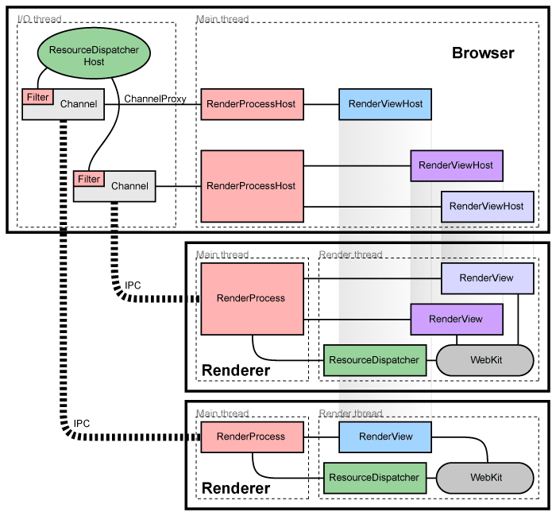
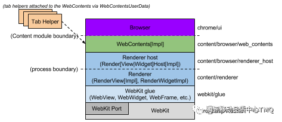
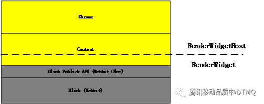

# Process Model

Chromium's multi-process architecture has evolved significantly in recent versions (v134+) to provide enhanced stability, security, and performance through sophisticated process isolation and modern service-based design. This article explores each process type, communication patterns, and the advanced sandboxing model that protects users in the modern web.



---

## 1. Why Multi-Process Architecture? (v134+ Enhancements)

- **Enhanced Isolation**  
  - Crashes in renderers, GPU, or service processes don't affect the browser
  - **Site Isolation**: Strict per-origin process boundaries for security
  - **Process-per-frame**: Fine-grained isolation for embedded content

- **Advanced Security (v134+)**  
  - **Spectre/Meltdown Mitigations**: Process boundaries prevent cross-origin data leaks
  - **Enhanced Sandboxing**: Improved platform-specific security restrictions  
  - **Control Flow Integrity (CFI)**: Hardware-assisted exploit prevention

- **Modern Performance Optimizations**  
  - **Intelligent Process Management**: Dynamic process allocation based on memory pressure
  - **Background Tab Throttling**: Aggressive resource management for inactive content
  - **GPU Process Optimization**: Unified Viz compositor for better performance
  - **Service-based Architecture**: Microservice design for better scalability

---

## 2. Browser Process (Enhanced in v134+)

The **Browser Process** serves as the central coordinator and control hub for Chromium's architecture, managing all other processes and providing the primary user interface.

- **Core Responsibilities**  
  - **UI Management**: Address bar, tabs, menus, extensions UI
  - **Navigation Coordination**: Cross-origin navigation and security decisions
  - **Storage Management**: Cookies, cache, local storage, IndexedDB coordination
  - **Process Lifecycle**: Launching, monitoring, and terminating child processes
  - **Security Policy Enforcement**: Site isolation decisions and sandbox configuration

- **Modern Components (v134+)**  
  - `BrowserMainLoop` (enhanced main event loop)
  - `SiteIsolationPolicy` (per-origin process management)
  - `ProcessManager` (intelligent process allocation)
  - `ServiceManager` (microservice coordination)
  - `FeaturePolicyManager` (permissions and feature controls)

- **Advanced Features**  
  - **Memory Pressure Management**: Intelligent tab discarding and process prioritization
  - **Extension Security**: Enhanced extension process isolation
  - **DevTools Integration**: Advanced debugging and profiling capabilities
  - **Update Management**: Background update coordination and rollback support

The browser process uses sophisticated **Mojo IPC** channels to communicate with all child processes while maintaining strict security boundaries.

---

## 3. Renderer Processes (Modern Site Isolation in v134+)

**Renderer Processes** are responsible for web content rendering, JavaScript execution, and DOM management, with enhanced security through strict site isolation policies.

- **Core Responsibilities**  
  - **Blink Engine**: Modern HTML/CSS parsing, layout, and painting
  - **V8 JavaScript Engine**: High-performance JavaScript execution with JIT compilation
  - **DOM Management**: Document tree construction and manipulation
  - **Web APIs**: Implementation of modern web platform features

- **Enhanced Isolation (v134+)**  
  - **Site-per-Process**: Strict per-origin process boundaries (default since v67, enhanced in v134+)
  - **Cross-Origin Isolation**: Prevention of Spectre-style attacks through process boundaries
  - **Origin Agent Clusters**: Fine-grained process allocation for related origins
  - **CORB/CORP Protection**: Cross-Origin Read Blocking and Resource Policy enforcement

- **Threading Architecture**  
  - **Main Thread**: DOM operations, style computation, layout, JavaScript execution
  - **Compositor Thread**: Hardware-accelerated scrolling and animations
  - **Worker Threads**: Web Workers, Service Workers, Worklets
  - **Raster Threads**: Painting and texture generation (when not using GPU process)

- **Modern Security Features**  
  - **Process Isolation**: Complete memory isolation between different origins
  - **Sandbox Restrictions**: Severely limited file system and network access
  - **Control Flow Integrity**: Hardware-assisted exploit mitigation
  - **Memory Protection**: Advanced heap protection and UAF detection

- **Performance Optimizations**  
  - **Code Caching**: Optimized JavaScript bytecode caching
  - **Background Processing**: Intelligent prioritization of background tabs
  - **Memory Management**: Advanced garbage collection and memory pressure handling

**Crash Recovery**: If a renderer crashes, only affected tabs show error pages while other content continues working normally.


---

## 4. GPU Process (Viz Compositor Architecture in v134+)

The **GPU Process** has been significantly enhanced in v134+ with the Viz Display Compositor, providing unified, high-performance graphics rendering and compositing for all content types.

- **Core Responsibilities (Enhanced)**  
  - **Viz Display Compositor**: Unified compositing architecture for all surfaces
  - **Out-of-Process Rasterization (OOP-R)**: Rasterization moved from renderer to GPU process
  - **Hardware Acceleration**: Modern graphics APIs (Vulkan, Metal, D3D12)
  - **Canvas2D Acceleration**: Hardware-accelerated 2D canvas rendering
  - **WebGL/WebGPU Management**: 3D graphics context and resource management

- **Modern Features (v134+)**  
  - **SkiaRenderer**: Advanced Skia-based rendering backend
  - **Surface Aggregation**: Efficient composition of multiple content sources
  - **HDR Support**: High dynamic range content rendering
  - **Variable Refresh Rate**: Adaptive sync display support
  - **Multi-Display**: Coordinated rendering across multiple screens

- **Performance Optimizations**  
  - **GPU Memory Management**: Intelligent texture allocation and caching
  - **Damage Tracking**: Precise invalidation of changed regions
  - **Frame Pacing**: Optimized frame timing for smooth animations
  - **Tile-based Rendering**: Efficient large surface management

- **Security & Stability**  
  - **GPU Sandbox**: Restricted access to system resources
  - **Driver Crash Isolation**: GPU crashes don't affect browser stability
  - **Context Recovery**: Automatic recovery from graphics context loss

---

## 5. Modern Service Architecture (v134+ Microservices)

Chromium has evolved to a sophisticated microservice architecture with specialized processes for enhanced security, performance, and maintainability:

| Process Type | Examples | Purpose & Benefits (v134+) |
| --- | --- | --- |
| **Network Service** | DNS resolution, HTTP/3, QUIC stack, certificate validation | Enhanced security isolation, easier updates, cross-platform consistency |
| **Audio Service** | Audio decoding, playback, WebAudio processing | Prevents audio driver issues from affecting other processes |
| **Video Decode Service** | Hardware video acceleration, codec management | Dedicated video processing with hardware acceleration |
| **Storage Service** | IndexedDB, localStorage, cache management | Centralized storage with better security and performance |
| **Device Service** | USB, Bluetooth, serial port access | Secure hardware access with permission management |
| **Printing Service** | Print preview, PDF generation, cloud printing | Isolated printing functionality with enhanced security |
| **PDF Service** | PDF rendering, annotation, form handling | Secure PDF processing separate from renderer |
| **ML Service** | On-device machine learning, TensorFlow Lite | Privacy-preserving ML processing |
| **Utility Processes** | File compression, image decoding, data validation | Sandboxed processing for untrusted data |

### Modern Service Features (v134+)
- **Service Manager**: Central coordination of all services with dependency management
- **Capability-based Security**: Fine-grained permission system for service access
- **Automatic Recovery**: Services can restart independently without affecting the browser
- **Resource Management**: Intelligent memory and CPU allocation across services
- **Cross-Platform Consistency**: Unified service interface across all supported platforms

---

## 6. Advanced Inter-Process Communication (Mojo v134+)

Chromium uses **Mojo IPC**, a sophisticated message-passing framework that has been significantly enhanced for modern multi-process architecture.

### Core Mojo Features (v134+)
- **Type-Safe Interfaces**: Strongly-typed IDL-based service definitions
- **Capability-Based Security**: Fine-grained permission system for service access
- **Shared Memory**: Efficient large data transfer without copying
- **Associated Interfaces**: Ordered message delivery within interface groups
- **Urgent Messages**: Priority message handling for time-critical operations

### Communication Patterns
- **Service Interfaces**: Structured RPC-style service definitions with versioning
- **Event Broadcasting**: Efficient multicast for system-wide notifications
- **Stream Processing**: High-throughput data streaming for media and large files
- **Synchronous Calls**: Blocking operations for critical coordination (used sparingly)

### Modern IPC Optimizations
- **Message Coalescing**: Batching related messages for better performance
- **Zero-Copy Transfers**: Direct memory sharing for large payloads
- **Priority Scheduling**: Critical path message prioritization
- **Connection Pooling**: Efficient reuse of communication channels
- **Dead Process Detection**: Rapid detection and cleanup of crashed processes

### Security Features
- **Interface Filtering**: Process-specific interface access control
- **Message Validation**: Automatic validation of all incoming messages
- **Capability Delegation**: Secure forwarding of permissions between processes
- **Audit Logging**: Comprehensive IPC activity tracking for security analysis

**Key Advantage**: Mojo provides type safety, versioning, and security while maintaining high performance across Chromium's complex process hierarchy.

---

## 7. Modern Process Lifecycle (v134+ Enhancements)

### Process Launch & Initialization
1. **Intelligent Process Creation**  
   - **Process Reuse**: Efficient reuse of existing processes when possible
   - **Preemptive Launch**: Speculative process creation for better performance
   - **Resource-Aware Spawning**: Dynamic process allocation based on system resources

2. **Enhanced Initialization**  
   - **Fast Startup**: Optimized initialization paths with reduced overhead
   - **Service Discovery**: Automatic discovery and connection to required services
   - **Sandbox Setup**: Advanced platform-specific security restrictions
   - **Capability Registration**: Registration of process-specific capabilities and permissions

### Process Management
3. **Runtime Operations**  
   - **Task Scheduling**: Priority-based task allocation across processes
   - **Memory Pressure Handling**: Intelligent response to system memory constraints
   - **Performance Monitoring**: Real-time process health and performance tracking
   - **Dynamic Resource Allocation**: Adaptive resource management based on workload

4. **Process Coordination**  
   - **Service Dependencies**: Automatic management of inter-service dependencies
   - **Load Balancing**: Intelligent distribution of work across available processes
   - **Migration Support**: Ability to move work between processes for optimization

### Advanced Shutdown & Recovery
5. **Graceful Termination**  
   - **Clean Resource Release**: Proper cleanup of GPU contexts, file handles, and memory
   - **State Preservation**: Saving critical state before process termination
   - **Dependency Notification**: Informing dependent processes of shutdown

6. **Crash Handling & Recovery (v134+)**  
   - **Crashpad Integration**: Advanced crash reporting with detailed stack traces
   - **Automatic Recovery**: Intelligent restart of crashed services
   - **State Restoration**: Recovery of user state after process crashes
   - **Diagnostic Information**: Enhanced crash analytics for debugging and telemetry

---

## 8. Advanced Sandboxing & Security (v134+ Enhancements)

Chromium employs sophisticated, platform-specific sandboxes to provide multi-layered security protection:

### Platform-Specific Sandboxing
- **Windows (v134+)**: 
  - **Job Objects**: Process resource and access restrictions
  - **Win32k Lockdown**: Restricted access to legacy Windows APIs
  - **App Container**: Enhanced isolation for renderer processes
  - **Code Integrity Guard (CIG)**: Prevent code injection attacks

- **Linux (v134+)**: 
  - **Namespaces**: Process, network, and filesystem isolation
  - **seccomp-bpf**: System call filtering and restriction
  - **User Namespaces**: Privilege isolation without setuid
  - **Landlock**: Path-based access control for filesystem

- **macOS (v134+)**: 
  - **Seatbelt Profiles**: Granular system access restrictions
  - **System Integrity Protection**: Enhanced system-level protection
  - **Hardened Runtime**: Advanced code signing and runtime protections
  - **App Sandbox**: Additional container-based isolation

### Advanced Security Features (v134+)
- **Site Isolation Enhancement**: 
  - **Cross-Origin Isolation**: Spectre/Meltdown attack prevention
  - **COOP/COEP**: Cross-Origin Opener/Embedder Policy enforcement
  - **Origin Agent Clusters**: Fine-grained process boundaries

- **Memory Protection**: 
  - **Control Flow Integrity (CFI)**: Comprehensive indirect call protection
  - **Stack Canaries**: Buffer overflow detection
  - **Heap Isolation**: Separate heap spaces for different data types
  - **Use-After-Free Detection**: Runtime memory safety validation

- **Capability-Based Security**: 
  - **Service Permissions**: Fine-grained access control for system services
  - **Resource Quotas**: Limits on CPU, memory, and network usage
  - **Dynamic Privilege Adjustment**: Runtime security policy modification

### Compiler-Level Protections
- **Modern Exploit Mitigations**: 
  - **Address Space Layout Randomization (ASLR)**: Enhanced memory layout randomization
  - **Stack Protection**: Comprehensive stack corruption prevention
  - **FORTIFY_SOURCE**: Enhanced runtime bounds checking
  - **-fstack-clash-protection**: Stack clash attack prevention
  - **Retpoline**: Speculative execution attack mitigation

### Security Monitoring & Response
- **Runtime Security**: 
  - **Anomaly Detection**: Behavioral analysis for threat detection
  - **Security Telemetry**: Comprehensive security event logging
  - **Automatic Threat Response**: Dynamic security policy adjustment
  - **Crash Analysis**: Advanced post-mortem security analysis

---

## 9. Process Architecture Visualization

The following diagrams illustrate Chromium's modern multi-process architecture with service-based design:





---

## 10. Debugging & Performance Analysis (v134+)

### Process Monitoring Tools
- **Chrome Task Manager**: `Shift+Esc` - Real-time process resource usage
- **chrome://process-internals/**: Detailed process information and IPC statistics
- **chrome://memory-internals/**: Memory usage breakdown by process type
- **chrome://system/**: Comprehensive system and process information

### Command Line Debugging
```bash
# Process debugging flags
--enable-logging=stderr             # Detailed process logging
--vmodule="*process*=2"            # Verbose process-related logging
--disable-features=VizDisplayCompositor  # Disable GPU process compositor
--single-process                   # Run in single-process mode (debug only)
--no-sandbox                       # Disable sandboxing (debug builds only)

# IPC and service debugging
--mojo-core-library-path=path      # Use custom Mojo library
--enable-service-manager-tracing   # Trace service manager operations
--trace-to-console                 # Output trace events to console
```

### Performance Analysis
- **chrome://tracing/**: Advanced process timeline analysis with IPC visualization
- **DevTools → Performance**: Process-aware performance profiling
- **chrome://histograms/**: Process-specific performance metrics
- **chrome://discards/**: Tab lifecycle and memory pressure information

---

## 11. Next Steps & Modern Architecture

### Essential Reading
- **[Render Pipeline](render-pipeline.md)**: How processes coordinate for frame construction
- **[IPC Internals](ipc-internals.md)**: Deep dive into Mojo communication patterns
- **[Security Model](../security/security-model.md)**: Advanced sandboxing and exploit mitigation

### Modern Development Topics (v134+)
- **Service-Oriented Architecture**: Understanding Chromium's microservice design
- **Site Isolation**: Implementation details and security implications
- **Viz Compositor**: GPU process architecture and performance optimization
- **Memory Management**: Advanced techniques for multi-process memory efficiency

### Experimental Features
- **Fuchsia Support**: Next-generation OS integration
- **WebAssembly System Interface (WASI)**: Secure system access for WebAssembly
- **Privacy Sandbox**: Enhanced privacy through process isolation

### Performance Optimization
```bash
# Monitor process performance
chrome://tracing/ with "Process" and "IPC" categories

# Analyze memory usage
chrome://memory-internals/ → Process breakdown

# Profile service interactions
DevTools → Performance → Main thread and GPU process analysis

# Test site isolation effectiveness
chrome://site-engagement/ → Origin-based process allocation
```

---

**End of Modern Process Model Guide**

### Key Evolution in v134+
- **Enhanced Site Isolation**: Stronger cross-origin protection with Origin Agent Clusters
- **Service Architecture**: Microservice-based design with intelligent coordination
- **Advanced Security**: Hardware-assisted exploit mitigation and capability-based access
- **Performance Optimization**: Intelligent process management and resource allocation
- **Modern IPC**: Type-safe Mojo interfaces with advanced security features

**Notes for Developers:**
- Process boundaries are security boundaries - design accordingly
- Use Chrome internal pages for debugging multi-process issues
- Monitor memory usage across processes, not just individual tabs
- Leverage site isolation for enhanced security in web applications
