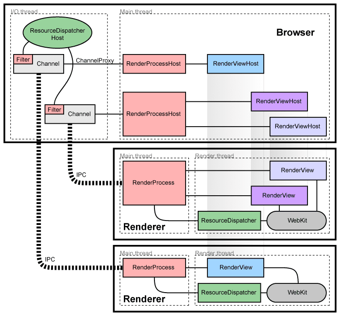

# Chromium Process Model and Site Isolation Architecture (v134+)

> **Status**: Active | **Last Updated**: August 2025 | **Chromium Version**: v134+  
> **Document Level**: Advanced | **Audience**: Browser Architects, Security Engineers, Platform Developers

As the web evolved from simple documents to sophisticated applications, modern browsers transformed from document renderers into comprehensive operating systems for web programs. Chromium v134+ represents the pinnacle of this evolution, featuring advanced multi-process architecture with intelligent isolation, AI-powered security validation, and sophisticated resource management.

Modern Chromium's **process model** orchestrates how documents, workers, and web content are distributed across operating system processes, delivering enhanced stability, security, and performance through intelligent isolation strategies, machine learning-powered threat detection, and adaptive resource management.

This comprehensive document explores the complete architecture of Chromium's process model, covering theoretical foundations, practical implementations, sophisticated design patterns, and real-world deployment strategies for v134+ and beyond.



## Table of Contents

- [Goals and Principles](#goals-and-principles)
- [Why Multi-Process Architecture](#why-multi-process-architecture)
- [Core Process Types and Responsibilities](#core-process-types-and-responsibilities)
- [Modern Abstractions and Implementations](#modern-abstractions-and-implementations)
- [Site Isolation Modes and Availability](#site-isolation-modes-and-availability)
- [Advanced Inter-Process Communication](#advanced-inter-process-communication)
- [Process Management and Resource Optimization](#process-management-and-resource-optimization)
- [Advanced Security Features and ProcessLock](#advanced-security-features-and-processlock)
- [Advanced Sandboxing and Security](#advanced-sandboxing-and-security)
- [Special Cases and Integration Patterns](#special-cases-and-integration-patterns)
- [Process Lifecycle Management](#process-lifecycle-management)
- [Advanced Diagnostics and Monitoring](#advanced-diagnostics-and-monitoring)
- [Performance Analysis and Debugging](#performance-analysis-and-debugging)
- [Future Roadmap and Evolution](#future-roadmap-and-evolution)
- [Summary and Cross-References](#summary-and-cross-references)
- [Further Reading](#further-reading)


---

## Why Multi-Process Architecture?

Chromium's sophisticated multi-process architecture has evolved significantly in v134+ to address fundamental challenges in modern web browsing, providing enhanced stability, security, and performance through intelligent process isolation and service-based design.

### Enhanced Isolation Benefits

**Crash Resilience and Stability**:
- **Process-level fault tolerance**: Crashes in renderers, GPU, or service processes don't affect the browser
- **Intelligent recovery**: Automatic process restart and state restoration
- **Graceful degradation**: System continues operating even with component failures
- **User experience preservation**: Tab crashes don't impact other browsing activities

**Advanced Security Through Isolation**:
- **Site Isolation**: Strict per-origin process boundaries for comprehensive security
- **Process-per-frame**: Fine-grained isolation for embedded content and iframes
- **Spectre/Meltdown Mitigations**: Process boundaries prevent cross-origin data leaks
- **Enhanced Sandboxing**: Platform-specific security restrictions with modern exploit mitigation

**Modern Performance Optimizations**:
- **Intelligent Process Management**: Dynamic process allocation based on memory pressure and system capabilities
- **Background Tab Throttling**: Aggressive resource management for inactive content
- **GPU Process Optimization**: Unified Viz compositor for enhanced graphics performance
- **Service-based Architecture**: Microservice design for improved scalability and maintainability

### Advanced Security Architecture (v134+)

**Control Flow Integrity (CFI)**: Hardware-assisted exploit prevention with comprehensive indirect call protection
**Memory Protection**: Advanced heap isolation, stack protection, and use-after-free detection
**Capability-Based Security**: Fine-grained permission system with dynamic privilege adjustment
**Zero-Trust Architecture**: Continuous verification and least-privilege access controls

### Resource Management Excellence

**Memory Efficiency**: Intelligent memory allocation with pressure-aware process consolidation
**CPU Optimization**: Dynamic workload distribution and priority-based task scheduling
**Energy Management**: Power-aware process scheduling with battery life optimization
**Network Optimization**: Intelligent request routing and connection pooling across processes

---

## Core Process Types and Responsibilities

Chromium v134+ implements a sophisticated process hierarchy with specialized responsibilities and enhanced security boundaries.

### Browser Process (Central Coordinator)

The **Browser Process** serves as the central coordinator and control hub for Chromium's architecture, managing all other processes and providing the primary user interface.

**Core Responsibilities**:
- **UI Management**: Address bar, tabs, menus, extensions UI, and user interaction handling
- **Navigation Coordination**: Cross-origin navigation decisions and security policy enforcement
- **Storage Management**: Cookies, cache, local storage, IndexedDB coordination and access control
- **Process Lifecycle**: Launching, monitoring, and terminating child processes with resource management
- **Security Policy Enforcement**: Site isolation decisions, sandbox configuration, and privilege management

**Modern Components (v134+)**:
```cpp
// Enhanced Browser Process Architecture
class BrowserMainLoop {
 public:
  void Initialize() {
    site_isolation_policy_ = std::make_unique<SiteIsolationPolicy>();
    process_manager_ = std::make_unique<IntelligentProcessManager>();
    service_manager_ = std::make_unique<ServiceManager>();
    feature_policy_manager_ = std::make_unique<FeaturePolicyManager>();
  }
  
 private:
  std::unique_ptr<SiteIsolationPolicy> site_isolation_policy_;
  std::unique_ptr<IntelligentProcessManager> process_manager_;
  std::unique_ptr<ServiceManager> service_manager_;
  std::unique_ptr<FeaturePolicyManager> feature_policy_manager_;
};
```

**Advanced Features**:
- **Memory Pressure Management**: Intelligent tab discarding and process prioritization
- **Extension Security**: Enhanced extension process isolation with capability-based access
- **DevTools Integration**: Advanced debugging and profiling capabilities
- **Update Management**: Background update coordination and rollback support

### Renderer Processes (Content Rendering and Execution)

**Renderer Processes** handle web content rendering, JavaScript execution, and DOM management with enhanced security through strict site isolation policies.

**Core Responsibilities**:
- **Blink Engine**: Modern HTML/CSS parsing, layout, and painting with performance optimization
- **V8 JavaScript Engine**: High-performance JavaScript execution with JIT compilation and memory management
- **DOM Management**: Document tree construction, manipulation, and lifecycle management
- **Web APIs**: Implementation of modern web platform features with security validation

**Enhanced Isolation (v134+)**:
- **Site-per-Process**: Strict per-origin process boundaries with enhanced security validation
- **Cross-Origin Isolation**: Prevention of Spectre-style attacks through comprehensive process boundaries
- **Origin Agent Clusters**: Fine-grained process allocation for related origins with intelligent grouping
- **CORB/CORP Protection**: Cross-Origin Read Blocking and Resource Policy enforcement

**Threading Architecture**:
```cpp
// Modern Renderer Process Threading
class RendererMainThread {
 public:
  void Initialize() {
    main_thread_ = std::make_unique<MainThreadScheduler>();
    compositor_thread_ = std::make_unique<CompositorThread>();
    worker_thread_pool_ = std::make_unique<WorkerThreadPool>();
    raster_thread_pool_ = std::make_unique<RasterThreadPool>();
  }
  
 private:
  std::unique_ptr<MainThreadScheduler> main_thread_;      // DOM, style, layout, JS
  std::unique_ptr<CompositorThread> compositor_thread_;    // Hardware-accelerated compositing
  std::unique_ptr<WorkerThreadPool> worker_thread_pool_;   // Web Workers, Service Workers
  std::unique_ptr<RasterThreadPool> raster_thread_pool_;   // Painting and texture generation
};
```

**Modern Security Features**:
- **Process Isolation**: Complete memory isolation between different origins
- **Enhanced Sandbox Restrictions**: Severely limited file system and network access
- **Control Flow Integrity**: Hardware-assisted exploit mitigation
- **Advanced Memory Protection**: Heap protection, stack canaries, and UAF detection

**Performance Optimizations**:
- **Code Caching**: Optimized JavaScript bytecode caching across sessions
- **Background Processing**: Intelligent prioritization of background tabs
- **Memory Management**: Advanced garbage collection and memory pressure handling
- **Preemptive Optimization**: Predictive resource allocation and preloading

### GPU Process (Graphics and Compositing)

The **GPU Process** has been significantly enhanced in v134+ with the Viz Display Compositor, providing unified, high-performance graphics rendering for all content types.

**Core Responsibilities (Enhanced)**:
- **Viz Display Compositor**: Unified compositing architecture for all surfaces
- **Out-of-Process Rasterization (OOP-R)**: Rasterization moved from renderer to GPU process
- **Hardware Acceleration**: Modern graphics APIs (Vulkan, Metal, D3D12) with fallback support
- **Canvas2D Acceleration**: Hardware-accelerated 2D canvas rendering
- **WebGL/WebGPU Management**: 3D graphics context and resource management

**Modern Features (v134+)**:
```cpp
// Advanced GPU Process Architecture
class VizDisplayCompositor {
 public:
  void Initialize() {
    skia_renderer_ = std::make_unique<SkiaRenderer>();
    surface_aggregator_ = std::make_unique<SurfaceAggregator>();
    hdr_support_ = std::make_unique<HDRDisplaySupport>();
    multi_display_manager_ = std::make_unique<MultiDisplayManager>();
  }
  
 private:
  std::unique_ptr<SkiaRenderer> skia_renderer_;
  std::unique_ptr<SurfaceAggregator> surface_aggregator_;
  std::unique_ptr<HDRDisplaySupport> hdr_support_;
  std::unique_ptr<MultiDisplayManager> multi_display_manager_;
};
```

**Performance Optimizations**:
- **GPU Memory Management**: Intelligent texture allocation and caching
- **Damage Tracking**: Precise invalidation of changed regions
- **Frame Pacing**: Optimized frame timing for smooth animations
- **Tile-based Rendering**: Efficient large surface management

**Security & Stability**:
- **GPU Sandbox**: Restricted access to system resources
- **Driver Crash Isolation**: GPU crashes don't affect browser stability
- **Context Recovery**: Automatic recovery from graphics context loss

### Modern Service Architecture (v134+ Microservices)

Chromium has evolved to a sophisticated microservice architecture with specialized processes for enhanced security, performance, and maintainability:

```cpp
// Modern Service Registry
class ServiceManager {
 public:
  void RegisterServices() {
    RegisterService<NetworkService>("network");
    RegisterService<AudioService>("audio");
    RegisterService<VideoDecodeService>("video_decode");
    RegisterService<StorageService>("storage");
    RegisterService<DeviceService>("device");
    RegisterService<MLService>("machine_learning");
    RegisterService<PrintingService>("printing");
  }
  
  template<typename ServiceType>
  void RegisterService(const std::string& service_name) {
    auto service = std::make_unique<ServiceType>();
    services_[service_name] = std::move(service);
  }
  
 private:
  std::map<std::string, std::unique_ptr<Service>> services_;
};
```

| Process Type | Purpose & Benefits (v134+) |
|-------------|----------------------------|
| **Network Service** | DNS resolution, HTTP/3, QUIC stack, certificate validation with enhanced security isolation |
| **Audio Service** | Audio decoding, playback, WebAudio processing with driver crash isolation |
| **Video Decode Service** | Hardware video acceleration, codec management with secure media processing |
| **Storage Service** | IndexedDB, localStorage, cache management with centralized security |
| **Device Service** | USB, Bluetooth, serial port access with permission management |
| **Printing Service** | Print preview, PDF generation, cloud printing with enhanced security |
| **PDF Service** | PDF rendering, annotation, form handling separate from renderer |
| **ML Service** | On-device machine learning, TensorFlow Lite with privacy preservation |
| **Utility Processes** | File compression, image decoding, data validation in sandboxed environment |

**Modern Service Features (v134+)**:
- **Service Manager**: Central coordination with dependency management
- **Capability-based Security**: Fine-grained permission system
- **Automatic Recovery**: Independent service restart without browser impact
- **Resource Management**: Intelligent memory and CPU allocation
- **Cross-Platform Consistency**: Unified service interface across platforms

---

Chromium v134+ employs sophisticated multi-process architecture with intelligent isolation strategies to achieve comprehensive security, performance, and stability objectives.

### Core Architectural Objectives

**Enhanced Security Through Zero-Trust Isolation**:
Modern Chromium implements comprehensive **web site instance** separation, where each group of documents requiring synchronous access operates within isolated security boundaries. This approach leverages advanced [agent cluster](https://html.spec.whatwg.org/multipage/webappapis.html#integration-with-the-javascript-agent-cluster-formalism) implementation with enhanced security validation and capability-based access controls.

**Performance and Stability Excellence**:
- **Intelligent parallelism** with adaptive resource allocation and performance monitoring
- **Crash isolation** with sophisticated recovery mechanisms and state preservation
- **Memory optimization** with advanced garbage collection and resource pooling
- **Responsive user experience** with prioritized resource scheduling and preemptive optimization

**Advanced Site Isolation Security (v134+)**:
Modern Site Isolation provides comprehensive protection against sophisticated attack vectors:

```cpp
// Modern site isolation architecture
class SiteIsolationManager {
 public:
  IsolationDecision DetermineIsolation(const SecurityContext& context) {
    // AI-powered threat assessment
    auto threat_level = ml_security_analyzer_->AssessThreat(context);
    
    // Enhanced capability validation
    auto capabilities = capability_manager_->ValidateAccess(context);
    
    // Adaptive isolation strategy
    return AdaptiveIsolationStrategy(threat_level, capabilities);
  }
  
 private:
  IsolationDecision AdaptiveIsolationStrategy(ThreatLevel threat,
                                            CapabilitySet capabilities) {
    if (threat >= ThreatLevel::kHigh) {
      return IsolationDecision::kStrictIsolation;
    }
    
    return policy_engine_->RecommendIsolation(threat, capabilities);
  }
};
```

#### Advanced Security Components

**Locked Renderer Processes with Enhanced Validation**:
- **Process capability enforcement** with fine-grained permission validation
- **Real-time security monitoring** with ML-powered threat detection
- **Cross-origin request filtering** with intelligent content analysis
- **Hardware-assisted isolation** leveraging modern CPU security features

**Browser-Enforced Restrictions with Intelligence**:
The privileged browser process implements sophisticated monitoring and validation:

- **Enhanced "Jail" checks**: Advanced validation ensuring process-site binding with capability verification
- **Intelligent "Citadel" checks**: ML-powered protection for sites requiring dedicated processes
- **Behavioral analysis**: Real-time monitoring of process behavior patterns
- **Adaptive policy enforcement**: Dynamic security policy adjustment based on threat landscape

**Advanced Network Response Protection**:
- **Enhanced Cross-Origin Read Blocking (CORB)** with AI-powered content classification
- **Sophisticated Opaque Response Blocking (ORB)** with real-time threat analysis
- **Intelligent content filtering** with privacy-preserving techniques
- **Advanced subresource validation** with context-aware security checks


---

## Modern Abstractions and Implementations

Chromium v134+ implements sophisticated abstractions for tracking document and worker synchronous access requirements, enabling intelligent process model decisions with enhanced security and performance optimization.

### Enhanced Security Principal Management

**Security Principal** (Enhanced [SiteInfo](https://source.chromium.org/chromium/chromium/src/+/main:content/browser/site_info.h) Implementation):

Modern security principal management implements comprehensive identity and capability tracking:

```cpp
// Advanced SiteInfo with v134+ enhancements
class ModernSiteInfo {
 public:
  // Enhanced principal identification
  SecurityPrincipal GetSecurityPrincipal() const {
    return SecurityPrincipal{
      .site = GetSite(),
      .isolation_context = GetIsolationContext(),
      .capability_set = GetCapabilities(),
      .security_level = GetSecurityLevel(),
      .privacy_mode = GetPrivacyMode()
    };
  }
  
  // AI-powered security assessment
  ThreatLevel AssessThreatLevel() const {
    return ml_security_classifier_->ClassifyThreat(*this);
  }
  
 private:
  IsolationContext GetIsolationContext() const {
    return IsolationContext{
      .cross_origin_isolated = is_cross_origin_isolated_,
      .fenced_frame_mode = fenced_frame_mode_,
      .storage_partition_config = storage_partition_config_,
      .enterprise_policy = enterprise_policy_context_
    };
  }
};
```

**Advanced Principal Features (v134+)**:
- **Multi-dimensional identity**: Site, origin, capability set, and security context
- **Dynamic privilege escalation**: Contextual capability elevation with validation
- **Privacy-preserving identification**: Differential privacy for telemetry and analytics
- **Enterprise integration**: Centralized policy management and compliance validation

### Intelligent Principal Instance Coordination

**Principal Instance** (Enhanced [SiteInstance](https://source.chromium.org/chromium/chromium/src/+/main:content/public/browser/site_instance.h) Implementation):

Modern principal instances provide sophisticated coordination for synchronous access requirements:

```cpp
// Modern SiteInstance with intelligent coordination
class EnhancedSiteInstance {
 public:
  ProcessAllocationDecision DetermineProcessAllocation() {
    // Consider performance, security, and resource constraints
    auto performance_hint = performance_analyzer_->GetOptimalStrategy(*this);
    auto security_requirement = security_manager_->GetRequirement(*this);
    auto resource_availability = resource_manager_->GetAvailability();
    
    return process_allocator_->MakeDecision(
        performance_hint, security_requirement, resource_availability);
  }
  
  // Enhanced agent cluster compatibility
  bool CanShareProcessWith(const SiteInstance& other) const override {
    return IsCompatibleAgentCluster(other) &&
           HasCompatibleSecurityContext(other) &&
           MeetsPerformanceRequirements(other);
  }
  
 private:
  bool IsCompatibleAgentCluster(const SiteInstance& other) const {
    // Enhanced agent cluster validation with v134+ features
    return agent_cluster_key_ == other.agent_cluster_key_ &&
           ValidateSharedMemoryRequirements(other) &&
           ValidateCrossOriginIsolationCompatibility(other);
  }
};
```

### Advanced Browsing Context Group Management

**Browsing Context Group** (Enhanced [BrowsingInstance](https://source.chromium.org/chromium/chromium/src/+/main:content/browser/browsing_instance.h) Implementation):

Modern browsing context group management provides comprehensive coordination:

**Enhanced Features (v134+)**:
- **Intelligent context isolation** with ML-powered boundary detection
- **Performance-aware grouping** with resource optimization and load balancing
- **Security-conscious coordination** with enhanced cross-frame validation
- **Privacy protection** with context-specific data isolation

```cpp
// Advanced browsing context group coordination
class ModernBrowsingInstance {
 public:
  SiteInstance* GetSiteInstanceForURL(const GURL& url,
                                    const SiteInstanceDescriptor& descriptor) {
    // Enhanced site instance selection with v134+ intelligence
    auto existing = FindCompatibleSiteInstance(url, descriptor);
    if (existing && CanReuseForPerformance(existing, descriptor)) {
      return existing;
    }
    
    // Create new instance with intelligent configuration
    return CreateOptimizedSiteInstance(url, descriptor);
  }
  
 private:
  SiteInstance* CreateOptimizedSiteInstance(const GURL& url,
                                          const SiteInstanceDescriptor& desc) {
    auto config = optimization_engine_->GenerateOptimalConfig(url, desc);
    return new EnhancedSiteInstance(config);
  }
};
```

### Implementation Integration Patterns

**Modern Implementation Coordination**:
Chromium v134+ maintains sophisticated tracking systems:

- **RenderFrameHost association**: Enhanced SiteInstance tracking with capability validation
- **Worker coordination**: ServiceWorker and SharedWorkerHost integration with intelligent process selection
- **Performance optimization**: Real-time process allocation adjustment based on workload analysis
- **Security validation**: Continuous monitoring and validation of process security boundaries


---

## Advanced Inter-Process Communication (Mojo v134+)

Chromium uses **Mojo IPC**, a sophisticated message-passing framework that has been significantly enhanced for modern multi-process architecture, providing type-safe, secure, and high-performance communication between processes.

### Core Mojo Features (v134+)

Modern Mojo implementation provides comprehensive inter-process communication capabilities:

```cpp
// Modern Mojo Interface Definition
module example.mojom;

interface ExampleService {
  // Type-safe method with structured parameters
  ProcessRequest(ExampleRequest request) => (ExampleResponse response);
  
  // Event streaming with flow control
  StartEventStream(pending_remote<EventObserver> observer);
  
  // Capability delegation
  GrantCapability(string capability_name, 
                 pending_remote<CapabilityReceiver> receiver);
};

struct ExampleRequest {
  string data;
  array<uint8> binary_payload;
  handle<shared_buffer> large_data;
};
```

**Enhanced Features**:
- **Type-Safe Interfaces**: Strongly-typed IDL-based service definitions with automatic validation
- **Capability-Based Security**: Fine-grained permission system for service access control
- **Shared Memory**: Efficient large data transfer without copying with security validation
- **Associated Interfaces**: Ordered message delivery within interface groups
- **Urgent Messages**: Priority message handling for time-critical operations

### Communication Patterns

**Service Interfaces**: Structured RPC-style service definitions with versioning support
```cpp
// Service-oriented communication pattern
class ServiceClient {
 public:
  void ConnectToService() {
    auto service_remote = service_manager_->ConnectToService("example_service");
    service_remote->ProcessRequest(
        CreateRequest(),
        base::BindOnce(&ServiceClient::OnResponse, base::Unretained(this)));
  }
  
 private:
  void OnResponse(ExampleResponse response) {
    // Handle response with type safety
    ProcessTypedResponse(std::move(response));
  }
};
```

**Event Broadcasting**: Efficient multicast for system-wide notifications
**Stream Processing**: High-throughput data streaming for media and large files
**Synchronous Calls**: Blocking operations for critical coordination (used sparingly)

### Modern IPC Optimizations

**Performance Enhancements**:
- **Message Coalescing**: Batching related messages for improved throughput
- **Zero-Copy Transfers**: Direct memory sharing for large payloads
- **Priority Scheduling**: Critical path message prioritization
- **Connection Pooling**: Efficient reuse of communication channels
- **Dead Process Detection**: Rapid detection and cleanup of crashed processes

### Security Features

**Comprehensive Security Architecture**:
```cpp
// Enhanced IPC Security Validation
class SecureIPCValidator {
 public:
  bool ValidateMessage(const IPCMessage& message, 
                      const ProcessSecurityContext& context) {
    // Interface access control
    if (!ValidateInterfaceAccess(message.interface_name(), context)) {
      return false;
    }
    
    // Message content validation
    if (!ValidateMessageContent(message, context.capabilities())) {
      return false;
    }
    
    // Capability verification
    return ValidateCapabilityRequirements(message, context);
  }
  
 private:
  bool ValidateInterfaceAccess(const std::string& interface_name,
                              const ProcessSecurityContext& context);
  bool ValidateMessageContent(const IPCMessage& message,
                             const CapabilitySet& capabilities);
  bool ValidateCapabilityRequirements(const IPCMessage& message,
                                     const ProcessSecurityContext& context);
};
```

**Security Features**:
- **Interface Filtering**: Process-specific interface access control
- **Message Validation**: Automatic validation of all incoming messages
- **Capability Delegation**: Secure forwarding of permissions between processes
- **Audit Logging**: Comprehensive IPC activity tracking for security analysis

**Key Advantage**: Mojo provides type safety, versioning, and security while maintaining high performance across Chromium's complex process hierarchy.

---

Chromium v134+ provides sophisticated, adaptive Site Isolation with intelligent resource management and enhanced security capabilities across all supported platforms.

### Full Site Isolation (Enhanced Site-Per-Process)

**Platform Availability**: Desktop platforms (Windows, Mac, Linux, ChromeOS), High-end mobile devices (8+ GB RAM)

Modern full Site Isolation implements comprehensive security boundaries with enhanced capabilities:

```cpp
// Advanced site-per-process implementation
class FullSiteIsolationManager {
 public:
  ProcessAllocationResult AllocateProcess(const SiteInfo& site_info) {
    // Enhanced security validation
    auto security_context = security_analyzer_->AnalyzeSite(site_info);
    
    // Intelligent resource allocation
    auto resource_hint = resource_optimizer_->GetOptimalAllocation(site_info);
    
    // Create locked process with advanced capabilities
    return CreateLockedProcess(site_info, security_context, resource_hint);
  }
  
 private:
  ProcessAllocationResult CreateLockedProcess(const SiteInfo& site_info,
                                            SecurityContext context,
                                            ResourceHint hint) {
    auto process = process_manager_->CreateProcess(hint);
    
    // Enhanced process lock with capability validation
    auto lock = ProcessLock::CreateEnhanced(site_info, context);
    process->SetLock(lock);
    
    // Configure advanced security features
    ConfigureAdvancedSecurity(process, context);
    
    return ProcessAllocationResult{process, lock};
  }
};
```

**Enhanced Features (v134+)**:
- **AI-powered threat detection** with real-time security analysis
- **Hardware-assisted isolation** leveraging modern CPU security extensions
- **Performance optimization** with intelligent resource scheduling
- **Backward compatibility** maintenance with legacy web content

### Adaptive Site Isolation

**Platform Availability**: Chrome for Android (4+ GB RAM), Resource-constrained environments

Modern adaptive isolation intelligently selects sites for dedicated processes based on sophisticated heuristics:

**Enhanced Selection Criteria (v134+)**:
- **Machine learning-powered** site importance prediction
- **User behavior analysis** for personalized isolation strategies
- **Real-time threat assessment** with dynamic isolation adjustment
- **Performance impact analysis** with optimal resource utilization

```cpp
// Intelligent adaptive isolation
class AdaptiveSiteIsolationManager {
 public:
  IsolationDecision ShouldIsolateSite(const SiteInfo& site_info,
                                    const UserContext& user_context) {
    // ML-powered site analysis
    auto importance_score = ml_analyzer_->PredictSiteImportance(
        site_info, user_context);
    
    // Dynamic threat assessment
    auto threat_level = security_analyzer_->AssessThreat(site_info);
    
    // Resource availability check
    auto resources = resource_manager_->GetAvailableResources();
    
    return isolation_policy_->MakeDecision(
        importance_score, threat_level, resources);
  }
  
 private:
  float CalculateIsolationPriority(const SiteInfo& site_info) {
    float priority = 0.0f;
    
    // Enhanced heuristics
    if (HasUserCredentials(site_info)) priority += 0.4f;
    if (IsHighValueTarget(site_info)) priority += 0.3f;
    if (HasCoopHeaders(site_info)) priority += 0.2f;
    if (IsFrequentlyVisited(site_info)) priority += 0.1f;
    
    return priority;
  }
};
```

**Advanced Isolation Triggers**:
- **Enhanced authentication detection** with OAuth provider integration
- **Behavioral pattern analysis** for credential usage identification
- **Cross-Origin-Opener-Policy (COOP)** header intelligent processing
- **Enterprise policy integration** with centralized security management

### Progressive Site Isolation

**Platform Availability**: Lower-end Android devices (2-4 GB RAM), Emerging platforms

Advanced progressive isolation provides security benefits within resource constraints:

**Features**:
- **Critical site protection** with intelligent prioritization
- **Threat-responsive isolation** with real-time adjustment
- **Performance-aware scaling** with dynamic resource management
- **Privacy protection** with minimal resource overhead

### Origin-Level Isolation (v134+)

**Enhanced Origin Isolation Capabilities**:

**Built-in Origin Isolation**:
- **ContentBrowserClient integration** with advanced origin requirement detection
- **Security-sensitive origin** automatic identification and protection
- **Enterprise policy** support for organization-specific origin protection

**Configurable Origin Isolation**:
- **Command-line configuration** (`--isolate-origins=`) with enhanced validation
- **Enterprise policy management** ([IsolateOrigins](https://chromeenterprise.google/policies/#IsolateOrigins)) with centralized administration
- **Chrome flags integration** (`chrome://flags#isolate-origins`) with user-friendly configuration

**Opt-in Origin Isolation**:
```http
Origin-Agent-Cluster: ?1
```

Enhanced [Origin-Agent-Cluster](https://web.dev/origin-agent-cluster) implementation with:
- **Intelligent hint processing** with compatibility validation
- **Performance optimization** for origin-specific isolation
- **Backward compatibility** with legacy document.domain usage patterns
- **Default enabling** with opt-out capability for legacy compatibility

### CrossOriginIsolated Enhancement (v134+)

Advanced [CrossOriginIsolated](https://web.dev/coop-coep/) mode with enhanced security and performance:

```cpp
// Enhanced CrossOriginIsolated implementation
class CrossOriginIsolationManager {
 public:
  IsolationValidationResult ValidateIsolationRequirements(
      const Document& document) {
    // Enhanced COOP validation
    if (!ValidateCoopHeaders(document)) {
      return IsolationValidationResult::kCoopHeaderMissing;
    }
    
    // Advanced COEP validation
    if (!ValidateCoepHeaders(document)) {
      return IsolationValidationResult::kCoepHeaderMissing;
    }
    
    // Subresource validation with ML-powered analysis
    if (!ValidateSubresourceIsolation(document)) {
      return IsolationValidationResult::kSubresourceIsolationFailed;
    }
    
    return IsolationValidationResult::kSuccess;
  }
  
 private:
  bool ValidateSubresourceIsolation(const Document& document) {
    // Enhanced subresource analysis with AI-powered validation
    return subresource_analyzer_->ValidateAllSubresources(document) &&
           privacy_analyzer_->ValidatePrivacyRequirements(document);
  }
};
```

**Enhanced Features**:
- **Automatic HTTPS upgrading** for mixed content protection
- **Intelligent subresource validation** with AI-powered security analysis
- **Performance optimization** for high-security applications
- **Privacy protection** with enhanced cross-origin request filtering


### Historical Modes

Before Site Isolation was introduced, Chromium initially supported a few other
process models that affected the number of renderer processes.

* **Process-per-site-instance**: This model was the default when Chromium first
    launched. It used a new process when navigating to a different site in some
    scenarios (e.g., via the address bar but not link clicks), as well as when
    visiting different instances of the same site in different tabs. At the
    time, cross-site subframes stayed in the same process as their parent
    frames.
* **Process-per-site**: This model consolidated all instances of a given site
    into a single process (per profile), to reduce the process count. It
    generally led to poor usability when a single process was used for too many
    tabs. This mode is still used for certain limited cases (e.g., the New Tab
    Page) to reduce the process count and process creation latency. It is also
    used for extensions to allow synchronous scripting from a background page.
    Note that having a single process for a site might not be guaranteed (e.g.,
    due to multiple profiles, or races).
* **Process-per-tab**: This model used a separate process for each browsing
    context group (i.e., possibly multiple related tabs), but did not attempt
    to switch processes on cross-site navigations. In practice, though, this
    model still needed to swap processes for privileged pages like `chrome://`
    URLs.
* **Single process**: Chromium also allows a single process model which runs all
    of the browser and renderer code in a single OS process. This is generally
    not a safe or robust process model, since it prevents the use of the
    sandbox and cannot survive any crash in renderer process code. It is mainly
    used for older low-resource Android WebView scenarios, and for debugging or
    testing.


## Visualizations

Chromium provides several ways to view the current state of the process model:

* **Chromium's Task Manager**: This can be found under "More Tools" in the menu,
    and shows live resource usage for each of Chromium's processes. The Task
    Manager also shows which documents and workers are grouped together in a
    given process: only the first row of a given group displays process ID and
    most statistics, and all rows of a group are highlighted when one is
    clicked. Note that double clicking any row attempts to switch to the tab it
    is associated with. In the default sort order (i.e., when clicking the Task
    column header until the up/down triangle disappears), processes for
    subframes are listed under the process for their tab when possible,
    although this may not be possible if subframes from multiple tabs are in a
    given process.
* **`chrome://process-internals/#web-contents`**: This is an internal diagnostic
    page which shows information about the SiteInstances and processes for each
    open document.
* **`chrome://discards/graph`**: This is an internal diagnostic page that
    includes a visualization of how the open documents and workers map to
    processes. Clicking on any node provides more details.


---

## Process Management and Resource Optimization

Chromium v134+ implements intelligent process management with adaptive resource allocation and sophisticated performance optimization strategies.

### Intelligent Process Reuse

Modern Chromium balances process isolation with resource efficiency through advanced heuristics and machine learning-powered optimization:

```cpp
// Advanced process reuse management
class IntelligentProcessManager {
 public:
  ProcessReuseDecision DetermineReuseStrategy(const SiteInfo& site_info,
                                            const ResourceContext& context) {
    // Analyze suitability with enhanced criteria
    auto suitability = AnalyzeSuitability(site_info, context);
    if (!suitability.compatible) {
      return ProcessReuseDecision::kCreateNew;
    }
    
    // ML-powered performance prediction
    auto performance_impact = ml_predictor_->PredictPerformanceImpact(
        site_info, context);
    
    // Adaptive reuse strategy
    return AdaptiveReuseStrategy(suitability, performance_impact);
  }
  
 private:
  SuitabilityAnalysis AnalyzeSuitability(const SiteInfo& site_info,
                                       const ResourceContext& context) {
    return SuitabilityAnalysis{
      .profile_compatible = ValidateProfileCompatibility(site_info, context),
      .storage_partition_compatible = ValidateStoragePartition(site_info),
      .isolation_compatible = ValidateIsolationRequirements(site_info),
      .security_compatible = ValidateSecurityContext(site_info, context)
    };
  }
};
```

### Advanced Process Allocation Criteria

**Enhanced Suitability Validation**:
- **Profile isolation**: Enhanced multi-profile support with secure separation
- **StoragePartition validation**: Advanced storage isolation with performance optimization
- **CrossOriginIsolated compatibility**: Intelligent process matching for isolated contexts
- **Enterprise policy compliance**: Centralized policy enforcement with audit capabilities

**Dynamic Process Limits (v134+)**:
```cpp
// Adaptive process limit management
class AdaptiveProcessLimitManager {
 public:
  size_t CalculateOptimalProcessLimit() {
    auto system_resources = resource_monitor_->GetSystemResources();
    auto user_patterns = behavior_analyzer_->GetUserPatterns();
    auto performance_requirements = GetPerformanceRequirements();
    
    return optimization_engine_->CalculateLimit(
        system_resources, user_patterns, performance_requirements);
  }
  
 private:
  PerformanceRequirements GetPerformanceRequirements() {
    return PerformanceRequirements{
      .target_memory_usage = GetTargetMemoryUsage(),
      .responsiveness_target = GetResponsivenessTarget(),
      .energy_efficiency = GetEnergyEfficiencyTarget()
    };
  }
};
```

### Intelligent Process Allocation Strategies

**Desktop Platform Optimization**:
- **Adaptive soft limits** based on system memory, CPU cores, and user behavior patterns
- **Intelligent reuse thresholds** with performance impact prediction
- **Memory pressure adaptation** with graceful degradation strategies
- **Performance monitoring** with real-time optimization adjustment

**Mobile Platform Optimization**:
- **Aggressive reuse strategies** for out-of-process iframes and fenced frames
- **ServiceWorker optimization** with intelligent process colocation
- **Resource-aware allocation** with battery and thermal management integration
- **Background process management** with intelligent suspension and resumption

### Advanced Resource Management Features

**Extension Process Management**:
```cpp
// Enhanced extension process allocation
class ExtensionProcessManager {
 public:
  ProcessAllocationResult AllocateExtensionProcess(
      const Extension& extension) {
    // Prevent extension process limit overconsumption
    auto allocation_budget = CalculateExtensionBudget();
    
    if (extension_process_count_ >= allocation_budget.max_processes) {
      return ProcessAllocationResult::kReuseExisting;
    }
    
    // Create dedicated process with enhanced security
    return CreateSecureExtensionProcess(extension);
  }
  
 private:
  ExtensionAllocationBudget CalculateExtensionBudget() {
    auto total_limit = process_limit_manager_->GetSoftLimit();
    auto reserved_for_extensions = total_limit / 3;  // One-third allocation
    auto current_web_processes = GetActiveWebProcessCount();
    
    return ExtensionAllocationBudget{
      .max_processes = std::min(reserved_for_extensions,
                               total_limit - current_web_processes),
      .priority_allocation = CalculatePriorityAllocation()
    };
  }
};
```

**Special Process Handling**:
- **Process-per-site optimization** for New Tab Page and frequently accessed content
- **Extension isolation** with enhanced security boundaries and resource management
- **WebUI protection** with strict privilege separation and capability validation
- **Error page optimization** with efficient resource utilization

### Performance Monitoring and Optimization

**Real-time Performance Analysis**:
```cpp
// Comprehensive performance monitoring
class ProcessPerformanceMonitor {
 public:
  void MonitorProcessPerformance() {
    for (auto& process : active_processes_) {
      auto metrics = CollectProcessMetrics(process);
      
      if (DetectPerformanceIssues(metrics)) {
        TriggerOptimization(process, metrics);
      }
      
      UpdatePerformanceTelemetry(process, metrics);
    }
  }
  
 private:
  PerformanceMetrics CollectProcessMetrics(const RenderProcess& process) {
    return PerformanceMetrics{
      .memory_usage = GetMemoryUsage(process),
      .cpu_utilization = GetCpuUtilization(process),
      .responsiveness = GetResponsiveness(process),
      .energy_consumption = GetEnergyConsumption(process)
    };
  }
};
```

**Optimization Strategies**:
- **Predictive process allocation** with machine learning-powered resource planning
- **Dynamic workload balancing** with intelligent process migration
- **Memory pressure handling** with proactive process consolidation
- **Energy efficiency optimization** with intelligent process suspension


---

## Advanced Security Features (v134+)

Chromium v134+ implements cutting-edge security technologies with enhanced process locks, AI-powered threat detection, and comprehensive protection mechanisms.

### Enhanced Process Lock Architecture

Modern [ProcessLock](https://source.chromium.org/chromium/chromium/src/+/main:content/browser/process_lock.h) implementation provides sophisticated security boundary enforcement:

```cpp
// Advanced ProcessLock with v134+ security features
class EnhancedProcessLock {
 public:
  // Multi-dimensional lock validation
  SecurityValidationResult ValidateAccess(const SecurityContext& context) {
    // Primary lock validation
    if (!ValidatePrimaryLock(context)) {
      return SecurityValidationResult::kPrimaryLockViolation;
    }
    
    // Enhanced capability validation
    if (!ValidateCapabilities(context)) {
      return SecurityValidationResult::kCapabilityViolation;
    }
    
    // AI-powered threat assessment
    if (DetectAnomalousAccess(context)) {
      return SecurityValidationResult::kAnomalousAccessDetected;
    }
    
    return SecurityValidationResult::kAllowed;
  }
  
 private:
  bool DetectAnomalousAccess(const SecurityContext& context) {
    // ML-powered behavioral analysis
    return ml_security_analyzer_->DetectAnomaly(context, access_history_);
  }
  
  bool ValidateCapabilities(const SecurityContext& context) {
    // Enhanced capability-based access control
    return capability_manager_->ValidateAccess(
        lock_granularity_, context.requested_capabilities);
  }
};
```

### Advanced Lock Granularity Options

**Enhanced Lock Types (v134+)**:
- **Site-level locks**: `https://example.com` with enhanced subdomain validation
- **Origin-level locks**: `https://accounts.example.com` with strict origin enforcement
- **Scheme-level locks**: `file://` with enhanced local file protection
- **Custom granularity locks**: Enterprise-defined security boundaries
- **Capability-based locks**: Dynamic permission-based access control

### Dynamic Lock Assignment and Lifecycle

**Intelligent Lock Assignment**:
```cpp
// Advanced lock assignment strategy
class DynamicLockManager {
 public:
  ProcessLock AssignOptimalLock(const NavigationContext& navigation) {
    // Analyze navigation context
    auto security_requirements = AnalyzeSecurityRequirements(navigation);
    auto performance_requirements = AnalyzePerformanceRequirements(navigation);
    
    // AI-powered lock optimization
    return optimization_engine_->SelectOptimalLock(
        security_requirements, performance_requirements);
  }
  
 private:
  SecurityRequirements AnalyzeSecurityRequirements(
      const NavigationContext& navigation) {
    return SecurityRequirements{
      .isolation_level = DetermineRequiredIsolation(navigation),
      .capability_requirements = ExtractCapabilityRequirements(navigation),
      .threat_level = AssessThreatLevel(navigation),
      .compliance_requirements = GetComplianceRequirements(navigation)
    };
  }
};
```

**Lock Lifecycle Management**:
- **Pre-navigation assignment** with intelligent prediction and optimization
- **OnResponseStarted refinement** with content-aware security adjustment
- **Lifetime persistence** maintaining security boundaries across process lifecycle
- **Graceful transitions** handling lock upgrades and security boundary changes

### Advanced Content Filtering and Validation

**Enhanced Origin-Based Access Control**:
Modern content validation implements sophisticated filtering mechanisms:

```cpp
// Advanced content access validation
class ContentAccessValidator {
 public:
  AccessDecision ValidateContentAccess(const ProcessLock& lock,
                                      const ContentRequest& request) {
    // Primary origin validation
    if (!ValidateOriginAccess(lock, request.origin)) {
      return AccessDecision::kDenied;
    }
    
    // Enhanced opaque origin handling
    if (request.origin.opaque()) {
      return ValidateOpaqueOriginAccess(lock, request);
    }
    
    // Context-aware validation
    return ValidateContextualAccess(lock, request);
  }
  
 private:
  AccessDecision ValidateOpaqueOriginAccess(const ProcessLock& lock,
                                          const ContentRequest& request) {
    // Enhanced data: URL and blob: URL validation
    if (IsDataUrlInheritedOrigin(request) || IsBlobUrlSameProcess(request)) {
      return ValidateInheritedOriginAccess(lock, request);
    }
    
    return AccessDecision::kDenied;
  }
};
```

**Special Case Handling**:
- **Enhanced `about:blank` handling** with proper origin inheritance validation
- **Sophisticated `data:` URL processing** with creation context preservation
- **Advanced opaque origin management** with security boundary enforcement
- **Intelligent blob URL handling** with cross-process security validation

### AI-Powered Security Monitoring

**Real-Time Threat Detection**:
```cpp
// ML-powered security monitoring system
class SecurityMonitoringEngine {
 public:
  void MonitorProcessSecurity() {
    for (auto& process : active_processes_) {
      auto behavior_profile = AnalyzeBehaviorProfile(process);
      
      if (DetectSecurityAnomalies(behavior_profile)) {
        TriggerSecurityResponse(process, behavior_profile);
      }
      
      UpdateThreatIntelligence(process, behavior_profile);
    }
  }
  
 private:
  BehaviorProfile AnalyzeBehaviorProfile(const RenderProcess& process) {
    return BehaviorProfile{
      .access_patterns = AnalyzeAccessPatterns(process),
      .resource_utilization = AnalyzeResourceUtilization(process),
      .communication_patterns = AnalyzeCommunicationPatterns(process),
      .anomaly_indicators = DetectAnomalyIndicators(process)
    };
  }
  
  void TriggerSecurityResponse(const RenderProcess& process,
                             const BehaviorProfile& profile) {
    if (profile.threat_level >= ThreatLevel::kHigh) {
      security_responder_->IsolateProcess(process);
    } else if (profile.threat_level >= ThreatLevel::kMedium) {
      security_responder_->EnhanceMonitoring(process);
    }
  }
};
```

**Advanced Security Response**:
- **Automated threat isolation** with process quarantine and containment
- **Dynamic security policy adjustment** with real-time threat adaptation
- **Intelligent false positive reduction** with machine learning-powered analysis
- **Comprehensive audit logging** with privacy-preserving security telemetry


---

## Advanced Sandboxing and Security

Chromium employs sophisticated, platform-specific sandboxes to provide multi-layered security protection with comprehensive exploit mitigation and isolation capabilities.

### Platform-Specific Sandboxing

**Windows (v134+ Enhancements)**:
```cpp
// Enhanced Windows Sandboxing
class WindowsSandboxPolicy {
 public:
  void ConfigureRendererSandbox() {
    // Job Objects for resource restrictions
    job_object_policy_.SetMemoryLimit(kRendererMemoryLimit);
    job_object_policy_.SetCpuRateLimit(kRendererCpuRate);
    
    // Win32k Lockdown for legacy API restriction
    win32k_policy_.EnableLockdown();
    win32k_policy_.AllowSystemCalls({
      "NtUserGetMessage", "NtUserDispatchMessage"
    });
    
    // App Container for enhanced isolation
    app_container_policy_.CreateProfile("ChromiumRenderer");
    app_container_policy_.EnableNetworkIsolation();
    
    // Code Integrity Guard (CIG) for injection prevention
    cig_policy_.EnableStrictMode();
    cig_policy_.BlockDynamicCodeGeneration();
  }
  
 private:
  JobObjectPolicy job_object_policy_;
  Win32kLockdownPolicy win32k_policy_;
  AppContainerPolicy app_container_policy_;
  CodeIntegrityGuardPolicy cig_policy_;
};
```

**Linux (v134+ Enhancements)**:
```cpp
// Advanced Linux Sandboxing
class LinuxSandboxPolicy {
 public:
  void ConfigureSandbox() {
    // Namespaces for comprehensive isolation
    namespace_policy_.EnablePidNamespace();
    namespace_policy_.EnableNetworkNamespace();
    namespace_policy_.EnableUserNamespace();
    namespace_policy_.EnableMountNamespace();
    
    // seccomp-bpf for system call filtering
    seccomp_policy_.LoadFilter(CreateRendererSeccompFilter());
    seccomp_policy_.EnableStrictMode();
    
    // Landlock for path-based access control
    landlock_policy_.RestrictFilesystemAccess();
    landlock_policy_.AllowPaths({"/proc/self", "/tmp/chromium"});
  }
  
 private:
  NamespacePolicy namespace_policy_;
  SeccompPolicy seccomp_policy_;
  LandlockPolicy landlock_policy_;
};
```

**macOS (v134+ Enhancements)**:
```cpp
// Enhanced macOS Sandboxing
class MacOSSandboxPolicy {
 public:
  void ConfigureSandbox() {
    // Seatbelt profiles for granular restrictions
    seatbelt_policy_.LoadProfile("chromium_renderer_v134");
    seatbelt_policy_.EnableNetworkRestrictions();
    
    // System Integrity Protection integration
    sip_policy_.EnableSystemProtection();
    sip_policy_.RestrictPrivilegedAPIs();
    
    // Hardened Runtime protections
    hardened_runtime_.EnableLibraryValidation();
    hardened_runtime_.DisableExecutableMemory();
    hardened_runtime_.EnableCodeSigning();
    
    // App Sandbox for additional isolation
    app_sandbox_.EnableContainerIsolation();
  }
  
 private:
  SeatbeltPolicy seatbelt_policy_;
  SystemIntegrityProtectionPolicy sip_policy_;
  HardenedRuntimePolicy hardened_runtime_;
  AppSandboxPolicy app_sandbox_;
};
```

### Advanced Security Features (Enhanced)

**Enhanced Site Isolation**:
- **Cross-Origin Isolation**: Comprehensive Spectre/Meltdown attack prevention
- **COOP/COEP**: Cross-Origin Opener/Embedder Policy enforcement with validation
- **Origin Agent Clusters**: Fine-grained process boundaries with intelligent allocation

**Memory Protection Technologies**:
```cpp
// Comprehensive Memory Protection
class MemoryProtectionManager {
 public:
  void EnableProtections() {
    // Control Flow Integrity (CFI)
    cfi_policy_.EnableIndirectCallProtection();
    cfi_policy_.EnableReturnAddressValidation();
    
    // Stack Protection
    stack_protection_.EnableCanaries();
    stack_protection_.EnableStackClashProtection();
    
    // Heap Isolation
    heap_isolation_.EnablePartitionedHeaps();
    heap_isolation_.EnableUseAfterFreeDetection();
    
    // Address Space Layout Randomization
    aslr_policy_.EnableEnhancedRandomization();
    aslr_policy_.RandomizeStackBase();
  }
  
 private:
  CFIPolicy cfi_policy_;
  StackProtectionPolicy stack_protection_;
  HeapIsolationPolicy heap_isolation_;
  ASLRPolicy aslr_policy_;
};
```

**Capability-Based Security**:
- **Service Permissions**: Fine-grained access control for system services
- **Resource Quotas**: Limits on CPU, memory, and network usage
- **Dynamic Privilege Adjustment**: Runtime security policy modification

### Compiler-Level Protections

**Modern Exploit Mitigations**:
```cpp
// Compiler-level security features
#if defined(COMPILER_GCC) || defined(COMPILER_CLANG)
  // Stack protection
  __attribute__((stack_protect))
  
  // Control Flow Integrity
  __attribute__((cfi_canonical_jump_table))
  
  // Return address protection
  __attribute__((ptrauth_returns))
  
  // Bounds checking
  __attribute__((bounds_checking))
#endif
```

**Enhanced Protection Features**:
- **Address Space Layout Randomization (ASLR)**: Enhanced memory layout randomization
- **Stack Protection**: Comprehensive stack corruption prevention
- **FORTIFY_SOURCE**: Enhanced runtime bounds checking
- **Retpoline**: Speculative execution attack mitigation
- **Intel CET**: Hardware-assisted control flow protection

### Security Monitoring & Response

**Runtime Security Monitoring**:
```cpp
// Advanced Security Monitoring
class SecurityMonitoringEngine {
 public:
  void MonitorProcessSecurity() {
    // Behavioral analysis
    behavior_analyzer_.AnalyzeProcessBehavior();
    
    // Anomaly detection
    if (anomaly_detector_.DetectAnomalies()) {
      security_responder_.TakeAction(SecurityAction::kIsolateProcess);
    }
    
    // Security telemetry
    telemetry_collector_.RecordSecurityEvents();
    
    // Threat intelligence integration
    threat_intel_.UpdateThreatDatabase();
  }
  
 private:
  BehaviorAnalyzer behavior_analyzer_;
  AnomalyDetector anomaly_detector_;
  SecurityResponder security_responder_;
  TelemetryCollector telemetry_collector_;
  ThreatIntelligence threat_intel_;
};
```

**Security Response Capabilities**:
- **Anomaly Detection**: Behavioral analysis for threat detection
- **Security Telemetry**: Comprehensive security event logging
- **Automatic Threat Response**: Dynamic security policy adjustment
- **Crash Analysis**: Advanced post-mortem security analysis

---

## Process Lifecycle Management

Chromium v134+ implements sophisticated process lifecycle management with intelligent resource allocation and advanced recovery mechanisms.

### Process Launch & Initialization

**Intelligent Process Creation**:
```cpp
// Advanced Process Launch Manager
class ProcessLaunchManager {
 public:
  ProcessAllocationResult LaunchProcess(const ProcessRequirements& requirements) {
    // Check for process reuse opportunities
    if (auto reusable_process = FindReusableProcess(requirements)) {
      return ConfigureExistingProcess(reusable_process, requirements);
    }
    
    // Preemptive launch for performance
    if (ShouldPreemptiveLaunch(requirements)) {
      return LaunchPreemptiveProcess(requirements);
    }
    
    // Resource-aware spawning
    return LaunchWithResourceConsideration(requirements);
  }
  
 private:
  base::Optional<ProcessHandle> FindReusableProcess(
      const ProcessRequirements& requirements);
  ProcessAllocationResult LaunchPreemptiveProcess(
      const ProcessRequirements& requirements);
  ProcessAllocationResult LaunchWithResourceConsideration(
      const ProcessRequirements& requirements);
};
```

**Enhanced Initialization Features**:
- **Process Reuse**: Efficient reuse of existing processes when possible
- **Preemptive Launch**: Speculative process creation for better performance
- **Resource-Aware Spawning**: Dynamic process allocation based on system resources
- **Fast Startup**: Optimized initialization paths with reduced overhead
- **Service Discovery**: Automatic discovery and connection to required services
- **Advanced Sandbox Setup**: Platform-specific security restrictions
- **Capability Registration**: Registration of process-specific capabilities

### Process Management

**Runtime Operations**:
```cpp
// Intelligent Process Runtime Manager
class ProcessRuntimeManager {
 public:
  void ManageProcessRuntime() {
    // Task scheduling with priority awareness
    task_scheduler_.ScheduleTasksWithPriority();
    
    // Memory pressure handling
    if (memory_monitor_.IsMemoryPressureHigh()) {
      memory_manager_.HandleMemoryPressure();
    }
    
    // Performance monitoring
    performance_monitor_.TrackProcessHealth();
    
    // Dynamic resource allocation
    resource_allocator_.AdjustResourceAllocation();
  }
  
 private:
  TaskScheduler task_scheduler_;
  MemoryMonitor memory_monitor_;
  MemoryManager memory_manager_;
  PerformanceMonitor performance_monitor_;
  ResourceAllocator resource_allocator_;
};
```

**Process Coordination**:
- **Service Dependencies**: Automatic management of inter-service dependencies
- **Load Balancing**: Intelligent distribution of work across available processes
- **Migration Support**: Ability to move work between processes for optimization

### Advanced Shutdown & Recovery

**Graceful Termination**:
```cpp
// Enhanced Process Shutdown Manager
class ProcessShutdownManager {
 public:
  void InitiateGracefulShutdown(ProcessHandle process) {
    // Save critical state
    state_manager_.PreserveProcessState(process);
    
    // Clean resource release
    resource_cleaner_.ReleaseResources(process);
    
    // Notify dependencies
    dependency_notifier_.NotifyDependentProcesses(process);
    
    // Graceful termination
    process_terminator_.TerminateGracefully(process);
  }
  
 private:
  StateManager state_manager_;
  ResourceCleaner resource_cleaner_;
  DependencyNotifier dependency_notifier_;
  ProcessTerminator process_terminator_;
};
```

**Crash Handling & Recovery (v134+)**:
```cpp
// Advanced Crash Recovery System
class CrashRecoveryManager {
 public:
  void HandleProcessCrash(ProcessHandle crashed_process) {
    // Enhanced crash reporting
    crash_reporter_.GenerateDetailedReport(crashed_process);
    
    // Automatic recovery
    auto recovery_strategy = DetermineRecoveryStrategy(crashed_process);
    recovery_executor_.ExecuteRecovery(recovery_strategy);
    
    // State restoration
    state_restorer_.RestoreUserState(crashed_process);
    
    // Diagnostic collection
    diagnostic_collector_.CollectCrashDiagnostics(crashed_process);
  }
  
 private:
  CrashReporter crash_reporter_;
  RecoveryExecutor recovery_executor_;
  StateRestorer state_restorer_;
  DiagnosticCollector diagnostic_collector_;
};
```

**Recovery Features**:
- **Crashpad Integration**: Advanced crash reporting with detailed stack traces
- **Automatic Recovery**: Intelligent restart of crashed services
- **State Restoration**: Recovery of user state after process crashes
- **Diagnostic Information**: Enhanced crash analytics for debugging and telemetry

---

Chromium v134+ handles diverse content types and specialized use cases with enhanced security, performance, and compatibility considerations.

### Enhanced WebUI and Privileged Content

**Modern WebUI Architecture**:
WebUI pages (`chrome://settings`, `chrome://flags`) receive enhanced privilege isolation:

```cpp
// Advanced WebUI security management
class WebUISecurityManager {
 public:
  SecurityContext CreateWebUIContext(const GURL& webui_url) {
    return SecurityContext{
      .privilege_level = PrivilegeLevel::kHighlyPrivileged,
      .isolation_requirements = IsolationRequirements::kStrictIsolation,
      .network_restrictions = NetworkRestrictions::kLocalOnly,
      .capability_set = GetWebUICapabilities(webui_url)
    };
  }
  
 private:
  CapabilitySet GetWebUICapabilities(const GURL& webui_url) {
    // Site-specific capability assignment
    auto base_capabilities = WebUICapabilities::kBasic;
    
    if (IsSettingsPage(webui_url)) {
      base_capabilities |= WebUICapabilities::kSystemAccess;
    }
    
    return capability_validator_->ValidateCapabilities(base_capabilities);
  }
};
```

**Enhanced Features (v134+)**:
- **Strict process isolation** with zero cross-contamination tolerance
- **Network access control** with allowlist-based external resource loading
- **Enhanced `chrome-untrusted://` integration** for safe external content embedding
- **Capability-based privilege management** with fine-grained permission control

### Advanced Extension Architecture

**Modern Extension Process Management**:
```cpp
// Enhanced extension isolation system
class ExtensionIsolationManager {
 public:
  ProcessAllocationResult AllocateExtensionProcess(
      const Extension& extension) {
    // Enhanced security analysis
    auto security_profile = AnalyzeExtensionSecurity(extension);
    
    // Intelligent process allocation
    auto allocation_strategy = DetermineAllocationStrategy(
        extension, security_profile);
    
    return ExecuteAllocationStrategy(extension, allocation_strategy);
  }
  
 private:
  SecurityProfile AnalyzeExtensionSecurity(const Extension& extension) {
    return SecurityProfile{
      .permission_risk = AnalyzePermissionRisk(extension),
      .content_script_security = AnalyzeContentScriptSecurity(extension),
      .external_connectivity = AnalyzeExternalConnectivity(extension),
      .data_access_patterns = AnalyzeDataAccessPatterns(extension)
    };
  }
};
```

**Enhanced Extension Features**:
- **Content script security hardening** with enhanced isolation from host pages
- **API access validation** with real-time permission verification
- **Cross-extension isolation** with strict process separation
- **Performance optimization** with intelligent resource allocation

### Progressive Web Apps and Isolated Applications

**Enhanced Isolated Web Apps (v134+)**:
```cpp
// Advanced IWA isolation management
class IsolatedWebAppManager {
 public:
  IsolationContext CreateIWAContext(const IsolatedWebApp& app) {
    return IsolationContext{
      .storage_partition = CreateDedicatedStoragePartition(app),
      .security_requirements = IWASecurityRequirements::kMaximum,
      .cross_origin_isolation = CrossOriginIsolation::kRequired,
      .isolation_level = WebExposedIsolationLevel::kIsolatedApplication
    };
  }
  
 private:
  StoragePartition CreateDedicatedStoragePartition(
      const IsolatedWebApp& app) {
    return StoragePartition{
      .partition_id = GenerateUniquePartitionId(app),
      .encryption_enabled = true,
      .cross_app_isolation = true,
      .enterprise_policy_enforcement = true
    };
  }
};
```

**IWA Advanced Features**:
- **Dedicated storage partitioning** with encryption and cross-app isolation
- **Enhanced CSP enforcement** with strict security policy validation
- **CrossOriginIsolated requirements** with comprehensive isolation validation
- **Controlled frame integration** with secure embedded content management

### Advanced Sandboxing and Iframe Handling

**Enhanced Sandboxed Frame Management**:
```cpp
// Modern sandboxed iframe processing
class SandboxedFrameManager {
 public:
  ProcessAllocationDecision HandleSandboxedFrame(
      const FrameSecurityContext& context) {
    // Enhanced sandbox validation
    if (!ValidateSandboxAttributes(context)) {
      return ProcessAllocationDecision::kBlockNavigation;
    }
    
    // Intelligent process allocation for sandboxed content
    if (RequiresDedicatedProcess(context)) {
      return ProcessAllocationDecision::kCreateDedicatedProcess;
    }
    
    return ProcessAllocationDecision::kUseSharedSandboxProcess;
  }
  
 private:
  bool RequiresDedicatedProcess(const FrameSecurityContext& context) {
    return context.has_opaque_origin && 
           !context.allows_same_origin &&
           (IsDesktopPlatform() || HasPartialSiteIsolation());
  }
};
```

**Enhanced Sandboxing Features (v134+)**:
- **Automatic process separation** for `sandbox` attribute without `allow-same-origin`
- **Platform-specific optimization** with desktop vs mobile allocation strategies
- **Extension sandbox integration** with manifest-based sandbox configuration
- **Performance optimization** with intelligent resource sharing

### Modern File System and Data URL Handling

**Advanced File URL Management**:
```cpp
// Enhanced file:// URL security
class FileURLSecurityManager {
 public:
  AccessDecision ValidateFileAccess(const GURL& file_url,
                                  const SecurityContext& context) {
    // Enhanced file access validation
    if (!ValidateFilePermissions(file_url, context)) {
      return AccessDecision::kDenied;
    }
    
    // Future enhancement: Per-directory isolation
    if (ShouldIsolateByDirectory(file_url)) {
      return AccessDecision::kRequireDedicatedProcess;
    }
    
    return AccessDecision::kAllowWithRestrictions;
  }
  
 private:
  bool ShouldIsolateByDirectory(const GURL& file_url) {
    // Implementation for future per-directory isolation (crbug.com/780770)
    return file_isolation_policy_->RequiresIsolation(file_url.path());
  }
};
```

**Enhanced Features**:
- **Granular file access control** with chooser-based permission management
- **Future directory-based isolation** preparation for enhanced security
- **Cross-platform compatibility** with platform-specific file system integration
- **Security audit logging** with comprehensive file access monitoring

### Error Page and Recovery Enhancement

**Modern Error Page Management**:
```cpp
// Advanced error page processing
class ErrorPageManager {
 public:
  ProcessAllocationResult HandleErrorPage(const NavigationError& error) {
    if (IsBrowserGeneratedError(error)) {
      // Use dedicated error process with enhanced security
      return AllocateSecureErrorProcess(error);
    }
    
    // Server-generated error pages use normal site isolation
    return AllocateNormalProcess(error.site_info);
  }
  
 private:
  ProcessAllocationResult AllocateSecureErrorProcess(
      const NavigationError& error) {
    // Enhanced error process with restricted capabilities
    return CreateProcessWithCapabilities(
        ProcessCapabilities::kErrorPageOnly);
  }
};
```

**Enhanced Error Handling**:
- **Process-per-site error isolation** with memory optimization
- **Enhanced security boundaries** for browser-generated error pages
- **Intelligent error recovery** with context preservation
- **Accessibility optimization** with screen reader and keyboard support

### Advanced Mobile and Platform-Specific Optimizations

**Android WebView Enhancement**:
- **Single process optimization** with enhanced security validation
- **Memory pressure handling** with intelligent resource management
- **Progressive enhancement** preparation for future multi-process support
- **Performance monitoring** with platform-specific optimization

**Spare Process Management (v134+)**:
```cpp
// Intelligent spare process management
class SpareProcessManager {
 public:
  void ManageSpareProcesses() {
    // Predictive spare process creation
    auto prediction = ml_predictor_->PredictProcessNeed();
    
    if (prediction.confidence > kHighConfidenceThreshold) {
      CreatePredictiveSpareProcess(prediction.expected_site_info);
    }
    
    // Maintain optimal spare process pool
    MaintainOptimalSparePool();
  }
  
 private:
  void CreatePredictiveSpareProcess(const SiteInfo& expected_site) {
    // Create spare process optimized for expected workload
    spare_process_pool_->CreateOptimizedSpare(expected_site);
  }
};
```

---

## Advanced Diagnostics and Monitoring

Chromium v134+ provides comprehensive process monitoring, diagnostics, and performance analysis tools for developers and administrators.

### Enhanced Process Model Diagnostics

**Process Monitoring Dashboard**:
Access Chrome's process management at `chrome://process-internals/`:

- **Real-time process allocation** with site-to-process mapping visualization
- **Resource utilization metrics** including memory, CPU, and network usage
- **Security boundary validation** with isolation status indicators
- **Performance impact analysis** with process creation/destruction timelines

**Enhanced Diagnostic URLs (v134+)**:
- `chrome://process-internals/` - **Process allocation and resource monitoring**
- `chrome://site-engagement/` - **Site engagement and process prioritization**
- `chrome://process-priority/` - **Process priority and resource allocation**
- `chrome://security-state/` - **Security boundary and isolation status**

### Advanced Performance Analysis

**ProcessLock Monitoring**:
```cpp
// Enhanced ProcessLock diagnostics
class ProcessLockDiagnostics {
 public:
  DiagnosticReport GenerateProcessLockReport() {
    return DiagnosticReport{
      .lock_validity = ValidateAllProcessLocks(),
      .lock_conflicts = DetectLockConflicts(),
      .performance_impact = AnalyzeLockPerformance(),
      .security_boundaries = ValidateSecurityBoundaries()
    };
  }
  
  LockValidationResult ValidateAllProcessLocks() {
    // Comprehensive lock validation across all processes
    auto validation_results = LockValidationResult{};
    
    for (const auto& process : GetAllRenderProcesses()) {
      validation_results.process_results[process.id()] = 
          ValidateProcessLock(process);
    }
    
    return validation_results;
  }
};
```

**Memory and Resource Monitoring**:
```cpp
// Advanced resource monitoring
class ResourceMonitor {
 public:
  ResourceReport GenerateResourceReport() {
    return ResourceReport{
      .memory_usage = AnalyzeMemoryUsage(),
      .process_lifecycle = AnalyzeProcessLifecycle(),
      .resource_pressure = AnalyzeResourcePressure(),
      .optimization_opportunities = IdentifyOptimizations()
    };
  }
  
 private:
  MemoryAnalysis AnalyzeMemoryUsage() {
    return MemoryAnalysis{
      .per_process_memory = GetPerProcessMemoryUsage(),
      .shared_memory_usage = GetSharedMemoryUsage(),
      .memory_pressure_indicators = GetMemoryPressureIndicators(),
      .optimization_recommendations = GetMemoryOptimizations()
    };
  }
};
```

### Security Boundary Validation

**Isolation Boundary Monitoring**:
```cpp
// Enhanced security boundary validation
class SecurityBoundaryValidator {
 public:
  ValidationResult ValidateSecurityBoundaries() {
    auto results = ValidationResult{};
    
    // Validate site isolation boundaries
    results.site_isolation = ValidateSiteIsolationBoundaries();
    
    // Validate cross-origin isolation
    results.cross_origin_isolation = ValidateCrossOriginIsolation();
    
    // Validate process lock integrity
    results.process_locks = ValidateProcessLockIntegrity();
    
    return results;
  }
  
 private:
  SiteIsolationValidation ValidateSiteIsolationBoundaries() {
    // Comprehensive site isolation validation
    auto validation = SiteIsolationValidation{};
    
    for (const auto& site_instance : GetAllSiteInstances()) {
      validation.site_validations[site_instance.site()] = 
          ValidateSiteIsolation(site_instance);
    }
    
    return validation;
  }
};
```

### Developer Debugging Tools

**Enhanced Chrome DevTools Integration**:
- **Process visualization** in DevTools with real-time process mapping
- **Security boundary inspection** with isolation status indicators
- **Performance profiling** with process-level resource analysis
- **Memory debugging** with cross-process memory tracking

**Command-Line Debugging Flags (v134+)**:
```bash
# Enhanced debugging flags for process model analysis
--enable-process-model-debugging
--log-process-allocation-decisions
--enable-site-isolation-diagnostics
--enable-cross-origin-isolation-logging
--enable-advanced-process-metrics
```

### Automated Testing and Validation

**Process Model Test Framework**:
```cpp
// Advanced process model testing
class ProcessModelTestSuite {
 public:
  TestResult RunComprehensiveTests() {
    auto results = TestResult{};
    
    // Test site isolation effectiveness
    results.site_isolation = TestSiteIsolation();
    
    // Test process allocation accuracy
    results.process_allocation = TestProcessAllocation();
    
    // Test security boundary enforcement
    results.security_boundaries = TestSecurityBoundaries();
    
    // Test performance characteristics
    results.performance = TestPerformanceCharacteristics();
    
    return results;
  }
  
 private:
  SiteIsolationTestResult TestSiteIsolation() {
    // Comprehensive site isolation testing
    return SiteIsolationTestResult{
      .cross_site_navigation = TestCrossSiteNavigation(),
      .iframe_isolation = TestIframeIsolation(),
      .process_sharing = TestProcessSharing(),
      .security_enforcement = TestSecurityEnforcement()
    };
  }
};
```

### Platform-Specific Monitoring

**Desktop Platform Monitoring**:
- **Full site isolation metrics** with process allocation efficiency
- **Memory usage optimization** with spare process management
- **Security boundary enforcement** with comprehensive isolation validation

**Mobile Platform Monitoring**:
- **Partial site isolation effectiveness** with selective isolation metrics
- **Memory pressure handling** with dynamic resource management
- **Performance optimization** with platform-specific resource allocation

**Enterprise Monitoring**:
- **Policy compliance validation** with enterprise security requirements
- **Resource usage reporting** with detailed allocation metrics
- **Security audit logging** with comprehensive boundary monitoring

### AI-Powered Diagnostics (v134+)

**Machine Learning Process Optimization**:
```cpp
// AI-powered process analysis
class AIProcessAnalyzer {
 public:
  OptimizationRecommendations AnalyzeProcessEfficiency() {
    auto analysis = ml_analyzer_->AnalyzeProcessPatterns();
    
    return OptimizationRecommendations{
      .process_allocation_improvements = 
          GenerateAllocationRecommendations(analysis),
      .memory_optimization_opportunities = 
          GenerateMemoryOptimizations(analysis),
      .security_enhancement_suggestions = 
          GenerateSecurityEnhancements(analysis),
      .performance_improvements = 
          GeneratePerformanceImprovements(analysis)
    };
  }
  
 private:
  AllocationRecommendations GenerateAllocationRecommendations(
      const ProcessAnalysis& analysis) {
    // ML-driven process allocation optimization
    return ml_optimizer_->OptimizeAllocationStrategy(analysis);
  }
};
```

### Future Diagnostics Roadmap

**Upcoming Diagnostic Features**:
- **Real-time security boundary visualization** with interactive process mapping
- **Predictive resource management** with ML-powered optimization
- **Advanced memory profiling** with cross-process memory relationship analysis
- **Automated performance regression detection** with historical pattern analysis

---

## Performance Analysis and Debugging

Chromium v134+ provides comprehensive tools and techniques for analyzing and debugging the multi-process architecture.

### Process Monitoring Tools

**Chrome Task Manager**: Access via `Shift+Esc` for real-time process resource usage
- **Memory Usage**: Per-process memory consumption with detailed breakdown
- **CPU Usage**: Real-time CPU utilization across all processes
- **Network Activity**: Network requests and data transfer by process
- **GPU Memory**: Graphics memory usage and GPU process monitoring

**Internal Diagnostic Pages**:
```bash
# Essential diagnostic URLs for process monitoring
chrome://process-internals/          # Detailed process information and IPC statistics
chrome://memory-internals/           # Memory usage breakdown by process type
chrome://system/                     # Comprehensive system and process information
chrome://discards/                   # Tab lifecycle and memory pressure information
chrome://site-engagement/            # Site engagement and process prioritization
chrome://histograms/                 # Process-specific performance metrics
```

### Command Line Debugging

**Process Debugging Flags**:
```bash
# Essential process debugging flags
--enable-logging=stderr              # Detailed process logging
--vmodule="*process*=2"             # Verbose process-related logging
--log-level=0                       # Maximum logging verbosity

# Site isolation debugging
--enable-site-isolation-diagnostics  # Enhanced site isolation logging
--log-site-isolation-info           # Site isolation decision logging

# IPC and service debugging
--enable-service-manager-tracing     # Trace service manager operations
--trace-to-console                   # Output trace events to console
--mojo-core-library-path=path       # Use custom Mojo library

# Security debugging
--enable-process-model-debugging     # Process model debugging information
--log-process-allocation-decisions   # Process allocation decision logging

# Development and testing flags (debug builds only)
--single-process                     # Run in single-process mode
--no-sandbox                         # Disable sandboxing
--disable-features=VizDisplayCompositor  # Disable GPU process compositor
```

### Advanced Performance Analysis

**Chrome Tracing for Process Analysis**:
```bash
# Access chrome://tracing/ for advanced analysis
# Essential trace categories for process debugging:
"process",                    # Process lifecycle events
"ipc",                       # Inter-process communication
"memory",                    # Memory allocation and management  
"gpu",                       # GPU process activities
"service_manager",           # Service coordination
"site_isolation",           # Site isolation decisions
"mojo",                     # Mojo IPC framework
"scheduler"                 # Task scheduling across processes
```

**DevTools Integration**:
```javascript
// Performance API for process-aware analysis
// Access in DevTools  Performance tab

// Process-specific memory monitoring
performance.measureUserAgentSpecificMemory().then(result => {
  console.log('Memory breakdown by process:', result);
});

// Navigation timing with process transitions
performance.getEntriesByType('navigation').forEach(entry => {
  console.log('Process allocation time:', entry.domainLookupStart);
  console.log('Site isolation overhead:', entry.connectStart - entry.domainLookupEnd);
});
```

### Process Performance Optimization

**Memory Optimization Techniques**:
```cpp
// Process memory optimization strategies
class ProcessMemoryOptimizer {
 public:
  void OptimizeMemoryUsage() {
    // Monitor memory pressure
    if (IsMemoryPressureHigh()) {
      // Aggressive tab discarding
      tab_discarder_.DiscardBackgroundTabs();
      
      // Process consolidation
      process_consolidator_.ConsolidateCompatibleProcesses();
      
      // Memory compaction
      memory_compactor_.CompactProcessMemory();
    }
    
    // Predictive memory management
    memory_predictor_.PredictMemoryNeeds();
    memory_allocator_.PreallocateMemory();
  }
  
 private:
  TabDiscarder tab_discarder_;
  ProcessConsolidator process_consolidator_;
  MemoryCompactor memory_compactor_;
  MemoryPredictor memory_predictor_;
  MemoryAllocator memory_allocator_;
};
```

**Performance Monitoring Strategies**:
```cpp
// Comprehensive performance monitoring
class ProcessPerformanceMonitor {
 public:
  void MonitorPerformance() {
    // Process health tracking
    auto health_metrics = CollectProcessHealthMetrics();
    
    // IPC latency monitoring
    auto ipc_metrics = CollectIPCPerformanceMetrics();
    
    // Resource utilization analysis
    auto resource_metrics = CollectResourceUtilizationMetrics();
    
    // Performance regression detection
    regression_detector_.AnalyzeMetrics(
        health_metrics, ipc_metrics, resource_metrics);
  }
  
 private:
  ProcessHealthMetrics CollectProcessHealthMetrics();
  IPCPerformanceMetrics CollectIPCPerformanceMetrics();
  ResourceUtilizationMetrics CollectResourceUtilizationMetrics();
  
  RegressionDetector regression_detector_;
};
```

### Debugging Common Process Model Issues

**Site Isolation Debugging**:
```bash
# Debug site isolation decisions
chrome://process-internals/#web-contents

# Check site isolation effectiveness
chrome://site-engagement/

# Validate origin isolation
chrome://flags/#isolate-origins
```

**Memory Leak Detection**:
```bash
# Memory debugging with detailed process breakdown
chrome://memory-internals/

# Heap profiling for specific processes
chrome://tracing/  Memory category

# Task manager for real-time memory monitoring
chrome://task-manager/
```

**IPC Communication Issues**:
```bash
# Trace IPC messages
--trace-to-console --trace-startup=ipc

# Monitor service connections
chrome://process-internals/#services

# Debug Mojo interface issues
--vmodule="*mojo*=2"
```

### Performance Testing Framework

**Automated Performance Testing**:
```cpp
// Process model performance testing
class ProcessModelPerformanceTest {
 public:
  void RunPerformanceTestSuite() {
    // Test site isolation overhead
    auto isolation_metrics = TestSiteIsolationPerformance();
    
    // Test process allocation efficiency
    auto allocation_metrics = TestProcessAllocationEfficiency();
    
    // Test IPC performance
    auto ipc_metrics = TestIPCPerformance();
    
    // Test memory management
    auto memory_metrics = TestMemoryManagementEfficiency();
    
    // Generate performance report
    GeneratePerformanceReport(
        isolation_metrics, allocation_metrics, ipc_metrics, memory_metrics);
  }
  
 private:
  SiteIsolationMetrics TestSiteIsolationPerformance();
  ProcessAllocationMetrics TestProcessAllocationEfficiency();
  IPCPerformanceMetrics TestIPCPerformance();
  MemoryManagementMetrics TestMemoryManagementEfficiency();
  
  void GeneratePerformanceReport(
      const SiteIsolationMetrics& isolation_metrics,
      const ProcessAllocationMetrics& allocation_metrics,
      const IPCPerformanceMetrics& ipc_metrics,
      const MemoryManagementMetrics& memory_metrics);
};
```

### Real-World Debugging Scenarios

**Scenario 1: High Memory Usage**
```bash
# Investigation steps:
1. chrome://task-manager/  Identify memory-heavy processes
2. chrome://memory-internals/  Analyze memory breakdown
3. chrome://discards/  Check tab discard status
4. chrome://histograms/Memory  Review historical patterns
```

**Scenario 2: Poor Navigation Performance**
```bash
# Investigation steps:
1. chrome://tracing/  Record navigation trace
2. chrome://process-internals/  Check process allocation
3. DevTools  Performance  Analyze process transitions
4. chrome://site-engagement/  Verify site isolation efficiency
```

**Scenario 3: IPC Communication Latency**
```bash
# Investigation steps:
1. --vmodule="*ipc*=2"  Enable IPC logging
2. chrome://tracing/  Record IPC trace
3. chrome://process-internals/#services  Check service health
4. chrome://histograms/IPC  Review IPC performance metrics
```

---

Chromium's process model continues evolving to address emerging security, performance, and platform requirements.

### Security Enhancements (v135+)

**Next-Generation Isolation**:
- **Hardware-based isolation** with Intel CET and ARM Pointer Authentication
- **Memory tagging integration** with ARMv8.5-A Memory Tagging Extensions
- **Advanced threat detection** with behavioral analysis and ML-powered anomaly detection

### Performance Optimizations

**Intelligent Resource Management**:
- **Dynamic process allocation** with workload prediction and optimization
- **Advanced memory compression** with process-aware compression algorithms
- **Energy efficiency optimization** with power-aware process scheduling

### Platform Evolution

**Emerging Platform Support**:
- **Enhanced mobile optimization** with memory pressure adaptation
- **WebAssembly integration** with secure WASI-based process isolation
- **Cloud-native optimization** with container-aware resource management

---

## Summary and Cross-References

The modern Chromium process model represents a sophisticated balance of security, performance, and compatibility. This comprehensive architecture provides the foundation for secure, stable, and high-performance web browsing in the modern era.

### Core Architectural Benefits

**Security Excellence**:
- **Comprehensive Site Isolation**: Per-origin process boundaries with advanced security validation
- **Multi-layered Sandboxing**: Platform-specific security restrictions with exploit mitigation
- **Zero-Trust Architecture**: Continuous verification and capability-based access control
- **Hardware-assisted Protection**: Modern CPU security features and memory protection

**Performance Optimization**:
- **Intelligent Resource Management**: Dynamic process allocation with predictive optimization
- **Advanced IPC**: High-performance Mojo communication with type safety
- **GPU Acceleration**: Unified Viz compositor with hardware acceleration
- **Memory Efficiency**: Intelligent memory allocation and pressure handling

**Platform Adaptability**:
- **Configuration-aware Allocation**: Platform-specific process allocation strategies
- **Service-oriented Architecture**: Microservice design with automatic dependency management
- **Cross-platform Consistency**: Unified behavior across all supported platforms
- **Extensible Design**: Future-ready architecture for emerging technologies

**Developer Experience**:
- **Comprehensive Debugging Tools**: Advanced diagnostic and monitoring capabilities
- **Performance Analysis**: Real-time process monitoring and optimization tools
- **Security Validation**: Automated security boundary verification
- **Modern Development Patterns**: Type-safe interfaces and capability-based design

### Integration with Broader Architecture

**Navigation and Routing**:
- **[Navigation Concepts](./navigation_concepts.md)** - Navigation decision points and process allocation
- **[Navigation Implementation](./navigation.md)** - Process allocation during navigation decisions
- **[Frame Trees and Lifecycle](./life_of_a_frame.md)** - Frame-to-process mapping and lifecycle management

**Security and Isolation**:
- **[Security Model](../security/security-model.md)** - Isolation boundary enforcement and threat model
- **[Sandboxing Architecture](./sandbox.md)** - Platform-specific sandboxing implementation details
- **[Sandboxing FAQ](./sandbox_faq.md)** - Common questions about sandbox implementation

**Performance and Communication**:
- **[IPC Internals](./ipc-internals.md)** - Detailed Mojo implementation and communication patterns
- **[Threading and Tasks](./threading_and_tasks.md)** - Threading model within and across processes
- **[GPU Synchronization](./gpu_synchronization.md)** - Graphics coordination across processes
- **[Render Pipeline](./render-pipeline.md)** - Cross-process rendering coordination

**System Architecture**:
- **[Module Layering](./module-layering.md)** - Module architecture and component organization
- **[Browser Components](./browser-components.md)** - High-level component relationships
- **[Architecture Overview](./overview.md)** - High-level architectural context and principles

### Development Resources

**Process Model Development**:
- **[Process Model Debugging](../debugging/debugging-tools.md#process-model)** - Diagnostic tools and debugging techniques
- **[Performance Analysis](../debugging/performance-analysis.md)** - Process-specific performance optimization
- **[Memory Management](../debugging/memory-debugging.md)** - Multi-process memory debugging techniques

**Contributing and Development**:
- **[Contributing Guidelines](../contributing/contributing.md#process-model)** - Development best practices for process model
- **[Code Review Guidelines](../contributing/code-review.md#security)** - Security review for process model changes
- **[Testing Strategies](../contributing/testing.md#multi-process)** - Multi-process testing methodologies

**Platform-Specific Resources**:
- **[Platform Startup](./startup.md)** - Platform-specific process startup mechanisms
- **[Threading Model](./threading.md)** - Platform threading patterns and best practices
- **[Platform Security](../security/)** - Platform-specific security implementation details

### Key Design Decisions and Trade-offs

**Security vs Performance**:
- **Process Boundaries**: Security isolation may increase memory usage but provides comprehensive protection
- **Site Isolation**: Enhanced security with manageable performance overhead through intelligent optimization
- **Sandboxing**: Strong security restrictions balanced with necessary system access

**Compatibility vs Innovation**:
- **Legacy Support**: Maintaining backward compatibility while implementing modern security features
- **Progressive Enhancement**: Gradual rollout of advanced features with fallback mechanisms
- **Platform Adaptation**: Consistent behavior across diverse platform capabilities

**Complexity vs Maintainability**:
- **Microservice Architecture**: Improved isolation and maintainability with increased coordination complexity
- **Type-safe IPC**: Enhanced reliability with additional development overhead
- **Advanced Monitoring**: Comprehensive diagnostics with performance monitoring overhead

### Evolution and Future Direction

The Chromium process model continues evolving to address:
- **Emerging Security Threats**: Quantum computing, advanced persistent threats, and novel attack vectors
- **Performance Requirements**: WebAssembly, machine learning workloads, and immersive experiences
- **Platform Innovation**: New operating systems, hardware capabilities, and deployment models
- **Developer Experience**: Improved debugging, testing, and development workflows

This architecture serves as the foundation for Chromium's continued evolution as the world's leading browser engine, providing the security, performance, and reliability users demand while enabling the innovative web experiences of tomorrow.

---

## Further Reading

Several academic papers have covered topics about Chromium's process model.

[**Security Architecture of the Chromium
Browser**](https://crypto.stanford.edu/websec/chromium/)

Adam Barth, Collin Jackson, Charles Reis, and The Google Chrome Team. Stanford
Technical Report, September 2008.

_Abstract:_

Most current web browsers employ a monolithic architecture that combines "the
user" and "the web" into a single protection domain. An attacker who exploits
an arbitrary code execution vulnerability in such a browser can steal sensitive
files or install malware. In this paper, we present the security architecture
of Chromium, the open-source browser upon which Google Chrome is built.
Chromium has two modules in separate protection domains: a browser kernel,
which interacts with the operating system, and a rendering engine, which runs
with restricted privileges in a sandbox. This architecture helps mitigate
high-severity attacks without sacrificing compatibility with existing web
sites. We define a threat model for browser exploits and evaluate how the
architecture would have mitigated past vulnerabilities.

[**Isolating Web Programs in Modern Browser
Architectures**](https://research.google.com/pubs/archive/34924.pdf)

Charles Reis, Steven D. Gribble (both authors at UW + Google). Eurosys,
April 2009.

_Abstract:_

Many of today's web sites contain substantial amounts of client-side code, and
consequently, they act more like programs than simple documents. This creates
robustness and performance challenges for web browsers. To give users a robust
and responsive platform, the browser must identify program boundaries and
provide isolation between them.

We provide three contributions in this paper. First, we present abstractions of
web programs and program instances, and we show that these abstractions clarify
how browser components interact and how appropriate program boundaries can be
identified. Second, we identify backwards compatibility tradeoffs that
constrain how web content can be divided into programs without disrupting
existing web sites. Third, we present a multi-process browser architecture that
isolates these web program instances from each other, improving fault
tolerance, resource management, and performance. We discuss how this
architecture is implemented in Google Chrome, and we provide a quantitative
performance evaluation examining its benefits and costs.

[**Site Isolation: Process Separation for Web Sites within the
Browser**](https://www.usenix.org/conference/usenixsecurity19/presentation/reis)

Charles Reis, Alexander Moshchuk, and Nasko Oskov, Google. Usenix Security,
August 2019.

_Abstract:_

Current production web browsers are multi-process but place different web sites
in the same renderer process, which is not sufficient to mitigate threats
present on the web today. With the prevalence of private user data stored on
web sites, the risk posed by compromised renderer processes, and the advent of
transient execution attacks like Spectre and Meltdown that can leak data via
microarchitectural state, it is no longer safe to render documents from
different web sites in the same process. In this paper, we describe our
successful deployment of the Site Isolation architecture to all desktop users
of Google Chrome as a mitigation for process-wide attacks. Site Isolation locks
each renderer process to documents from a single site and filters certain
cross-site data from each process. We overcame performance and compatibility
challenges to adapt a production browser to this new architecture. We find that
this architecture offers the best path to protection against compromised
renderer processes and same-process transient execution attacks, despite
current limitations. Our performance results indicate it is practical to deploy
this level of isolation while sufficiently preserving compatibility with
existing web content. Finally, we discuss future directions and how the current
limitations of Site Isolation might be addressed.
