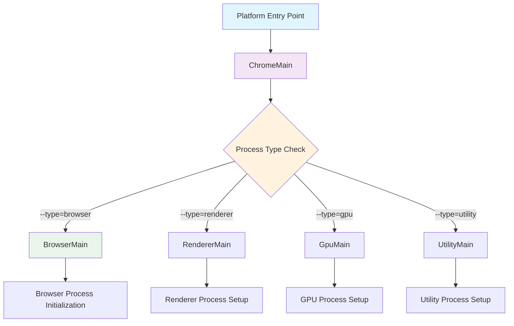
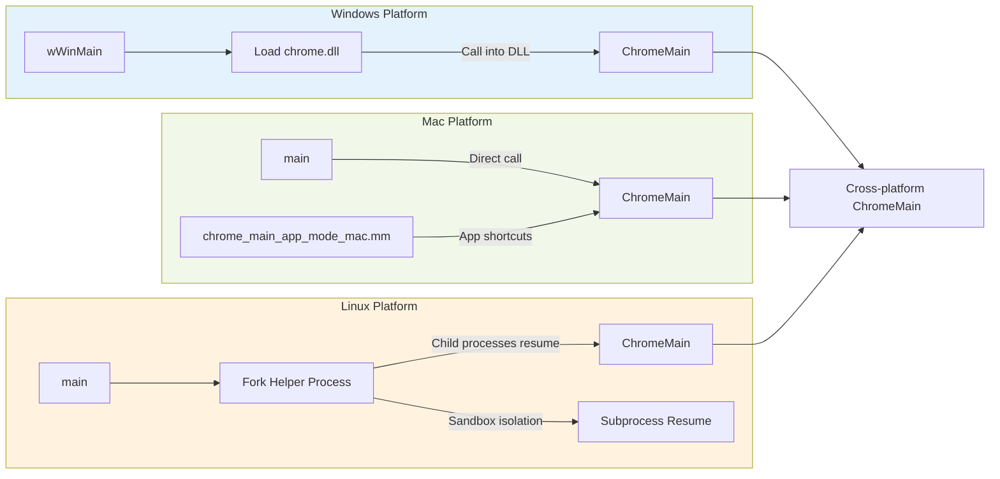

# Startup

Chrome is (mostly) shipped as a single executable that knows how to run as all
the interesting sorts of processes we use.

Here's an overview of how that works.

## Chrome Startup Process Overview

The Chrome startup process follows a platform-agnostic flow with platform-specific entry points:

## Detailed Startup Flow

1. First there's the platform-specific entry point: `wWinMain()` on Windows,
   `main()` on Linux.  This lives in `chrome/app/chrome_exe_main_*`.  On Mac and
   Windows, that function loads modules as described later, while on Linux it
   does very little, and all of them call into:
2. `ChromeMain()`, which is the place where cross-platform code that needs to
   run in all Chrome processes lives.  It lives in `chrome/app/chrome_main*`.
   For example, here is where we call initializers for modules like logging and
   ICU.  We then examine the internal `--process-type` switch and dispatch to:
3. A process-type-specific main function such as `BrowserMain()` (for the outer
   browser process) or `RendererMain()` (for a tab-specific renderer process).

## Platform-specific entry points

Platform-specific startup implementations vary based on the operating system architecture:

### Windows

On Windows we build the bulk of Chrome as a DLL.  (XXX: why?)  `wWinMain()`
loads `chrome.dll`, does some other random stuff (XXX: why?) and calls
`ChromeMain()` in the DLL.

### Mac

Mac is also packaged as a framework and an executable, but they're linked
together: `main()` calls `ChromeMain()` directly.  There is also a second entry
point, in
[`chrome_main_app_mode_mac.mm`](https://cs.chromium.org/chromium/src/chrome/app_shim/chrome_main_app_mode_mac.mm),
for app mode shortcuts: "On Mac, one can't make shortcuts with command-line
arguments. Instead, we produce small app bundles which locate the Chromium
framework and load it, passing the appropriate
data."  This executable also calls `ChromeMain()`.

### Linux

On Linux due to the sandbox we launch subprocesses by repeatedly forking from a
helper process.  This means that new subprocesses don't enter through main()
again, but instead resume from clones in the middle of startup.  The initial
launch of the helper process still executes the normal startup path, so any
initialization that happens in `ChromeMain()` will have been run for all
subprocesses but they will all share the same initialization.
