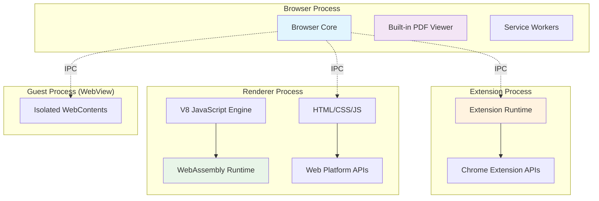
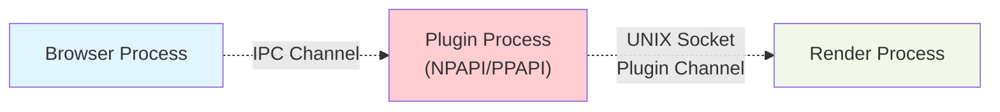
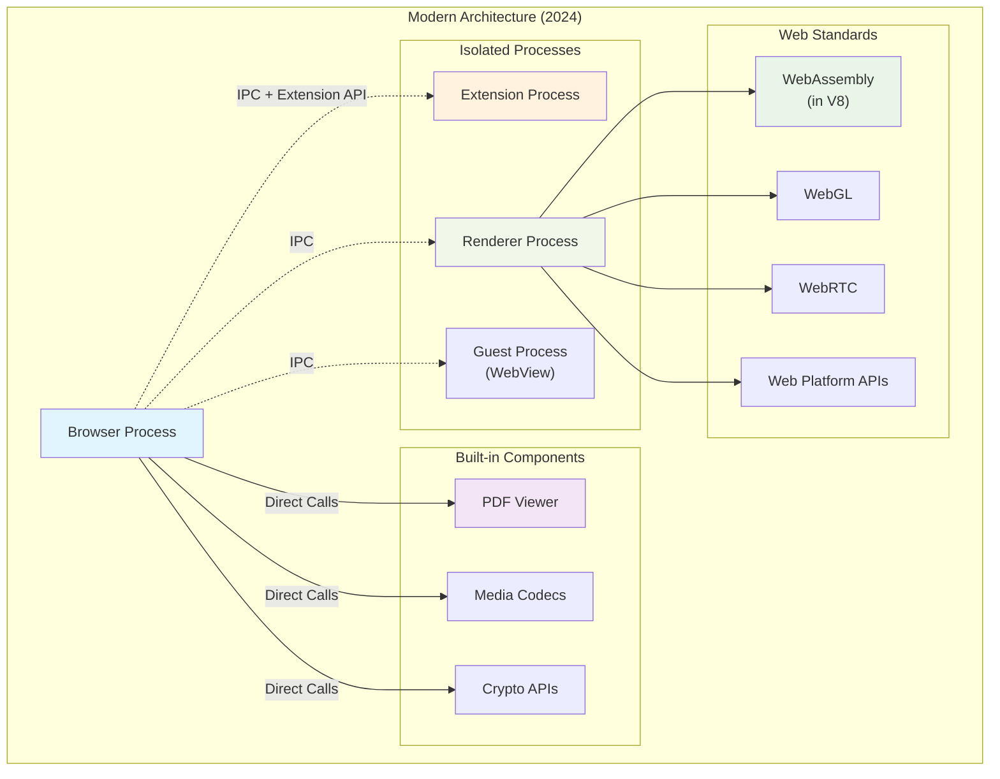
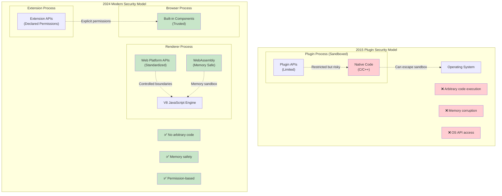
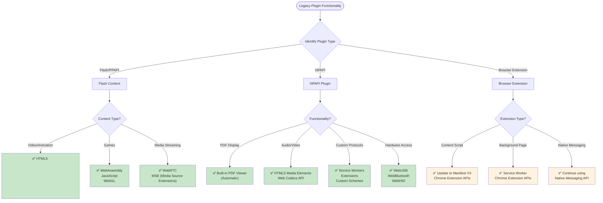

# Analysis of Chromium 134 Plugin Architecture: The Post-Plugin Era

**Created:** March 23, 2026  
**Chromium Version:** 134.0.6998.95  
**Status:** Complete removal of legacy plugin systems

---

## Executive Summary

This document analyzes the current state of plugin architecture in Chromium 134, focusing on what replaced the NPAPI/PPAPI plugin systems that were analyzed in earlier documentation from 2015. The fundamental conclusion is that **Chromium has completely eliminated traditional plugins** and replaced them with modern web platform APIs, WebAssembly, extensions, and built-in browser functionality.

---

## Historical Context: What Was Removed

### NPAPI Plugins (Netscape Plugin API)
- **Status in Chromium 134:** **COMPLETELY REMOVED**
- **Last Supported:** Chromium 45 (September 2015)
- **Reason for Removal:** Security vulnerabilities, stability issues, incompatibility with modern browser architecture

### PPAPI Plugins (Pepper Plugin API)
- **Status in Chromium 134:** **MOSTLY REMOVED**
- **Current Remnants:** Some legacy code for PDF handling (now deprecated)
- **Last Major Use Case:** Flash Player (removed in Chromium 88, January 2021)
- **Reason for Removal:** Security concerns, performance issues, superseded by web standards

### Native Client (NaCl)
- **Status in Chromium 134:** **DEPRECATED AND REMOVED**
- **Replacement:** WebAssembly (WASM)
- **Timeline:** Deprecated in 2020, fully removed by 2022

---

## Modern Architecture Overview

The architecture that replaced the plugin system can be visualized as follows:



---

## Replacement Technologies

### 1. Web Platform APIs
Modern web standards now provide capabilities that previously required plugins:

- **Media:** `<video>`, `<audio>` elements with codec support
- **Graphics:** WebGL, Canvas 2D, WebGPU
- **Communication:** WebRTC for real-time communication
- **Hardware Access:** WebUSB, WebBluetooth, WebHID
- **Cryptography:** Web Crypto API
- **Performance:** WebAssembly for near-native performance

### 2. WebAssembly (WASM)
**Implementation in Chromium 134:**
- Fully integrated into V8 JavaScript engine
- No separate process required
- Runs in the same renderer process as JavaScript
- Subject to same security model as web content

**Key Files:**
- `content/renderer/render_process_impl.cc` - V8 WASM configuration
- `chrome/browser/about_flags.cc` - WASM experimental features
- `content/renderer/content_security_policy_util.cc` - WASM CSP handling

### 3. Extensions (Manifest V3)
**Purpose:** Browser-level functionality extension
**Process Model:** Isolated extension processes
**Security:** Declared permissions, content script isolation
**API Access:** Chrome extension APIs (tabs, storage, networking, etc.)

### 4. Built-in Components
**PDF Viewer:**
- No longer a plugin - built into browser
- Implemented as browser component
- Handles PDF display without external dependencies
- Located in `components/pdf/` directory structure

---

## Process Architecture Changes

### What the 2015 Document Described:


### Current Chromium 134 Architecture:


---

## Code Analysis: Key Changes

### 1. Removal of Plugin Process Infrastructure

**Files that no longer exist or are gutted:**
- `content/browser/plugin/` - Removed
- `content/renderer/pepper/` - Mostly removed
- `ppapi/` directory - Deprecated/removed

**Legacy remnants (marked for removal):**
```cpp
// content/browser/browser_plugin/browser_plugin_guest.h
// NOTE: Despite the name "plugin", this is for guest WebContents (webview)
// TODO: Rename to avoid confusion with removed plugin system
class BrowserPluginGuest {
  // Used for <webview> in extensions, not for plugins
};
```

### 2. Modern PDF Handling

**Old Plugin Approach (2015):**
```cpp
// Plugin process would handle PDF rendering
PluginModule::CreateOutOfProcessModule(render_frame, info, channel_handle)
```

**Modern Built-in Approach (2024):**
```cpp
// chrome/browser/download/chrome_download_manager_delegate.cc
#include "components/pdf/common/pdf_util.h"

// PDF handling is now integrated into browser
void ChromeDownloadManagerDelegate::DetermineDownloadTarget(...) {
  if (IsPdfFile(download_path)) {
    // Route to built-in PDF viewer, no plugin process
    HandlePdfViewing(download);
  }
}
```

### 3. WebAssembly Integration

**Configuration in renderer process:**
```cpp
// content/renderer/render_process_impl.cc
void RenderProcessImpl::InitializeWebKit(...) {
  // WASM flags are configured directly in V8
  SetV8FlagsForWasm(command_line);
  
  // No separate process - runs in renderer with JS
  blink::Initialize(platform.get());
}
```

---

## Security Model Evolution



### Security Improvements:

**Old Plugin Security (2015):**
1. **Process Isolation:** Plugins ran in separate processes
2. **Sandboxing:** Operating system-level restrictions
3. **API Restrictions:** Limited plugin APIs
4. **Problem:** Still allowed arbitrary native code execution

**Modern Security (2024):**
1. **Web Standard Boundaries:** Only standardized web APIs
2. **WASM Sandbox:** Memory-safe execution in V8
3. **Extension Permissions:** Explicit, granular permissions
4. **Built-in Components:** No external code execution

---

## Migration Guide for Legacy Plugin Functionality



### Detailed Migration Paths:

**For Content That Used Flash/PPAPI:**
- **Video/Animation:** Use HTML5 `<video>`, CSS animations, or WebGL
- **Games:** Port to WebAssembly or pure JavaScript
- **Media Streaming:** Use WebRTC or MSE (Media Source Extensions)

**For Content That Used NPAPI:**
- **PDF Display:** Automatic - handled by built-in viewer
- **Audio/Video Codecs:** Use HTML5 media elements
- **Custom Protocols:** Use Service Workers or Extensions
- **Hardware Access:** Use appropriate Web APIs (WebUSB, etc.)

**For Browser Extensions:**
- **Continue using Extensions:** Update to Manifest V3
- **No Process Changes:** Extensions still run in isolated processes
- **API Evolution:** Use chrome.* APIs instead of plugin interfaces

---

## Performance and Developer Experience

### Benefits of the New Architecture:
1. **Improved Security:** No arbitrary native code execution
2. **Better Performance:** WASM provides near-native speed
3. **Simplified Development:** Standard web technologies
4. **Reduced Attack Surface:** Fewer process boundaries to secure
5. **Better Compatibility:** Web standards work across browsers

### Developer Migration Path:
1. **Identify Plugin Dependencies:** Catalog current plugin usage
2. **Map to Web APIs:** Find web standard replacements
3. **Consider WebAssembly:** Port performance-critical native code
4. **Use Extensions Sparingly:** Only for browser-level integration
5. **Test Thoroughly:** Ensure functionality parity

---

## Conclusion

The plugin architecture described in the 2015 document is completely obsolete in Chromium 134. The browser has successfully transitioned to a **plugin-free architecture** where:

- **PDF viewing** is built-in
- **Media playback** uses HTML5 standards
- **High-performance computing** uses WebAssembly
- **Browser extension** uses the Extensions API
- **Hardware access** uses web platform APIs

This evolution represents a fundamental shift from allowing arbitrary native code execution to providing secure, standardized web platform capabilities. The complexity of managing plugin processes, IPC channels, and security boundaries has been replaced with simpler, more secure web standards that provide equivalent or superior functionality.

**Bottom Line:** If you're working with modern Chromium, focus on web standards, WebAssembly, and extensions rather than trying to implement or understand plugin architectures that no longer exist.

---

## References

- **Chromium 134 Source Code Analysis:** Content, Chrome, and Components directories
- **Web Platform Status:** [chromestatus.com](https://chromestatus.com)
- **Extension Documentation:** [Chrome Extension APIs](https://developer.chrome.com/docs/extensions/)
- **WebAssembly Specification:** [W3C WebAssembly](https://www.w3.org/wasm/)
- **Security Model:** Chromium Security Architecture Documentation