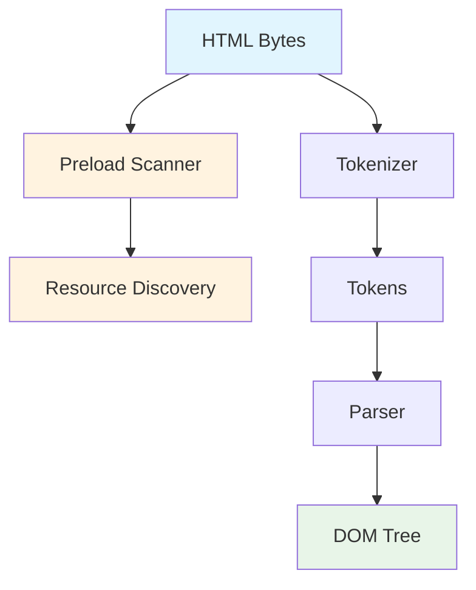
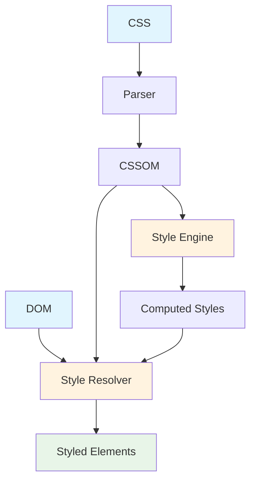
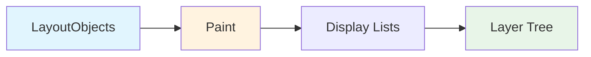
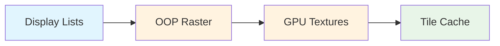
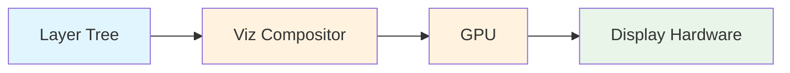

# Render Pipeline

Chromium's render pipeline transforms HTML, CSS and JavaScript into pixels on your screen. In this article we'll cover each major stage, the threads involved, and how Chromium optimizes for smooth, high-performance rendering in modern versions (v134+).

> **📚 Comprehensive Reference**: For deep technical details including browser architecture evolution, JavaScript engine comparisons, and the complete 13-stage rendering pipeline, see **[Rendering Architecture Fundamentals](rendering-architecture-fundamentals.md)**.

---

## 1. Overview & Motivation

- **Goals**  
  - **Speed**: maintain 60 FPS (or higher) on modern devices with 120Hz+ displays  
  - **Smoothness**: avoid jank by minimizing main-thread work per frame  
  - **Efficiency**: only repaint and composite what changed using advanced optimization techniques  
  - **Responsiveness**: prioritize user interactions and critical rendering paths

- **Key Processes**  
  - **Browser Process**: coordinates navigation, input, and process management  
  - **Renderer Process**: handles parsing, style computation, layout, and paint preparation  
  - **GPU Process**: manages compositing, rasterization, and hardware acceleration via Viz  

- **Modern Architecture (v134+)**  
  - **Viz Display Compositor**: unified GPU-accelerated compositing architecture  
  - **SkiaRenderer**: advanced Skia-based rendering backend  
  - **Out-of-Process Rasterization (OOP-R)**: rasterization moved to GPU process  
  - **Direct Rendering Display Compositor (DrDc)**: dual GPU threading for enhanced performance
  - **Canvas2D in GPU Process**: hardware-accelerated canvas rendering

*(Link back to [Architecture → Process Model](process-model.md) for IPC & sandbox context.)*

---

## 2. Stage 1 – Document Parsing & DOM Construction

1. **HTML Tokenizer**  
   - Splits raw bytes into tokens using streaming parser  
   - Supports incremental parsing for progressive rendering  

2. **DOM Tree Builder**  
   - Builds a tree of `Node` objects from tokens  
   - Handles `<script>` tags: may pause parsing for execution  
   - Uses **script streaming** for async script compilation  

3. **Preload Scanner**  
   - Speculatively discovers resources during parsing  
   - Enables early resource loading for better performance  

4. **Progressive Rendering**  
   - Allows rendering to begin before full document parse  
   - Critical for perceived performance on large pages  



---

## 3. Stage 2 – CSS Style Resolution & Computed Styles

### CSSOM Construction
- **CSS Tokenizer**: Parses stylesheets into CSSOM tree  
- **Rule Matching**: Optimized selector matching against DOM nodes  
- **Cascade Resolution**: Handles specificity, inheritance, and !important rules  

### Style Computation (Blink StyleEngine)
- **Computed Style Calculation**: Resolves all CSS properties to computed values  
- **CSS Container Queries**: Modern layout feature support (v134+)  
- **CSS Cascade Layers**: Advanced cascade control mechanisms  
- **Style Invalidation**: Efficiently updates styles when changes occur  

### Modern CSS Features (v134+)
- **CSS Grid subgrid**: Advanced grid layout capabilities  
- **CSS View Transitions**: Smooth page transitions  
- **CSS Color Level 4**: Extended color spaces and functions  
- **CSS Logical Properties**: Writing-mode aware properties  



---

## 4. Stage 3 – Layout (Reflow) & Modern Layout Engines

### Box Tree Construction
- **LayoutObject Tree**: Wraps styled nodes into layout boxes  
- **Modern Layout**: Support for Flexbox, Grid, and Container Queries  
- **NG Layout Engine**: Next-generation layout system for better performance  

### Layout Computation
- **Flow & Positioning**: Box model, floats, positioning schemes  
- **Fragmentation**: Multi-column, CSS regions, and printing support  
- **Intrinsic Sizing**: Content-based sizing calculations  
- **Layout Containment**: Performance optimizations through CSS containment  

### Threading & Performance
- **Main Thread**: Primary layout computation  
- **Layout Shift Prevention**: Core Web Vitals optimization  
- **Incremental Layout**: Only relayout affected subtrees  

**Output**: LayoutObject tree with precise geometry and positioning


---

## 5. Stage 4 – Paint Preparation & Recording

### Paint Operation Generation
- **Paint Records**: Translates LayoutObjects into Skia drawing operations  
- **Display Lists**: Serializes paint commands for efficient replay  
- **Paint Worklets**: CSS Paint API support for custom rendering  

### Layer Creation & Compositing Decisions
- **Compositing Triggers**: CSS transforms, opacity, filters, will-change  
- **Layer Tree**: Organizes content into compositable layers  
- **Paint Invalidation**: Tracks which regions need repainting  
- **Backdrop Filters**: Advanced filter effects on layer content  

### Modern Paint Features (v134+)
- **Variable Fonts**: Advanced typography support  
- **CSS Color Spaces**: P3, Rec2020, and other wide-gamut colors  
- **Advanced Filters**: CSS filter effects and backdrop-filter  

**Key Classes**: `PaintController`, `DisplayItemList`, `PaintLayer`



---

## 6. Stage 5 – Rasterization & GPU Acceleration

### Out-of-Process Rasterization (OOP-R)
- **GPU Process Raster**: Rasterization moved from renderer to GPU process  
- **Vulkan Backend**: Modern graphics API support on supported platforms  
- **Metal Backend**: macOS hardware acceleration  
- **Performance Benefits**: Reduced memory usage and improved parallelism  

### Tile-Based Rendering
- **Raster Tiles**: Large layers split into manageable tiles  
- **Tile Prioritization**: Visible tiles rendered first  
- **Tile Caching**: Intelligent reuse of unchanged tile content  
- **GPU Texture Management**: Efficient GPU memory allocation  

### Modern Rasterization Features
- **SkiaRenderer**: Advanced Skia-based rendering backend  
- **Hardware-accelerated Canvas**: Canvas2D operations in GPU process  
- **WebGL Integration**: Seamless 3D content integration  

**Output**: GPU textures and rasterized tile bitmaps



---

## 7. Stage 6 – Compositing & Display via Viz

### Viz Display Compositor Architecture
- **Unified Compositing**: Single compositor for all content types  
- **Surface Aggregation**: Combines surfaces from multiple sources  
- **Damage Tracking**: Precise tracking of changed regions  
- **Frame Synchronization**: Coordinated frame submission across processes  

### GPU Process Composition
- **CompositorFrameSink**: Interface for submitting compositor frames  
- **Surface Hierarchy**: Nested surface management for complex layouts  
- **Display Transform**: Handle device rotation and scaling  
- **HDR Support**: High dynamic range content rendering  

### DrDc Enhancement (Modern Builds)
For detailed information about the advanced **Direct Rendering Display Compositor (DrDc)** dual GPU threading architecture that enhances performance beyond traditional Viz compositing, see **[DrDc Architecture](drdc-architecture.md)**.

### Present & VSync Integration
- **Frame Scheduling**: Intelligent frame timing based on display capabilities  
- **Variable Refresh Rate**: Support for adaptive sync displays  
- **Frame Pacing**: Optimized frame submission for smooth animation  
- **Multi-Display**: Synchronized rendering across multiple screens  

**Output**: Smooth, synchronized frames displayed to screen



---

## 8. Threading & Modern Pipeline Architecture

### Thread Responsibilities (v134+)

| Thread | Work | Modern Enhancements |
|--------|------|-------------------|
| **Main** | DOM, CSSOM, style, layout, paint commands | Script streaming, lazy loading |
| **Compositor** | Layer tree updates, IPC to GPU process | Viz integration, surface management |
| **Raster** | Display list → GPU textures (OOP-R) | GPU process rasterization |
| **GPU** | Texture uploads, draw calls, compositing | SkiaRenderer, Vulkan/Metal support |
| **IO** | Network, file operations | Parallel resource loading |
| **Worker** | Web Workers, Service Workers | Off-main-thread execution |

### Performance Optimizations
- **Frame Pipelining**: Chromium overlaps raster & GPU work across frames to maximize throughput
- **Predictive Loading**: Anticipate user actions for better responsiveness  
- **Priority-based Scheduling**: Critical rendering path optimization
- **Concurrent Processing**: Multi-threaded execution where possible

---

## 9. Modern Optimizations & Techniques (v134+)

### Rendering Optimizations
- **Partial Invalidation**: Only repaint precisely changed regions using damage tracking
- **Occlusion Culling**: Skip rendering completely hidden content
- **Content Visibility**: CSS content-visibility for performance gains
- **Container Queries**: Efficient responsive design without layout thrashing

### GPU & Memory Optimizations  
- **Zero-Copy Paths**: Direct GPU texture for video, WebGL, and canvas content
- **Memory Pressure Handling**: Intelligent texture eviction under memory constraints
- **Shared GPU Memory**: Efficient cross-process texture sharing
- **Tile Prioritization**: Render visible content first, defer off-screen tiles

### Scrolling & Animation
- **Compositor-Only Scrolling**: Smooth scrolling without main thread involvement
- **Transform Animations**: GPU-accelerated CSS transforms and animations
- **Scroll Anchoring**: Prevent layout shifts during dynamic content loading
- **Paint Holding**: Minimize flash of unstyled content (FOUC)

### Modern Web Features
- **Canvas OffscreenCanvas**: Multi-threaded canvas rendering
- **WebAssembly Integration**: Optimized WASM execution in rendering pipeline
- **WebGPU Support**: Next-generation graphics API integration
- **CSS Containment**: Isolation boundaries for performance optimization

---

## 10. Debugging & Performance Analysis (v134+)

### Chrome DevTools Integration
- **Performance Panel**: Detailed flame graphs with modern metrics
- **Rendering Tab**: Layer visualization, paint flashing, and layout shift detection
- **Core Web Vitals**: LCP, FID, CLS measurement and optimization guidance
- **Memory Panel**: GPU memory usage and texture analysis

### Command Line Debugging
```bash
# Modern GPU debugging flags
--enable-gpu-rasterization          # Force GPU rasterization
--enable-vulkan                     # Use Vulkan backend (where supported)
--disable-gpu-sandbox               # Disable GPU process sandbox (debug only)
--show-composited-layer-borders     # Visualize compositing layers
--show-paint-rects                  # Highlight repainted regions
--enable-logging=stderr             # Detailed logging output

# Performance analysis
--trace-startup                     # Profile startup performance
--no-sandbox                       # Disable sandboxing (debug builds only)
```

### Chrome Internal Pages
- **chrome://gpu/**: GPU capabilities and feature status
- **chrome://tracing/**: Advanced performance tracing with timeline visualization
- **chrome://histograms/**: Detailed performance metrics and histograms
- **chrome://memory-internals/**: Memory usage breakdown by process
- **chrome://discards/**: Tab lifecycle and memory pressure information

### Blink Rendering Metrics
- **First Contentful Paint (FCP)**: Time to first visible content
- **Largest Contentful Paint (LCP)**: Time to largest content element
- **Cumulative Layout Shift (CLS)**: Visual stability measurement
- **First Input Delay (FID)**: Input responsiveness metric

---

## 11. Next Steps & Further Reading

### Advanced Topics
- **[Browser Components](browser-components.md)**: Cross-process services and architecture
- **[Storage & Cache](../modules/storage-cache.md)**: How caching integrates with rendering pipeline
- **[Security Model](../security/security-model.md)**: Sandboxing and process isolation details

### Experimental Features (v134+)
- **Document Transition API**: Smooth page transitions with shared element animations
- **CSS Anchor Positioning**: Advanced positioning relative to other elements
- **WebGPU Integration**: Next-generation graphics API for web applications
- **Advanced Typography**: Variable fonts and OpenType features

### Performance Optimization Resources
- **Web Performance Working Group**: Latest standards and best practices
- **Chrome Platform Status**: Track new rendering features and their implementation status
- **Lighthouse CI**: Automated performance testing and Core Web Vitals monitoring

### Hands-On Experiments
```bash
# Try modern GPU acceleration
--enable-gpu-rasterization --enable-vulkan

# Profile rendering performance
chrome://tracing/ with "Rendering" category enabled

# Measure Core Web Vitals
DevTools → Lighthouse → Performance audit

# Visualize rendering pipeline
DevTools → Rendering → Paint flashing + Layer borders
```

---

**End of Modern Render Pipeline Guide**

### Key Changes in v134+
- **Viz Display Compositor**: Unified GPU-accelerated compositing
- **Out-of-Process Rasterization**: Improved performance and stability
- **SkiaRenderer**: Advanced graphics rendering backend
- **Modern CSS Support**: Container queries, cascade layers, color spaces
- **Enhanced Performance Tools**: Better debugging and optimization capabilities

**Notes for Developers:**
- Monitor Chrome Platform Status for latest rendering features
- Use modern CSS containment for performance optimization
- Leverage GPU acceleration through proper layer promotion
- Profile regularly with DevTools Performance panel and Core Web Vitals metrics

**Related Deep-Dive Documentation:**
- [Chromium Compositor (cc) - Technical Deep Dive](chromium-compositor-cc.md) - Detailed technical analysis of the cc component architecture, layer management, and compositor internals
