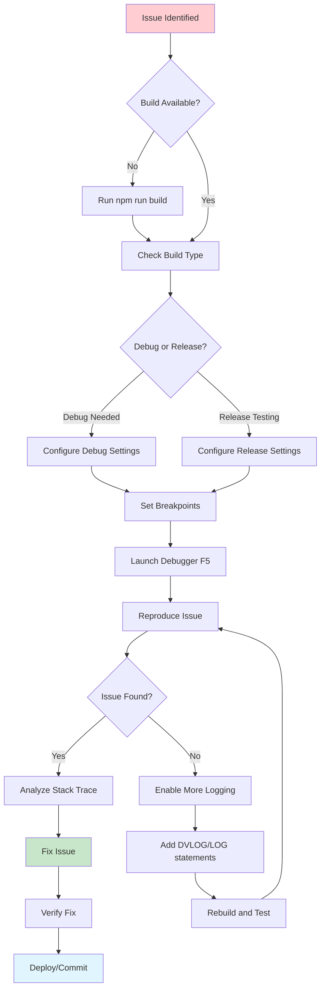

# Debugging Guide

## Overview

This guide provides comprehensive debugging instructions for the Custom Browser project, including VS Code configuration, debugging scenarios, troubleshooting, and best practices.

## Quick Reference

### Debug Configurations Summary

| Configuration | Build | Purpose | Auto-Launch URL |
|---------------|-------|---------|-----------------|
| **Debug Browser (Debug Build)** | Debug | General development | None |
| **Debug Browser (Release Build)** | Release | Performance testing | None |
| **Debug RSS Feature** | Debug | RSS functionality | http://www.ft.com/rss/world/uk |
| **Debug Browser with DevTools** | Debug | Frontend debugging | None (DevTools auto-open) |
| **Debug Browser - Headless** | Debug | Automated testing | https://example.com |
| **Debug Browser - Safe Mode** | Debug | Compatibility issues | None |
| **Attach to Browser Process** | Any | Running instance | N/A |

### Quick Start Commands

```bash
# Standard debugging workflow
npm run build              # Build debug version
F5                        # Launch debugger in VS Code
Ctrl+Shift+D              # Open debugger panel
Ctrl+Shift+P → "Debug"    # Access debug commands

# Build tasks
Ctrl+Shift+B              # Run build task
Ctrl+Shift+P → "Tasks"    # Access all tasks
```

## Debug Workflow Process

The debugging workflow follows a systematic approach for effective troubleshooting:



### Common Logging Commands

```bash
# Quick DVLOG debugging (debug builds only)
./out/Debug/chrome.exe --enable-logging --v=2

# Focused module logging (recommended)
./out/Debug/chrome.exe --log --v=0 --vmodule=my_component*=2

# RSS-specific debugging
./out/Debug/chrome.exe --enable-logging --vmodule=rss*=3

# Minimal noise logging for specific investigation
./out/Debug/chrome.exe --log --v=0 --vmodule=network=1,cache=2
```

## Detailed Configuration Guide

### Primary Debug Configuration: Debug Browser (Debug Build)

**Configuration Details:**
```json
{
  "name": "Debug Browser (Debug Build)",
  "type": "cppvsdbg",
  "request": "launch",
  "program": "${workspaceFolder}/src/custom/out/Debug/chrome.exe",
  "args": [
    "--disable-web-security",
    "--disable-features=VizDisplayCompositor",
    "--user-data-dir=${workspaceFolder}/debug-profile",
    "--enable-logging",
    "--log-level=0",
    "--v=1"
  ]
}
```

**Command Line Equivalent:**
```powershell
./src/custom/out/Debug/chrome.exe `
  --disable-web-security `
  --disable-features=VizDisplayCompositor `
  --user-data-dir=./debug-profile `
  --enable-logging --log-level=0 --v=1
```

**Use Cases:**
- Setting breakpoints in C++ code
- Stepping through browser initialization
- Debugging custom features and components
- General day-to-day development

### RSS-Specific Debug Configuration

**Configuration Purpose:**
Specialized debugging for RSS feed detection and InfoBar functionality.

**Key Features:**
```bash
# RSS-specific logging
--vmodule=rss*=2          # Verbose RSS component logging
--log-level=0 --v=2       # Enhanced general logging

# Pre-configured test URL
http://www.ft.com/rss/world/uk   # Known working RSS feed

# Isolated profile
--user-data-dir=./debug-profile-rss
```

**Expected Debug Output:**
```
[RSS] RSSTabHelper::RSSTabHelper() - Initializing for URL: https://www.ft.com/rss/world/uk
[RSS] RSSTabHelper::DidFinishNavigation() - Navigation completed
[RSS] RSSTabHelper::DidFinishLoad() - Calling validation script
[RSS] RSSTabHelper::OnDOMInspectionDone() - Browser found on retry
[RSS] RSSTabHelper::OnDOMInspectionDone() - Found 1 potential RSS feeds
[RSS] RSSInfoBarDelegate::Create() - Creating RSS InfoBar
[RSS] RSSTabHelper::CreateInfoBar() - InfoBar created successfully
```

**RSS Debugging Workflow:**
1. **Set breakpoints** in RSS code:
   - `src/custom/components/rss/rss_tab_helper.cc`
   - `src/custom/browser/ui/views/infobars/rss_infobar_delegate.cc`
2. **Launch RSS debug configuration** (F5)
3. **Monitor Debug Console** for RSS-specific logs
4. **Test RSS detection** on various feeds
5. **Verify InfoBar** appears and functions correctly

## Debugging Scenarios

### Scenario 1: Debugging Browser Startup Issues

**Problem**: Browser crashes or fails to start

**Debug Approach:**
```bash
# 1. Use Safe Mode configuration first
Configuration: "Debug Browser - Safe Mode"

# 2. Check startup logs
Debug Console → Look for early initialization errors

# 3. Set breakpoints in browser main parts
File: src/custom/chrome/browser/chrome_browser_main_parts.cc
Function: ChromeBrowserMainParts::PreMainMessageLoopStart()
```

**Common Startup Issues:**
- Missing dependencies (DLLs)
- Profile/user data directory permissions
- Custom component initialization failures
- Patch application issues

### Scenario 2: RSS Feature Not Working

**Problem**: RSS feeds not detected or InfoBar not appearing

**Debug Steps:**
```bash
# 1. Enable RSS debug configuration  
F5 → "Debug RSS Feature"

# 2. Check RSS logs in Debug Console
Look for: "RSSTabHelper" messages

# 3. Verify RSS detection JavaScript
Set breakpoint: RSSTabHelper::DidFinishLoad()

# 4. Test known working feeds
- http://www.ft.com/rss/world/uk
- http://feeds.bbci.co.uk/news/rss.xml
- http://feeds.feedburner.com/TechCrunch
```

**RSS Debug Checkpoints:**
1. **Navigation**: `RSSTabHelper::DidFinishNavigation()`
2. **DOM Ready**: `RSSTabHelper::DidFinishLoad()`
3. **Feed Detection**: `RSSTabHelper::OnDOMInspectionDone()`
4. **InfoBar Creation**: `RSSInfoBarDelegate::Create()`

### Scenario 3: Performance Issues

**Problem**: Browser runs slowly or consumes excessive resources

**Debug Configuration**:
```bash
Configuration: "Debug Browser (Release Build)"
Additional Args: [
  "--enable-benchmarking",
  "--enable-stats-collection-bindings",
  "--single-process"
]
```

**Performance Analysis Steps:**
1. **Compare Debug vs Release** build performance
2. **Use single-process mode** to simplify debugging
3. **Enable performance counters** with additional flags
4. **Profile with Visual Studio** performance tools

### Scenario 4: Frontend/JavaScript Issues  

**Problem**: Web content not rendering correctly or JavaScript errors

**Debug Configuration**: "Debug Browser with DevTools"

**Features:**
- **Auto-opens DevTools** for immediate frontend debugging
- **Console access** for JavaScript error inspection
- **Network tab** for resource loading issues
- **Elements tab** for DOM manipulation debugging

## Advanced Debugging Techniques

### Memory Debugging

**Configuration Modifications:**
```json
"args": [
  // Standard args...
  "--enable-heap-profiling",
  "--enable-memory-benchmarking",
  "--log-level=0",
  "--v=2"
]
```

**Memory Analysis Tools:**
- Visual Studio Diagnostic Tools
- Chrome DevTools Memory tab (for web content)
- Custom memory tracking in C++ code

### Multi-Process Debugging

**Challenge**: Chromium runs multiple processes (browser, renderer, GPU, etc.)

**Solutions:**
1. **Single-process mode**: `--single-process` (easier debugging)
2. **Attach to specific processes**: Use "Attach to Browser Process" configuration
3. **Multi-target debugging**: Configure multiple debug sessions

**Process Identification:**
```bash
# List Chrome processes
tasklist | findstr chrome

# Attach to specific process types
Browser Process:   Main chrome.exe
Renderer Process:  chrome.exe --type=renderer  
GPU Process:       chrome.exe --type=gpu-process
Utility Process:   chrome.exe --type=utility
```

### Remote Debugging

**Setup for remote debugging:**
```bash
# Launch browser with remote debugging enabled
./chrome.exe --remote-debugging-port=9222 --user-data-dir=./remote-profile

# Connect from another machine
http://[target-ip]:9222
```

**Use Cases:**
- Debugging on different machines
- Automated testing integration
- Web content debugging from external tools

### KeyedService Shutdown Crashes

**Common Issue**: Shutdown crashes due to invalid service references

**Typical Stack Trace Pattern:**
```
PrefService::GetPreferenceValue() CHECK failure: "Trying to access an unregistered pref"
Called from CustomService::SomeMethod() during PostMainMessageLoopRun()
```

**Root Cause**: Services holding `raw_ptr` references to profile-dependent objects (PrefService, HistoryService, etc.) where the referenced objects are destroyed before the service.

**Solution Pattern**: Always override `KeyedService::Shutdown()` for custom services:

```cpp
class ClearDataService : public KeyedService {
 public:
  // KeyedService implementation
  void Shutdown() override;
  
 private:
  base::raw_ptr<PrefService> prefs_ = nullptr;
  base::raw_ptr<Profile> profile_ = nullptr;
};

void ClearDataService::Shutdown() {
  // Clear references to profile-dependent objects during shutdown
  // to prevent crashes when they are destroyed before this service
  pref_change_registrar_.RemoveAll();
  prefs_ = nullptr;
  profile_ = nullptr;
  // Clear other profile-dependent raw_ptr references...
}
```

**Additional Safety**: Keep null checks in accessor methods as defensive programming:

```cpp
bool ClearDataService::IsOnExit() const {
  if (!prefs_) {
    return false;  // Safe default during shutdown
  }
  return prefs_->GetBoolean(prefs::kBrowserClearDataOnExit);
}
```

**Debug Tips:**
- Check if crash happens during `PostMainMessageLoopRun()`
- Look for `CHECK` failures in preference/service access
- Verify all custom KeyedServices implement `Shutdown()`
- Test shutdown scenarios frequently during development

## Build Integration

### Automatic Build Tasks

**Pre-Launch Tasks:**
Debug configurations automatically trigger build tasks:

```json
// Triggered automatically before debugging
{
  "preLaunchTask": "Build Debug Browser"
}
```

**Available Build Tasks:**
- **Build Debug Browser** (Default, triggered by F5)
- **Build Release Browser** (Manual, via Ctrl+Shift+P)
- **Clean Build Output** (Manual cleanup)
- **Sync Chromium Source** (Update source code)

### Manual Build Commands

```powershell
# Standard development build
npm run build

# Clean build (recommended after major changes)
npm run gn_clean && npm run build

# Apply patches (if build fails due to patches)
npm run apply_patches && npm run build

# Check patch application status
npm run apply_patches:what-if
```

### Build Troubleshooting

**Common Build Issues:**

1. **Out-of-date patches**:
   ```bash
   npm run apply_patches    # Reapply patches
   npm run update_patches   # Update patch files
   ```

2. **Missing dependencies**:
   ```bash
   cd src/custom
   gclient sync --force      # Force dependency sync
   ```

3. **Configuration issues**:
   ```bash
   npm run gn_clean         # Clean GN configuration
   npm run build           # Regenerate and build
   ```

## Troubleshooting Common Issues

### Issue: "chrome.exe not found"

**Cause**: Debug build not completed or in wrong location

**Solutions:**
```bash
# 1. Verify build completion
ls src/custom/out/Debug/chrome.exe

# 2. Check build logs for errors
npm run build 2>&1 | grep -i error

# 3. Clean and rebuild
npm run gn_clean && npm run build
```

### Issue: Debugger won't attach

**Causes & Solutions:**

1. **VS Code permissions**:
   ```bash
   # Run VS Code as administrator (Windows)
   # Or check file permissions (Linux/Mac)
   ```

2. **Antivirus interference**:
   ```bash
   # Add exclusions for:
   # - Workspace folder  
   # - VS Code executable
   # - Chrome debug builds
   ```

3. **Multiple VS Code instances**:
   ```bash
   # Close all VS Code windows
   # Open single instance with workspace
   ```

### Issue: Breakpoints not hit

**Diagnostic Steps:**

1. **Verify symbol loading**:
   ```bash
   # Check Debug Console for symbol loading messages
   # Ensure debug build includes full symbols
   ```

2. **Check code path execution**:
   ```cpp
   // Add logging to verify code execution
   VLOG(1) << "Debug checkpoint reached";
   ```

3. **Validate breakpoint location**:
   ```bash
   # Ensure breakpoint is in executed code path
   # Not in header-only code or unused functions
   ```

### Issue: RSS debugging shows no logs

**Debug Steps:**

1. **Verify RSS logging flags**:
   ```bash
   # Check launch configuration includes:
   --vmodule=rss*=2
   ```

2. **Check RSS code compilation**:
   ```bash
   # Verify RSS sources are included in build
   grep -r "rss_tab_helper" src/custom/out/Debug/
   ```

3. **Test with known RSS feeds**:
   ```bash
   # Use confirmed working feeds:
   http://www.ft.com/rss/world/uk
   http://feeds.bbci.co.uk/news/rss.xml
   ```

## Best Practices

### Code Organization for Debugging

**Structured Logging:**
```cpp
// Use consistent logging levels
VLOG(1) << "High-level operation: " << operation_name;
VLOG(2) << "Detailed step: " << step_details;  
VLOG(3) << "Verbose debug: " << debug_info;
```

### Advanced Logging Techniques

#### DVLOG vs VLOG

**DVLOG (Debug Verbose Log):**
- Only available in **debug builds**
- Automatically stripped from release builds
- Ideal for development-time debugging that shouldn't impact production

```cpp
// Debug builds only - automatically removed in release
DVLOG(1) << "DisplayInfoFromSpec info=" << display_info.ToString() 
         << ", spec=" << spec;
DVLOG(2) << "Internal state: " << GetInternalState();
```

**VLOG (Verbose Log):**
- Available in both debug and release builds
- Controlled by runtime flags
- Use for logging that might be helpful in production

```cpp
// Available in all builds
VLOG(1) << "User action: " << user_action;
VLOG(2) << "Performance metric: " << timing_info;
```

#### Command Line Logging Controls

**Basic Verbose Logging:**
```bash
# Enable DVLOG(1) output (requires debug build)
--v=2

# Enable DVLOG(0) output  
--v=1

# General pattern: --v=N enables DVLOG(N-1) and below
```

**Module-Specific Logging (Recommended):**
```bash
# Enable logging only for specific files/modules
--log --v=0 --vmodule=foo=1           # Only foo.cc DVLOG(0)
--log --v=0 --vmodule=foo=1,bar=2     # foo.cc DVLOG(0), bar.cc DVLOG(1)
--log --v=0 --vmodule=rss*=2          # All RSS files DVLOG(1)

# Benefits: Reduces noise, focuses on specific components
```

**Complete Logging Configuration:**
```bash
# Full logging setup for development
./out/Debug/chrome.exe \
  --enable-logging \
  --log-level=0 \
  --v=2 \
  --vmodule=my_component*=3 \
  --user-data-dir=./debug-profile
```

#### Practical Logging Examples

**Component Initialization:**
```cpp
DVLOG(1) << "Initializing " << GetComponentName();
DVLOG(2) << "Configuration: " << config.ToString();
DVLOG(3) << "Dependencies: " << GetDependencyList();
```

**Performance Monitoring:**
```cpp
base::TimeTicks start_time = base::TimeTicks::Now();
// ... do work ...
DVLOG(1) << "Operation completed in " 
         << (base::TimeTicks::Now() - start_time).InMilliseconds() << "ms";
```

**State Debugging:**
```cpp
DVLOG(2) << "State transition: " << old_state << " -> " << new_state;
DVLOG(3) << "Full state dump: " << DumpInternalState();
```

**Meaningful Breakpoint Locations:**
```cpp
// Good breakpoint locations:
void ComponentInitialize() {
  // ← Set breakpoint here for initialization debugging
  VLOG(1) << "Starting component initialization";
  
  DoImportantWork();
  // ← Set breakpoint here for work completion
  
  VLOG(1) << "Component initialization complete";
}
```

### Profile Management

**Isolated Debug Profiles:**
Each debug configuration uses separate profiles to avoid interference:

```bash
debug-profile/          # General debugging
debug-profile-rss/      # RSS-specific debugging  
debug-profile-devtools/ # DevTools development
debug-profile-safe/     # Safe mode debugging
debug-profile-release/  # Release build testing
```

**Benefits:**
- Independent browser state
- Separate extension configurations
- Isolated crash dumps and logs
- No interference with personal browsing data

### Effective Debugging Workflow

**Daily Development Cycle:**
1. **Start with broad breakpoints** in major components
2. **Use logging** for persistent debugging information
3. **Narrow down** to specific issue areas
4. **Test with multiple configurations** (debug/release)
5. **Document findings** in code comments

**Debugging Session Structure:**
```bash
# Morning startup
1. Pull latest changes
2. npm run build          # Ensure clean build
3. F5 → Start debugging   # Begin debug session
4. Set strategic breakpoints
5. Test core functionality

# During development  
1. Make code changes
2. F5 (auto-rebuild and restart)
3. Test specific features
4. Iterate on fixes

# End of day
1. Commit working changes
2. Document any remaining issues
3. Clean debug profiles if needed
```

### Performance Considerations

**Debug vs Release Builds:**

**Debug Build Characteristics:**
- Full symbol information for detailed debugging
- Assertions enabled for runtime validation
- Optimizations disabled for accurate debugging
- Larger file sizes and slower execution

**Release Build Characteristics:**  
- Optimized for performance
- Minimal symbol information
- Production-like behavior
- Smaller footprint, faster execution

**When to Use Each:**
- **Debug Build**: Daily development, feature work, bug investigation
- **Release Build**: Performance testing, final validation, production simulation

## Integration with Development Tools

### Git Integration

**Debug Profile Management:**
```bash
# Debug profiles are ignored in .gitignore
debug-profile*/
out/
*.log
```

**Debugging Git Issues:**
```bash
# Debug repository state during build
git status
git log --oneline -10
git submodule status
```

### VS Code Extensions Recommendations

**Recommended Extensions for Enhanced Debugging:**

1. **C/C++** (ms-vscode.cpptools)
   - IntelliSense and debugging for C++
   - Symbol navigation and code completion

2. **Python** (ms-python.python)
   - Python script debugging and IntelliSense  
   - Integration with project Python tools

3. **GitLens** (eamodio.gitlens)
   - Enhanced Git integration
   - Blame information and history

4. **Error Lens** (usernamehw.errorlens)
   - Inline error and warning display
   - Improved compilation error visibility

### Integration with External Tools

**Windows Tools:**
- **Visual Studio Debugger**: For advanced C++ debugging
- **Process Monitor**: For file and registry access debugging
- **Windows Event Viewer**: For system-level debugging

**Cross-Platform Tools:**
- **GDB**: For Linux debugging (when applicable)
- **Valgrind**: For memory debugging (Linux)
- **Chrome DevTools**: For web content debugging
- **WinDbg**: For advanced Windows debugging scenarios

---

## Additional Resources

### Documentation References
- [Development Guide](development-guide.md) - Main development documentation
- [Build System Guide](build-system.md) - Build system details
- [API Reference](api-reference.md) - Code API documentation
- [Troubleshooting Guide](troubleshooting.md) - General troubleshooting

### External Resources
- [Chromium Development Documentation](https://www.chromium.org/developers/)
- [VS Code Debugging Guide](https://code.visualstudio.com/docs/editor/debugging)
- [Windows Debugging Tools](https://docs.microsoft.com/en-us/windows-hardware/drivers/debugger/)

### Community Support
- Project GitHub Issues: Technical problems and bug reports
- Stack Overflow: General Chromium and C++ debugging questions
- Chromium Developer Groups: Advanced Chromium development topics