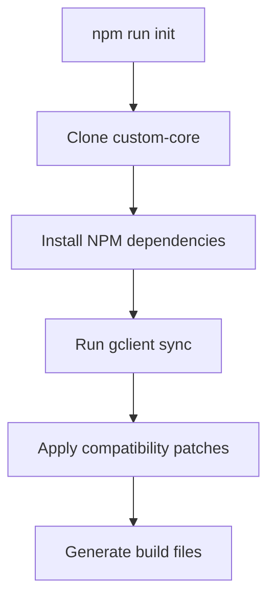

# Custom Browser Build System Documentation

## Overview

The Custom Browser project uses a sophisticated build system based on Chromium's build infrastructure, with custom configurations and automation scripts to streamline the development process.

## Build Architecture

### Core Components

#### 1. Chromium Build System
- **GN (Generate Ninja)**: Meta-build system that generates Ninja files
- **Ninja**: Fast, small build system designed for speed
- **depot_tools**: Google's collection of build tools
- **gclient**: Repository management and dependency synchronization

#### 2. Custom Build Configuration
- **BUILD.gn**: Main build configuration files
- **custom_browser_config.gni**: Browser-specific build flags
- **sources.gni**: Source file inclusions and exclusions
- **buildflag headers**: Compile-time feature flags

#### 3. Build Automation
- **build.py**: Main build orchestration script
- **sync.py**: Source synchronization script
- **applyPatches.py**: Patch management script

## Build Process Flow

### 1. Environment Setup


### Build Configuration Hierarchy

```mermaid
graph TB
    subgraph "Configuration Sources"
        PKG[package.json]
        ARGS[args.gn]
        CONFIG[custom_browser_config.gni]
        ENV[Environment Variables]
    end
    
    subgraph "Build System"
        GN[GN Meta-Build]
        NINJA[Ninja Build]
        COMP[Compilation]
    end
    
    subgraph "Output Artifacts"
        EXE[Browser Executable]
        RES[Resource Files]
        LIBS[Libraries]
        PAK[PAK Files]
    end
    
    PKG --> GN
    ARGS --> GN
    CONFIG --> GN
    ENV --> GN
    
    GN --> NINJA
    NINJA --> COMP
    
    COMP --> EXE
    COMP --> RES
    COMP --> LIBS
    COMP --> PAK
```



### 2. Source Synchronization
```bash
# Performed by gclient sync
gclient sync --nohooks --no-history --shallow
```

**Operations**:
- Fetch Chromium source code at specified version
- Download build dependencies and tools
- Apply custom patches and modifications
- Set up build environment

### 3. Build Configuration
```bash
# Generate build files with GN
gn gen out/Release --args="custom_browser_build=true"
```

**Configuration Files**:
- `args.gn`: Build argument configuration
- `BUILD.gn`: Build target definitions
- `custom_browser_config.gni`: Custom build flags

### 4. Compilation
```bash
# Build with Ninja
ninja -C out/Release chrome
```

**Process**:
- Parallel compilation across CPU cores
- Incremental builds for changed files
- Link custom browser executable

## Build Configuration

### GN Build Arguments

#### Core Arguments
```gn
# Enable custom browser build
custom_browser_build = true

# Set browser branding
custom_browser_name = "CustomBrowser"
custom_browser_version = "1.0.0"

# Build configuration
is_debug = false
is_component_build = false
symbol_level = 1

# Feature flags
enable_nacl = false
enable_print_preview = true
enable_pdf = true
```

#### Platform-Specific Arguments
```gn
# Windows
is_win = true
target_cpu = "x64"
win_console_app = false

# Visual Studio configuration
visual_studio_version = "2022"
visual_studio_runtime_dirs = ["C:/Program Files/Microsoft Visual Studio/2022/BuildTools/VC/Redist/MSVC/..."]
```

## Build Optimization

### Performance Optimization
- **Parallel Builds**: Configure number of parallel jobs based on system capabilities
- **Incremental Builds**: Leverage Ninja's dependency tracking for faster rebuilds
- **ccache Integration**: Binary caching for faster compilation
- **Windows Defender Exclusions**: Automated setup to improve build performance

### Build Configuration Strategies
1. **Debug Builds**: Full symbols, assertions enabled, slower compilation
2. **Release Builds**: Optimized, minimal symbols, fastest runtime
3. **Component Builds**: Shared libraries for faster incremental builds

### Common Commands
```bash
# Fast debug build
npm run build:debug

# Optimized release build  
npm run build:release

# Clean rebuild
npm run clean && npm run build
```

## Troubleshooting

### Common Build Issues

#### Sync Failures
```bash
# Issue: gclient sync fails with network timeouts
# Solution: Retry with longer timeout
gclient sync --timeout=7200
```

#### Missing Dependencies
```bash
# Issue: Missing Visual Studio Build Tools
# Solution: Install required components
# Download Visual Studio Installer
# Install "C++ build tools" workload
```

#### Patch Application Failures
```bash
# Issue: Custom patches fail to apply
# Solution: Reset and reapply patches
npm run reset:patches
npm run apply:patches
```

### Build Performance Issues

#### Slow Compilation
1. **Enable parallel builds**: Configure ninja to use all CPU cores
2. **Windows Defender**: Add build directory exclusions
3. **Disk I/O**: Use SSD storage for source and build directories
4. **Memory**: Ensure sufficient RAM (16GB+ recommended)

#### Large Binary Size
1. **Symbol stripping**: Configure symbol_level for production builds
2. **Component builds**: Use shared libraries during development
3. **Feature flags**: Disable unused features to reduce binary size

## Build System Integration

### CI/CD Integration
- **GitHub Actions**: Automated build and testing
- **Build verification**: Pre-commit build checks
- **Artifact management**: Build output packaging and distribution

### Development Workflow Integration
- **VS Code tasks**: Integrated build tasks
- **Debug configurations**: Launch configurations for debugging
- **Hot reload**: Development server integration (where applicable)

## Advanced Configuration

### Custom Build Targets
```gn
# Define custom build target
executable("custom_tool") {
  sources = [ "tools/custom_tool.cc" ]
  deps = [ "//base" ]
}
```

### Conditional Compilation
```cpp
#include "build/buildflag.h"
#include "custom_browser_config.h"

#if BUILDFLAG(CUSTOM_BROWSER_BUILD)
// Custom browser specific code
#endif
```

## Related Documentation

- **[Development Guide](./custom-browser-development.md)** - Development setup and workflow
- **[Architecture Guide](../architecture/custom-browser-architecture.md)** - System architecture overview
- **[Debugging Guide](../debugging/custom-browser-debugging.md)** - Debugging configuration
- **[Troubleshooting](../debugging/custom-browser-troubleshooting.md)** - Common build issues

## External Resources

- **[GN Reference](https://gn.googlesource.com/gn/)** - GN build system documentation
- **[Ninja Manual](https://ninja-build.org/manual.html)** - Ninja build tool documentation
- **[depot_tools](https://chromium.googlesource.com/chromium/tools/depot_tools.git)** - Google's build tools