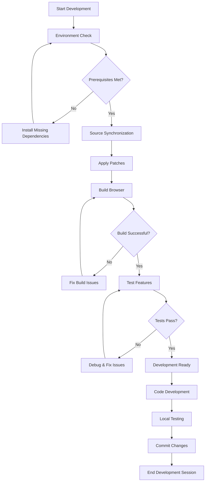
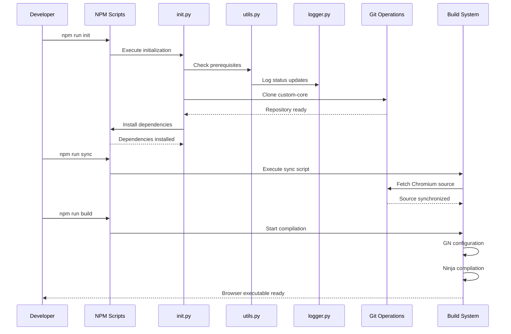

# Custom Browser Development Guide

## Getting Started

This guide covers the complete development setup process, from prerequisites to building your first custom browser.

## Prerequisites

### System Requirements

#### Windows (Primary Platform)
- **Windows 10/11**: 64-bit required
- **Visual Studio Build Tools 2019/2022**: C++ workload required
- **Disk Space**: Minimum 50GB free space (Chromium source is large)
- **RAM**: Minimum 16GB recommended for compilation

#### Required Software
- **Python 3.8+**: Download from [python.org](https://python.org)
- **Git**: Download from [git-scm.com](https://git-scm.com)
- **Node.js/NPM**: Download from [nodejs.org](https://nodejs.org)

#### Visual Studio Build Tools Setup
```powershell
# Download Visual Studio Installer
# Select "C++ build tools" workload
# Include Windows 10/11 SDK
# Include CMake tools for Visual Studio
```

### Validation Commands
```powershell
# Verify Python installation
python --version

# Verify Git installation  
git --version

# Verify NPM installation
npm --version

# Verify Visual Studio installation
where cl.exe
```

## Initial Setup

### 1. Clone Repository
```powershell
git clone https://github.com/WanderLust-Tech/custom-browser.git
cd custom-browser
```

### 2. Install Python Dependencies
```powershell
npm run install:python
# OR
pip install -r requirements.txt
```

### 3. Configure Windows Defender (Recommended)
```powershell
# Run as Administrator
cd scripts/av
.\setup-defender-exclusions.ps1
```

### 4. Initialize Project
```powershell
npm run init
```

## Development Workflow

### Daily Development Process



### Development Workflow Script Integration



#### Commands Overview:

#### 1. Environment Check
```powershell
# Verify all prerequisites are met
python scripts/init.py --check-only
```

#### 2. Source Synchronization
```powershell
# Update to latest Chromium source
npm run sync
```

#### 3. Apply Patches
```powershell
# Apply compatibility patches
npm run apply_patches
```

#### 4. Build Browser
```powershell
# Build the custom browser
npm run build
```

### Script Usage Patterns

#### Initialization Script
```python
# Basic initialization
python scripts/init.py

# With custom branch
python scripts/init.py --branch feature-branch

# With verbose output
python scripts/init.py --verbose
```

#### Logger Demonstrations
```python
# Test logging capabilities
python lib/logger_demo.py
npm run demo:logger
```

## Build System

### Build Configuration

#### NPM Scripts
```json
{
  "scripts": {
    "init": "python scripts/init.py",
    "build": "cd src/custom && npm run build --",
    "apply_patches": "cd src/custom && npm run apply_patches --",
    "update_patches": "cd src/custom && npm run update_patches --"
  }
}
```

#### Custom Core Scripts
```json
{
  "scripts": {
    "build": "python build/commands/lib/build.py",
    "sync": "python build/commands/scripts/sync.py",
    "apply_patches": "python build/commands/lib/applyPatches.py"
  }
}
```

### Build Process Details

#### 1. Source Preparation
- Clone custom-core repository
- Fetch Chromium source via gclient
- Apply compatibility patches
- Install build dependencies

#### 2. Configuration Generation
- Run GN to generate build files
- Configure build flags and options
- Set up branding and customization

#### 3. Compilation
- Run Ninja build system
- Compile C++ source code
- Generate browser binaries

#### 4. Output
- Browser executable in `out/` directory
- Debug symbols and crash dumps
- Installer packages (if configured)

## Debugging and Troubleshooting

### Common Issues

#### Sync Timeout Issues
```powershell
# Issue: npm sync times out during gclient operations
# Solution: The init script now automatically retries with longer timeouts
# - Initial attempt: 2 hours
# - Retry 1: 3 hours  
# - Retry 2: 4.5 hours
# If all attempts fail, check network connectivity and try again later
```

#### Git Not Found
```powershell
# Error: git command not found
# Solution: Add Git to PATH environment variable
$env:PATH += ";C:\Program Files\Git\bin"
```

#### Visual Studio Build Tools Missing
```powershell
# Error: MSVC compiler not found
# Solution: Install Visual Studio Build Tools with C++ workload
```

#### Python Dependencies Missing
```powershell
# Error: Module 'rich' not found
# Solution: Install Python dependencies
pip install -r requirements.txt
```

#### Windows Defender Interference
```powershell
# Error: Build process very slow or files disappear
# Solution: Configure Windows Defender exclusions
cd scripts/av
.\setup-defender-exclusions.ps1
```

### Debug Techniques

#### Verbose Logging
```python
# Enable debug logging in scripts
from lib.logger import logger
logger.debug("Debug message")
```

#### Build Debug Information
```powershell
# Enable verbose build output
cd src/custom
npm run build -- --verbose
```

#### Git Operation Debugging
```python
# Debug git operations
from lib.utils import run_git
result = run_git(directory, ['status', '--porcelain'])
print(f"Git status: {result}")
```

## Next Steps

After completing your development setup:

1. **[Build System Guide](./custom-browser-build-system.md)** - Deep dive into the build process
2. **[Debugging Guide](../debugging/custom-browser-debugging.md)** - VS Code debugging setup
3. **[API Reference](../apis/custom-browser-api-reference.md)** - Python modules and functions
4. **[Feature Development](../features/custom-browser/)** - Adding new features to the browser

## Additional Resources

- **[Scripts Reference](./custom-browser-scripts-reference.md)** - Detailed script documentation
- **[Troubleshooting](../debugging/custom-browser-troubleshooting.md)** - Common issues and solutions
- **[Architecture Guide](../architecture/custom-browser-architecture.md)** - System architecture overview