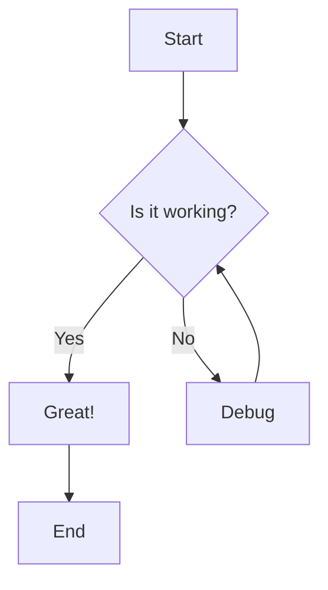
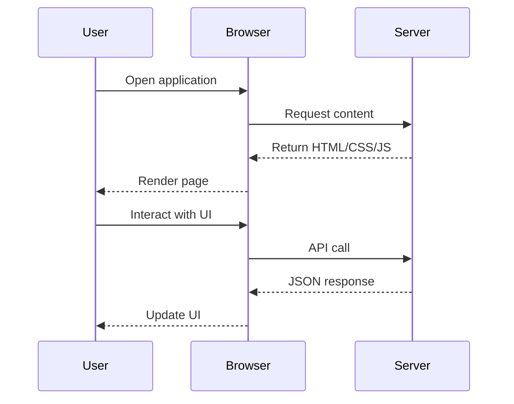
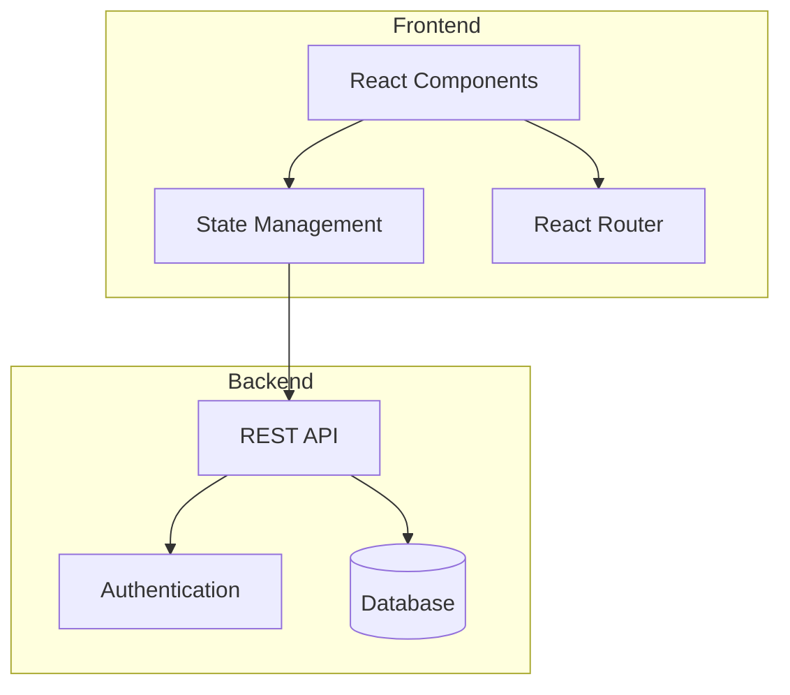
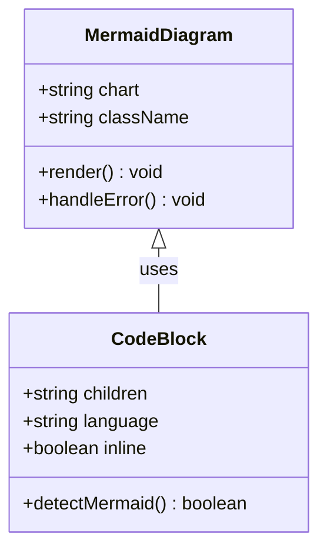
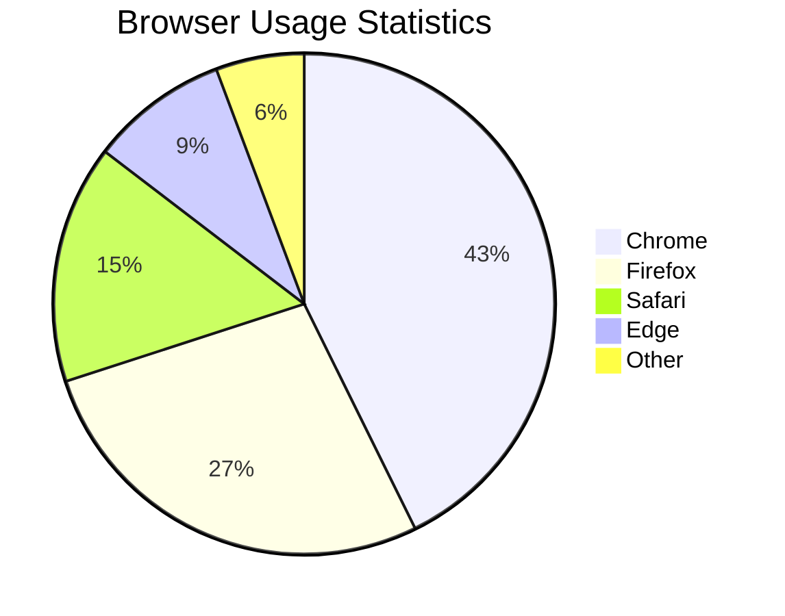
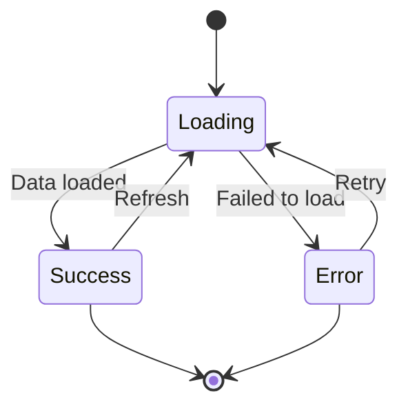

# Mermaid Diagram Examples

This document demonstrates various Mermaid diagram types that are now supported in the Wanderlust Knowledge Base.

## Flowchart Example



## Sequence Diagram Example



## Component Architecture Diagram



## Git Workflow Diagram

```mermaid
gitgraph
    commit id: "Initial"
    branch develop
    checkout develop
    commit id: "Feature A"
    commit id: "Feature B"
    checkout main
    merge develop
    commit id: "Release v1.0"
```

## Class Diagram Example



## Pie Chart Example



## State Diagram Example

