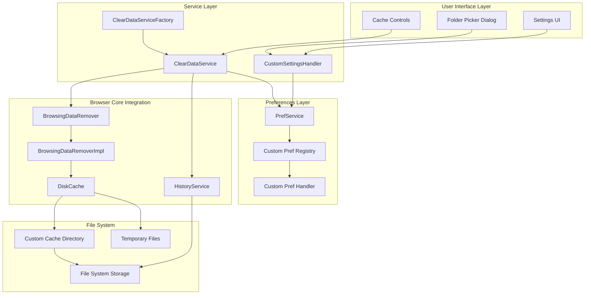
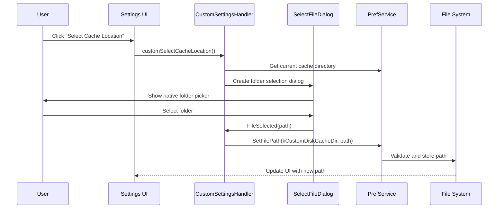
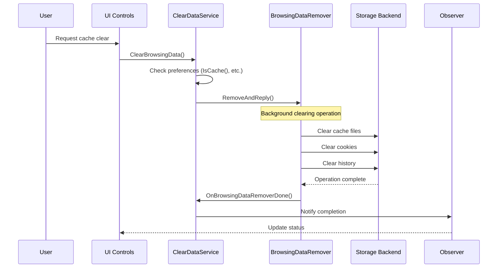
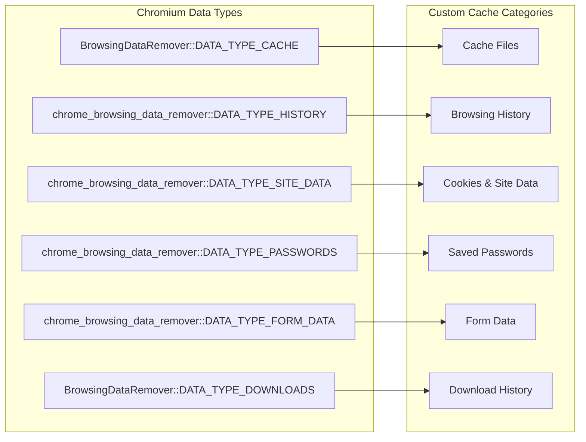
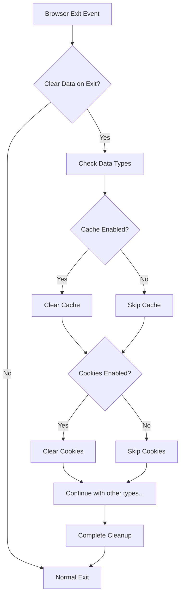
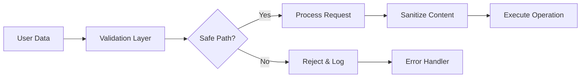
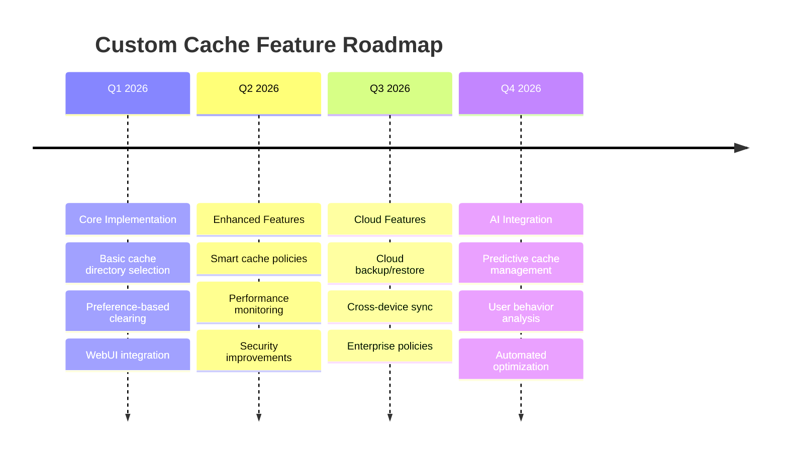

# Custom Cache Feature Documentation

## Overview

The **Custom Cache Feature** provides enhanced cache management capabilities for the Custom Browser, offering users fine-grained control over browser data storage and cleanup operations. This feature extends Chromium's standard cache functionality with custom cache directory selection, intelligent cache clearing policies, and comprehensive browsing data management.

## Key Features

### 1. **Custom Cache Directory Selection**
- **User-defined cache locations**: Users can select custom directories for cache storage
- **Folder picker integration**: Native OS folder selection dialog
- **Preference persistence**: Settings saved across browser sessions
- **Path validation**: Ensures selected directories are accessible and writable

### 2. **Advanced Cache Clearing Service**
- **Selective data clearing**: Fine-grained control over what data to clear
- **Exit-based clearing**: Automatic data cleanup when browser closes
- **Multiple data types**: Cache, cookies, history, downloads, passwords, form data
- **Background processing**: Non-blocking cache operations
- **Observer pattern**: Real-time status updates for clearing operations

### 3. **Smart Cache Management**
- **Cache enablement control**: Toggle disk caching on/off
- **Data type granularity**: Individual control over different cache components
- **Performance optimization**: Intelligent cache retention policies
- **Storage efficiency**: Automatic cleanup and size management

## Architecture Overview



## Component Architecture

### Core Services

#### 1. **ClearDataService**
**Location**: `src/custom/browser/clear_data/`

**Responsibilities**:
- Manages browsing data clearing operations
- Integrates with Chromium's `BrowsingDataRemover`
- Handles preference-based clearing policies
- Provides observer interface for status updates

**Key Methods**:
```cpp
class ClearDataService : public KeyedService,
                         public content::BrowsingDataRemover::Observer {
public:
  // Clear browsing data based on user preferences
  bool ClearBrowsingData(const base::OnceCallback<void()>& callback);
  
  // Check individual data type preferences
  bool IsCache() const;
  bool IsCookies() const;
  bool IsBrowsingHistory() const;
  bool IsDownloadHistory() const;
  
  // Clear operation status
  bool IsRemoving();
  bool IsRemoved();
};
```

#### 2. **CustomSettingsHandler**
**Location**: `src/custom/browser/ui/webui/settings/`

**Responsibilities**:
- Handles WebUI communication for cache settings
- Manages folder selection dialog for custom cache directories
- Bridges JavaScript settings UI with native preferences

**Key Methods**:
```cpp
class CustomSettingsHandler : public SettingsPageUIHandler,
                             public ui::SelectFileDialog::Listener {
public:
  // Handle cache location selection from UI
  void HandleSelectCacheLocation(const base::Value::List& args);
  
  // File selection callback
  void FileSelected(const ui::SelectedFileInfo& file, int index) override;
};
```

## Data Flow Architecture

### Cache Directory Selection Flow



### Cache Clearing Flow



## Preference System

### Cache-Related Preferences

The custom cache feature uses a comprehensive preference system defined in `custom_pref_names.h`:

| Preference Key | Type | Purpose | Default |
|---------------|------|---------|---------|
| `kCustomDiskCacheDir` | String | Custom cache directory path | Empty |
| `kBrowserDiskCacheDir` | String | Browser cache directory | Empty |
| `kCustomEnableDiskCache` | Boolean | Enable custom disk cache | `true` |
| `kBrowserEnableDiskCache` | Boolean | Enable browser disk cache | `true` |
| `kBrowserClearDataOnExit` | Boolean | Clear data on browser exit | `false` |
| `kBrowserClearDataCache` | Boolean | Include cache in clearing | `false` |
| `kBrowserClearDataCookies` | Boolean | Include cookies in clearing | `false` |
| `kBrowserClearDataBrowsingHistory` | Boolean | Include history in clearing | `false` |
| `kBrowserClearDataDownloadHistory` | Boolean | Include download history | `false` |
| `kBrowserClearDataPasswords` | Boolean | Include saved passwords | `false` |
| `kBrowserClearDataFormData` | Boolean | Include form data | `false` |

### Preference Registration

```cpp
// In custom_prefs.cc
void RegisterProfilePrefs(user_prefs::PrefRegistrySyncable* registry) {
  // Cache directory preferences
  registry->RegisterStringPref(prefs::kBrowserDiskCacheDir, std::string());
  registry->RegisterBooleanPref(prefs::kBrowserEnableDiskCache, true);
  
  // Clear data preferences are registered by ClearDataService
  ClearDataService::RegisterProfilePrefs(registry);
}
```

## Data Types and Clearing Policies

### Supported Data Types

The cache clearing system supports multiple data types with individual control:



### Clearing Implementation

```cpp
bool ClearDataService::ClearBrowsingData(const base::OnceCallback<void()>& callback) {
  int site_data_mask = chrome_browsing_data_remover::DATA_TYPE_SITE_DATA;
  int remove_mask = 0;
  int origin_mask = 0;
  
  // Build removal mask based on user preferences
  if (IsCache()) {
    remove_mask |= BrowsingDataRemover::DATA_TYPE_CACHE;
  }
  if (IsCookies()) {
    remove_mask |= site_data_mask;
    origin_mask |= BrowsingDataRemover::ORIGIN_TYPE_UNPROTECTED_WEB;
  }
  if (IsBrowsingHistory()) {
    remove_mask |= chrome_browsing_data_remover::DATA_TYPE_HISTORY;
  }
  // ... additional data types
  
  // Execute removal with BrowsingDataRemover
  BrowsingDataRemover* remover = profile_->GetBrowsingDataRemover();
  remover->RemoveAndReply(base::Time(), base::Time::Max(), 
                         remove_mask, origin_mask, this);
}
```

## Advanced Features

### 1. **Immediate Download History Removal**

The system provides special handling for download history that may not be cleared immediately by the standard remover:

```cpp
void ClearDataService::RemoveDownloadsImmediately(history::HistoryService* service) {
  if (!service) return;
  
  history::HistoryBackend* backend = service->history_backend();
  if (!backend) return;
  
  // Get all downloads and remove them directly
  auto downloads = backend->QueryDownloads();
  std::set<uint32_t> query;
  for (const auto& download : downloads) {
    query.insert(download.id);
  }
  
  backend->SetForceCommit(true);
  backend->RemoveDownloads(query);
  backend->SetForceCommit(false);
}
```

### 2. **Exit-Based Clearing**

Automatic data clearing when browser exits:



### 3. **Observer Pattern for Status Updates**

```cpp
class ClearDataService : public content::BrowsingDataRemover::Observer {
public:
  void OnBrowsingDataRemoverDone(uint64_t failed_data_types) override {
    // Restore history backend state
    history::HistoryService* service = GetHistoryService();
    if (service && service->history_backend()) {
      service->history_backend()->SetForceCommit(false);
    }
    
    // Update status and notify observers
    is_removed_ = true;
    remover_ = nullptr;
    
    // Trigger callback if provided
    if (!callback_.is_null()) {
      std::move(callback_).Run();
    }
  }
};
```

## UI Integration

### Settings UI Components

The cache feature integrates with the browser's settings UI through custom WebUI handlers:

```javascript
// JavaScript side (settings UI)
function selectCacheLocation() {
  chrome.send('customSelectCacheLocation');
}

// Update cache preference
function updateCacheEnabled(enabled) {
  chrome.settingsPrivate.setPref(
    'browser.enable_disk_cache', 
    enabled
  );
}
```

### Native Dialog Integration

```cpp
void CustomSettingsHandler::HandleSelectCacheLocation(
    const base::Value::List& args) {
  PrefService* pref_service = Profile::FromWebUI(web_ui())->GetPrefs();
  
  // Create native folder selection dialog
  select_folder_dialog_ = ui::SelectFileDialog::Create(
      this, std::make_unique<ChromeSelectFilePolicy>(web_ui()->GetWebContents()));
  
  ui::SelectFileDialog::FileTypeInfo info;
  select_folder_dialog_->SelectFile(
      ui::SelectFileDialog::SELECT_FOLDER,
      l10n_util::GetStringUTF16(IDS_DISK_CACHE_BROWSE_TITLE),
      pref_service->GetFilePath(prefs::kCustomDiskCacheDir),
      &info, 0, base::FilePath::StringType(),
      web_ui()->GetWebContents()->GetTopLevelNativeWindow(),
      nullptr);
}
```

## Performance Considerations

### 1. **Background Operations**

Cache clearing operations run in the background to avoid blocking the UI:

```mermaid
gantt
    title Cache Clearing Performance Timeline
    dateFormat X
    axisFormat %s
    
    section UI Interaction
    User Request     :done, request, 0, 100
    UI Response      :done, ui, 0, 150
    
    section Background Processing
    Data Analysis    :active, analysis, 100, 300
    Cache Clearing   :clearing, 200, 800
    Cookie Clearing  :cookies, 300, 600
    History Clearing :history, 400, 700
    
    section Completion
    Status Update    :status, 800, 900
    UI Notification  :notify, 850, 950
```



### 2. **Memory Management**

- **Lazy initialization**: Services created only when needed
- **Weak pointers**: Prevent memory leaks in async operations
- **RAII patterns**: Automatic resource cleanup

### 3. **File System Optimization**

```cpp
// Optimized cache directory handling
class CacheDirectoryManager {
  void SetCacheDirectory(const base::FilePath& path) {
    // Validate path accessibility
    if (!base::DirectoryExists(path)) {
      base::CreateDirectory(path);
    }
    
    // Check write permissions
    base::FilePath test_file = path.Append("test_write");
    if (!base::WriteFile(test_file, "test")) {
      LOG(ERROR) << "Cache directory not writable: " << path;
      return;
    }
    base::DeleteFile(test_file);
    
    // Update preference
    prefs_->SetFilePath(prefs::kCustomDiskCacheDir, path);
  }
};
```

## Security and Privacy

### 1. **Data Sanitization**



### 2. **Permission Validation**

- **File system access**: Validate user permissions for selected directories
- **Process isolation**: Cache operations isolated from main browser process
- **Secure cleanup**: Proper disposal of sensitive data during clearing

### 3. **Privacy Protection**

```cpp
class SecureCacheManager {
  void SecureDelete(const base::FilePath& file) {
    // Multi-pass secure deletion for sensitive cache files
    if (base::PathExists(file)) {
      // Overwrite with random data multiple times
      OverwriteFileSecurely(file);
      base::DeleteFile(file);
    }
  }
  
  bool ValidateCachePath(const base::FilePath& path) {
    // Ensure path is not in sensitive system directories
    base::FilePath system_root = GetSystemDirectory();
    if (system_root.IsParent(path)) {
      LOG(WARNING) << "Rejecting cache path in system directory";
      return false;
    }
    return true;
  }
};
```

## Error Handling and Recovery

### 1. **Graceful Degradation**

```cpp
bool ClearDataService::ClearBrowsingData(const base::OnceCallback<void()>& callback) {
  if (!IsOnExit()) {
    LOG(INFO) << "Cache clearing not enabled on exit";
    return false;
  }
  
  try {
    // Attempt cache clearing
    BrowsingDataRemover* remover = profile_->GetBrowsingDataRemover();
    if (!remover) {
      LOG(ERROR) << "BrowsingDataRemover not available";
      return false;
    }
    
    remover->RemoveAndReply(/* parameters */);
    return true;
    
  } catch (const std::exception& e) {
    LOG(ERROR) << "Cache clearing failed: " << e.what();
    return false;
  }
}
```

### 2. **Recovery Mechanisms**

- **Fallback cache locations**: Automatic fallback to default locations if custom path fails
- **Partial clearing**: Continue with available operations if some fail
- **State restoration**: Restore browser state if clearing is interrupted

## Configuration and Deployment

### 1. **Enterprise Policies**

The cache feature supports enterprise configuration through group policies:

```json
{
  "CustomCacheSettings": {
    "DefaultCacheDirectory": "C:\\Company\\Cache",
    "AllowCustomCacheLocation": true,
    "ClearOnExit": {
      "Cache": true,
      "Cookies": false,
      "History": false
    },
    "MaxCacheSize": "1GB"
  }
}
```

### 2. **Build Configuration**

```gn
# BUILD.gn configuration
custom_cache_feature_enabled = true

if (custom_cache_feature_enabled) {
  sources += [
    "clear_data/clear_data_service.cc",
    "clear_data/clear_data_service.h",
    "clear_data/clear_data_service_factory.cc",
    "clear_data/clear_data_service_factory.h",
  ]
}
```

## Testing and Validation

### 1. **Unit Tests**

```cpp
class ClearDataServiceTest : public testing::Test {
public:
  void SetUp() override {
    profile_ = std::make_unique<TestingProfile>();
    service_ = ClearDataServiceFactory::GetForProfile(profile_.get());
  }
  
  void TestCacheClearing() {
    EXPECT_TRUE(service_->ClearBrowsingData(base::DoNothing()));
    EXPECT_TRUE(service_->IsRemoving());
  }
  
  void TestPreferenceHandling() {
    PrefService* prefs = profile_->GetPrefs();
    prefs->SetBoolean(prefs::kBrowserClearDataCache, true);
    EXPECT_TRUE(service_->IsCache());
  }
};
```

### 2. **Integration Tests**

- **End-to-end cache clearing**: Verify complete data removal workflow
- **UI integration**: Test settings UI interactions
- **Preference persistence**: Validate settings survival across restarts

## Future Enhancements

### Planned Features

1. **Smart Cache Policies**
   - Dynamic cache size management based on disk space
   - Intelligent data expiration policies
   - User behavior-based cache optimization

2. **Advanced UI**
   - Cache usage visualization
   - Detailed data type breakdowns
   - Performance impact metrics

3. **Cloud Integration**
   - Encrypted cache backup/restore
   - Cross-device cache synchronization
   - Cloud-based cache policies

### Roadmap



## Troubleshooting

### Common Issues

| Issue | Symptoms | Solution |
|-------|----------|----------|
| **Cache directory inaccessible** | Settings UI shows error | Check folder permissions, select different directory |
| **Clearing operation hanging** | UI becomes unresponsive | Restart browser, check disk space |
| **Preferences not persisting** | Settings reset on restart | Check profile directory permissions |
| **Partial data clearing** | Some data remains after clearing | Check individual data type preferences |

### Debug Information

Enable detailed logging for cache operations:

```cpp
// Add to command line
--enable-logging --v=2 --log-level=0

// Check logs for cache-related entries
VLOG(2) << "Cache clearing started, types: " << data_types;
DLOG(INFO) << "Custom cache directory: " << cache_path.value();
```

## Contributing

### Implementation Guidelines

When extending the cache feature:

1. **Follow Chromium patterns**: Use existing service factory patterns
2. **Maintain compatibility**: Ensure integration with standard Chromium cache systems
3. **Add comprehensive tests**: Unit tests for all new functionality
4. **Document changes**: Update this documentation for new features
5. **Consider security**: Validate all user inputs and file system operations

### Code Review Checklist

- [ ] Preference registration follows established patterns
- [ ] Service factory integration is complete
- [ ] UI handlers properly validate inputs
- [ ] Error handling covers edge cases
- [ ] Memory management uses weak pointers appropriately
- [ ] File operations include permission checks
- [ ] Tests cover both success and failure scenarios

## Conclusion

The Custom Cache Feature provides a comprehensive solution for advanced cache management in the Custom Browser. By extending Chromium's built-in capabilities with user-configurable options, intelligent clearing policies, and robust error handling, this feature enhances both user control and system performance while maintaining security and privacy standards.

The modular architecture ensures easy maintenance and extensibility, while the comprehensive preference system provides flexibility for both individual users and enterprise deployments.