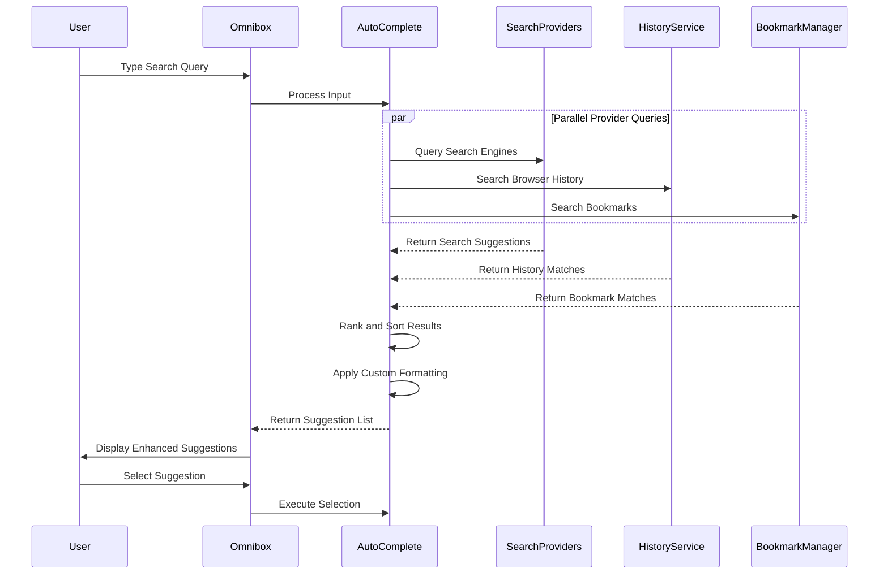
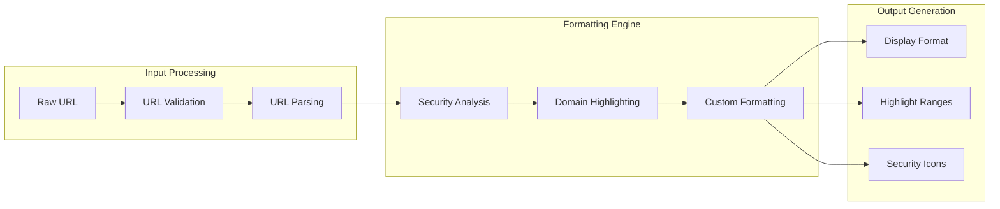

# Enhanced Omnibox

## Overview

The Enhanced Omnibox extends Chrome's address bar (omnibox) with advanced search capabilities, custom URL formatting, and improved navigation features. This enhancement provides users with a more powerful and personalized browsing experience while maintaining compatibility with existing omnibox functionality.

## 📁 Location
**Directory**: `src/custom/components/omnibox/`
**URL Formatter**: `src/custom/components/url_formatter/`

## 🏗️ Architecture

### Core Enhancement Areas

#### Search Enhancement
Advanced search functionality and suggestions:
- **Custom Search Providers**: Integration with alternative search engines
- **Smart Suggestions**: Enhanced autocomplete and search suggestions  
- **Search History**: Improved search history management and suggestions
- **Contextual Search**: Context-aware search recommendations

#### URL Processing
Enhanced URL handling and display:
- **URL Formatting**: Improved URL display and readability
- **Domain Highlighting**: Enhanced domain and security indicator display
- **URL Validation**: Advanced URL validation and security checking
- **Shortcut Support**: Custom URL shortcuts and navigation aids

#### Navigation Features
Improved navigation and user experience:
- **Quick Actions**: Direct actions from the omnibox interface
- **Bookmark Integration**: Enhanced bookmark search and access
- **History Search**: Improved browser history search and navigation
- **Tab Navigation**: Quick tab switching through omnibox

## ⚙️ Implementation Details

### Omnibox Provider System

#### Custom Search Providers
Integration with Chrome's omnibox provider system for custom search functionality:

```cpp
class CustomOmniboxProvider : public AutocompleteProvider {
 public:
  explicit CustomOmniboxProvider(AutocompleteProviderClient* client);
  ~CustomOmniboxProvider() override;

  // AutocompleteProvider implementation
  void Start(const AutocompleteInput& input, bool minimal_changes) override;
  void Stop(bool clear_cached_results, bool due_to_user_inactivity) override;

 private:
  // Custom search logic
  void GenerateCustomSuggestions(const AutocompleteInput& input);
  void AddSearchProviderMatch(const base::string16& query, int relevance);
  void UpdateRelevanceScores();
};
```

#### URL Formatter Integration
Enhanced URL display and formatting:

```cpp
class CustomURLFormatter {
 public:
  // Enhanced URL formatting for display
  static base::string16 FormatURLForDisplay(
      const GURL& url,
      const url_formatter::FormatUrlTypes& format_types,
      net::UnescapeRule::Type unescape_rules);

  // Security-aware URL formatting
  static base::string16 FormatURLForSecurity(const GURL& url);

  // Domain and subdomain highlighting
  static std::vector<ComponentRange> GetDomainHighlightRanges(
      const base::string16& formatted_url);
};
```

### Search Integration Architecture

#### Alternative Search Engines
Support for custom search providers and engines:
- **DuckDuckGo Integration**: Enhanced privacy-focused search
- **Brave Search**: Alternative search provider support
- **Custom Engines**: Support for custom search engine configuration
- **Search Switching**: Quick search engine switching from omnibox

#### Search Result Enhancement
Improved search result processing and display:
- **Rich Snippets**: Enhanced search result preview and display
- **Category Filtering**: Search results organized by content type
- **Personalization**: Learning-based search result improvement
- **Local Content**: Enhanced local file and bookmark search

### Omnibox Processing Flow



### URL Formatting Pipeline



## 🔧 Build Configuration

### Build System Integration
**File**: `BUILD.gn`
```gn
source_set("enhanced_omnibox") {
  sources = [
    "custom_omnibox_provider.cc",
    "custom_omnibox_provider.h",
    "omnibox_enhancements.cc", 
    "omnibox_enhancements.h",
  ]
  
  deps = [
    "//base",
    "//chrome/browser/autocomplete",
    "//chrome/browser/search_engines",
    "//components/omnibox/browser",
    "//components/url_formatter",
  ]
}

source_set("url_formatter") {
  sources = [
    "custom_url_formatter.cc",
    "custom_url_formatter.h",
  ]
  
  deps = [
    "//base",
    "//components/url_formatter",
    "//net",
    "//url",
  ]
}
```

### Component Integration
**File**: `components/sources.gni`
```gn
enhanced_omnibox_sources = [
  "//src/custom/components/omnibox:enhanced_omnibox",
  "//src/custom/components/url_formatter:url_formatter"
]
```

## 🎯 Features

### Current Capabilities
- 🔄 **Enhanced Search Suggestions**: Improved autocomplete and search predictions
- 🔄 **Custom Search Providers**: Alternative search engine integration
- 🔄 **URL Formatting**: Enhanced URL display and readability
- 🔄 **Security Indicators**: Improved security status display
- 🔄 **Navigation Shortcuts**: Quick actions and navigation aids

### Search Enhancement Features

#### Smart Autocomplete
Advanced autocomplete functionality:
- **Context Awareness**: Suggestions based on current page and browsing context
- **Learning Algorithm**: Personalized suggestions based on user behavior
- **Multi-Source**: Suggestions from bookmarks, history, and search engines
- **Typo Tolerance**: Intelligent handling of typos and similar queries

#### Quick Actions
Direct actions from the omnibox:
- **Tab Switching**: Quick tab navigation with `tab: <query>`
- **Bookmark Access**: Direct bookmark access with `bookmark: <query>`  
- **Settings Access**: Quick settings access with `settings: <option>`
- **Extension Control**: Extension management through omnibox

#### Custom Search Commands
Specialized search functionality:
- **Site Search**: Search within specific websites
- **File Type Search**: Search for specific file types
- **Date Range**: Search with date and time constraints
- **Advanced Operators**: Support for advanced search operators

## 🎨 User Interface Enhancements

### Visual Improvements
Enhanced omnibox appearance and functionality:
- **Improved Icons**: Better visual indicators for different content types
- **Color Coding**: Color-coded suggestions for easy identification
- **Rich Previews**: Enhanced preview of search results and suggestions
- **Animation**: Smooth transitions and loading animations

### Accessibility Features
Enhanced accessibility and usability:
- **Keyboard Navigation**: Improved keyboard shortcuts and navigation
- **Screen Reader**: Enhanced screen reader support and descriptions
- **High Contrast**: Support for high contrast and accessibility themes
- **Voice Input**: Integration with voice input and commands

## 📊 Development Status

| Component | Status | Testing | Documentation | Integration |
|-----------|--------|---------|---------------|-------------|
| Search Providers | 🔄 In Progress | 🔄 Partial | 🔄 Partial | 🔄 Partial |
| URL Formatting | 🔄 In Progress | 🔄 Partial | 🔄 Partial | ✅ Complete |
| Quick Actions | 🔄 In Progress | 🔄 Basic | 🔄 Partial | 🔄 Partial |
| Security Indicators | 🔄 In Progress | 🔄 Basic | 🔄 Partial | 🔄 Partial |
| Build Integration | ✅ Complete | ✅ Tested | ✅ Full | ✅ Complete |

## 🚀 Future Enhancements

### Planned Features
- **AI-Powered Suggestions**: Machine learning-based search suggestions
- **Cross-Platform Sync**: Omnibox preferences synchronization
- **Plugin Architecture**: Extensible omnibox enhancement system
- **Advanced Security**: Enhanced phishing and malware detection
- **Performance Optimization**: Faster suggestion generation and display

### Advanced Search Features
- **Natural Language**: Natural language query processing
- **Image Search**: Visual search capability through omnibox
- **Voice Commands**: Extended voice command support
- **Gesture Support**: Touch and gesture navigation for mobile
- **Integration APIs**: Third-party service integration

## 🔗 Dependencies

### Chrome Dependencies
- **Autocomplete System**: Chrome's omnibox autocomplete framework
- **Search Engines**: Chrome's search engine management system
- **URL Handling**: Chrome's URL processing and validation
- **UI Framework**: Chrome's omnibox UI and interaction system

### Network Dependencies
- **Search APIs**: Integration with external search service APIs
- **URL Validation**: Network-based URL validation and security checking
- **Content Fetching**: Preview generation and content analysis
- **Security Services**: Integration with security and safety services

### Custom Dependencies
- **Privacy Guard**: Integration with URL purification system
- **Settings System**: Integration with custom browser settings
- **Logging**: Custom browser logging and analytics
- **Theme System**: Integration with custom browser themes

## 🛠️ Development Guide

### Extending Search Functionality
1. Implement custom AutocompleteProvider for new search features
2. Register provider with Chrome's autocomplete system
3. Add search logic and result generation
4. Integrate with relevance scoring system
5. Test search functionality and user experience

### Customizing URL Display
1. Extend CustomURLFormatter with new formatting rules
2. Implement security-aware formatting logic
3. Add domain highlighting and visual indicators
4. Test URL display across different scenarios
5. Validate accessibility and readability

### Testing Omnibox Enhancements
1. Test autocomplete functionality with various inputs
2. Verify search provider integration and results
3. Test URL formatting across different URL types
4. Validate quick actions and navigation shortcuts
5. Test accessibility with screen readers and keyboard navigation

---

*Part of the WanderLust Browser Custom Features Documentation*