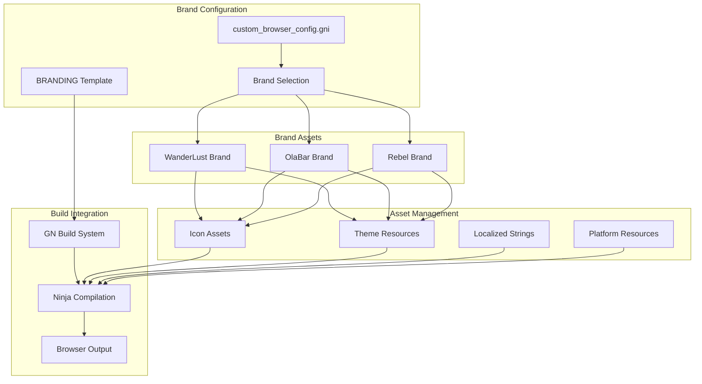
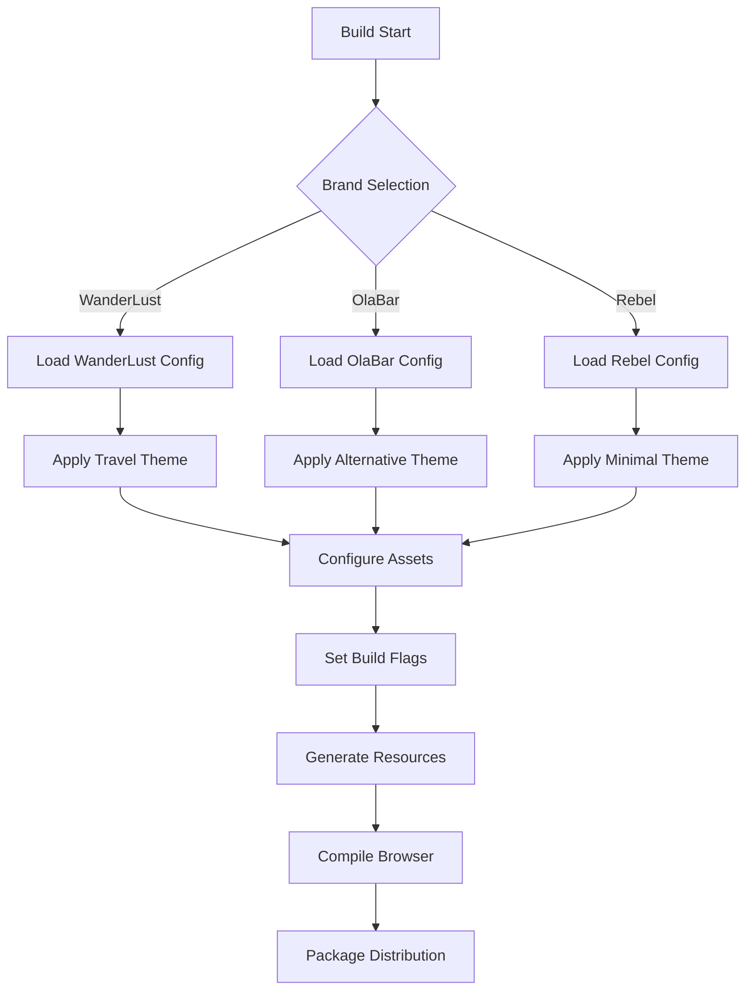

# Multi-Brand System

## Overview

The Multi-Brand System enables the WanderLust browser project to support multiple browser brands from a single codebase. This powerful feature allows for efficient development and maintenance of multiple browser variants while sharing core functionality and security updates.

## 📁 Location
**Primary Directory**: `src/custom/branding/`
**Configuration**: `src/custom/custom_browser_config.gni`

## 🏗️ Architecture

### Brand Configuration System



### Brand Selection Flow



#### Central Configuration
**File**: `custom_browser_config.gni`
- **Purpose**: Central configuration file for all branding parameters  
- **Size**: 427+ lines of comprehensive brand configuration
- **Features**:
  - Product naming and company information
  - Path components for file system integration
  - URL schemas and contact information
  - Channel-specific build configurations
  - Platform-specific branding parameters

#### Brand Template System
**File**: `branding/BRANDING`
- **Purpose**: Template file for brand-specific build integration
- **Integration**: Referenced by Chromium's build system
- **Functionality**:
  - Build-time brand parameter injection
  - Resource file path configuration
  - Platform-specific branding rules

### Supported Brands

#### WanderLust (Default Brand)
**Directory**: `branding/wanderlust/`
- **Description**: Primary browser brand with travel-oriented branding
- **Features**:
  - Custom application icons and themes
  - Travel-focused color schemes and imagery
  - WanderLust-specific messaging and content
- **Assets**:
  - Application icons (various sizes)
  - Theme resources and color definitions
  - Brand-specific vector graphics
  - Platform-specific resources (macOS, Windows, Linux)

#### OlaBar Brand
**Directory**: `branding/olabar/`
- **Description**: Alternative browser variant with different brand identity
- **Features**:
  - Distinct visual identity and branding
  - Alternative color schemes and themes
  - OlaBar-specific messaging and content
- **Use Case**: Different target market or feature set

#### Rebel Brand (Reference Implementation)
**Directory**: `branding/rebel/`
- **Description**: Reference implementation based on Rebel browser
- **Purpose**:
  - Minimal branding approach demonstration
  - Compatibility testing with Rebel browser patterns
  - Development reference for brand implementation

## ⚙️ Configuration Parameters

### Core Brand Parameters
```gn
# Product identification
custom_browser_name = "WanderLust"
custom_browser_company = "WanderLust Technologies"
custom_browser_abbreviation = "WL"

# Path components (filesystem-safe)
custom_browser_name_path_component = "wanderlust"
custom_browser_company_path_component = "wanderlust"

# Contact and web presence
custom_browser_email = "support@wanderlust-browser.com"
custom_browser_website = "https://wanderlust-browser.com"
custom_browser_schema = "wanderlust"

# Channel configuration
browser_channel = ""  # stable, beta, dev, nightly
is_release_channel = false
```

### Advanced Configuration
```gn
# Platform-specific settings
use_macos_branding = true
use_windows_branding = true
use_linux_branding = true

# Feature toggles
enable_custom_themes = true
enable_brand_switching = false
enable_debug_branding = false

# Build optimization
optimize_brand_resources = true
compress_brand_assets = true
```

## 🛠️ Build System Integration

### GN Build Configuration
**File**: `BUILD.gn`
```gn
import("//src/custom/branding/create_branded_grd.gni")

create_branded_grd("wanderlust_resources") {
  brand_name = "wanderlust"
  input_files = [
    "strings/brand_strings.grd",
    "resources/brand_resources.grd"
  ]
  output_dir = "$target_gen_dir/wanderlust"
}
```

### Resource Generation
**Files**: `createBrandedGrd.py`, `create_branded_grd.gni`
- **Automated Resource Generation**: Creates brand-specific resource files
- **String Substitution**: Replaces placeholders with brand-specific content
- **Asset Processing**: Processes and optimizes brand assets
- **Platform Adaptation**: Generates platform-specific resource variants

### Conditional Compilation
```cpp
#if BUILDFLAG(CUSTOM_BROWSER)
  #if defined(WANDERLUST_BRANDING)
    // WanderLust-specific code
  #elif defined(OLABAR_BRANDING) 
    // OlaBar-specific code
  #endif
#endif
```

## 🎨 Brand Assets Management

### Asset Organization
```
branding/wanderlust/
├── mac/
│   ├── app_icons/           # macOS application icons
│   ├── dmg_background/      # DMG installer backgrounds
│   └── helper_icons/        # Helper application icons
├── vector_icons/
│   ├── browser_icons/       # Browser UI vector icons
│   ├── toolbar_icons/       # Toolbar button icons
│   └── menu_icons/          # Menu and context menu icons
└── README.md               # Brand-specific documentation
```

### Resource Processing Pipeline
1. **Source Assets**: Original design files (SVG, PNG, etc.)
2. **Build Processing**: Automated asset optimization and resizing
3. **Platform Generation**: Platform-specific asset variants
4. **Resource Integration**: Inclusion in browser build
5. **Runtime Loading**: Dynamic asset loading based on brand configuration

### Asset Requirements
- **Application Icons**: Multiple sizes for different platforms
- **UI Elements**: Toolbar, menu, and interface icons
- **Theme Resources**: Color definitions and styling assets
- **Marketing Assets**: About dialog images and branding elements

## 🔧 Implementation Details

### Brand Switching Architecture
```cpp
class BrandManager {
 public:
  static std::string GetBrandName();
  static std::string GetBrandDisplayName(); 
  static GURL GetBrandWebsite();
  static std::string GetBrandEmail();
  
  // Resource management
  static base::FilePath GetBrandAssetPath(const std::string& asset_name);
  static SkBitmap GetBrandIcon(int size);
  static SkColor GetBrandColor(BrandColorType type);
};
```

### String Resource System
**Files**: `branding/strings/`
- **Localized Brand Strings**: Brand names and messages in multiple languages
- **Template Processing**: Automatic string substitution during build
- **Platform Integration**: Integration with Chrome's string resource system

### Channel Management
**Files**: `createChannelConstants.py`
- **Release Channel Support**: Stable, beta, dev, and nightly channels
- **Channel-Specific Branding**: Different branding for different release channels
- **Update Management**: Channel-specific update URLs and configuration

## 📦 Platform-Specific Features

### macOS Integration
- **Application Bundle**: Proper macOS app bundle structure
- **DMG Installer**: Custom installer disk images
- **Dock Integration**: Brand-specific dock icons
- **Menu Bar**: Native macOS menu bar integration

### Windows Integration  
- **Installer Branding**: Custom Windows installer appearance
- **Registry Keys**: Brand-specific registry configuration
- **Start Menu**: Proper Start Menu integration
- **File Associations**: Brand-specific file type associations

### Linux Integration
- **Desktop Files**: Proper .desktop file configuration
- **Package Information**: Distribution package metadata
- **Icon Themes**: Integration with Linux icon theme systems
- **Application Menu**: Native application menu integration

## 📊 Development Status

| Component | Status | WanderLust | OlaBar | Rebel |
|-----------|--------|------------|--------|-------|
| Core Configuration | ✅ Complete | ✅ Active | ✅ Available | ✅ Reference |
| Asset Management | ✅ Complete | ✅ Full Set | 🔄 Partial | ✅ Minimal |
| Build Integration | ✅ Complete | ✅ Tested | ✅ Tested | ✅ Tested |
| Platform Support | ✅ Complete | ✅ All Platforms | 🔄 Partial | ✅ macOS Focus |
| String Resources | ✅ Complete | ✅ Full | 🔄 Partial | ✅ Minimal |

## 🚀 Future Enhancements

### Planned Features
- **Dynamic Brand Switching**: Runtime brand switching capability
- **Brand Store Integration**: Centralized brand asset management
- **Theme Customization**: User-customizable brand themes
- **A/B Testing**: Brand variant testing infrastructure
- **Brand Analytics**: Usage analytics per brand variant

### Technical Improvements  
- **Asset Optimization**: Advanced asset compression and optimization
- **Build Performance**: Faster brand-specific build processes
- **Resource Caching**: Intelligent brand resource caching
- **Hot Reloading**: Development-time brand asset hot reloading

## 🔗 Dependencies

### Build System Dependencies
- **GN Build System**: Google's generate ninja build system
- **Python Tooling**: Brand resource processing scripts
- **Image Processing**: Asset optimization and processing tools
- **String Processing**: Localization and template systems

### Platform Dependencies
- **macOS**: Xcode tools and macOS SDK
- **Windows**: Visual Studio build tools
- **Linux**: Distribution-specific packaging tools

## 🛠️ Development Guide

### Adding a New Brand
1. Create brand directory in `branding/new_brand/`
2. Add brand configuration to `custom_browser_config.gni`
3. Create brand-specific assets and resources
4. Add build configuration in `BUILD.gn`
5. Test brand across all target platforms
6. Document brand-specific features and requirements

### Brand Asset Creation
1. Design brand assets following platform guidelines
2. Create assets in multiple sizes and formats
3. Add assets to appropriate brand directory
4. Update build configuration for new assets
5. Test asset loading and display across platforms

### Testing Multi-Brand Builds
1. Configure build for specific brand
2. Build browser with brand configuration
3. Verify brand assets and strings are correct
4. Test platform-specific integrations
5. Validate installer and packaging

---

*Part of the WanderLust Browser Custom Features Documentation*