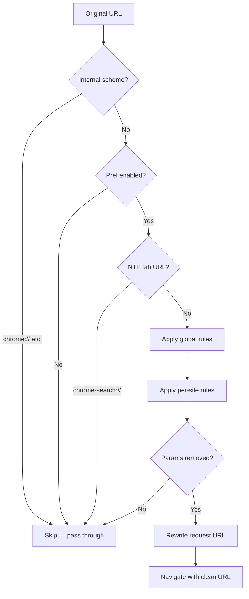

# Privacy Guard

Gated by `BUILDFLAG(ENABLE_PRIVACY_GUARD)`. Strips known tracking query
parameters from HTTP(S) URLs before the network request leaves the browser
process. Operates entirely in the browser process — no network round-trip
is needed to decide whether a parameter should be removed.

The feature has two layers of rules compiled into the binary:

- **Global rules** — applied to every URL. Covers widely-deployed tracking
  params (`utm_*`, `ga_*`, `fbclid`, `gclid`, `yclid`, `mkt_tok`,
  `__twitter_impression`, `Echobox`, `spm`, etc.).
- **Per-site rules** — applied only when the URL's host matches the rule's
  domain. Covers site-specific analytics params for Google, Amazon, YouTube,
  Facebook, Instagram, Steam, GitHub, LinkedIn, and others.

## URL processing flow



## Build / activation

| Where | What |
|---|---|
| [`custom_browser_config.gni`](../src/custom/custom_browser_config.gni) | `enable_privacy_guard = true` — gates source compilation and the proxying URL loader factory hook |
| [`branding_buildflags.h`](../src/custom/buildflags/) | Emits `BUILDFLAG(ENABLE_PRIVACY_GUARD)` for `#if`-gating |
| [`custom_prefs.cc`](../src/custom/browser/prefs/custom_prefs.cc) | `prefs::kURLPurifyEnabled` (`privacy_guard.url_purify.enabled`) — user toggle, defaults to `false` |
| [`custom_content_browser_client.cc`](../src/custom/browser/custom_content_browser_client.cc) | `WillCreateURLLoaderFactory` override (under `BUILDFLAG(ENABLE_PRIVACY_GUARD)`) — installs `CustomProxyingURLLoaderFactory` for every render frame |
| Net sources | [`browser/sources.gni`](../src/custom/browser/sources.gni) — `custom_browser_net` under `if (enable_privacy_guard)` |

## Architecture

### Proxy installation (once per render frame)

```
ContentBrowserClient::WillCreateURLLoaderFactory called for a RenderFrameHost
   │
   ▼
CustomContentBrowserClient::WillCreateURLLoaderFactory
   │  (custom_content_browser_client.cc, gated by BUILDFLAG(ENABLE_PRIVACY_GUARD))
   │
   ├── Calls ChromeContentBrowserClient::WillCreateURLLoaderFactory (Chrome base)
   │
   └── CustomProxyingURLLoaderFactory::MaybeProxyRequest(
           browser_context, frame, render_process_id,
           factory_builder, navigation_response_task_runner)
            │
            └── ResourceContextData::StartProxying(...)
                  Wraps the network-service URLLoaderFactory with
                  CustomProxyingURLLoaderFactory for this BrowserContext.
                  All subsequent URL loads from this frame go through
                  the proxy.
```

### Per-request interception (every non-internal-scheme URL load)

```
Browser navigates / a page loads a sub-resource
   │
   ▼
CustomProxyingURLLoaderFactory::InProgressRequest::Restart()
   │  (browser process, UI thread)
   │
   ▼
CustomRequestHandler::OnBeforeURLRequest(ctx, ...)
   │
   ├── IsInternalScheme? (chrome://, chrome-extension://) → skip
   │
   └── Runs before_url_request_callbacks_ in order
            │
            ▼
       OnBeforeURLRequest_URLPurifyWork(next_callback, ctx)
            │
            ├── ctx->browser_context null? → skip
            ├── prefs::kURLPurifyEnabled false? → skip
            ├── ctx->tab_url scheme == "chrome-search"? → skip (NTP)
            │
            └── URLPurifier::Purify(ctx->request_url)
                     │
                     ├── No query string? → return nullopt
                     │
                     ├── Apply global rules (always)
                     │     RE2::GlobalReplace × 3 patterns per rule
                     │     (trailing param, first param, mid param)
                     │
                     └── Apply per-site rules (first domain match wins)
                           │
                           ├── URL doesn't match rule's domain? → try next
                           ├── URL matches exception pattern? → break
                           └── Apply query_matchers, break
                     │
                     └── count > 0?
                           Yes → GURL with modified/cleared query string
                           No  → nullopt (URL unchanged)

            If purified URL returned:
              ctx->new_url_spec = purified.spec()
              (applied by RunNextCallback → *ctx->new_url = GURL(new_url_spec))
```

The `URLPurifier` is a process-wide singleton (`base::NoDestructor`) whose
RE2 patterns are compiled once at first use from the compiled-in default rules.
Pattern construction is single-threaded (the first `OnBeforeURLRequest` call
on the UI thread triggers it); after that all access is read-only and
thread-safe.

## Default rules

### Global (`GetDefaultGlobalRules`)

Applies to every URL. Patterns are case-insensitive RE2 regexes matched
against the query parameter name.

| Pattern | What it covers |
|---|---|
| `utm(?:_[a-z_]*)?` | All UTM campaign params (`utm_source`, `utm_medium`, etc.) |
| `ga_[a-z_]+` | Google Analytics cross-domain params |
| `fbclid` | Facebook click identifier |
| `gclid` | Google Ads click identifier |
| `yclid` | Yandex click identifier |
| `_openstat` | Yandex OpenStat |
| `mkt_tok` | Marketo email link token |
| `gfe_[a-zA-Z]`, `gs_[a-zA-Z]` | Google Frontend / Search params |
| `__twitter_impression` | Twitter impression tracker |
| `Echobox` | Echobox social sharing tracker |
| `spm` | Alibaba/Taobao Super Position Model |
| `dclid` | DoubleClick click ID |
| `otm_[a-z_]*` | Oracle marketing params |
| `ref_?`, `referrer` | Generic referrer params (where they appear as query keys) |
| `wt_?z?mc`, `wtrid`, `[a-z]?mc` | Webtrends / generic marketing codes |
| `hmb_(?:campaign\|medium\|source)` | HubSpot marketing |
| `vn(?:_[a-z]*)+`, `tracking_source`, `from_spm_id` | Miscellaneous |

### Per-site (`GetDefaultPerSiteRules`)

Only applied when the URL host matches the rule's domain regex. First matching
rule wins; if the URL matches a rule's exception list, all per-site processing
stops.

| Site | Extra params stripped | Notable exceptions |
|---|---|---|
| Google | `ved`, `ei`, `source`, `oq`, `esrc`, `uact`, `cd`, `cad`, `sa`, `hl`, `dpr`, `usg`, `zx`, `_u`, `je`, `dcr`, `ie`, `sei`, `atyp`, `vet`, `gws_[a-zA-Z]`, `gs_[a-zA-Z]`, `bi[a-zA-Z]`, `gfe_[a-zA-Z]`, `btn[a-zA-Z]` | googlevideo.com, Gmail, Drive, Docs, Accounts, image search, Hangouts, Maps, news hl, setprefs, reCAPTCHA |
| Amazon | `pd_rd_*`, `pf_rd_*`, `qid`, `crid`, `sprefix`, `keywords`, `smid`, `linkCode`, `creativeASIN`, `ascsubtag`, `aaxitk`, `hsa_cr_id`, `sb-ci-*`, `rnid`, `dchild`, `camp`, `creative`, and more | Redirector/cart-ajax/video-API paths, reviews-render |
| YouTube | `feature`, `gclid`, `kw` | — |
| Facebook | `hc_*`, `*ref*`, `__tn__`, `eid`, `__xts__[…]`, `comment_tracking`, `dti`, `app`, `video_source`, etc. | plugins/ajax, dialog/share, photo download |
| Instagram | `igshid` | — |
| Steam | `snr` | — |
| GitHub | `email_token`, `email_source` | — |
| LinkedIn | `refId`, `trk`, `li[a-z]{2}` | — |

## NTP exclusion

Requests initiated from a `chrome-search://` tab (the custom NTP) are skipped
entirely. The check is `ctx->tab_url.SchemeIs("chrome-search")`. This prevents
the purifier from interfering with API calls the NTP makes to its own backend,
which may carry params that look like tracking params but are semantically
required.

## Threading

Everything in the URL purify path runs on the UI thread:

- `CustomProxyingURLLoaderFactory` and `InProgressRequest` are UI-thread objects
- `CustomRequestHandler::OnBeforeURLRequest` is called on UI
- Pref reads via `user_prefs::UserPrefs::Get()` are safe on UI
- RE2 matching in `URLPurifier::Purify` is read-only and safe on any thread, but
  in practice it runs on UI via the callback chain

The `URLPurifier` singleton is constructed on the UI thread on the first
request that passes the pref check. Subsequent calls are read-only.

## Adding a rule

**Global rule** — add a pattern string to the `query_patterns` vector in
`GetDefaultGlobalRules()` in
[`url_purify_default_rules.cc`](../src/custom/components/privacy_guard/core/url_purify_default_rules.cc).
Patterns are case-insensitive RE2 regexes matched against the parameter name
only (not the value).

**Per-site rule** — append a new `URLPurifyRule` to the vector returned by
`GetDefaultPerSiteRules()`. Fields:

| Field | Meaning |
|---|---|
| `name` | Human-readable label (used in VLOG output) |
| `url_pattern` | RE2 regex matched against the full URL — rule applies only when this matches |
| `query_patterns` | Vector of RE2 regexes matched against parameter names |
| `url_exceptions` | Optional vector of RE2 regexes — if any match the full URL, this rule is skipped |

The singleton is constructed once at first use. Rules take effect on the
next browser launch — a running browser won't pick up changes.

## Known gaps

- **Default pref is `false`.** URL purification is opt-in via the settings toggle. Stripping params can occasionally break sites that use `ref` as a functional parameter rather than a tracker.
- **Per-request pref read.** `prefs->GetBoolean(kURLPurifyEnabled)` is called on every request. PrefService caches the value (hash lookup) so cost is low, but a `PrefChangeRegistrar` + `std::atomic<bool>` cache would eliminate it entirely.
- **No user-visible indicator.** No omnibox badge showing that params were stripped on the current page. A `WebContentsUserData` counter + `PageActionIconView` badge (similar to `AdBlockTabHelper`) would fill this gap.
- **Network-service delegate is unused.** `URLPurifyDelegate` in `services/network/privacy_guard/` was inherited from the upstream fork but is wired to nothing — the browser-side `url_purify_work.cc` is the active path.
- **`ParseRules` is a stub.** `url_purify_rule_parser.cc::ParseRules` returns `std::nullopt` unconditionally. Dynamic rule loading from a JSON policy file is not implemented.

## Testing

Smoke test recipe:

1. Build with `enable_privacy_guard = true`.
2. Open `chrome://settings` → Privacy and security → enable "Remove tracking parameters from URLs".
3. Navigate to a URL with known tracking params:
   ```
   https://example.com/page?utm_source=newsletter&utm_medium=email&id=123
   ```
4. In DevTools Network panel the request URL should show only `?id=123`.
5. Visit a Google search result link — `ved`, `ei`, `usg`, etc. should be absent from the outbound request.
6. Toggle the pref off → reload → params are preserved in the outbound request.
7. Open a new tab (NTP) and confirm NTP API calls are not rewritten (check via DevTools on `chrome-search://` frame resources).

| Symptom | Likely cause |
|---|---|
| Params not stripped despite toggle on | `enable_privacy_guard = false` at build time; OR `CustomContentBrowserClient::WillCreateURLLoaderFactory` is missing |
| Site broken after enabling | A per-site rule is stripping a param the site uses functionally — add URL to `url_exceptions` |
| NTP content fails to load | The `chrome-search://` scheme guard isn't firing — verify `ctx->tab_url` is set correctly |
| RE2 compile crash at startup | A pattern string has invalid RE2 syntax — check `DCHECK(m.url_matcher->ok())` in debug builds |

## File map

| File | Purpose |
|---|---|
| [`browser/custom_content_browser_client.{cc,h}`](../src/custom/browser/custom_content_browser_client.cc) | Entry point — `WillCreateURLLoaderFactory` override installs the proxy factory for every render frame |
| [`browser/net/url_purify_work.{cc,h}`](../src/custom/browser/net/url_purify_work.cc) | `OnBeforeURLRequest_URLPurifyWork` — pref check, NTP exclusion, singleton `URLPurifier` invocation |
| [`browser/net/custom_request_handler.{cc,h}`](../src/custom/browser/net/custom_request_handler.cc) | Owns the `before_url_request_callbacks_` chain |
| [`browser/net/custom_proxying_url_loader_factory.{cc,h}`](../src/custom/browser/net/custom_proxying_url_loader_factory.cc) | Intercepts URL loads for a given `BrowserContext` + `RenderFrameHost` |
| [`browser/net/resource_context_data.{cc,h}`](../src/custom/browser/net/resource_context_data.cc) | Per-`BrowserContext` storage for the proxy factory |
| [`browser/net/url_context.{cc,h}`](../src/custom/browser/net/url_context.h) | `CustomRequestInfo` struct — per-request state. `new_url_spec` is the output field |
| [`components/privacy_guard/core/url_purify_default_rules.{cc,h}`](../src/custom/components/privacy_guard/core/url_purify_default_rules.cc) | Static default rule sets — `base::NoDestructor`-backed singletons |
| [`components/privacy_guard/core/url_purify_rule.{cc,h}`](../src/custom/components/privacy_guard/core/url_purify_rule.h) | `URLPurifyRule` struct |
| [`components/privacy_guard/browser/custom_privacy_guard_service.{cc,h}`](../src/custom/components/privacy_guard/browser/custom_privacy_guard_service.cc) | `KeyedService` shell — holds a `PrefChangeRegistrar` for future callbacks |
| [`browser/privacy_guard/custom_privacy_guard_service_factory.{cc,h}`](../src/custom/browser/privacy_guard/custom_privacy_guard_service_factory.cc) | `BrowserContextKeyedServiceFactory` — redirects incognito to the original profile |
| [`components/custom_settings/components/PrivacyPage.tsx`](../src/custom/components/custom_settings/components/PrivacyPage.tsx) | Settings UI toggle bound to `privacy_guard.url_purify.enabled` |
