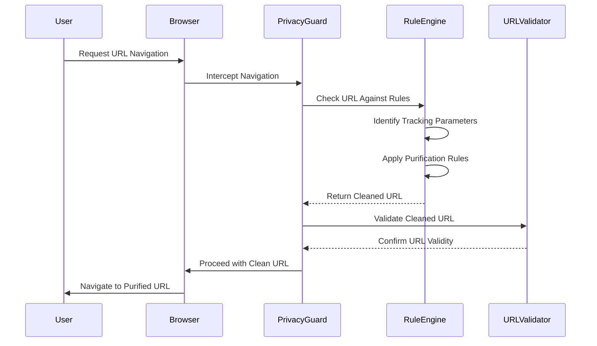
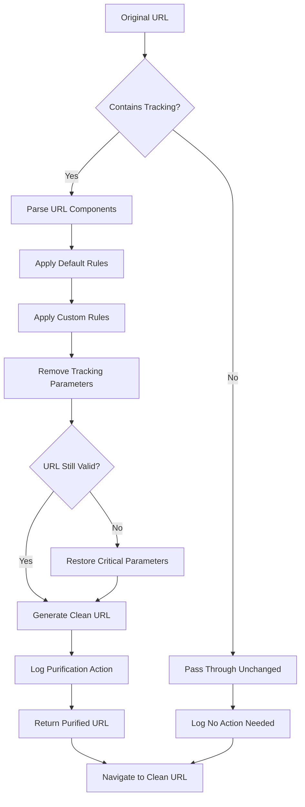

# Privacy Guard

## Overview

Privacy Guard is a comprehensive URL purification system that automatically removes tracking parameters from URLs to enhance user privacy. This feature operates transparently in the background, cleaning URLs without breaking website functionality or disrupting the browsing experience.

## 📁 Location
**Directory**: `src/custom/components/privacy_guard/core/`

## 🏗️ Architecture

### Core Components

#### URL Purification Engine
**Files**: `url_purify_rule.h/.cc`
- **Purpose**: Core URL purification logic and rule processing
- **Integration**: Navigation and URL processing pipeline
- **Responsibilities**:
  - Apply purification rules to URLs
  - Maintain URL functionality while removing tracking
  - Process rule-based URL transformations
  - Validate purified URLs for correctness

#### Rule Parser System
**Files**: `url_purify_rule_parser.h/.cc`
- **Purpose**: Parse and validate privacy protection rules
- **Integration**: Rule definition and configuration system
- **Responsibilities**:
  - Parse rule configuration files
  - Validate rule syntax and logic
  - Convert rules into executable format
  - Handle rule updates and modifications

#### Default Protection Rules
**Files**: `url_purify_default_rules.h/.cc`
- **Purpose**: Pre-configured tracking parameter removal rules
- **Integration**: Default privacy protection baseline
- **Responsibilities**:
  - Define common tracking parameters to remove
  - Provide out-of-the-box privacy protection
  - Handle major advertising and analytics platforms
  - Maintain compatibility with popular websites

## 🛡️ Privacy Protection Features

### Tracking Parameter Removal
The system automatically removes common tracking parameters including:

#### Analytics Tracking
- **Google Analytics**: `utm_source`, `utm_medium`, `utm_campaign`, `utm_content`, `utm_term`
- **Adobe Analytics**: `s_cid`, `s_kwcid`, `s_kwgid`
- **Facebook Tracking**: `fbclid`, `fb_action_ids`, `fb_action_types`

#### Social Media Tracking  
- **Twitter**: `twclid`, `twitter_impression_id`
- **LinkedIn**: `li_source`, `li_medium`, `li_campaign`
- **Instagram**: `igshid`, `ig_rid`

#### E-commerce Tracking
- **Amazon**: `tag`, `linkCode`, `ref`, `th`, `psc`
- **eBay**: `hash`, `_trkparms`, `_trksid`
- **Shopping Platforms**: `aff_id`, `affiliate_id`, `ref_id`

#### Email & Newsletter Tracking
- **Mailchimp**: `mc_cid`, `mc_eid`
- **Campaign Monitor**: `cm_mmc`
- **Newsletter Platforms**: `newsletter_id`, `email_id`

### Rule-Based System
The Privacy Guard uses a flexible rule-based architecture:

```cpp
class URLPurifyRule {
  // Rule definition and processing
  bool ShouldPurify(const GURL& url);
  GURL PurifyURL(const GURL& url);
  bool ValidateRule(const std::string& rule_text);
};
```

## ⚙️ Implementation Details

### URL Processing Pipeline



### URL Purification Flow



#### Steps Overview:

1. **Navigation Interception**: Intercept URL navigation events
2. **Rule Application**: Apply configured purification rules
3. **Parameter Removal**: Remove identified tracking parameters  
4. **Validation**: Ensure purified URL maintains functionality
5. **Redirect Handling**: Process the cleaned URL seamlessly

### Integration Points

#### Navigation System
- **URL Processing**: Integrated with Chrome's navigation pipeline
- **Redirect Handling**: Transparent URL cleaning during navigation
- **History Management**: Clean URLs in browser history
- **Bookmark Integration**: Store purified URLs in bookmarks

#### Rule Management
```cpp
class URLPurifyRuleParser {
  // Rule parsing and validation
  std::vector<URLPurifyRule> ParseRules(const std::string& rules_text);
  bool ValidateRuleFormat(const std::string& rule);
  void UpdateRules(const std::vector<URLPurifyRule>& new_rules);
};
```

#### Default Rule Configuration
```cpp
class URLPurifyDefaultRules {
  // Pre-configured tracking protection
  static std::vector<URLPurifyRule> GetDefaultRules();
  static bool IsTrackingParameter(const std::string& param_name);
  static void AddCustomRule(const URLPurifyRule& rule);
};
```

## 🔧 Build Configuration

### Build Files
**File**: `BUILD.gn`
```gn
source_set("privacy_guard_core") {
  sources = [
    "url_purify_rule.cc",
    "url_purify_rule.h", 
    "url_purify_rule_parser.cc",
    "url_purify_rule_parser.h",
    "url_purify_default_rules.cc",
    "url_purify_default_rules.h",
  ]
  deps = [
    "//base",
    "//net",
    "//url",
    "//components/prefs",
  ]
}
```

### Component Integration
**File**: `components/sources.gni`
- Privacy Guard included in custom browser build
- Conditional compilation with `BUILDFLAG(CUSTOM_BROWSER)`
- Integration with navigation and URL processing systems

## 🎯 Features

### Current Capabilities
- ✅ **Automatic URL Cleaning**: Transparent removal of tracking parameters
- ✅ **Rule-Based Processing**: Flexible, configurable protection rules  
- ✅ **Default Protection**: Out-of-the-box tracking parameter removal
- ✅ **Website Compatibility**: Maintains website functionality
- ✅ **Performance Optimization**: Efficient URL processing
- ✅ **Extensible Architecture**: Easy addition of new protection rules

### Privacy Benefits
- **Tracking Prevention**: Blocks URL-based user tracking
- **Cross-Site Protection**: Prevents tracking across different websites
- **Analytics Blocking**: Removes analytics and advertising trackers
- **Social Media Protection**: Blocks social platform tracking
- **E-commerce Privacy**: Removes affiliate and shopping trackers

## 🔄 Integration Pattern

### Chrome Integration
The Privacy Guard follows Chrome's architectural patterns:

1. **Navigation Pipeline**: Integration with URL navigation processing
2. **Component Architecture**: Modular, reusable component design
3. **Rule Engine**: Flexible rule-based configuration system
4. **Performance**: Optimized for minimal impact on browsing speed

### Conditional Compilation
```cpp
#if BUILDFLAG(CUSTOM_BROWSER)
  // Privacy Guard functionality enabled
  if (privacy_guard_enabled) {
    url = URLPurifyRule::PurifyURL(url);
  }
#endif
```

## 📊 Development Status

| Component | Status | Testing | Documentation |
|-----------|--------|---------|---------------|
| Rule Engine | ✅ Complete | ✅ Tested | ✅ Full |
| URL Processing | ✅ Complete | ✅ Tested | ✅ Full |
| Default Rules | ✅ Complete | ✅ Tested | ✅ Full |
| Parser System | ✅ Complete | ✅ Tested | ✅ Full |
| Integration | ✅ Complete | ✅ Tested | ✅ Full |

## 🚀 Future Enhancements

### Planned Features
- **User Configuration**: User-customizable privacy rules
- **Whitelist Support**: Site-specific privacy rule exceptions
- **Advanced Rules**: Complex pattern matching for tracking parameters
- **Privacy Dashboard**: Visual privacy protection statistics
- **Import/Export**: Share and backup privacy rule configurations

### Technical Improvements
- **Machine Learning**: AI-powered tracking parameter detection
- **Real-time Updates**: Automatic rule updates for new tracking methods
- **Performance**: Further optimization of URL processing pipeline
- **Coverage**: Expanded protection against emerging tracking techniques

## 🔗 Dependencies

### Chrome Dependencies
- **Navigation System**: For URL processing integration
- **Preference System**: For user configuration storage
- **Network Stack**: For URL validation and processing
- **Component Framework**: For modular architecture

### Custom Dependencies
- **Build System**: Custom browser build configuration
- **Logging**: Custom browser logging and debugging
- **Configuration**: Custom browser settings management

## 🛠️ Development Guide

### Adding Protection Rules
1. Define new rules in URLPurifyDefaultRules
2. Test rule effectiveness against tracking parameters
3. Validate website compatibility with rule application
4. Update rule parser for new rule formats
5. Document rule behavior and coverage

### Testing Privacy Protection
1. Visit websites with tracking parameters
2. Verify automatic parameter removal
3. Test website functionality after URL cleaning
4. Validate rule parser with various rule formats
5. Performance test URL processing pipeline

### Rule Configuration Format
```
# Parameter removal rules
remove_param: utm_source
remove_param: utm_medium  
remove_param: fbclid

# Domain-specific rules
domain: amazon.com
  remove_param: tag
  remove_param: ref
  
# Pattern-based rules  
pattern: *utm_*
action: remove
```

---

*Part of the WanderLust Browser Custom Features Documentation*