# Remote NTP (New Tab Page) Implementation Documentation

## Overview

The Remote NTP system is a comprehensive implementation that provides a cloud-hosted New Tab Page experience for the Custom Browser. Unlike traditional local new tab pages, this system fetches content and configuration from remote servers while maintaining rich offline functionality and seamless integration with browser features.

## Key Features

- **Remote Content Delivery**: New tab page content served from remote servers with local caching
- **Offline Support**: Fallback resources when network connectivity is unavailable
- **Theme Synchronization**: Dynamic theme updates including dark mode support
- **Custom Tile Management**: User-defined shortcuts and bookmarks
- **Icon Processing**: Advanced favicon and touch icon handling with storage optimization
- **WiFi Status Integration**: Network connectivity awareness for enhanced user experience
- **Search Integration**: Embedded autocomplete functionality
- **Service Worker Support**: Progressive Web App capabilities

## Architecture Overview

### System Components

The Remote NTP implementation consists of several interconnected components across the Chromium architecture:

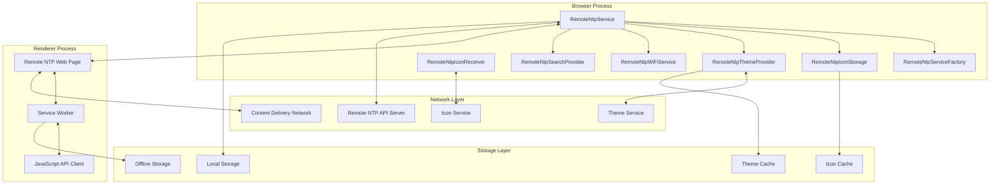

## Code Organization

### Directory Structure

```
src/custom/browser/ntp/
├── remote_ntp_service.h               # Main service interface
├── remote_ntp_service.cc              # Service implementation base
├── remote_ntp_service_impl.h          # Concrete service implementation
├── remote_ntp_service_impl.cc         # Implementation details
├── remote_ntp_service_factory.h       # Service factory for dependency injection
├── remote_ntp_service_factory.cc      # Factory implementation
├── remote_ntp_source.h                # WebUI data source for offline fallback
├── remote_ntp_source.cc               # URL data source implementation
├── remote_ntp_icon_receiver.h         # Icon parsing and receiving interface
├── remote_ntp_icon_receiver.cc        # Icon processing implementation
├── remote_ntp_icon_storage.h          # Icon cache management interface
├── remote_ntp_icon_storage.cc         # Icon storage and retrieval
├── remote_ntp_theme_provider.h        # Theme management interface
├── remote_ntp_theme_provider.cc       # Theme and appearance handling
├── remote_ntp_theme_delegate.h        # Theme change notification interface
├── remote_ntp_search_provider.h       # Search/autocomplete integration
├── remote_ntp_search_provider.cc      # Search service implementation
├── remote_ntp_wifi_service.h          # Network status monitoring
├── remote_ntp_wifi_service.cc         # WiFi connectivity tracking
├── remote_ntp_offline_resources.h     # Offline resource definitions
├── remote_ntp_offline_resources.cc    # Offline content management
└── remote_ntp_browsertest.cc          # Integration tests

src/custom/common/ntp/
├── remote_ntp.mojom                   # Mojo IPC interface definitions
├── remote_ntp_types.h                 # Type aliases and common definitions
├── remote_ntp_prefs.h                 # Preference key definitions
├── remote_ntp_prefs.cc                # Preference management
├── remote_ntp_icon_util.h             # Icon utility functions
├── remote_ntp_icon_util.cc            # Icon processing utilities
└── BUILD.gn                           # Build configuration
```

### Integration Points

The Remote NTP integrates with core Chromium systems through several well-defined interfaces:

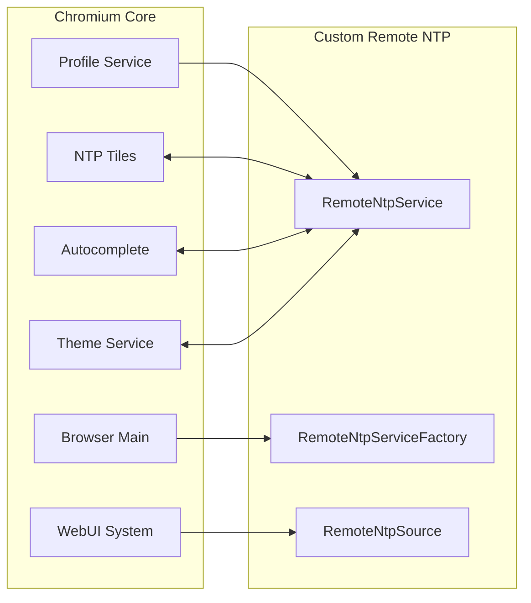

## Data Flow Architecture

### High-Level Data Flow

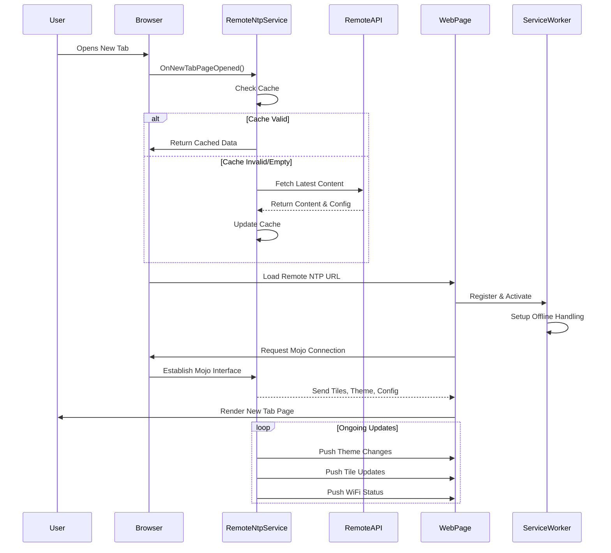

### Icon Processing Flow

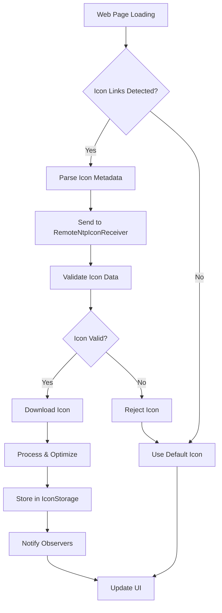

### Theme Management Flow

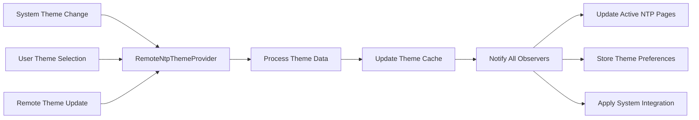

## Mojo Interface Architecture

The Remote NTP uses Mojo for efficient cross-process communication:

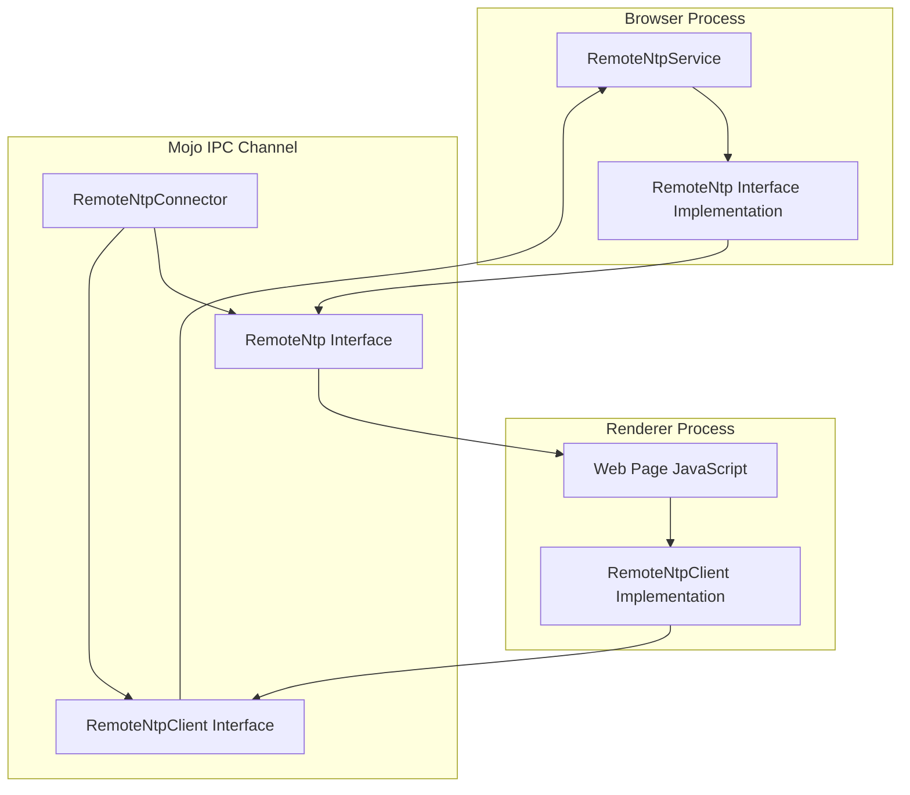

### Mojo Interface Definitions

The system defines several key interfaces:

1. **RemoteNtpConnector**: Connection establishment
2. **RemoteNtp**: Browser → Renderer communication
3. **RemoteNtpClient**: Renderer → Browser communication
4. **RemoteNtpIconReceiver**: Icon data transfer

### Key Mojo Methods

| Interface | Method | Description |
|-----------|--------|-------------|
| RemoteNtp | AddCustomTile() | Add user-defined shortcut |
| RemoteNtp | QueryAutocomplete() | Search suggestions |
| RemoteNtp | UpdateWiFiStatus() | Request network status |
| RemoteNtpClient | NtpTilesChanged() | Tile updates from browser |
| RemoteNtpClient | ThemeChanged() | Theme updates from browser |
| RemoteNtpClient | WiFiStatusChanged() | Network status updates |

## Storage and Caching Strategy

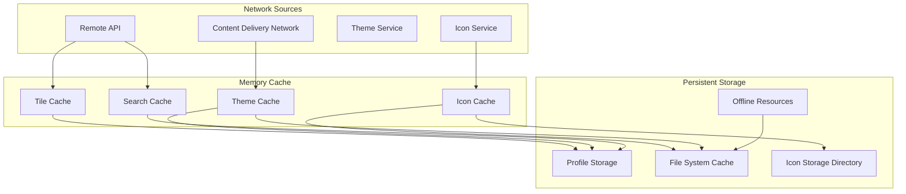

## Offline Functionality

The Remote NTP provides robust offline support through multiple mechanisms:

### Offline Resource Management

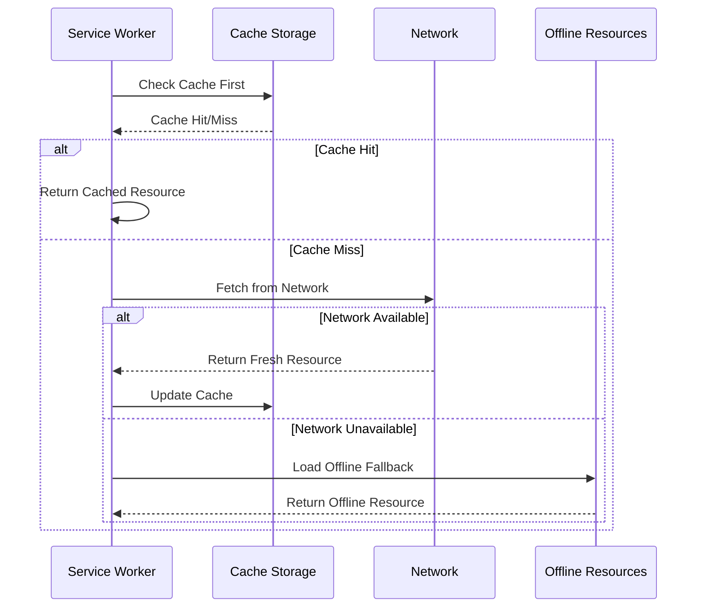

## WiFi Status Integration

The WiFi service provides real-time network awareness:

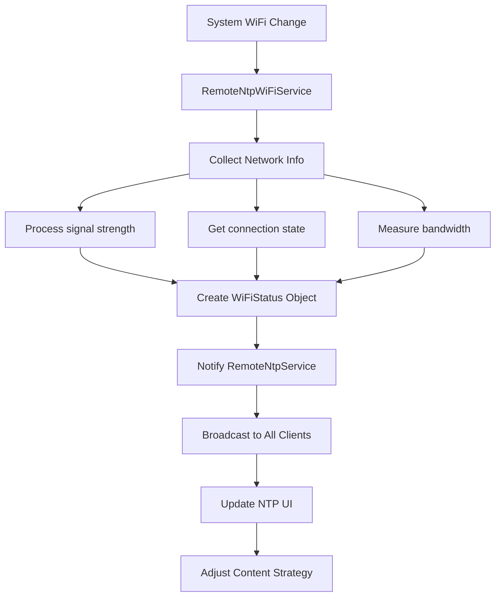

## Search Integration

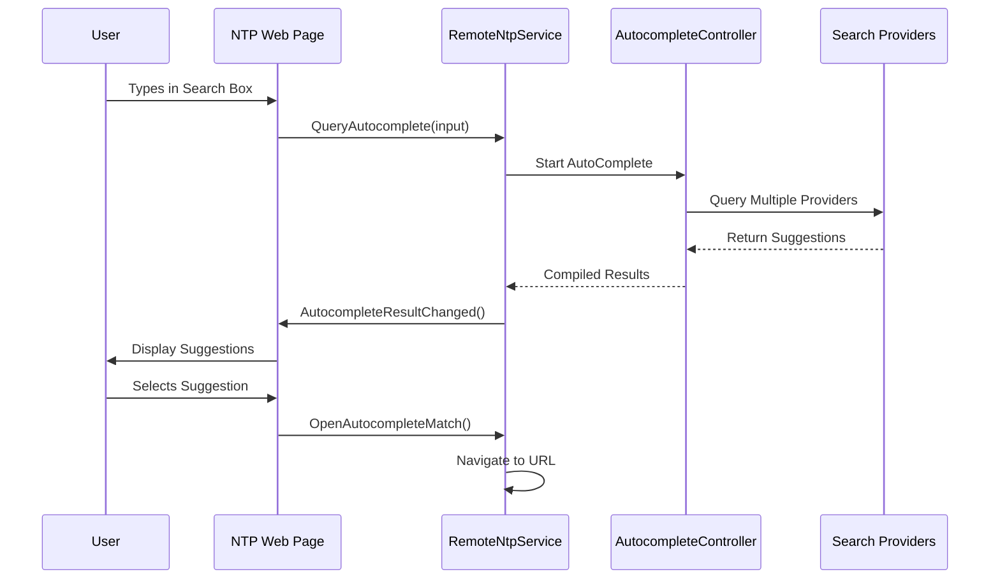

## Configuration and Preferences

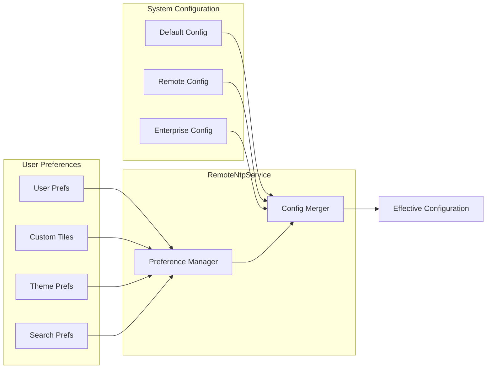

## Error Handling and Recovery

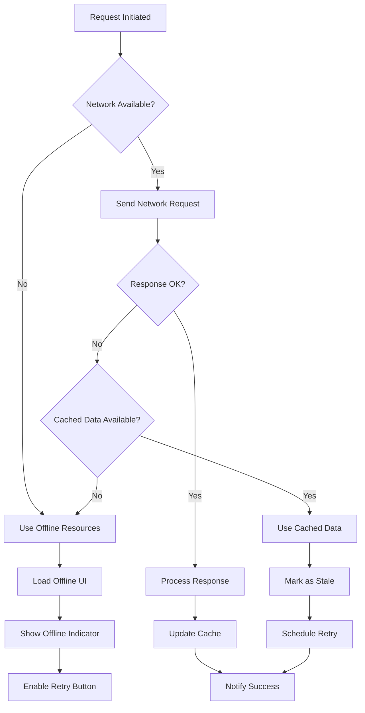

## Performance Considerations

### Initialization Performance

```mermaid
gantt
    title Remote NTP Initialization Timeline
    dateFormat X
    axisFormat %s
    
    section Browser Startup
    Service Factory    :done, factory, 0, 50
    Profile Loading    :done, profile, 0, 100
    
    section Service Init
    Service Creation   :done, creation, 50, 100
    Preference Loading :done, prefs, 75, 125
    Cache Validation   :active, cache, 100, 200
    
    section Network
    API Connection     :network, 150, 300
    Content Fetch      :fetch, 200, 400
    
    section Rendering
    Page Load          :render, 250, 450
    Mojo Setup         :mojo, 300, 400
    UI Rendering       :ui, 400, 500
```

## Security Model

The Remote NTP implements several security measures:

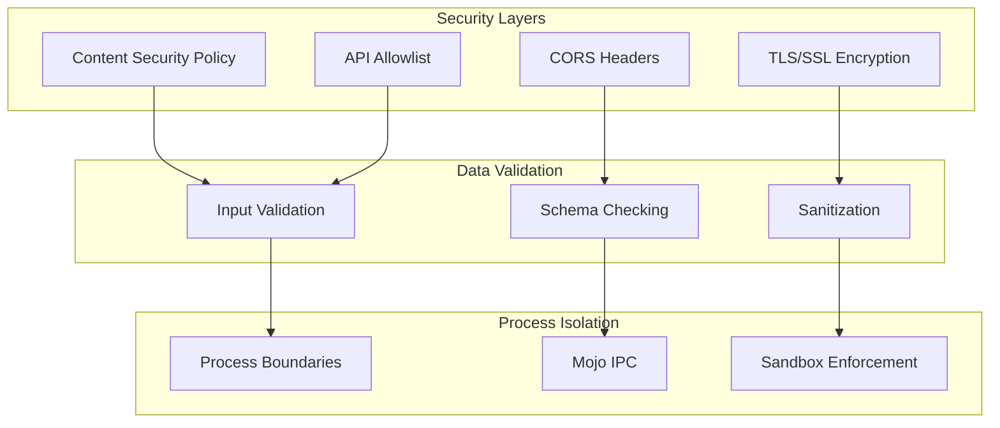

## Deployment Architecture

### Remote NTP Web Page Deployment

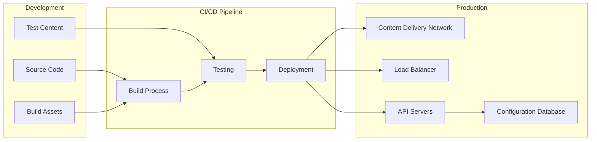

## Future Enhancements

### Planned Features

1. **Progressive Web App Support**: Enhanced offline capabilities
2. **Advanced Analytics**: Usage tracking and optimization
3. **Machine Learning Integration**: Personalized content recommendations
4. **Enhanced Theming**: Dynamic theme generation
5. **Multi-Language Support**: Localized content delivery

### Scalability Considerations

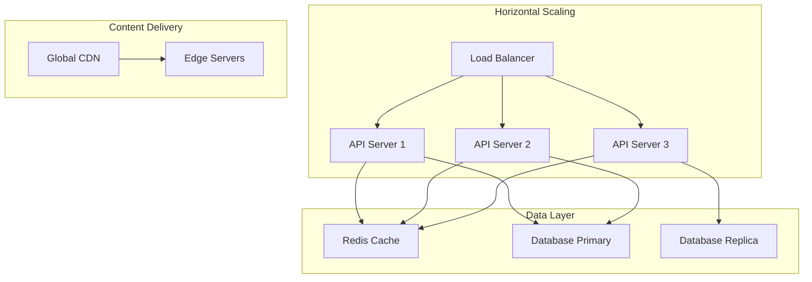

## Contributing and Maintenance

### Code Contribution Guidelines

When contributing to the Remote NTP implementation:

1. **Follow Chromium Coding Standards**: Maintain consistency with upstream Chromium
2. **Minimize Core Changes**: Place custom code in `src/custom/` directory structure
3. **Document Changes**: Update this documentation for any architectural changes
4. **Test Coverage**: Include comprehensive tests for new functionality
5. **Performance**: Consider impact on browser startup and memory usage

### Maintenance Procedures

1. **Regular Updates**: Sync with upstream Chromium changes
2. **Security Audits**: Regular security reviews of remote endpoints
3. **Performance Monitoring**: Track metrics and optimize bottlenecks
4. **Cache Management**: Implement cache eviction and cleanup strategies

## Troubleshooting

### Common Issues

| Issue | Symptoms | Solution |
|-------|----------|----------|
| Network Connectivity | NTP shows offline content | Check network, verify API endpoints |
| Icon Loading Failures | Missing site icons | Clear icon cache, check icon URLs |
| Theme Not Updating | Stale appearance | Force theme refresh, check theme service |
| Search Not Working | No autocomplete results | Verify search service integration |
| Performance Issues | Slow NTP loading | Check cache validity, optimize network requests |

### Debug Information

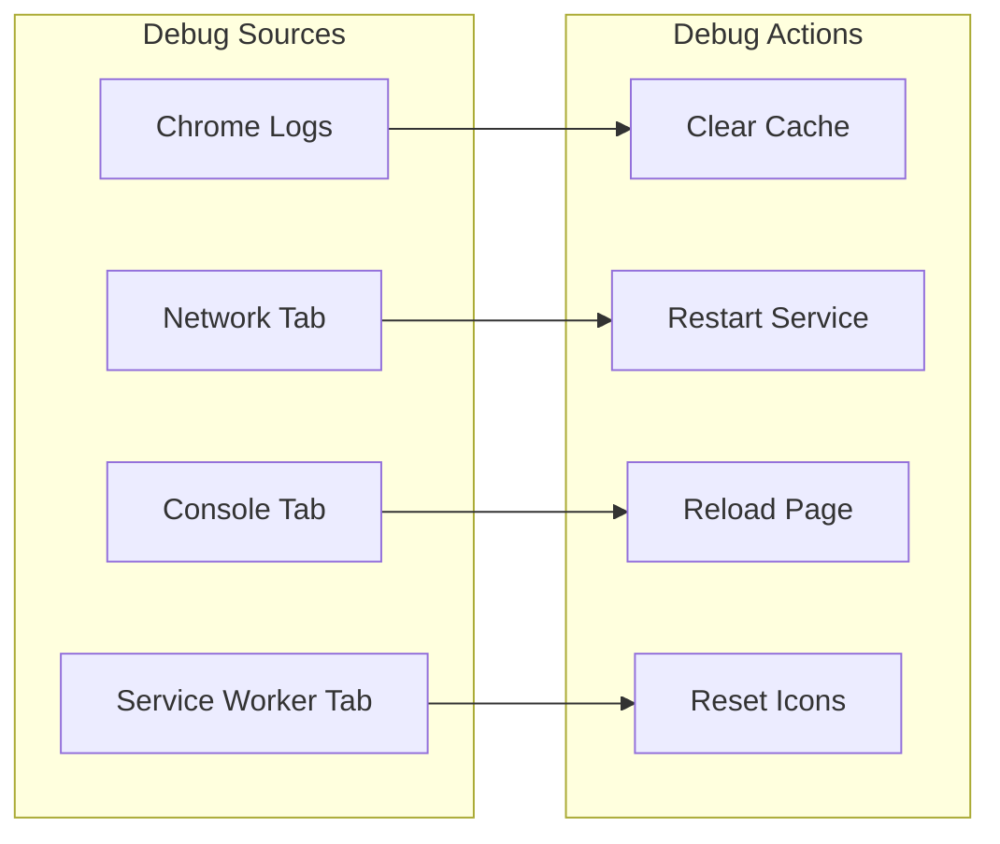

## Conclusion

The Remote NTP implementation provides a robust, scalable, and feature-rich new tab page experience that leverages remote content delivery while maintaining excellent offline functionality and performance. The modular architecture ensures maintainability and extensibility while adhering to Chromium's security and performance standards.

This documentation should be updated as the implementation evolves to ensure it remains accurate and useful for developers working on the Remote NTP system.