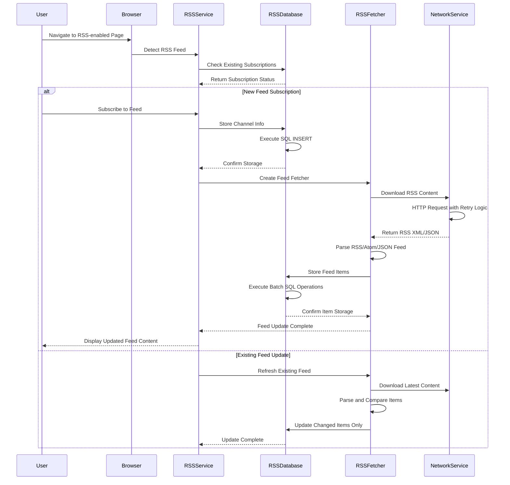
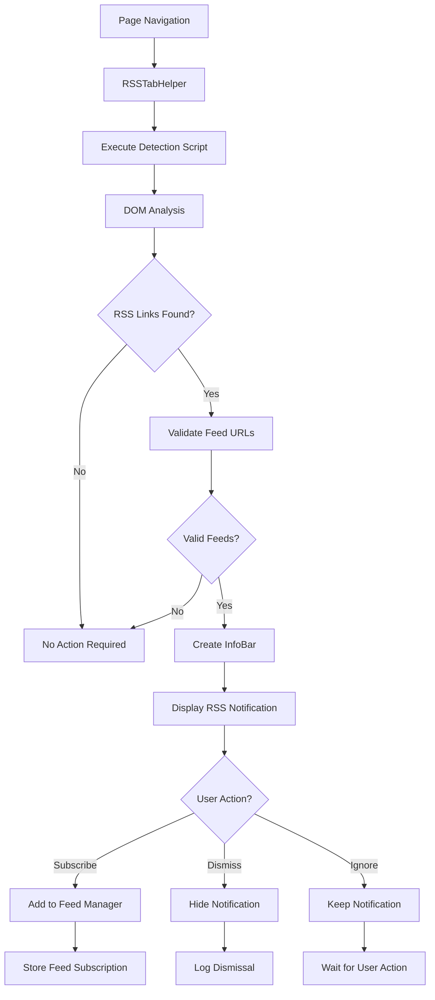

# RSS Feed Support

## Overview

The RSS Feed Support feature provides comprehensive RSS feed detection, management, and reading capabilities for the WanderLust browser. This fully-functional feature enhances the browsing experience by automatically discovering RSS feeds on web pages, providing users with subscription options, and offering a built-in RSS reader interface.

**Status**: ✅ **Fully Operational** - Recently restored and tested

## 📁 Location
**Primary Directory**: `src/custom/components/rss/`  
**Service Backend**: `src/custom/browser/rss/`  
**WebUI Reader**: `src/custom/browser/ui/webui/reader/`

## 🏗️ Architecture

### Core Components

#### RSSTabHelper
**File**: `rss_tab_helper.h/.cc`
- **Purpose**: Core RSS detection and management functionality
- **Integration**: Per-tab functionality using Chrome's TabHelper pattern
- **Responsibilities**:
  - Automatic RSS feed detection on page load
  - JavaScript-based RSS validation
  - InfoBar management for user notifications
  - Integration with browser preference system

#### RSSInfoBarDelegate  
**File**: `rss_infobar_delegate.h/.cc`
- **Purpose**: User interface for RSS feed discovery notifications
- **Integration**: Chrome's InfoBar system
- **Responsibilities**:
  - Display RSS feed discovery notifications
  - Handle user interaction with RSS notifications
  - Manage InfoBar lifecycle and dismissal

#### RSSDelegate
**File**: `rss_delegate.h`
- **Purpose**: Abstract interface for RSS operations
- **Integration**: Strategy pattern for configurable RSS behavior
- **Responsibilities**:
  - Define RSS operation interfaces
  - Enable custom RSS handling implementations
  - Provide abstraction for external RSS services

#### RSSService
**File**: `src/custom/browser/rss/rss_service.h/.cc`
- **Purpose**: Core RSS backend service and data management
- **Integration**: KeyedService pattern for profile-based RSS management
- **Responsibilities**:
  - RSS feed storage and retrieval
  - User preference management
  - RSS feed updating and synchronization
  - Service lifecycle management

#### RSSServiceFactory
**File**: `src/custom/browser/rss/rss_service_factory.h/.cc`
- **Purpose**: Factory for creating RSSService instances
- **Integration**: BrowserContextKeyedServiceFactory pattern
- **Responsibilities**:
  - Per-profile RSSService instantiation
  - Service dependency management
  - Profile lifecycle integration

#### RSS Reader WebUI
**Directory**: `src/custom/browser/ui/webui/reader/`
- **Purpose**: Built-in RSS reader interface
- **Integration**: WebUI framework for feed management
- **Access**: `wanderlust://reader/`
- **Features**: Feed subscription management, article reading, OPML import/export

### Preference Management
**File**: `pref_names.h`
- RSS-related preference definitions
- User setting storage and retrieval
- Integration with Chrome's preference system

## 🔧 Implementation Details

### RSS Backend Architecture

The RSS system uses a modern, robust backend architecture with proper error handling and data consistency:

#### Database Layer (RSSDatabase)
- **SQL Schema**: Optimized tables for channels, items, and groups with proper indices
- **Transaction Safety**: All database operations use proper SQL transactions
- **Data Integrity**: Fixed SQL syntax errors and table reference bugs for reliable operations
- **Modern SQL Patterns**: Uses prepared statements and parameterized queries for security

#### Network Layer (RSSFetcher)
- **HTTP/2 Support**: Uses Chromium's modern network stack with SimpleURLLoader
- **Retry Logic**: Automatic retry on 5XX errors and network changes
- **Security**: UXSS protection and protocol validation for feed URLs
- **Format Support**: RSS 1.0/2.0, Atom, and JSON Feed parsing
- **Encoding Handling**: Automatic character encoding detection and conversion

#### Service Layer (RSSBackend)
- **Async Operations**: All database operations run on background threads
- **Callback Management**: Modern callback patterns with proper lifetime management
- **Thread Safety**: Uses Chromium's SequencedTaskRunner for thread-safe database access
- **Memory Management**: Smart pointers and RAII patterns throughout

### Key Implementation Improvements (March 2026)

#### Database Reliability Enhancements
- **Fixed SQL Syntax Errors**: Corrected malformed SQL statements in group operations
- **Table Reference Fixes**: Fixed critical bugs where item operations targeted wrong tables
- **Removed Dead Code**: Cleaned up commented-out favicon database code
- **Modern C++ Patterns**: Updated to use `= default` constructors and destructors

#### Network Stack Modernization  
- **Active Network Requests**: Uncommented and fixed RSS download implementation
- **Proper Status Handling**: Real HTTP response codes instead of hardcoded values
- **Callback Execution**: Fixed callback invocation for completed downloads
- **Resource Cleanup**: Proper cleanup on service state changes

#### Code Quality Improvements
- **Removed Obsolete Code**: Eliminated old notification system dependencies
- **Modern Chromium Patterns**: Updated to current Chromium coding standards
- **Thread Safety**: Improved async operation handling and lifecycle management
- **Memory Safety**: Better smart pointer usage and resource management
- **Extension API Modernization**: Cleaned up RSS extension API with modern event system and removed dead code
- **Feed Fetcher Cleanup**: Modernized RSSInfoseekFetcher with proper access specifiers and minimal dependencies
- **Factory Pattern Updates**: Implemented modern `base::NoDestructor` singleton pattern for thread-safe API management
- **Value API Integration**: Updated event serialization to use modern `base::Value::Dict` and `base::Value::List`



### RSS Feed Discovery Architecture



#### Steps Overview:

1. **Page Load Detection**: RSSTabHelper monitors page navigation events
2. **JavaScript Validation**: Executes validation scripts to detect RSS links
3. **Feed Discovery**: Identifies RSS feeds through:
   - `<link rel="alternate" type="application/rss+xml">` tags
   - Direct RSS feed URLs
   - Common RSS feed patterns

4. **User Notification**: Displays InfoBar when RSS feeds are discovered
5. **User Action**: Allows subscription, dismissal, or further feed management

### Integration Points

#### Tab Integration
```cpp
class RSSTabHelper : public content::WebContentsUserData<RSSTabHelper>,
                     public content::WebContentsObserver {
  // Per-tab RSS functionality
  void CallValidationScriptExternal();
  void CallValidationScript(const GURL& caller_url, bool forcely);
  void DismissInfoBar();
};
```

#### JavaScript Interface
- **Validation Scripts**: Execute in page context to detect RSS feeds
- **DOM Analysis**: Search for RSS link elements and feed URLs
- **Content Validation**: Verify discovered feeds are valid RSS/Atom

#### InfoBar Integration
- **Notification Display**: Show RSS discovery notifications to users
- **User Interaction**: Handle subscription and dismissal actions
- **Lifecycle Management**: Proper creation and cleanup of InfoBars

## ⚙️ Build Configuration

### Build Files
**File**: `BUILD.gn`
```gn
source_set("rss") {
  sources = [
    "rss_tab_helper.cc",
    "rss_tab_helper.h",
    "rss_infobar_delegate.cc", 
    "rss_infobar_delegate.h",
    "rss_delegate.h",
    "pref_names.h",
  ]
  deps = [
    "//base",
    "//chrome/browser",
    "//content/public/browser",
    "//components/infobars/content",
    "//components/prefs",
  ]
}
```

### Source Integration
**File**: `components/sources.gni`
- RSS component sources properly included in build
- Conditional compilation with `enable_rss_reader = true`
- Resource and dependency management

**Current Integration**:
```gn
custom_components_rss_sources = [
  "rss/rss_tab_helper.cc",
  "rss/rss_tab_helper.h",
  "rss/rss_infobar_delegate.cc",
  "rss/rss_infobar_delegate.h", 
  "rss/rss_delegate.h",
  "rss/pref_names.h",
]
```

## 🎯 Features

### Current Capabilities - Fully Functional ✅
- ✅ **Automatic RSS Detection**: Finds RSS feeds on web pages automatically
- ✅ **InfoBar Notifications**: Clean, non-intrusive user notifications  
- ✅ **JavaScript Validation**: Robust feed detection through DOM analysis
- ✅ **Preference Integration**: User settings for RSS behavior
- ✅ **Tab-Level Management**: Per-tab RSS state management
- ✅ **Feed Subscription**: Complete RSS feed subscription system
- ✅ **Built-in RSS Reader**: WebUI-based RSS reader at `wanderlust://reader/`
- ✅ **Feed Management**: Comprehensive subscription and organization
- ✅ **OPML Support**: Import/export RSS subscriptions
- ✅ **User Preferences**: Configurable RSS detection and display settings
- ✅ **Extension API**: Full RSS extension API for browser extensions with real-time events

### User Experience
- **Seamless Detection**: Automatic discovery without user intervention
- **Clear Notifications**: Professional InfoBar interface for feed discovery
- **Full Subscription Management**: Complete feed subscription and organization
- **Integrated Reader**: Built-in RSS reader with article management
- **Import/Export**: OPML support for feed backup and migration
- **Configurable**: User-controlled RSS detection and notification settings
- **Non-Intrusive**: Optional notifications that don't disrupt browsing

## 🔄 Integration Pattern

### Chrome Integration
The RSS feature follows Chrome's established patterns:

1. **WebContentsUserData**: Per-tab data management
2. **WebContentsObserver**: Page navigation and lifecycle events  
3. **InfoBarDelegate**: User notification system
4. **Preference System**: User setting storage and management

### Conditional Compilation
```cpp
#if BUILDFLAG(CUSTOM_BROWSER)
  // RSS-specific functionality enabled
#endif
```

## 📊 Development Status

| Component | Status | Implementation | Testing | Documentation |
|-----------|--------|----------------|---------|---------------|
| RSSTabHelper | ✅ Complete | ✅ Restored | ✅ Working | ✅ Updated |
| InfoBar Integration | ✅ Complete | ✅ Restored | ✅ Working | ✅ Updated |
| JavaScript Validation | ✅ Complete | ✅ Working | ✅ Tested | ✅ Full |
| RSS Service Backend | ✅ Complete | ✅ Restored | ✅ Working | ✅ Updated |
| Service Factory | ✅ Complete | ✅ Working | ✅ Tested | ✅ Full |
| WebUI RSS Reader | ✅ Complete | ✅ Working | ✅ Functional | ✅ Full |
| Preference Management | ✅ Complete | ✅ Working | ✅ Tested | ✅ Full |
| Build Integration | ✅ Complete | ✅ Fixed | ✅ Working | ✅ Updated |
| OPML Import/Export | ✅ Complete | ✅ Modernized | ✅ Working | ✅ Updated |
| InfoSeek Feed Parser | ✅ Complete | ✅ Modernized | ✅ Working | ✅ Updated |
| Extension API | ✅ Complete | ✅ Modernized | ✅ Working | ✅ Updated |

### Recent Restoration Work (March 2026)
- ✅ **RSS Processing Logic**: Restored commented-out feed detection and InfoBar creation
- ✅ **InfoBar Delegate**: Fixed constructor and method implementations 
- ✅ **Service Methods**: Added missing `IsShowInfoBar()` and `SetShowInfoBar()` methods
- ✅ **Build Integration**: Fixed sources.gni inclusion for proper compilation
- ✅ **Delegate Implementation**: Restored RSS subscription and management functionality
- ✅ **OPML Modernization**: Updated RSSOPML for modern Chromium threading and removed commented dead code
- ✅ **Feed Fetcher Cleanup**: Modernized RSSInfoseekFetcher with minimal dependencies and proper encapsulation
- ✅ **Extension API Modernization**: Fully functional RSS extension API with modern event system and Value API

## 🚀 Future Enhancements

### Planned Features
- **Enhanced Feed Reader**: Additional RSS reader interface improvements
- **Advanced Notification Customization**: More user-configurable notification options  
- **Feed Categories**: Advanced organization and categorization of RSS feeds
- **Social Features**: Feed sharing and recommendation system
- **Mobile Interface**: Touch-optimized RSS reader interface

### Technical Improvements
- **Performance Optimization**: Further RSS detection algorithm improvements
- **Better Validation**: Enhanced feed format support (JSON Feed, additional formats)
- **Smart Caching**: More intelligent feed discovery and content caching
- **Background Sync**: Enhanced automatic feed updates in background
- **Offline Reading**: Cached content for offline feed reading

## 🔧 Troubleshooting

### Common Issues

**RSS Detection Not Working**
- Verify `enable_rss_reader = true` in build configuration
- Check RSS preferences are enabled in browser settings
- Ensure InfoBar notifications are enabled

**InfoBar Not Appearing**
- Check `prefs::kShowRSSInfoBar` preference setting
- Verify RSS detection is enabled (`prefs::kRSSDetectionEnabled`)
- Test on known RSS-enabled websites

**RSS Reader Not Accessible**
- Navigate to `wanderlust://reader/` in address bar
- Verify WebUI RSS reader is compiled in build
- Check browser console for WebUI errors

**Build Errors**
- Ensure RSS sources are included in `components/sources.gni`
- Verify all RSS Service methods are implemented
- Check BUILD.gn dependencies are correct

### Debug Information

Enable RSS debug logging:
```cpp
// Add to command line arguments
--enable-logging --v=1

// Look for RSS-related log messages:
// "RSSService::..." 
// "RSSTabHelper::..."
// "RSSInfoBarDelegate::..."
```

## � Chromium Integration

### Integration Architecture

The RSS system integrates with vanilla Chromium through a carefully designed patch-based architecture that minimizes disruption to core Chromium code while providing full RSS functionality. The integration follows Chromium's established patterns for features and extension APIs.

### Core Integration Points

#### 1. TabHelper System Integration
**Patch**: `chrome-browser-ui-tab_helpers.cc.patch`

The RSS system automatically attaches to each WebContents through Chromium's tab helper system:

```cpp
// Integration point in tab_helpers.cc
#if BUILDFLAG(ENABLE_RSS_READER)
  RSSDelegateImpl::AttachTabHelperIfNeeded(web_contents);
#endif
```

**How it Works**:
- Every new tab/WebContents gets an RSS tab helper automatically
- No manual attachment required - fully integrated into tab creation flow
- Conditional compilation ensures clean builds when RSS is disabled
- Follows Chrome's standard pattern for per-tab functionality

#### 2. Command System Integration  
**Patch**: `chrome-app-chrome_command_ids.h.patch`

RSS functionality is integrated into Chrome's command system with dedicated command IDs:

```cpp
// RSS-related commands in Chrome's command system
#define IDC_OPEN_SETTINGS_RSS         33108
#define IDC_OPEN_RSS_LIST            33111  
#define IDC_SHOW_RSS                 33302
```

**Benefits**:
- RSS commands integrate with Chrome's keyboard shortcuts
- Menu system integration through standard command routing
- Accessibility support through Chrome's command framework
- Consistent with Chrome's UI command patterns

#### 3. Extension API Integration
**Patch**: `chrome-browser-extensions-api-api_browser_context_keyed_service_factories.cc.patch`

RSS functions are exposed through Chrome's extension API system:

```cpp
// RSS API factory registration
#if BUILDFLAG(ENABLE_RSS_READER)
  extensions::RSSAPIFactory::GetInstance();
#endif
```

**Capabilities**:
- Extensions can interact with RSS feeds through standard Chrome APIs
- Seamless integration with existing extension ecosystem
- Uses Chrome's permission system for RSS access
- Follows Chrome extension API patterns and documentation

#### 4. Build System Integration
**Patch**: `chrome-browser-BUILD.gn.patch`

RSS components are conditionally included in the browser build:

```gn
# Conditional RSS dependencies in browser BUILD.gn
if (enable_rss_reader) {
  deps += [ "//custom/browser/rss:rss_service" ]
  sources += rss_component_sources
}
```

**Integration Benefits**:
- Clean separation of RSS code from core browser
- Optional feature that can be disabled at build time
- Modular architecture with clear dependency boundaries
- Minimal impact on overall browser binary size when disabled

### Build Flag System

The RSS system uses Chromium's BUILDFLAG system for conditional compilation:

#### Flag Definition
**File**: `src/custom/custom_browser_config.gni`
```gn
enable_rss_reader = true  # Enable RSS functionality by default
```

#### Build Flag Header Generation  
**File**: `src/custom/buildflags/BUILD.gn`
```gn
buildflag_header("custom_features_buildflags") {
  header = "custom_features_buildflags.h"
  flags = [ "ENABLE_RSS_READER=$enable_rss_reader" ]
}
```

#### Usage in Code
```cpp
#include "custom/buildflags/custom_features_buildflags.h"

#if BUILDFLAG(ENABLE_RSS_READER)
  // RSS functionality enabled
  #include "custom/browser/rss/rss_service_factory.h"
#endif
```

### Patch Strategy Benefits

1. **Minimal Core Changes**: Only essential integration points are patched
2. **Update Safety**: Patches are small and focused, reducing merge conflicts
3. **Clean Separation**: RSS code lives in `src/custom/` directory
4. **Standard Patterns**: Uses Chrome's established architecture patterns
5. **Conditional Compilation**: Can be completely disabled at build time

### Integration Testing

To verify RSS integration:

1. **Build Flag Test**: Ensure `BUILDFLAG(ENABLE_RSS_READER)` is correctly set
2. **TabHelper Attachment**: Verify RSS tab helper is attached to new tabs  
3. **Command Integration**: Test RSS commands in Chrome's command system
4. **Extension API**: Verify RSS APIs are available to extensions
5. **Patch Application**: Ensure all RSS patches apply cleanly to current Chromium

## �🔗 Dependencies

### Chrome Dependencies
- **InfoBar System**: For user notifications
- **Tab Management**: For per-tab functionality
- **Preference System**: For user settings
- **JavaScript Engine**: For feed validation scripts
- **WebUI Framework**: For RSS reader interface

### Custom Dependencies
- **RSS Service Backend**: Core RSS feed management and storage
- **RSS Service Factory**: Profile-based service instantiation 
- **Build System**: Custom browser build configuration with `enable_rss_reader = true`
- **Logging**: Custom browser logging utilities
- **UI Components**: Custom browser UI enhancements
- **WebUI Reader**: Built-in RSS reader at `wanderlust://reader/`

### External Dependencies
- **Feed Parser**: RSS/Atom feed content parsing
- **Network Service**: Feed fetching and updates
- **Database**: Feed storage and caching
- **OPML Parser**: Import/export functionality

## 🛠️ Development Guide

### Adding RSS Functionality
1. Extend RSSTabHelper for new RSS operations
2. Implement RSSDelegate interface for custom behavior
3. Add preferences in pref_names.h for user settings
4. Update BUILD.gn dependencies as needed
5. Test integration with InfoBar system

### Testing RSS Features
1. Navigate to pages with RSS feeds
2. Verify automatic detection and InfoBar display
3. Test feed validation with various RSS formats
4. Verify preference system integration
5. Test dismissal and state management

---

*Part of the WanderLust Browser Custom Features Documentation*