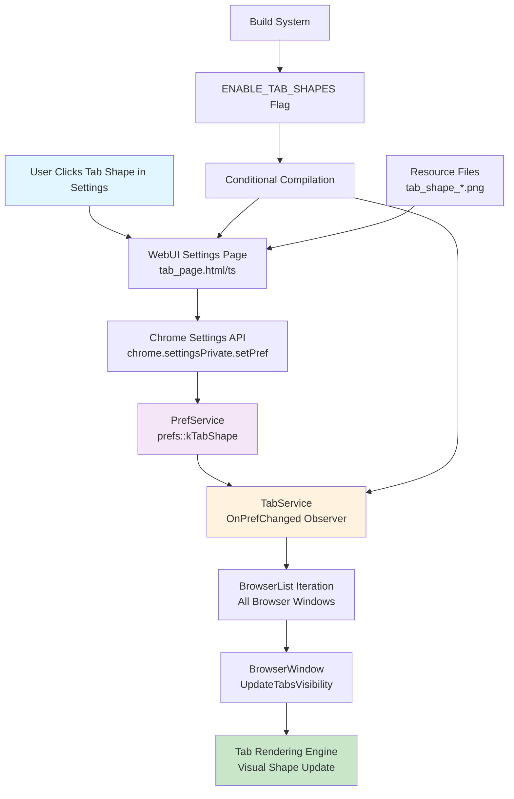
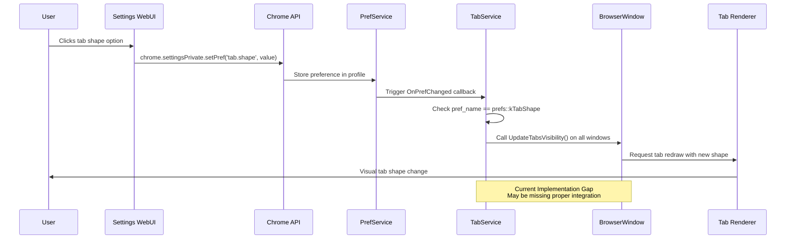

# Tab Shapes Feature

The tab shapes feature allows users to customize the visual appearance of browser tabs with different shape options, providing a personalized browsing experience.

## 📋 Overview

### Supported Tab Shapes
- **Round (Default)**: Traditional rounded tab corners
- **Rectangle**: Sharp, modern rectangular tabs  
- **Trapezoid**: Angular, geometric tab design

### Build Configuration
- **Build Flag**: `enable_tab_shapes = true` in `custom_browser_config.gni`
- **Compile Flag**: `ENABLE_TAB_SHAPES=1` 
- **Default State**: Enabled in custom browser builds

## 🎨 User Guide

### Accessing Tab Shape Settings

1. **Open Settings**: Navigate to `chrome://settings/customTab`
2. **Locate Tab Shapes**: Find the "Tab Shape" section at the top of the page
3. **Select Shape**: Choose from three visual preview options:
   - **Round**: Classic curved tab edges
   - **Rectangle**: Modern straight-edged tabs
   - **Trapezoid**: Angled geometric design

### Visual Previews
The settings page displays realistic tab previews for each shape:
- **Light Mode**: Standard appearance previews
- **Dark Mode**: Automatic dark theme previews when browser is in dark mode
- **Interactive Selection**: Click any preview to apply immediately

### Settings Persistence
- **Profile-Scoped**: Tab shape preference saved per browser profile
- **Sync Support**: Setting syncs across devices when browser sync enabled
- **Default Fallback**: Returns to "Round" if preference becomes corrupted

## 🔧 Technical Implementation

### Architecture Overview



### Component Interaction Flow



### Core Components

#### 1. Preference System
```cpp
// Preference registration in TabService
registry->RegisterIntegerPref(prefs::kTabShape, TabService::ROUND);

// Preference path
namespace prefs {
  inline constexpr char kTabShape[] = "tab.shape";
}

// Shape enumeration
enum Shape {
  ROUND = 0,     // Default rounded tabs
  RECTANGLE = 1, // Rectangular tabs
  TRAPEZOID = 2  // Trapezoidal tabs
};
```

#### 2. TabService Integration
```cpp
class TabService : public KeyedService {
public:
  // Gets current tab shape preference  
  int GetTabShape() const;
  
  // Handles preference changes
  void OnPrefChanged(const std::string& pref_name);
  
private:
  // Notifies all browser windows of shape changes
  void UpdateTabsVisibility();
};
```

#### 3. WebUI Settings Integration
```html
<!-- Settings radio group with preference binding -->
<settings-radio-group id="tabShapeGroup" pref="{{prefs.tab.shape}}">
  <controlled-radio-button name="0" pref="[[prefs.tab.shape]]">
    <div class="tab-round">Round</div>
  </controlled-radio-button>
  <controlled-radio-button name="1" pref="[[prefs.tab.shape]]">
    <div class="tab-rectangle">Rectangle</div>  
  </controlled-radio-button>
  <controlled-radio-button name="2" pref="[[prefs.tab.shape]]">
    <div class="tab-trapezoid">Trapezoid</div>
  </controlled-radio-button>
</settings-radio-group>
```

### Build System Integration

#### Build Configuration
```gn
# In custom_browser_config.gni
enable_tab_shapes = true

# Conditional compilation flags
if (is_custom_browser && enable_tab_shapes) {
  custom_branding_flags += [ "ENABLE_TAB_SHAPES=1" ]
} else {
  custom_branding_flags += [ "ENABLE_TAB_SHAPES=0" ]  
}
```

#### Conditional Compilation
```cpp
#if BUILDFLAG(ENABLE_TAB_SHAPES)
int TabService::GetTabShape() const {
  return prefs_->GetInteger(prefs::kTabShape);
}
#endif // BUILDFLAG(ENABLE_TAB_SHAPES)
```

### CSS Styling System

#### Preview Styles
```css
/* Tab shape preview styles in settings */
.tab-round {
  background-image: url('chrome://resources/images/tab_shape_round.png');
  width: 100px;
  height: 37px;
  background-size: cover;
}

.tab-rectangle {
  background-image: url('chrome://resources/images/tab_shape_rectangle.png');
  width: 100px;
  height: 37px;  
  background-size: cover;
}

.tab-trapezoid {
  background-image: url('chrome://resources/images/tab_shape_trapezoid.png');
  width: 100px;
  height: 37px;
  background-size: cover;  
}

/* Dark mode support */
:host-context([dark]) .tab-round {
  background-image: url('chrome://resources/images/tab_shape_round_dark.png');
}
```

## 🐛 Troubleshooting

### Common Issues

#### Settings Not Applying Visually

**Symptoms**: Tab shape changes in settings but browser tabs don't visually update

**Possible Causes**:
1. **Missing Browser Window Update**: `UpdateTabsVisibility()` not being called
2. **Tab Rendering Disconnect**: Actual tab rendering code not responding to preference changes
3. **Build Flag Issues**: `ENABLE_TAB_SHAPES` not properly enabled
4. **Preference Path Mismatch**: WebUI saving to different path than TabService expects

**Debugging Steps**:
```javascript
// In browser DevTools console on settings page
// 1. Check if preference is changing
chrome.settingsPrivate.getPref('tab.shape', (pref) => console.log('Current shape:', pref));

// 2. Monitor preference changes  
chrome.settingsPrivate.onPrefsChanged.addListener((prefs) => {
  if (prefs['tab.shape']) {
    console.log('Shape changed to:', prefs['tab.shape']);
  }
});
```

**Resolution**:
1. Verify build configuration has `enable_tab_shapes = true`
2. Ensure browser rebuilt after configuration changes
3. Check that `UpdateTabsVisibility()` implementation exists and triggers tab redraws
4. Verify tab rendering code respects shape preference

#### Settings Page Not Loading

**Symptoms**: Tab shape section missing or not interactive

**Possible Causes**:
- Build flag disabled: `ENABLE_TAB_SHAPES=0`
- Missing resource files for tab shape previews
- WebUI compilation issues

**Resolution**:
```bash
# Check build flags
grep -r "ENABLE_TAB_SHAPES" out/*/gen/
# Should show ENABLE_TAB_SHAPES=1

# Verify resource files exist
ls out/*/gen/chrome/grit/theme_resources.h | grep tab_shape
```

#### Preference Reset After Restart

**Symptoms**: Tab shape reverts to default after browser restart

**Possible Causes**:
- Preference not properly registered in all profiles
- Profile corruption or sync conflicts
- Default value override in code

**Resolution**:
1. Check preference registration in `TabService::RegisterProfilePrefs()`
2. Verify preference storage in profile directory
3. Test with fresh profile to isolate corruption

### Developer Debug Commands

#### Preference Inspection
```cpp
// Log current tab shape in C++ code
LOG(INFO) << "Current tab shape: " << prefs_->GetInteger(prefs::kTabShape);
```

#### Force Preference Change
```javascript
// Set preference programmatically in DevTools
chrome.settingsPrivate.setPref('tab.shape', 2, '', (success) => {
  console.log('Set trapezoid shape:', success);
});
```

## 📚 Related Documentation

- **[Custom Settings UI](custom-settings-ui.md)**: Complete settings system overview
- **[Vertical Tabs UI](vertical-tabs-ui.md)**: Alternative tab layout options
- **[Custom Features Implementation](custom-features-implementation.md)**: General feature development patterns

## 🔧 Development Guidelines

### Adding New Tab Shapes

To add additional tab shape options:

1. **Update Shape Enum**:
```cpp
enum Shape {
  ROUND = 0,
  RECTANGLE = 1, 
  TRAPEZOID = 2,
  HEXAGON = 3,    // New shape
  SHAPE_TERM      // Keep as last
};
```

2. **Add WebUI Option**:
```html
<controlled-radio-button name="3" pref="[[prefs.tab.shape]]">
  <div class="tab-hexagon">Hexagon</div>
</controlled-radio-button>
```

3. **Create Preview Resources**:
- `tab_shape_hexagon.png` (light mode)
- `tab_shape_hexagon_dark.png` (dark mode)

4. **Implement Rendering Logic**: Update tab drawing code to handle new shape

### Best Practices

- **Preference Validation**: Always validate preference values against enum
- **Graceful Fallback**: Default to `ROUND` for invalid values  
- **Resource Management**: Ensure preview images are included in resource builds
- **Cross-Platform**: Test shape rendering across Windows, Mac, Linux
- **Performance**: Shape changes should not cause noticeable UI lag

## 📊 Feature Status

| Component | Status | Implementation | Notes |
|-----------|--------|----------------|-------|
| **Build System** | ✅ Complete | GN build flags | Conditional compilation working |
| **Preference System** | ✅ Complete | Profile-scoped prefs | Registration and persistence working |
| **WebUI Settings** | ✅ Complete | React/Polymer UI | Visual previews functional |
| **Tab Rendering** | ⚠️ Partial | Browser window updates | *May need integration fixes* |
| **Resource Assets** | ✅ Complete | Preview images | Light/dark theme support |
| **Documentation** | ✅ Complete | This guide | User and developer docs |

**Last Updated**: January 15, 2025  
**Feature Version**: 1.1.0  
**Compatibility**: Chrome 131+ based custom browser builds