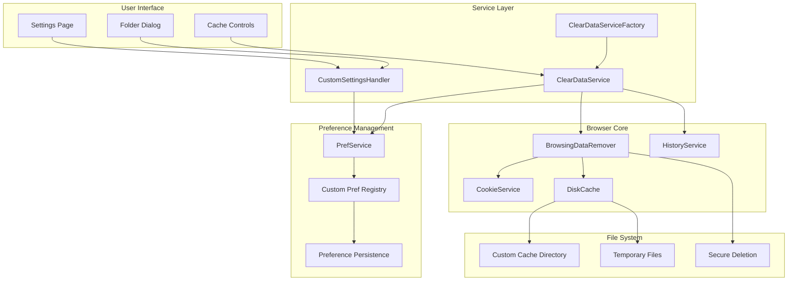
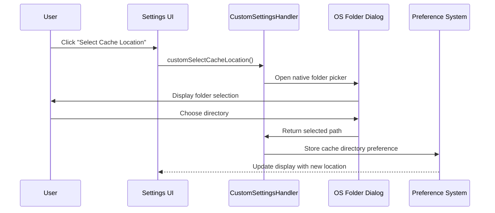
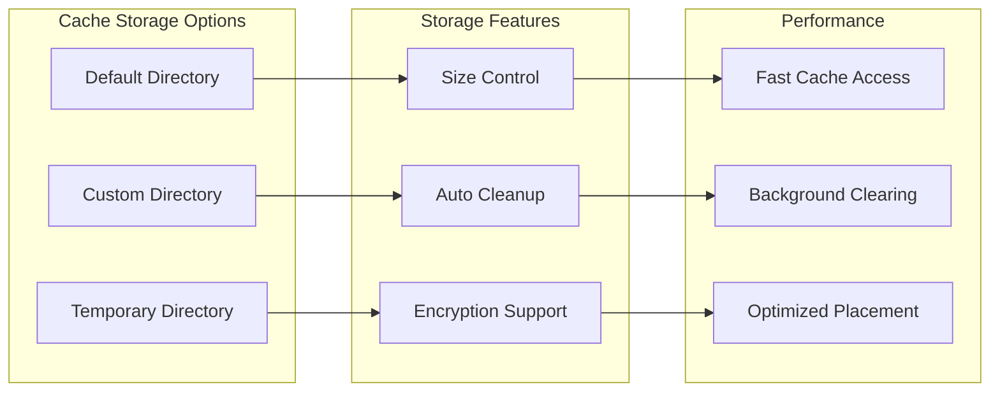
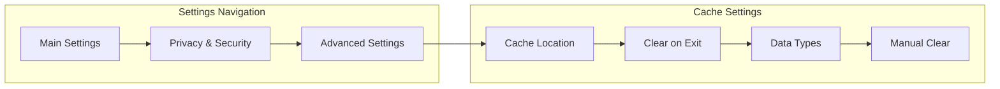
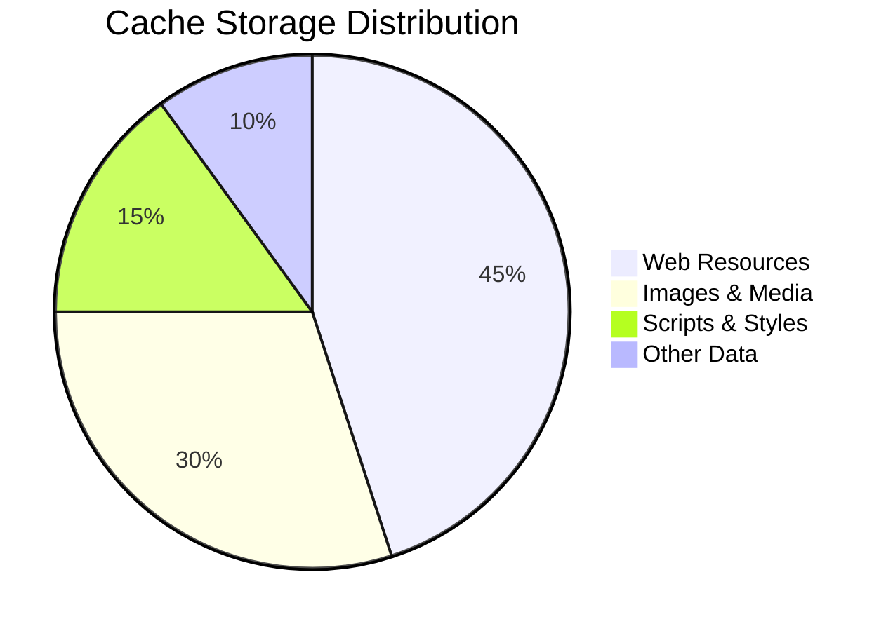
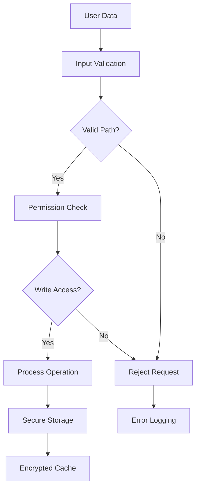
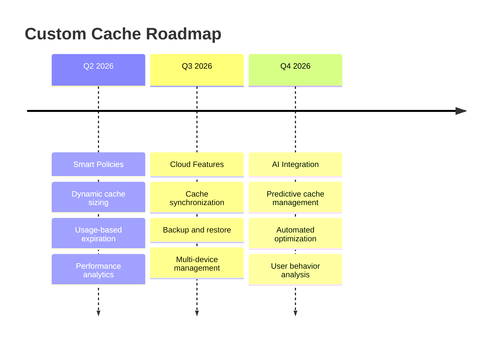

# Custom Cache Management System

## Overview

The **Custom Cache Management System** is a comprehensive browser feature that provides users with advanced control over cache storage and data clearing operations. Unlike standard browser cache management, this system offers custom directory selection, granular data type control, and intelligent clearing policies that enhance both performance and privacy.

## Key Benefits

### For Users
- **Custom Storage Locations**: Choose where browser cache is stored on your system
- **Granular Data Control**: Select exactly what data to clear (cache, cookies, history, etc.)
- **Exit-Based Clearing**: Automatically clear selected data when closing the browser
- **One-Click Cleanup**: Instantly clear browsing data with customizable presets
- **Privacy Protection**: Secure data deletion with multiple overwrite passes

### For Developers
- **Service-Based Architecture**: Clean separation of concerns with dedicated services
- **Observer Pattern**: Real-time status updates for clearing operations
- **Chromium Integration**: Seamless integration with existing browser cache systems
- **Preference System**: Comprehensive settings persistence and management
- **Enterprise Support**: Policy-based configuration for organizational deployment

## System Architecture



## Core Features

### 1. Custom Cache Directory Selection

Users can choose custom locations for browser cache storage, providing flexibility for:
- **Storage Management**: Direct cache to drives with more space
- **Performance Optimization**: Use faster storage devices for cache
- **Organization**: Keep browser data in specific organizational structures
- **Privacy**: Store cache in encrypted or secure volumes



### 2. Intelligent Data Clearing Service

The system provides sophisticated data clearing capabilities with fine-grained control:

#### Supported Data Types
- **Browser Cache**: Temporary web files and resources
- **Cookies & Site Data**: Login sessions and website preferences
- **Browsing History**: Visited pages and navigation history
- **Download History**: Record of downloaded files
- **Saved Passwords**: Stored login credentials
- **Form Data**: Auto-fill information
- **Content Licenses**: Digital rights management data

#### Clearing Policies
- **Manual Clearing**: User-initiated cleanup operations
- **Exit-Based Clearing**: Automatic cleanup when browser closes
- **Selective Clearing**: Individual control over each data type
- **Scheduled Clearing**: Time-based automatic cleanup (future feature)

### 3. Advanced Storage Management



## Technical Implementation

### Service Architecture

#### ClearDataService
The core service that manages all cache clearing operations:

```cpp
class ClearDataService : public KeyedService,
                         public content::BrowsingDataRemover::Observer {
public:
  // Main clearing operation
  bool ClearBrowsingData(const base::OnceCallback<void()>& callback);
  
  // Individual data type checks
  bool IsCache() const;
  bool IsCookies() const;
  bool IsBrowsingHistory() const;
  bool IsDownloadHistory() const;
  
  // Operation status
  bool IsRemoving();
  bool IsRemoved();
  
  // Observer callbacks
  void OnBrowsingDataRemoverDone(uint64_t failed_data_types) override;
};
```

#### CustomSettingsHandler
Manages the WebUI interface for cache settings:

```cpp
class CustomSettingsHandler : public SettingsPageUIHandler,
                             public ui::SelectFileDialog::Listener {
public:
  // Handle cache location selection
  void HandleSelectCacheLocation(const base::Value::List& args);
  
  // File selection callback
  void FileSelected(const ui::SelectedFileInfo& file, int index) override;
};
```

### Data Flow Architecture

The cache management system follows a clear data flow pattern:

1. **User Interaction**: User initiates action through settings UI
2. **Handler Processing**: CustomSettingsHandler processes UI requests
3. **Service Execution**: ClearDataService executes cache operations
4. **Browser Integration**: System integrates with Chromium's BrowsingDataRemover
5. **Status Feedback**: Observer pattern provides real-time status updates

### Preference System

Comprehensive preference management for all cache-related settings:

| Preference | Type | Purpose |
|------------|------|---------|
| `custom.disk_cache_dir` | String | Custom cache directory path |
| `browser.enable_disk_cache` | Boolean | Enable/disable disk caching |
| `browser.clear_data.on_exit` | Boolean | Clear data when browser exits |
| `browser.clear_data.cache` | Boolean | Include cache in clearing |
| `browser.clear_data.cookies` | Boolean | Include cookies in clearing |
| `browser.clear_data.browsing_history` | Boolean | Include history in clearing |
| `browser.clear_data.download_history` | Boolean | Include download history |
| `browser.clear_data.passwords` | Boolean | Include saved passwords |
| `browser.clear_data.form_data` | Boolean | Include form data |

## User Experience

### Settings Integration

The custom cache feature integrates seamlessly with the browser's settings system:



### User Workflows

#### Basic Cache Location Setup
1. Open browser settings
2. Navigate to Advanced → Privacy & Security
3. Click "Select Cache Location"
4. Choose desired directory in folder dialog
5. Settings automatically save and apply

#### Configuring Exit-Based Clearing
1. Access cache settings section
2. Enable "Clear data on exit"
3. Select specific data types to clear:
   - Browser cache
   - Cookies and site data
   - Browsing history
   - Download history
   - Saved passwords
   - Form data
4. Save preferences

#### Manual Data Clearing
1. Access "Clear browsing data" option
2. Choose data types to clear
3. Select time range (if applicable)
4. Confirm clearing operation
5. Monitor progress through status indicators

## Performance Benefits

### 1. Storage Optimization



**Benefits:**
- **Custom Location**: Store cache on faster drives for improved performance
- **Size Management**: Automatically manage cache size to prevent disk space issues
- **Smart Cleanup**: Remove unused cache entries to maintain optimal performance

### 2. Memory Efficiency

- **Background Operations**: Cache clearing runs in background without blocking UI
- **Lazy Loading**: Services created only when needed to save memory
- **Efficient Patterns**: Use of weak pointers and RAII for automatic resource management

### 3. Network Performance

- **Intelligent Caching**: Smart cache retention policies reduce unnecessary network requests
- **Selective Clearing**: Clear only necessary data to maintain useful cache entries
- **Optimal Placement**: Custom cache locations on fast storage improve access times

## Security and Privacy

### Data Protection Measures



### Privacy Features

1. **Secure Deletion**: Multiple-pass overwriting of sensitive cache files
2. **Permission Validation**: Strict checking of file system access permissions  
3. **Process Isolation**: Cache operations isolated from main browser process
4. **Audit Logging**: Comprehensive logging of all cache management operations

### Enterprise Security

- **Policy Enforcement**: Group policy support for organizational cache management
- **Compliance**: Support for data retention and deletion policies
- **Monitoring**: Detailed audit trails for security compliance

## Advanced Configuration

### Enterprise Deployment

For organizational environments, the custom cache system supports policy-based configuration:

```json
{
  "CustomCachePolicy": {
    "DefaultCacheDirectory": "\\\\server\\cache\\{username}",
    "AllowCustomLocation": false,
    "MaxCacheSize": "2GB",
    "ClearOnExit": {
      "Enabled": true,
      "DataTypes": ["cache", "cookies", "browsing_history"]
    },
    "ScheduledCleaning": {
      "Enabled": true,
      "Frequency": "weekly",
      "RetentionDays": 30
    }
  }
}
```

### Developer Configuration

Build-time configuration options for customizing cache behavior:

```gn
# Enable custom cache feature
enable_custom_cache = true

# Maximum cache size (in MB)
default_cache_size_mb = 1024

# Enable enterprise policy support
enable_cache_policies = true

# Debug logging for cache operations
enable_cache_debug_logging = false
```

## Troubleshooting

### Common Issues

| Problem | Symptoms | Solution |
|---------|----------|----------|
| **Cache directory inaccessible** | Error messages in settings UI | Verify folder permissions, select different directory |
| **Clearing operation hangs** | UI becomes unresponsive during clearing | Check available disk space, restart browser if needed |
| **Settings not saving** | Preferences reset after browser restart | Check profile directory write permissions |
| **Partial data clearing** | Some data remains after clearing operation | Verify individual data type preferences are enabled |
| **Performance degradation** | Slow browser response during cache operations | Monitor system resources, consider smaller cache sizes |

### Debug Information

Enable detailed logging for cache operations:

**Command Line Flags:**
```bash
--enable-logging --v=2 --vmodule=clear_data_service=3
```

**Log Analysis:**
```
[INFO] ClearDataService: Cache clearing initiated
[DEBUG] CustomSettingsHandler: Cache directory selected: C:\CustomCache
[VERBOSE] BrowsingDataRemover: Clearing 1024MB of cache data
[INFO] ClearDataService: Operation completed successfully
```

## Best Practices

### For Users

1. **Choose Appropriate Cache Location**
   - Use fast storage devices (SSD) for better performance
   - Ensure sufficient free space (at least 2GB recommended)
   - Avoid system directories or network drives

2. **Configure Sensible Clearing Policies**
   - Enable cache clearing but preserve useful cookies
   - Consider keeping form data for convenience
   - Clear download history periodically for privacy

3. **Monitor Cache Usage**
   - Regularly check cache directory size
   - Adjust settings if performance degradation occurs
   - Use manual clearing for immediate cleanup needs

### For Developers

1. **Service Integration**
   - Use factory pattern for service creation
   - Implement proper observer notifications
   - Handle errors gracefully with fallback options

2. **Performance Optimization**
   - Use background threads for cache operations
   - Implement efficient file system operations
   - Cache frequently accessed preferences

3. **Security Considerations**
   - Validate all user input paths
   - Use secure deletion for sensitive data
   - Implement proper permission checking

## Future Enhancements

### Planned Features



### Advanced Capabilities

1. **Machine Learning Integration**
   - Predictive cache cleaning based on usage patterns
   - Intelligent cache size management
   - Automated performance optimization

2. **Cloud Synchronization**
   - Encrypted cache backup to cloud storage
   - Cross-device cache synchronization
   - Remote cache management

3. **Enhanced Analytics**
   - Real-time cache usage monitoring
   - Performance impact analysis
   - Storage efficiency reporting

## Conclusion

The Custom Cache Management System provides a comprehensive solution for advanced browser cache control, offering users unprecedented flexibility in managing their browsing data while maintaining optimal performance and security. 

Through its modular architecture, intelligent clearing policies, and seamless integration with browser settings, this feature enhances both individual user control and enterprise deployment capabilities. The system's focus on security, privacy, and performance optimization makes it an essential component of the modern browser experience.

Whether used for personal privacy management, performance optimization, or enterprise compliance, the custom cache feature provides the tools and flexibility needed for advanced browser data management.

---

*For implementation details, see the [Custom Cache Feature Technical Documentation](../../../docs/features/custom-cache-feature.md)*