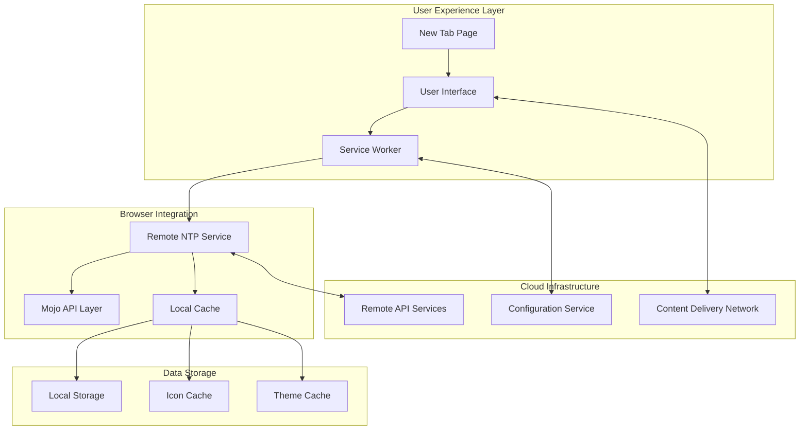
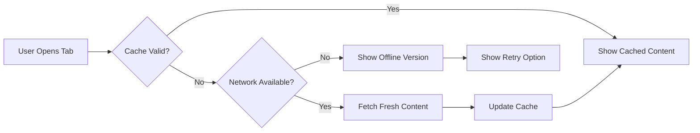
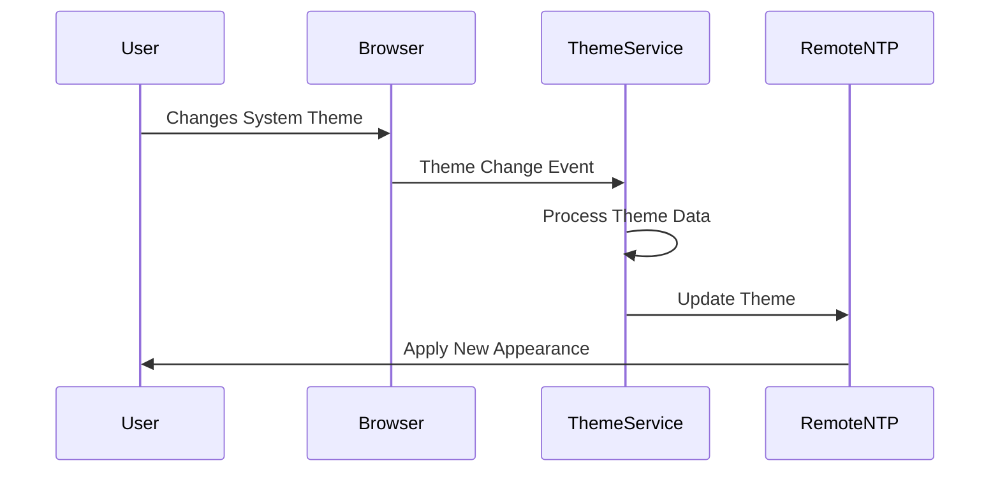
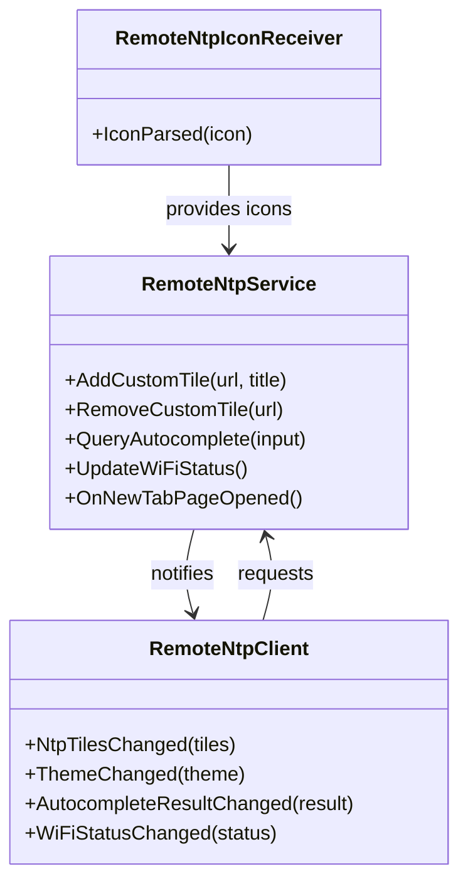
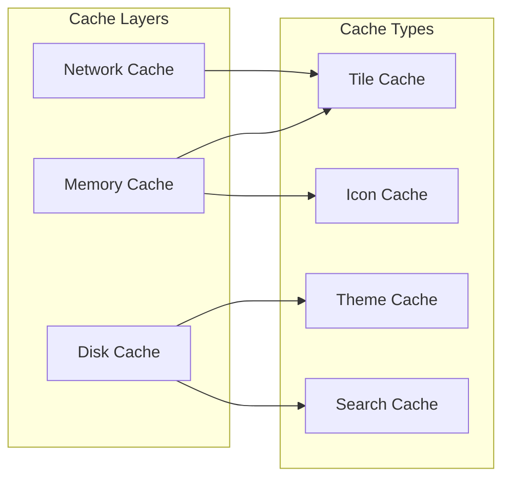
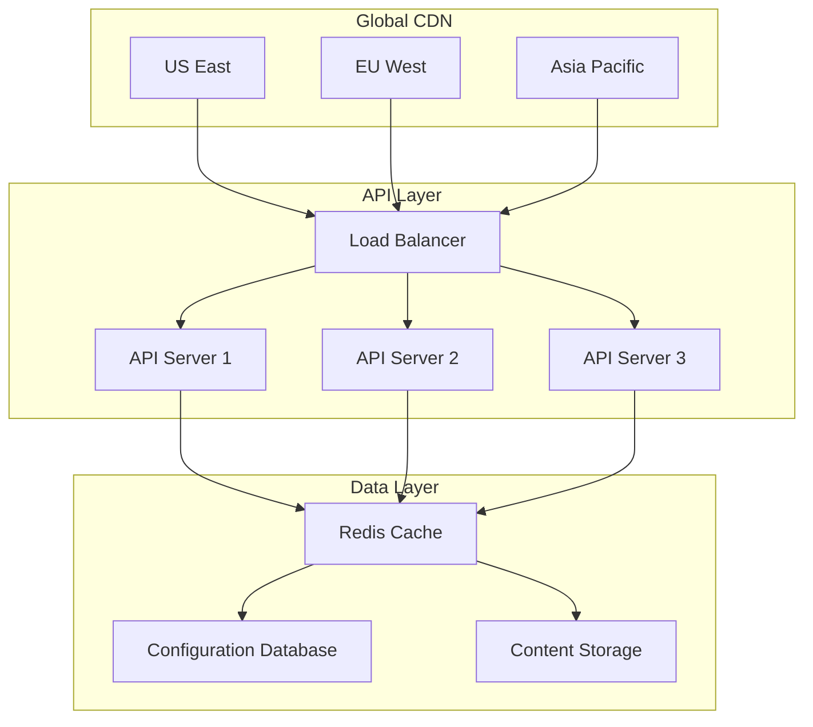

# Remote New Tab Page (NTP) System

## Overview

The **Remote New Tab Page (NTP)** is a revolutionary approach to browser start pages that combines the flexibility of cloud-hosted content with the reliability of local caching and offline functionality. Unlike traditional static new tab pages, this system provides dynamic, personalized content while maintaining excellent performance and user experience.

## Key Benefits

### For Users
- **Personalized Experience**: Dynamic content tailored to your preferences
- **Always Available**: Robust offline support ensures functionality without internet
- **Fast Loading**: Intelligent caching provides near-instant page loads
- **Customizable**: Rich customization options for tiles, themes, and layout
- **Network Aware**: Adapts behavior based on connection quality

### For Developers
- **Scalable Architecture**: Cloud-hosted content with CDN distribution
- **Modern APIs**: Clean Mojo interfaces for browser integration
- **Progressive Enhancement**: Works great offline, better online
- **Extensible Design**: Easy to add new features and content types
- **Performance Optimized**: Minimal impact on browser startup time

## System Architecture



## Core Features

### 1. Dynamic Content Delivery

The Remote NTP fetches fresh content from cloud servers, providing:
- **Latest News & Updates**: Real-time information delivery
- **Trending Content**: Popular and relevant web destinations
- **Personalized Recommendations**: AI-driven content suggestions
- **Regional Customization**: Location-appropriate content

### 2. Intelligent Caching



### 3. Advanced Icon Management

- **Multi-Source Icons**: Supports favicon, touch icons, and fluid icons
- **Automatic Optimization**: Icons are resized and compressed optimally
- **Fallback Icons**: Generates icons when none are available
- **Smart Caching**: Efficient storage with automatic cleanup

### 4. Theme Synchronization



### 5. Network Awareness

The system intelligently adapts to network conditions:
- **WiFi Quality Monitoring**: Tracks signal strength and speed
- **Adaptive Loading**: Adjusts content quality based on connection
- **Bandwidth Optimization**: Reduces data usage on slow connections
- **Offline Graceful Degradation**: Seamless transition to offline mode

## User Customization Features

### Custom Tiles

Users can create personalized shortcuts with:
- **Custom URLs**: Add any website as a quick-access tile
- **Custom Titles**: Rename tiles for better organization
- **Icon Customization**: Use custom icons or auto-generated ones
- **Drag & Drop Reordering**: Organize tiles by preference

### Theme Options

- **Dark/Light Mode**: Automatic system theme following
- **Custom Backgrounds**: Upload personal images
- **Color Schemes**: Predefined and custom color palettes
- **Layout Options**: Grid size and spacing customization

### Search Integration

- **Unified Search Box**: Google, Bing, or custom search engines
- **Autocomplete**: Fast suggestions as you type
- **Search History**: Recent searches for quick access
- **Voice Search**: Speech-to-text search capabilities

## Technical Implementation

### Browser Integration

The Remote NTP integrates deeply with the Custom Browser through:

1. **Service Registration**: Factory pattern for service lifecycle management
2. **Profile Integration**: User-specific settings and preferences
3. **WebUI Framework**: Native Chrome WebUI integration
4. **Mojo IPC**: High-performance cross-process communication

### API Interfaces



### Data Flow

1. **Initialization**: Service starts with profile and loads cached data
2. **Content Fetch**: Asynchronous update from remote services
3. **UI Update**: Browser pushes updates to open NTP tabs
4. **User Interaction**: Mojo API handles user actions
5. **State Persistence**: Changes saved to local storage

## Performance Characteristics

### Startup Performance

- **Cold Start**: ~200ms from browser launch to usable NTP
- **Warm Start**: ~50ms with valid cache
- **Memory Usage**: <10MB additional RAM usage
- **Network Impact**: Minimal during startup, background updates only

### Caching Strategy



## Security & Privacy

### Security Measures

- **Content Security Policy**: Strict CSP headers prevent XSS
- **HTTPS Only**: All remote content served over secure connections
- **Input Validation**: All user inputs validated and sanitized
- **Process Isolation**: Renderer process sandboxing
- **API Allowlisting**: Only approved external APIs accessible

### Privacy Protection

- **Local Processing**: Sensitive data processed locally when possible
- **Minimal Data Collection**: Only necessary usage metrics collected
- **User Consent**: Clear opt-in for data sharing features
- **Data Encryption**: All stored data encrypted at rest
- **Regular Audits**: Security and privacy reviews

## Deployment & Operations

### Cloud Infrastructure



### Configuration Management

- **Feature Flags**: A/B testing and gradual rollouts
- **Regional Settings**: Location-specific configurations
- **User Segments**: Different experiences for user groups
- **Emergency Controls**: Quick disable switches for issues

## Development Workflow

### Adding New Features

1. **Design Phase**: Create feature specification and UI mockups
2. **API Design**: Define Mojo interfaces for browser communication
3. **Backend Development**: Implement cloud services and APIs
4. **Frontend Development**: Build web UI components
5. **Integration**: Connect browser service with web interface
6. **Testing**: Comprehensive testing including offline scenarios

### Code Organization

```
Remote NTP Codebase Structure:
├── Browser Service Layer
│   ├── src/custom/browser/ntp/
│   └── Service implementation and factories
├── Common Interfaces
│   ├── src/custom/common/ntp/
│   └── Mojo definitions and shared types
├── Web Frontend
│   ├── Remote hosted web application
│   └── Service worker and offline resources
└── Cloud Backend
    ├── Content management system
    ├── Configuration APIs
    └── Analytics and monitoring
```

## Troubleshooting & Support

### Common Issues

| Problem | Symptoms | Solution |
|---------|----------|----------|
| **Blank NTP** | White page on new tab | Clear browser cache, check network |
| **Outdated Content** | Stale tiles and themes | Force refresh, verify API connectivity |
| **Missing Icons** | Default icons everywhere | Clear icon cache, check site permissions |
| **Slow Loading** | Long load times | Check network speed, disable extensions |
| **Theme Issues** | Wrong colors/appearance | Reset theme settings, update browser |

### Debug Information

Enable verbose logging by:
1. Open Chrome with `--enable-logging --v=1`
2. Check `chrome://net-internals/#events`
3. Monitor Network tab in Developer Tools
4. Check Service Worker status in Application tab

### Getting Help

- **Documentation**: Comprehensive guides in `/docs/features/`
- **Issue Tracker**: Report bugs and feature requests
- **Community Forums**: Ask questions and share solutions
- **Developer Support**: Direct support for integration issues

## Future Roadmap

### Planned Enhancements

- **AI-Powered Personalization**: Machine learning content recommendations
- **Enhanced Offline Mode**: Richer offline experiences
- **Widget System**: Embeddable widgets for weather, news, etc.
- **Multi-Profile Support**: Different NTP configurations per profile
- **Advanced Analytics**: Detailed usage insights and optimization

### Experimental Features

- **Voice Commands**: Voice-controlled NTP navigation
- **AR Integration**: Augmented reality web previews
- **Social Features**: Shared bookmarks and recommendations
- **IoT Integration**: Smart home device controls

## Conclusion

The Remote NTP system represents a significant advancement in browser start page technology, providing users with a rich, personalized, and reliable experience while offering developers a flexible and scalable platform for content delivery and user engagement.

By combining the best of cloud technology with robust offline functionality, the Remote NTP ensures that users always have access to their personalized browsing starting point, regardless of network conditions or device capabilities.

---

*For technical implementation details, see the [Remote NTP Implementation Documentation](../../../docs/features/remote-ntp-documentation.md)*