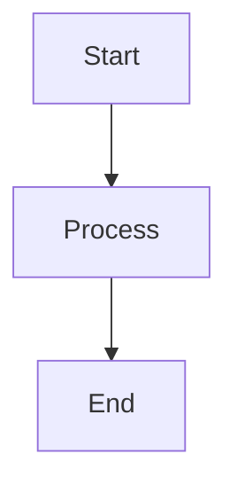
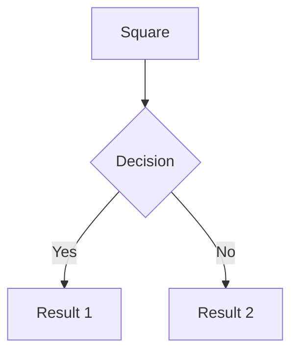
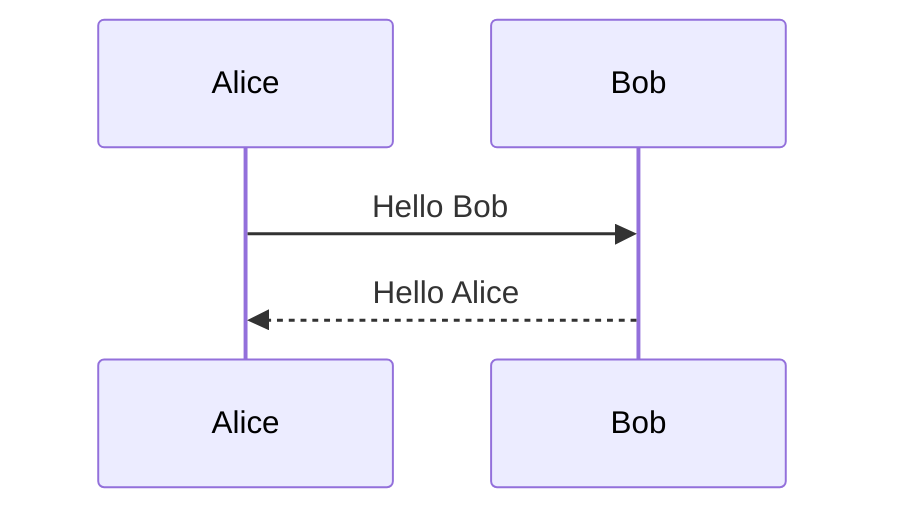
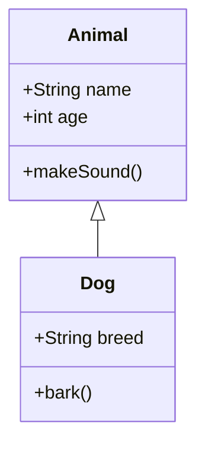
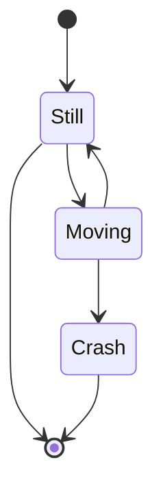
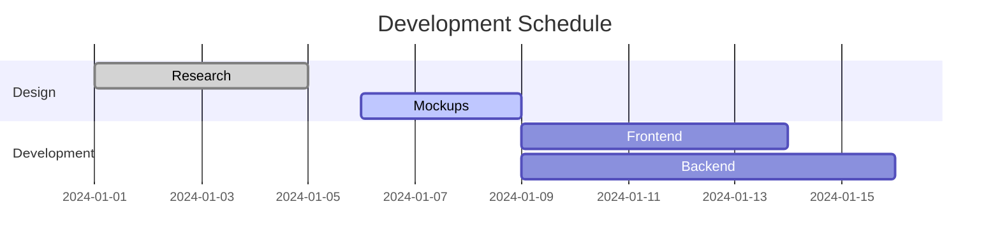
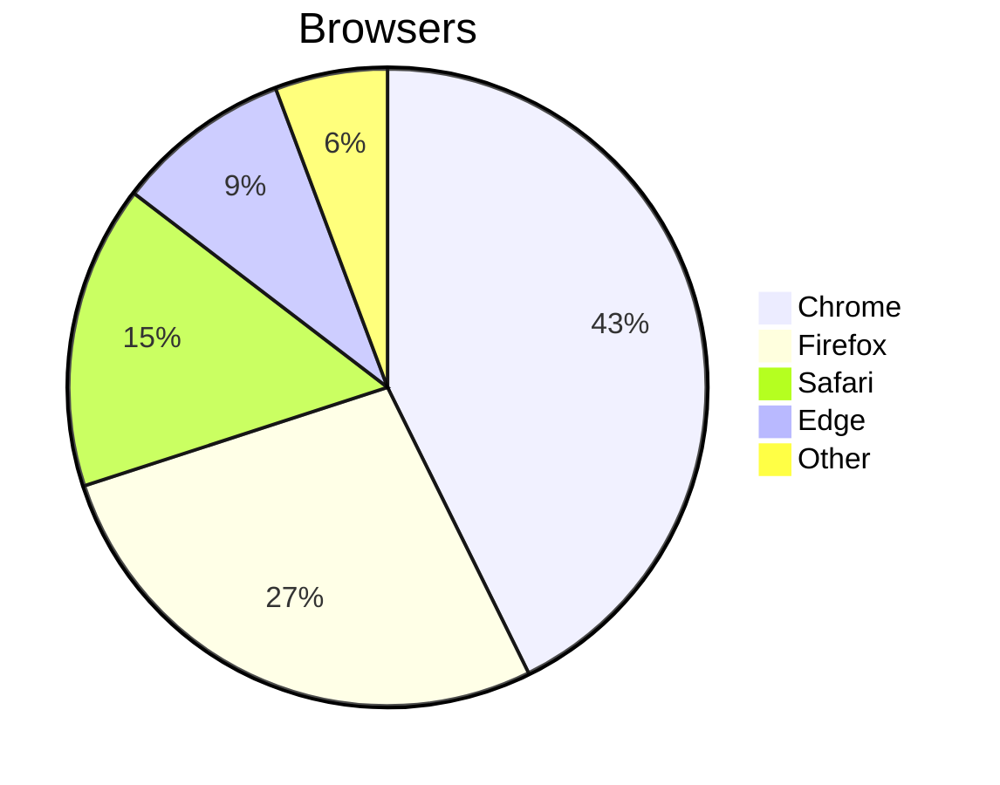
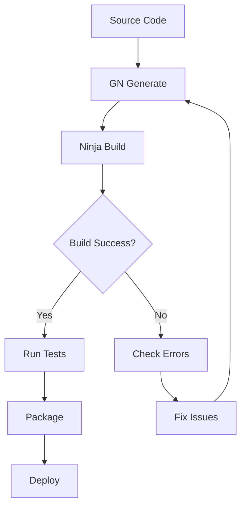
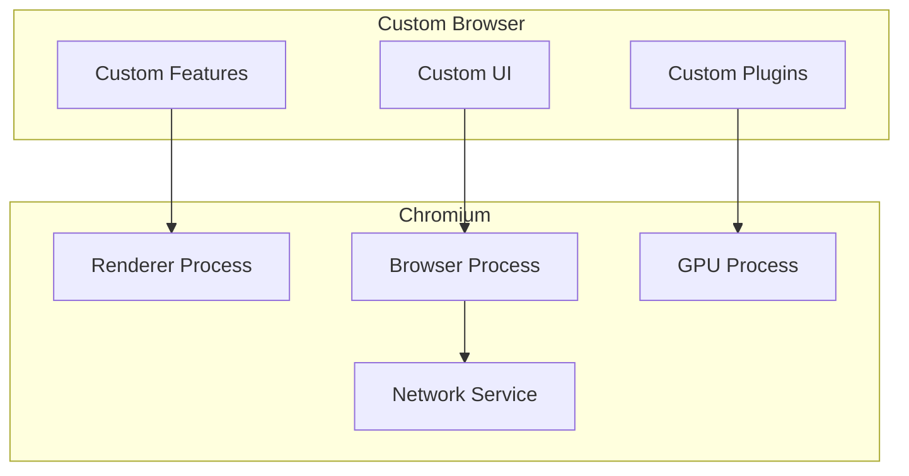

# Using Mermaid Diagrams

The Wanderlust Knowledge Base now supports [Mermaid](https://mermaid.js.org/) diagrams, allowing you to create beautiful, interactive diagrams directly in your markdown content.

## Quick Start

To add a Mermaid diagram to any markdown file, use a code block with the `mermaid` language identifier:

````markdown

````

## Supported Diagram Types

### 1. Flowcharts
Create process flows, decision trees, and workflow diagrams:

````markdown

````

### 2. Sequence Diagrams
Visualize interactions between different actors:

````markdown

````

### 3. Class Diagrams
Document software architecture and relationships:

````markdown

````

### 4. State Diagrams
Show states and transitions in systems:

````markdown

````

### 5. Gantt Charts
Project timelines and schedules:

````markdown

````

### 6. Pie Charts
Show data distributions:

````markdown

````

## Features

### Theme Support
Diagrams automatically adapt to the current theme (light/dark mode) of the knowledge base.

### Error Handling
If a diagram has syntax errors, an error message will be displayed with the option to view the source code for debugging.

### Responsive Design
All diagrams are responsive and will scale appropriately on different screen sizes.

### Copy Support
While you can't copy diagrams directly, you can view the source code and copy it for reuse.

## Best Practices

### 1. Keep It Simple
- Start with simple diagrams and add complexity gradually
- Use clear, descriptive labels
- Avoid overcrowding diagrams

### 2. Consistent Naming
- Use consistent naming conventions for nodes and connections
- Use meaningful IDs and labels

### 3. Documentation
- Add titles to complex diagrams
- Include explanatory text before or after diagrams
- Use comments in Mermaid code when useful

### 4. Performance
- Large, complex diagrams may take longer to render
- Consider breaking very complex diagrams into smaller parts

## Examples in Practice

### Chromium Build Process


### Browser Component Architecture


## Troubleshooting

### Common Issues

1. **Diagram not rendering**: Check your Mermaid syntax using the [Mermaid Live Editor](https://mermaid.live/)
2. **Styling issues**: The theme is automatically applied; manual styling may conflict
3. **Performance**: Very large diagrams may be slow to render

### Getting Help

- Visit the [Mermaid documentation](https://mermaid.js.org/intro/)
- Use the [Mermaid Live Editor](https://mermaid.live/) to test syntax
- Check the browser console for error messages

## Version Information

- Mermaid version: 11.4.0
- Supported in: All modern browsers
- Theme support: Automatic light/dark mode detection