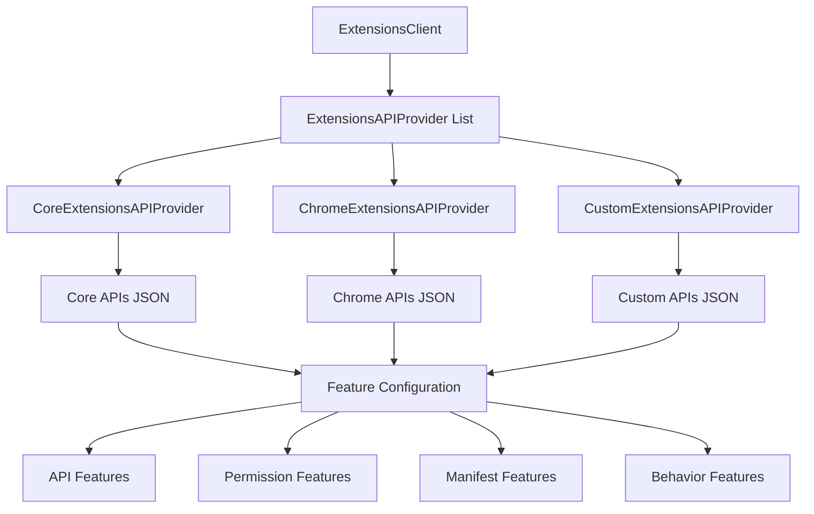

# Chromium Extension API System Architecture

This document provides a comprehensive technical overview of how Chromium's extension API system is initialized and structured, including the architecture required for custom shell implementations to provide their own extension APIs.

## Overview

Chromium provides sophisticated infrastructure to extend the JavaScript API available to specific web clients including:
- **Chrome Extensions**: Third-party browser extensions
- **Privileged Websites**: Certain allowlisted websites with extended permissions  
- **Internal Resources**: Chrome internal pages (chrome:// protocol)
- **Custom Shell Implementations**: Alternative browser implementations with their own API extensions

The extension API system operates across both the **render process** and **browser process**, with carefully coordinated initialization sequences and well-defined interfaces for extensibility.

## Core Architecture Components

### Extension API Provider Architecture

The extension system is built around a provider pattern that separates API definition from implementation:



### Process-Specific Components

#### Render Process Architecture
```cpp
// Main initialization entry point
class ChromeContentRendererClient {
  void RenderThreadStarted() override {
    // Initialize extension system singletons
    ExtensionsClient::Set(new ChromeExtensionsClient());
    ExtensionsRendererClient::Set(new ChromeExtensionsRendererClient());
  }
};

// API provider management
class ExtensionsClient {
  void AddAPIProvider(std::unique_ptr<ExtensionsAPIProvider> provider) {
    api_providers_.push_back(std::move(provider));
  }
  
  FeatureProvider* CreateFeatureProvider(const std::string& name) {
    // Called with: "api", "permission", "manifest", "behavior"
    for (auto& provider : api_providers_) {
      provider->RegisterFeatures(name, &features);
    }
  }
};
```

#### Browser Process Architecture
```cpp
// Browser-side extension management
class ExtensionsBrowserClient {
  void RegisterExtensionFunctions(ExtensionFunctionRegistry* registry) {
    for (auto& provider : api_providers_) {
      provider->RegisterExtensionFunctions(registry);
    }
  }
};

// API function registration
class ExtensionsBrowserAPIProvider {
  void RegisterExtensionFunctions(ExtensionFunctionRegistry* registry) {
    // Links API definitions to native implementation functions
    GeneratedFunctionRegistry::RegisterAll(registry);
  }
};
```

## Render Process Initialization

### ExtensionsClient Setup

The `ExtensionsClient` singleton manages API providers and feature configuration:

```cpp
class ChromeExtensionsClient : public ExtensionsClient {
  ChromeExtensionsClient() {
    // Register core and Chrome-specific API providers
    AddAPIProvider(std::make_unique<CoreExtensionsAPIProvider>());
    AddAPIProvider(std::make_unique<ChromeExtensionsAPIProvider>());
  }
};
```

### API Provider Responsibilities

Each `ExtensionsAPIProvider` serves as a proxy to JSON configuration files:

#### Feature Configuration Files
- **`_api_features.json`**: Defines which contexts/extensions can access specific APIs
- **`_permission_features.json`**: Limits extension usage of permission entries
- **`_manifest_features.json`**: Controls manifest entry availability
- **`_behavior_features.json`**: Miscellaneous extension behavior constraints

#### API Schema Files
- **API Definition Files**: JSON/IDL files defining the JavaScript API surface
- **Schema Validation**: Compile-time and runtime API validation
- **Code Generation**: Automatic binding code generation from schemas

### ExtensionsRendererClient and Dispatcher Delegation

```cpp
class ExtensionsRendererClient {
  void RenderThreadStarted() override {
    // Create dispatcher delegate for fine-tuned control
    auto delegate = std::make_unique<ChromeExtensionsDispatcherDelegate>();
    Dispatcher::Set(std::move(delegate));
  }
};

class DispatcherDelegate {
  // Core extension system customization points
  void RegisterNativeHandlers(ModuleSystem* module_system) override;
  void PopulateSourceMap(ResourceBundleSourceMap* source_map) override;
  void InitializeBindingsSystem(ModuleSystem* module_system) override;
  void RequireAdditionalModules(ModuleSystem* module_system) override;
};
```

### Custom Bindings and Module System Integration

The `DispatcherDelegate` provides several customization hooks:

#### Native Handler Registration
```cpp
void ChromeExtensionsDispatcherDelegate::RegisterNativeHandlers(
    ModuleSystem* module_system) {
  module_system->RegisterNativeHandler("chrome.runtime", 
      std::make_unique<RuntimeNativeHandler>(context));
  module_system->RegisterNativeHandler("chrome.tabs",
      std::make_unique<TabsNativeHandler>(context));
  // Additional native handlers...
}
```

#### Source Map Population  
```cpp
void ChromeExtensionsDispatcherDelegate::PopulateSourceMap(
    ResourceBundleSourceMap* source_map) {
  // Inject custom JavaScript bindings
  source_map->RegisterSource("chrome_runtime_binding", 
                             IDR_CHROME_RUNTIME_BINDING_JS);
  source_map->RegisterSource("chrome_tabs_binding",
                             IDR_CHROME_TABS_BINDING_JS);
  // Additional JS binding sources...
}
```

#### Module Requirements
```cpp
void CustomDispatcherDelegate::RequireAdditionalModules(
    ModuleSystem* module_system) {
  // Force-require modules for non-extension contexts
  module_system->Require("chrome.storage");
  module_system->Require("chrome.identity");
  // Useful when APIs need to be available outside extension context
}
```

## Browser Process Architecture

### ExtensionsBrowserClient Interface

The browser process uses `ExtensionsBrowserClient` for extension queries requiring browser context:

```cpp
class ChromeExtensionsBrowserClient : public ExtensionsBrowserClient {
  content::BrowserContext* GetBrowserContext() override;
  bool IsIncognito(content::BrowserContext* context) override; 
  Profile* GetProfile(content::BrowserContext* context) override;
};
```

### API Function Registry

The browser process maintains a registry linking API calls to native implementations:

```cpp
class ExtensionFunction : public UIThreadExtensionFunction {
 protected:
  ExtensionFunction::ResponseAction Run() override {
    // Implement specific API functionality
    return RespondNow(ArgumentList(CreateResponse()));
  }
};

// Example API implementation
class ChromeTabsQueryFunction : public ExtensionFunction {
  ExtensionFunction::ResponseAction Run() override {
    // Parse parameters from API call
    auto params = chrome::tabs::Query::Params::Create(*args_);
    
    // Execute browser-side logic
    TabStripModel* tab_strip = GetTabStripModel();
    std::vector<chrome::tabs::Tab> result_tabs;
    
    for (int i = 0; i < tab_strip->count(); ++i) {
      if (MatchesQuery(tab_strip->GetWebContentsAt(i), params->query_info)) {
        result_tabs.push_back(CreateTabObject(tab_strip->GetWebContentsAt(i)));
      }
    }
    
    return RespondNow(ArgumentList(chrome::tabs::Query::Results::Create(result_tabs)));
  }
};
```

### Function Registration Process

```cpp
void ChromeExtensionsBrowserAPIProvider::RegisterExtensionFunctions(
    ExtensionFunctionRegistry* registry) {
  // Register all generated function mappings
  GeneratedFunctionRegistry::RegisterAll(registry);
  
  // Manual registration for custom functions
  registry->RegisterFunction<ChromeTabsQueryFunction>();
  registry->RegisterFunction<ChromeRuntimeSendMessageFunction>();
  // Additional function registrations...
}
```

## JSON Configuration and Code Generation

### API Feature Definition Example

```json
// _api_features.json
{
  "chrome.tabs": {
    "contexts": ["blessed_extension"],
    "dependencies": ["permission:tabs"],
    "platforms": ["chromeos", "linux", "mac", "win"]
  },
  "chrome.storage": {
    "contexts": ["blessed_extension", "webui"],
    "dependencies": ["permission:storage"]
  },
  "chrome.runtime.sendMessage": {
    "contexts": ["blessed_extension", "content_script"]
  }
}
```

### API Schema Definition Example

```json
// chrome_tabs.json
[
  {
    "namespace": "tabs",
    "description": "Use the chrome.tabs API to interact with the browser's tab system.",
    "types": [
      {
        "id": "Tab",
        "type": "object",
        "properties": {
          "id": {"type": "integer", "minimum": 0},
          "url": {"type": "string"},
          "title": {"type": "string"},
          "active": {"type": "boolean"}
        }
      }
    ],
    "functions": [
      {
        "name": "query",
        "type": "function",
        "parameters": [
          {
            "name": "queryInfo",
            "type": "object",
            "properties": {
              "active": {"type": "boolean", "optional": true},
              "url": {"type": "string", "optional": true}
            }
          }
        ],
        "returns_async": {
          "name": "callback",
          "parameters": [
            {"name": "result", "type": "array", "items": {"$ref": "Tab"}}
          ]
        }
      }
    ]
  }
]
```

### Build System Integration

```gn
# BUILD.gn file for API code generation
chrome_extensions_api_schema_sources = [
  "chrome_tabs.json",
  "chrome_storage.json", 
  "chrome_runtime.json",
]

chrome_extensions_api_uncompiled_sources = [
  "_api_features.json",
  "_permission_features.json", 
  "_manifest_features.json",
]

generated_extensions_api("chrome_extensions_api") {
  sources = chrome_extensions_api_schema_sources
  uncompiled_sources = chrome_extensions_api_uncompiled_sources
  
  # Generate C++ binding code
  generate_cpp = true
  
  # Generate JavaScript binding code  
  generate_js = true
  
  # Register with resource system
  register_resources = true
}
```

## Custom Shell Implementation Guide

### Complete Implementation Checklist

To implement custom extension APIs in a Chromium-based shell:

#### 1. Define API Schema and Features
```bash
# Create API definition files
custom_shell/
├── api/
│   ├── custom_api.json          # API schema definition
│   ├── _api_features.json       # Feature requirements
│   ├── _permission_features.json # Permission constraints  
│   ├── _manifest_features.json   # Manifest validation
│   └── BUILD.gn                 # Build configuration
```

#### 2. Implement API Providers
```cpp
// custom_extensions_api_provider.h
class CustomExtensionsAPIProvider : public ExtensionsAPIProvider {
 public:
  void AddAPIFeatures(FeatureProvider::Features* features) override;
  void AddPermissionFeatures(FeatureProvider::Features* features) override;
  void AddManifestFeatures(FeatureProvider::Features* features) override;
  
  bool IsAPISchemaGenerated(const std::string& name) override;
  base::StringPiece GetAPISchema(const std::string& name) override;
};

// custom_extensions_browser_api_provider.h  
class CustomExtensionsBrowserAPIProvider : public ExtensionsBrowserAPIProvider {
 public:
  void RegisterExtensionFunctions(ExtensionFunctionRegistry* registry) override;
};
```

#### 3. Implement Client Classes
```cpp
// custom_extensions_client.h
class CustomExtensionsClient : public ExtensionsClient {
 public:
  CustomExtensionsClient() {
    AddAPIProvider(std::make_unique<CoreExtensionsAPIProvider>());
    AddAPIProvider(std::make_unique<CustomExtensionsAPIProvider>());
  }
};

// custom_extensions_browser_client.h
class CustomExtensionsBrowserClient : public ExtensionsBrowserClient {
 public:
  CustomExtensionsBrowserClient() {
    AddAPIProvider(std::make_unique<CoreExtensionsBrowserAPIProvider>());
    AddAPIProvider(std::make_unique<CustomExtensionsBrowserAPIProvider>());
  }
  
  // Implement browser context methods
  content::BrowserContext* GetBrowserContext() override;
  // Additional browser-specific methods...
};
```

#### 4. Implement Dispatcher Delegate
```cpp
// custom_extensions_dispatcher_delegate.h
class CustomExtensionsDispatcherDelegate : public DispatcherDelegate {
 public:
  void RegisterNativeHandlers(ModuleSystem* module_system) override;
  void PopulateSourceMap(ResourceBundleSourceMap* source_map) override;
  void InitializeBindingsSystem(ModuleSystem* module_system) override;
  void RequireAdditionalModules(ModuleSystem* module_system) override;
};
```

#### 5. Implement Extension Functions  
```cpp
// custom_api_functions.h
class CustomStorageGetFunction : public UIThreadExtensionFunction {
  DECLARE_EXTENSION_FUNCTION("customShell.storage.get", CUSTOMSHELL_STORAGE_GET)
  
 protected:
  ExtensionFunction::ResponseAction Run() override {
    auto params = custom_shell::storage::Get::Params::Create(*args_);
    
    // Implement custom storage logic
    base::Value result = GetStorageValue(params->key);
    
    return RespondNow(ArgumentList(
        custom_shell::storage::Get::Results::Create(result)));
  }
};
```

#### 6. Wire Up in Shell Initialization
```cpp
// custom_content_client.cc
void CustomContentRendererClient::RenderThreadStarted() {
  ExtensionsClient::Set(new CustomExtensionsClient());
  ExtensionsRendererClient::Set(new CustomExtensionsRendererClient());
}

void CustomContentBrowserClient::BrowserStart() {
  ExtensionsBrowserClient::Set(new CustomExtensionsBrowserClient());
}
```

#### 7. Resource Integration
```xml
<!-- custom_shell_resources.grd -->
<grit-part>
  <include name="IDR_CUSTOM_API_FEATURES" 
           file="api/_api_features.json" 
           type="BINDATA" />
  <include name="IDR_CUSTOM_PERMISSION_FEATURES"
           file="api/_permission_features.json"
           type="BINDATA" />
  <!-- Additional resource includes... -->
</grit-part>
```

### Web-Available Features

For APIs intended for webpage contexts (not just extensions), add to the web-available features list:

```cpp
// extension_bindings_system.cc
const char* kWebAvailableFeatures[] = {
  "chrome.runtime.sendMessage",
  "customShell.webIntegration",  // Custom web-available API
  // Additional web-available APIs...
};
```

## Advanced Topics

### Module System Integration

The extension system integrates deeply with Chromium's JavaScript module system:

```javascript
// Generated JavaScript binding example
define('chrome.tabs', function() {
  'use strict';
  
  var binding = require('binding').Binding.create('tabs');
  var sendRequest = require('sendRequest').sendRequest;
  
  binding.registerCustomHook(function(api) {
    var tabs = api.compiledApi;
    
    tabs.query = function(queryInfo, callback) {
      sendRequest('tabs.query', [queryInfo], callback);
    };
    
    return api;
  });
  
  return binding.generate();
});
```

### Security and Sandboxing Considerations

Extension APIs must carefully validate all inputs and respect security boundaries:

```cpp
class SecureExtensionFunction : public UIThreadExtensionFunction {
 protected:
  ExtensionFunction::ResponseAction Run() override {
    // Validate extension permissions
    if (!extension()->permissions_data()->HasAPIPermission(
           APIPermissionID::kCustomAPI)) {
      return RespondNow(Error("Permission denied"));
    }
    
    // Validate browser context
    if (!GetBrowserContext()) {
      return RespondNow(Error("Invalid context"));
    }
    
    // Validate and sanitize parameters
    auto params = ValidateAndParseParams();
    if (!params) {
      return RespondNow(Error("Invalid parameters"));
    }
    
    return ExecuteSecurely(std::move(params));
  }
};
```

### Performance Considerations

- **Lazy Loading**: APIs should be loaded only when needed
- **Caching**: Feature providers should cache parsed JSON configurations  
- **Async Operations**: Long-running operations must use async patterns
- **Memory Management**: Careful lifetime management of API objects

```cpp
class PerformantAPIProvider : public ExtensionsAPIProvider {
 private:
  mutable base::Optional<FeatureProvider::Features> cached_api_features_;
  
 public:
  void AddAPIFeatures(FeatureProvider::Features* features) override {
    if (!cached_api_features_.has_value()) {
      cached_api_features_ = LoadAndParseAPIFeatures();
    }
    features->insert(cached_api_features_->begin(), 
                     cached_api_features_->end());
  }
};
```

## Testing Extension APIs

### Unit Testing API Functions

```cpp
class CustomAPIFunctionTest : public ExtensionFunctionTest {
 public:
  void SetUp() override {
    ExtensionFunctionTest::SetUp();
    function_ = new CustomStorageGetFunction();
    function_->set_extension(extension());
  }

 protected:
  scoped_refptr<CustomStorageGetFunction> function_;
};

TEST_F(CustomAPIFunctionTest, ValidRequest) {
  auto result = RunFunction(function_.get(), R"([{"key": "testKey"}])");
  ASSERT_TRUE(result);
  
  auto list = result->GetListDeprecated();
  EXPECT_EQ(list.size(), 1u);
  // Additional assertions...
}
```

### Integration Testing

```cpp
class ExtensionAPIIntegrationTest : public ExtensionApiTest {
 public:
  void SetUpInProcessBrowserTestFixture() override {
    ExtensionApiTest::SetUpInProcessBrowserTestFixture();
    // Setup custom extension environment
  }
};

IN_PROC_BROWSER_TEST_F(ExtensionAPIIntegrationTest, CustomAPIWorks) {
  ASSERT_TRUE(RunExtensionTest("custom_api_test")) << message_;
}
```

## Related Documentation

### Core Architecture
- [Process Model](../architecture/process-model.md) - Multi-process architecture fundamentals
- [IPC Internals](../architecture/ipc-internals.md) - Inter-process communication patterns
- [Browser Components](../architecture/browser-components.md) - Browser process organization

### APIs & Services  
- [Mojo & Services](../apis/mojo_and_services.md) - Modern IPC and service architecture
- [APIs Overview](../apis/overview.md) - Chromium API design patterns

### Security
- [Security Model](../security/security-model.md) - Chromium security architecture
- [Browser Protocol Schemes](../security/browser-protocol-schemes.md) - Extension URL schemes and CSP

### Development
- [Testing in Chromium](../development/testing/testing_in_chromium.md) - Testing strategies and frameworks

---

*This document provides a comprehensive guide to Chromium's extension API system. For additional implementation examples and updates, refer to the Chromium source code and the original [blog post by Jacobo Aragunde](https://blogs.igalia.com/jaragunde/2019/11/initialization-of-the-chromium-extension-api-system/).*