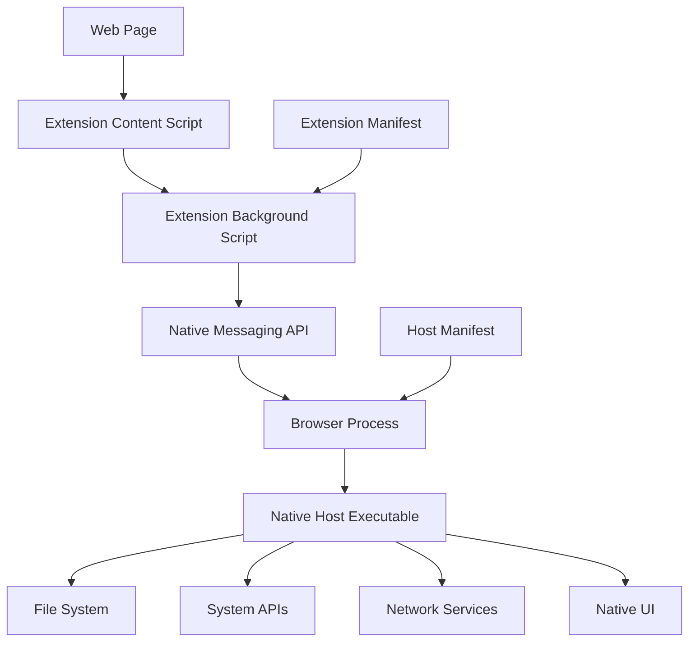

# Native Messaging API: Web-to-App Communication

The Native Messaging API represents one of the most powerful mechanisms for bidirectional communication between Chromium extensions and native applications running outside the browser sandbox. This document provides comprehensive technical coverage of implementing, registering, and securing native messaging hosts for robust web-to-app integration.

## Overview

### What is Native Messaging?

The Native Messaging API enables **Chrome extensions** to exchange messages with **native-code "Host" executables** running with full user privileges outside the browser sandbox. This mechanism provides a secure bridge between sandboxed web content and native system capabilities.

### Key Capabilities

Native Messaging hosts can:
- **Show UI**: Display native dialogs and windows
- **Access File System**: Read/write files with user permissions
- **Make Network Connections**: Bypass browser network restrictions
- **Call Privileged APIs**: Access system-level functionality
- **Integrate with OS Services**: Connect to platform-specific features

### Architecture Overview



### Security Model

The Native Messaging architecture maintains security through:
- **Extension Requirement**: Web pages cannot directly communicate with hosts
- **Manifest Restrictions**: Hosts specify allowed extension origins
- **Permission Gates**: Extensions must declare `nativeMessaging` permission
- **Process Isolation**: Hosts run in separate processes from the browser

## Host Executable Implementation

### Communication Protocol

#### Message Format
Native messaging uses a binary protocol over standard I/O streams:

```
[4-byte length header][UTF-8 JSON message body]
```

#### Protocol Specifications
- **Message Length**: 32-bit unsigned integer in native byte order
- **Message Encoding**: UTF-8 encoded JSON
- **Input Message Limit**: 4GB maximum
- **Output Message Limit**: 1MB maximum
- **Transport**: stdin/stdout streams

#### Example Message Structure
```json
{
  "type": "request",
  "action": "getSystemInfo", 
  "data": {
    "requestId": "req-123",
    "parameters": ["cpu", "memory"]
  }
}
```

### Implementation Guidelines

#### Cross-Platform Host Development

**Recommended Languages:**
- **Go**: Excellent cross-platform support and JSON handling
- **Rust**: Memory safety with strong performance
- **C++**: Maximum performance and system integration
- **Python**: Rapid prototyping and development
- **C#**: Windows-focused development with .NET

#### Critical Implementation Details

**Binary Mode Configuration:**
```cpp
// C/C++ Example - Essential for correct operation
#include <fcntl.h>
#include <io.h>

void ConfigureStreams() {
    // Set streams to binary mode to prevent CR/LF issues
    _setmode(_fileno(stdin), _O_BINARY);
    _setmode(_fileno(stdout), _O_BINARY);
}
```

**Message Reading Implementation:**
```cpp
bool ReadMessage(std::string& message) {
    // Read 4-byte length header
    uint32_t messageLength;
    if (fread(&messageLength, sizeof(messageLength), 1, stdin) != 1) {
        return false;
    }
    
    // Validate message length
    if (messageLength > MAX_MESSAGE_SIZE) {
        return false;
    }
    
    // Read message body
    message.resize(messageLength);
    if (fread(&message[0], 1, messageLength, stdin) != messageLength) {
        return false;
    }
    
    return true;
}
```

**Message Writing Implementation:**
```cpp
bool WriteMessage(const std::string& message) {
    // Write length header
    uint32_t messageLength = static_cast<uint32_t>(message.length());
    if (fwrite(&messageLength, sizeof(messageLength), 1, stdout) != 1) {
        return false;
    }
    
    // Write message body
    if (fwrite(message.c_str(), 1, messageLength, stdout) != messageLength) {
        return false;
    }
    
    // Ensure immediate delivery
    fflush(stdout);
    return true;
}
```

### Host Lifecycle Management

#### Startup Parameters
On Windows, hosts receive two command-line arguments:
1. **Extension Origin**: The chrome-extension:// URL of the calling extension
2. **Browser HWND**: Handle to the browser window (platform-specific)

#### Example Host Main Function:
```cpp
int main(int argc, char* argv[]) {
    if (argc < 3) {
        return 1; // Invalid arguments
    }
    
    std::string extensionOrigin = argv[1];
    std::string browserHandle = argv[2];
    
    // Validate extension origin
    if (!IsAllowedOrigin(extensionOrigin)) {
        return 1;
    }
    
    ConfigureStreams();
    
    // Main message processing loop
    std::string message;
    while (ReadMessage(message)) {
        std::string response = ProcessMessage(message);
        if (!WriteMessage(response)) {
            break;
        }
    }
    
    return 0;
}
```

## Host Registration and Deployment

### Manifest Configuration

#### Host Manifest Structure
```json
{
  "name": "com.example.nativehost",
  "description": "Example Native Messaging Host",
  "path": "/path/to/native/executable",
  "type": "stdio",
  "allowed_origins": [
    "chrome-extension://extensionid1234567890abcdef/",
    "chrome-extension://anotherId987654321fedcba/"
  ]
}
```

#### Manifest Field Specifications
- **`name`**: Unique identifier for the host (reverse domain notation recommended)
- **`description`**: Human-readable description
- **`path`**: Absolute path to the host executable
- **`type`**: Always "stdio" for Native Messaging
- **`allowed_origins`**: Array of extension IDs authorized to connect

### Platform-Specific Registration

#### Windows Registry Registration

**System-Level Installation (HKLM):**
```registry
[HKEY_LOCAL_MACHINE\SOFTWARE\Microsoft\Edge\NativeMessagingHosts\com.example.nativehost]
@="C:\\Program Files\\ExampleApp\\host_manifest.json"

[HKEY_LOCAL_MACHINE\SOFTWARE\Google\Chrome\NativeMessagingHosts\com.example.nativehost]  
@="C:\\Program Files\\ExampleApp\\host_manifest.json"
```

**User-Level Installation (HKCU):**
```registry
[HKEY_CURRENT_USER\SOFTWARE\Microsoft\Edge\NativeMessagingHosts\com.example.nativehost]
@="C:\\Users\\%USERNAME%\\AppData\\Local\\ExampleApp\\host_manifest.json"
```

#### macOS Installation Paths
```bash
# System-level
/Library/Google/Chrome/NativeMessagingHosts/com.example.nativehost.json
/Library/Microsoft Edge/NativeMessagingHosts/com.example.nativehost.json

# User-level  
~/Library/Application Support/Google/Chrome/NativeMessagingHosts/com.example.nativehost.json
~/Library/Application Support/Microsoft Edge/NativeMessagingHosts/com.example.nativehost.json
```

#### Linux Installation Paths
```bash
# System-level
/etc/opt/chrome/native-messaging-hosts/com.example.nativehost.json
/etc/opt/microsoft/msedge/native-messaging-hosts/com.example.nativehost.json

# User-level
~/.config/google-chrome/NativeMessagingHosts/com.example.nativehost.json
~/.config/microsoft-edge/NativeMessagingHosts/com.example.nativehost.json
```

### Enterprise Deployment Considerations

#### User-Level vs System-Level Registration

**User-Level Registration Advantages:**
- No administrative privileges required for installation
- Simpler deployment for individual users
- Faster installation process

**User-Level Registration Limitations:**
1. **Multi-User Systems**: Each user must run the installer separately
2. **Enterprise Policy Restrictions**: May be disabled by `NativeMessagingUserLevelHosts` policy

#### Enterprise Security Policies

**NativeMessagingUserLevelHosts Policy:**
```json
{
  "NativeMessagingUserLevelHosts": false
}
```

When this policy is enabled:
- Only HKLM-registered hosts are allowed
- HKCU registrations are ignored
- Ensures organizational control over native messaging hosts
- Prevents unauthorized user-installed native applications

#### Deployment Strategy for Enterprise

**Dual Installer Approach:**
```powershell
# Install script with elevation detection
if (([Security.Principal.WindowsPrincipal] `
    [Security.Principal.WindowsIdentity]::GetCurrent()).IsInRole(`
    [Security.Principal.WindowsBuiltInRole] "Administrator")) {
    
    # Install to HKLM for system-wide access
    Install-SystemLevel
} else {
    # Install to HKCU for current user only
    Install-UserLevel
}
```

## Extension Integration

### Extension Manifest Configuration

```json
{
  "name": "Example Extension",
  "version": "1.0",
  "manifest_version": 3,
  "permissions": [
    "nativeMessaging",
    "activeTab"
  ],
  "background": {
    "service_worker": "background.js"
  },
  "content_scripts": [
    {
      "matches": ["<all_urls>"],
      "js": ["content.js"]
    }
  ]
}
```

### Extension Implementation

#### Background Script (Service Worker)
```javascript
// background.js
chrome.runtime.onMessage.addListener((request, sender, sendResponse) => {
  if (request.action === 'connectNative') {
    connectToNativeHost(request.data)
      .then(response => sendResponse({success: true, data: response}))
      .catch(error => sendResponse({success: false, error: error.message}));
    return true; // Keep message channel open for async response
  }
});

async function connectToNativeHost(data) {
  return new Promise((resolve, reject) => {
    const port = chrome.runtime.connectNative('com.example.nativehost');
    
    port.onMessage.addListener((response) => {
      resolve(response);
      port.disconnect();
    });
    
    port.onDisconnect.addListener(() => {
      if (chrome.runtime.lastError) {
        reject(new Error(chrome.runtime.lastError.message));
      } else {
        reject(new Error('Native host disconnected unexpectedly'));
      }
    });
    
    // Send message to native host
    port.postMessage(data);
  });
}
```

#### Content Script Integration
```javascript
// content.js
async function callNativeFunction(action, data) {
  return new Promise((resolve, reject) => {
    chrome.runtime.sendMessage({
      action: 'connectNative',
      data: {
        type: 'request',
        action: action,
        data: data,
        timestamp: Date.now()
      }
    }, (response) => {
      if (chrome.runtime.lastError) {
        reject(new Error(chrome.runtime.lastError.message));
        return;
      }
      
      if (response.success) {
        resolve(response.data);
      } else {
        reject(new Error(response.error));
      }
    });
  });
}

// Example usage
async function getSystemInfo() {
  try {
    const info = await callNativeFunction('getSystemInfo', {
      requestedFields: ['cpu', 'memory', 'disk']
    });
    console.log('System information:', info);
    return info;
  } catch (error) {
    console.error('Failed to get system info:', error);
    throw error;
  }
}
```

### Advanced Extension Patterns

#### Long-Lived Connection Pattern
```javascript
class NativeMessagingClient {
  constructor(hostName) {
    this.hostName = hostName;
    this.port = null;
    this.messageId = 0;
    this.pendingRequests = new Map();
  }
  
  connect() {
    if (this.port) {
      return; // Already connected
    }
    
    this.port = chrome.runtime.connectNative(this.hostName);
    
    this.port.onMessage.addListener((message) => {
      this.handleMessage(message);
    });
    
    this.port.onDisconnect.addListener(() => {
      this.handleDisconnect();
    });
  }
  
  async sendRequest(action, data) {
    if (!this.port) {
      this.connect();
    }
    
    const messageId = ++this.messageId;
    const message = {
      id: messageId,
      action: action,
      data: data
    };
    
    return new Promise((resolve, reject) => {
      this.pendingRequests.set(messageId, { resolve, reject });
      this.port.postMessage(message);
      
      // Set timeout for request
      setTimeout(() => {
        if (this.pendingRequests.has(messageId)) {
          this.pendingRequests.delete(messageId);
          reject(new Error('Request timeout'));
        }
      }, 30000);
    });
  }
  
  handleMessage(message) {
    const { id, success, data, error } = message;
    const request = this.pendingRequests.get(id);
    
    if (request) {
      this.pendingRequests.delete(id);
      if (success) {
        request.resolve(data);
      } else {
        request.reject(new Error(error));
      }
    }
  }
  
  handleDisconnect() {
    // Reject all pending requests
    for (const [id, request] of this.pendingRequests) {
      request.reject(new Error('Native host disconnected'));
    }
    this.pendingRequests.clear();
    this.port = null;
  }
}
```

## Security Considerations

### Input Validation and Sanitization

#### Host-Side Validation
```cpp
class MessageValidator {
public:
    static bool ValidateMessage(const std::string& message) {
        // Parse JSON safely
        Json::Value root;
        Json::Reader reader;
        
        if (!reader.parse(message, root)) {
            return false;
        }
        
        // Validate required fields
        if (!root.isMember("action") || !root["action"].isString()) {
            return false;
        }
        
        // Validate action whitelist
        std::string action = root["action"].asString();
        if (!IsAllowedAction(action)) {
            return false;
        }
        
        // Action-specific validation
        return ValidateActionData(action, root["data"]);
    }
    
private:
    static bool IsAllowedAction(const std::string& action) {
        static const std::set<std::string> allowedActions = {
            "getSystemInfo", "openFile", "saveData"
        };
        return allowedActions.count(action) > 0;
    }
};
```

#### Extension-Side Validation
```javascript
class SecureNativeMessaging {
  static validateResponse(response) {
    // Verify response structure
    if (typeof response !== 'object' || response === null) {
      throw new Error('Invalid response format');
    }
    
    // Validate required fields
    if (!response.hasOwnProperty('success')) {
      throw new Error('Response missing success field');
    }
    
    // Sanitize data fields
    if (response.data) {
      return this.sanitizeData(response.data);
    }
    
    return response;
  }
  
  static sanitizeData(data) {
    // Remove potentially dangerous properties
    const sanitized = JSON.parse(JSON.stringify(data));
    delete sanitized.__proto__;
    delete sanitized.constructor;
    return sanitized;
  }
}
```

### Error Handling and Recovery

#### Robust Error Handling Pattern
```javascript
class NativeMessagingService {
  async executeWithRetry(action, data, maxRetries = 3) {
    let lastError;
    
    for (let attempt = 1; attempt <= maxRetries; attempt++) {
      try {
        return await this.sendRequest(action, data);
      } catch (error) {
        lastError = error;
        
        // Don't retry on certain errors
        if (this.isNonRetriableError(error)) {
          break;
        }
        
        // Exponential backoff
        if (attempt < maxRetries) {
          await this.delay(Math.pow(2, attempt) * 1000);
        }
      }
    }
    
    throw lastError;
  }
  
  isNonRetriableError(error) {
    return error.message.includes('Permission denied') ||
           error.message.includes('Invalid action') ||
           error.message.includes('Host not found');
  }
  
  delay(ms) {
    return new Promise(resolve => setTimeout(resolve, ms));
  }
}
```

### Common Security Vulnerabilities

#### Path Traversal Prevention
```cpp
bool ValidateFilePath(const std::string& path) {
    // Normalize path
    std::string normalizedPath = NormalizePath(path);
    
    // Check for directory traversal attempts
    if (normalizedPath.find("..") != std::string::npos) {
        return false;
    }
    
    // Ensure path is within allowed directories
    for (const auto& allowedDir : GetAllowedDirectories()) {
        if (normalizedPath.substr(0, allowedDir.length()) == allowedDir) {
            return true;
        }
    }
    
    return false;
}
```

#### Command Injection Prevention
```cpp
std::string ExecuteSafeCommand(const std::string& command, 
                              const std::vector<std::string>& args) {
    // Validate command whitelist
    if (!IsAllowedCommand(command)) {
        throw std::runtime_error("Command not allowed");
    }
    
    // Validate and escape arguments
    std::vector<std::string> escapedArgs;
    for (const auto& arg : args) {
        escapedArgs.push_back(EscapeArgument(arg));
    }
    
    // Use safe execution method
    return SafeExecute(command, escapedArgs);
}
```

## Testing and Debugging

### Host Testing Framework

#### Test Message Generator
```cpp
class NativeHostTester {
public:
    void TestMessageHandling() {
        // Test valid messages
        TestValidMessage();
        
        // Test invalid messages
        TestInvalidJSON();
        TestMissingFields();
        TestInvalidDataTypes();
        
        // Test edge cases
        TestLargeMessages();
        TestEmptyMessages();
        TestMalformedLength();
    }
    
private:
    void TestValidMessage() {
        std::string testMessage = R"({
            "action": "getSystemInfo",
            "data": {"requestId": "test-123"}
        })";
        
        auto response = ProcessTestMessage(testMessage);
        assert(response.contains("success"));
    }
};
```

#### Extension Testing
```javascript
// Test extension in isolated environment
describe('Native Messaging', () => {
  let mockPort;
  
  beforeEach(() => {
    mockPort = {
      postMessage: jest.fn(),
      onMessage: { addListener: jest.fn() },
      onDisconnect: { addListener: jest.fn() },
      disconnect: jest.fn()
    };
    
    chrome.runtime.connectNative = jest.fn(() => mockPort);
  });
  
  test('should handle successful communication', async () => {
    const testData = { action: 'test' };
    const expectedResponse = { success: true, data: 'test-result' };
    
    // Simulate successful response
    mockPort.onMessage.addListener.mockImplementation((callback) => {
      setTimeout(() => callback(expectedResponse), 100);
    });
    
    const result = await connectToNativeHost(testData);
    expect(result).toEqual(expectedResponse);
  });
});
```

### Debugging Tools and Techniques

#### Host Process Debugging
```cpp
#ifdef DEBUG
class DebugLogger {
public:
    static void LogMessage(const std::string& direction, 
                          const std::string& message) {
        std::ofstream logFile("native_host_debug.log", std::ios::app);
        logFile << "[" << GetTimestamp() << "] " 
               << direction << ": " << message << std::endl;
    }
};

#define LOG_INCOMING(msg) DebugLogger::LogMessage("INCOMING", msg)
#define LOG_OUTGOING(msg) DebugLogger::LogMessage("OUTGOING", msg)
#else
#define LOG_INCOMING(msg)
#define LOG_OUTGOING(msg)
#endif
```

#### Extension Debugging
```javascript
// Enhanced logging for development
class DebugNativeMessaging {
  static enable() {
    this.enabled = true;
    this.startTime = Date.now();
  }
  
  static log(direction, message) {
    if (!this.enabled) return;
    
    const timestamp = Date.now() - this.startTime;
    console.log(`[${timestamp}ms] Native Messaging ${direction}:`, message);
  }
  
  static wrapPort(port) {
    const originalPostMessage = port.postMessage;
    port.postMessage = (message) => {
      this.log('SEND', message);
      return originalPostMessage.call(port, message);
    };
    
    const originalOnMessage = port.onMessage.addListener;
    port.onMessage.addListener = (callback) => {
      return originalOnMessage.call(port.onMessage, (message) => {
        this.log('RECEIVE', message);
        return callback(message);
      });
    };
    
    return port;
  }
}
```

## Performance Optimization

### Message Batching
```javascript
class BatchedNativeMessaging {
  constructor(hostName, batchTimeout = 50) {
    this.hostName = hostName;
    this.batchTimeout = batchTimeout;
    this.pendingMessages = [];
    this.batchTimer = null;
  }
  
  sendMessage(message) {
    return new Promise((resolve, reject) => {
      this.pendingMessages.push({
        message: { ...message, id: this.generateId() },
        resolve,
        reject
      });
      
      this.scheduleBatch();
    });
  }
  
  scheduleBatch() {
    if (this.batchTimer) return;
    
    this.batchTimer = setTimeout(() => {
      this.processBatch();
      this.batchTimer = null;
    }, this.batchTimeout);
  }
  
  processBatch() {
    if (this.pendingMessages.length === 0) return;
    
    const batch = this.pendingMessages.splice(0);
    const batchMessage = {
      type: 'batch',
      messages: batch.map(item => item.message)
    };
    
    this.sendBatchToHost(batchMessage, batch);
  }
}
```

### Connection Pooling
```javascript
class NativeMessagingPool {
  constructor(hostName, maxConnections = 3) {
    this.hostName = hostName;
    this.maxConnections = maxConnections;
    this.availableConnections = [];
    this.activeConnections = new Set();
  }
  
  async getConnection() {
    if (this.availableConnections.length > 0) {
      return this.availableConnections.pop();
    }
    
    if (this.activeConnections.size < this.maxConnections) {
      return this.createConnection();
    }
    
    // Wait for available connection
    return this.waitForConnection();
  }
  
  releaseConnection(connection) {
    this.activeConnections.delete(connection);
    this.availableConnections.push(connection);
  }
}
```

## Real-World Use Cases

### File System Integration
```javascript
// Extension side
async function saveFileWithNativeApp(fileName, content) {
  try {
    const result = await callNativeFunction('saveFile', {
      fileName: fileName,
      content: content,
      encoding: 'utf8'
    });
    
    return result.filePath;
  } catch (error) {
    console.error('Failed to save file:', error);
    throw error;
  }
}

// Host side (C++)
Json::Value HandleSaveFile(const Json::Value& data) {
    std::string fileName = data["fileName"].asString();
    std::string content = data["content"].asString();
    
    if (!ValidateFilePath(fileName)) {
        return CreateErrorResponse("Invalid file path");
    }
    
    std::string fullPath = GetSafeFilePath(fileName);
    if (WriteFile(fullPath, content)) {
        Json::Value response;
        response["success"] = true;
        response["filePath"] = fullPath;
        return response;
    } else {
        return CreateErrorResponse("Failed to write file");
    }
}
```

### System Integration
```javascript
// System information retrieval
async function getDetectedHardware() {
  const systemInfo = await callNativeFunction('getSystemInfo', {
    includeHardware: true,
    includePerformance: true
  });
  
  return {
    cpu: systemInfo.cpu,
    memory: systemInfo.memory,
    graphics: systemInfo.graphics,
    storage: systemInfo.storage
  };
}
```

### Enterprise Integration
```javascript
// Corporate authentication integration
async function authenticateWithCorporateSystem(credentials) {
  try {
    const authResult = await callNativeFunction('corporateAuth', {
      domain: credentials.domain,
      username: credentials.username,
      // Note: Never pass passwords through messaging
      // Use secure token exchange instead
      authToken: credentials.token
    });
    
    return {
      authenticated: authResult.success,
      userInfo: authResult.userInfo,
      permissions: authResult.permissions
    };
  } catch (error) {
    console.error('Corporate authentication failed:', error);
    throw new Error('Authentication service unavailable');
  }
}
```

## Troubleshooting Guide

### Common Issues and Solutions

#### Host Not Found
**Symptoms**: Error "Specified native messaging host not found"
**Solutions**:
1. Verify host manifest is correctly registered
2. Check manifest JSON syntax
3. Ensure executable path is correct and accessible
4. Verify extension ID in `allowed_origins` matches

#### Permission Denied  
**Symptoms**: Error "Access is denied" or similar
**Solutions**:
1. Check executable has proper permissions
2. Verify user has read access to host manifest
3. Ensure executable is not blocked by antivirus
4. Check Enterprise policy restrictions

#### Message Format Errors
**Symptoms**: Host crashes or stops responding
**Solutions**:
1. Verify binary mode is set on I/O streams
2. Check message length calculation
3. Validate JSON structure before sending
4. Ensure proper UTF-8 encoding

#### Host Process Termination
**Symptoms**: Unexpected disconnection
**Solutions**:
1. Add proper error handling in host
2. Validate all input data
3. Check for memory leaks
4. Add logging to identify crash causes

### Diagnostic Commands

#### Windows Registry Verification
```powershell
# Check for host registration
Get-ItemProperty "HKLM:\SOFTWARE\Microsoft\Edge\NativeMessagingHosts\com.example.host" -ErrorAction SilentlyContinue
Get-ItemProperty "HKCU:\SOFTWARE\Microsoft\Edge\NativeMessagingHosts\com.example.host" -ErrorAction SilentlyContinue
```

#### Extension Debugging
```javascript
// Enable verbose logging
chrome.runtime.onConnect.addListener((port) => {
  console.log('Extension connected:', port);
  
  port.onMessage.addListener((message) => {
    console.log('Message received:', message);
  });
  
  port.onDisconnect.addListener(() => {
    if (chrome.runtime.lastError) {
      console.error('Disconnect error:', chrome.runtime.lastError);
    }
  });
});
```

## Best Practices Summary

### Development Best Practices
1. **Always validate input** from both extension and host sides
2. **Use strongly-typed message schemas** for maintainability
3. **Implement proper error handling** with meaningful error messages
4. **Add comprehensive logging** for debugging and monitoring
5. **Test across all target platforms** and browser versions

### Security Best Practices
1. **Minimize host privileges** - run with least necessary permissions
2. **Validate extension origins** in host manifest and code
3. **Sanitize all data** passed between extension and host
4. **Use allowlists** for permitted actions and file paths
5. **Implement proper session management** for long-lived connections

### Deployment Best Practices
1. **Provide both user-level and system-level installers** for flexibility
2. **Include uninstallation procedures** in documentation
3. **Test Enterprise policy compatibility** before deployment
4. **Provide clear troubleshooting documentation** for end users
5. **Monitor host performance** and resource usage

## Related Documentation

### Extension Architecture
- [Extension API System Architecture](extension-api-system.md) - Foundation extension system concepts
- [Browser Protocol Schemes](../security/browser-protocol-schemes.md) - Extension URL schemes and security

### Security and IPC
- [Security Model](../security/security-model.md) - Chromium security architecture
- [IPC Internals](../architecture/ipc-internals.md) - Inter-process communication patterns
- [Process Model](../architecture/process-model.md) - Multi-process architecture

### Development Tools
- [Testing in Chromium](../development/testing/testing_in_chromium.md) - Testing strategies and frameworks
- [Debugging Chromium](../debugging/debugging-tools.md) - Debugging tools and techniques

---

*This document provides comprehensive coverage of the Native Messaging API based on research from [Eric Lawrence's technical blog](https://textslashplain.com/2020/09/04/web-to-app-communication-the-native-messaging-api/). For additional implementation examples and debugging tools, refer to the linked resources and Chromium source code.*