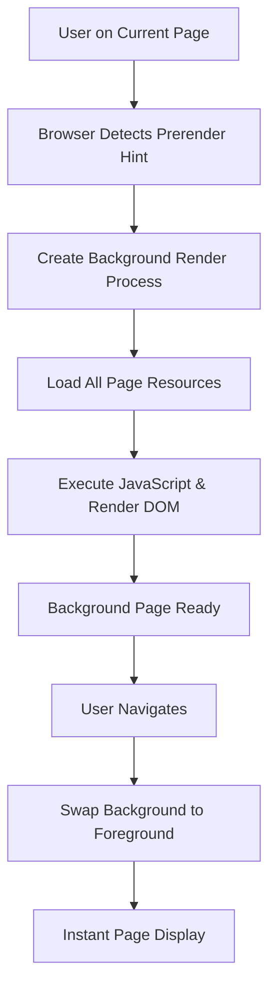

# Web Prerendering: Predictive Page Loading

**Prerendering** is a web performance optimization technique that allows browsers to speculatively load and fully render web pages in the background before users navigate to them. This technology can deliver near-instantaneous page loads by predicting user navigation patterns and pre-preparing complete page resources.

## 📋 **Overview**

### **Core Concept**
Prerendering extends traditional prefetching by not only downloading resources but also fully rendering pages in background processes. When users navigate to a prerendered page, the browser swaps the background page to the foreground, creating an instant loading experience.

### **Performance Metrics**
- **PLT (Page Load Time)**: Browser kernel time from `onPageStarted` to `onPageFinished`
- **PPLT (Perceived Page Load Time)**: User-perceived time from navigation request to visible rendering

### **Historical Context**
- **June 14, 2011**: Google Chrome introduced prerendering support
- **Chrome 17**: First stable release with prerendering capabilities
- **Chrome 35+**: Enhanced resource management and timing optimizations

## 🎯 **How Prerendering Works**

### **Conceptual Overview**



### **Technical Implementation Phases**

#### **Phase 1: Hint Detection**
```html
<!-- Basic prerender syntax -->
<link rel="prerender" href="https://example.com/next-page.html">

<!-- Modern resource hints -->
<link rel="dns-prefetch" href="//example.com">
<link rel="preconnect" href="https://example.com">
<link rel="prefetch" href="/next-page.html">
<link rel="prerender" href="/likely-next-page.html">
```

#### **Phase 2: Background Page Creation**
```cpp
// Simplified Chromium prerender architecture
class PrerenderManager {
 public:
  void AddPrerenderFromLinkElement(const GURL& url,
                                   const url::Origin& origin) {
    // Check resource constraints
    if (CanCreateNewPrerender()) {
      auto prerender_host = std::make_unique<PrerenderHost>(url, origin);
      active_prerenders_[url] = std::move(prerender_host);
      
      // Start background loading process
      StartPrerenderProcess(url);
    }
  }
  
 private:
  std::map<GURL, std::unique_ptr<PrerenderHost>> active_prerenders_;
  
  bool CanCreateNewPrerender() {
    return active_prerenders_.size() < kMaxPrerenders && 
           HasSufficientResources();
  }
};
```

#### **Phase 3: Resource Loading and Rendering**
```cpp
// Background page resource management
class PrerenderHost {
 public:
  void StartLoading() {
    // Create dedicated render process for prerendered page
    render_process_ = CreateRenderProcess();
    
    // Load main resource
    LoadMainResource(prerender_url_);
    
    // Start resource loading timer
    expiration_timer_.Start(
        FROM_HERE,
        base::Milliseconds(kPrerenderTimeToLive),
        base::BindOnce(&PrerenderHost::OnPrerenderExpired,
                      base::Unretained(this)));
  }
  
 private:
  static constexpr int kPrerenderTimeToLive = 30000; // 30 seconds in Chrome 35+
  GURL prerender_url_;
  std::unique_ptr<RenderProcess> render_process_;
  base::OneShotTimer expiration_timer_;
};
```

## 🏗️ **Chromium Implementation Architecture**

### **Process Flow Diagram**

```cpp
// Complete prerender implementation flow
class ChromiumPrerenderFlow {
 public:
  void HandleLinkRelPrerender(const std::string& href) {
    // 1. HTML Parsing Phase
    HTMLLinkElement::ParseAttribute("rel", "prerender");
    
    // 2. Link Loader Processing
    LinkLoader::LoadLink() -> CreatePrerenderHandle();
    
    // 3. IPC Message to Browser Process
    SendPrerenderMessage(PrerenderHostMsg_AddLinkRelPrerender, href);
    
    // 4. Browser Process Management
    PrerenderManager::AddPrerender(href);
    
    // 5. Background Render Process Creation
    CreateBackgroundRenderProcess();
    
    // 6. Resource Loading
    LoadAllPageResources();
    
    // 7. JavaScript Execution
    ExecutePageJavaScript();
    
    // 8. Expiration Management
    SetExpirationTimer();
  }
};
```

### **Key Implementation Files**

#### **Render Process Components**
```cpp
// third_party/blink/renderer/core/html/link_rel_attribute.cpp
class LinkRelAttribute {
  bool IsPrerender() const { return is_prerender_; }
  void SetPrerender() { is_prerender_ = true; }
};

// third_party/blink/renderer/core/loader/link_loader.cpp
class LinkLoader {
  void LoadLink() {
    if (rel_attribute.IsPrerender()) {
      prerender_handle_ = PrerenderHandle::Create(url, initiator_origin);
    }
  }
 private:
  std::unique_ptr<PrerenderHandle> prerender_handle_;
};

// third_party/blink/renderer/core/html/html_link_element.cpp
class HTMLLinkElement {
  void ParseAttribute(const QualifiedName& name, const AtomicString& value) {
    if (name == html_names::kRelAttr) {
      rel_attribute_.Update(value);
      if (rel_attribute_.IsPrerender()) {
        link_loader_->LoadLink();
      }
    }
  }
};
```

#### **Browser Process Management**
```cpp
// chrome/browser/prerender/prerender_manager.cc
class PrerenderManager {
 public:
  void AddPrerenderFromOmnibox(const GURL& url) {
    // Smart address bar prerendering
    if (ShouldPrerenderFromOmnibox(url)) {
      AddPrerender(url, ORIGIN_OMNIBOX);
    }
  }
  
  void OnPrerenderHostMsg_AddLinkRelPrerender(const GURL& url,
                                             const url::Origin& origin) {
    // Handle <link rel="prerender"> requests
    AddPrerender(url, ORIGIN_LINK_REL_PRERENDER);
  }
  
 private:
  void AddPrerender(const GURL& url, PrerenderOrigin origin) {
    // Check if prerender already exists
    if (HasPrerenderForUrl(url)) {
      return;
    }
    
    // Resource constraint checks
    if (!CanCreatePrerender()) {
      RecordPrerenderAbandoned(origin, FINAL_STATUS_TOO_MANY_PROCESSES);
      return;
    }
    
    // Create and start prerender
    auto prerender_host = std::make_unique<PrerenderHost>(
        this, url, origin, base::Time::Now());
    prerender_host->StartPrerendering();
    
    active_prerenders_.push_back(std::move(prerender_host));
  }
};

// chrome/browser/prerender/prerender_message_filter.cc
class PrerenderMessageFilter {
 public:
  bool OnMessageReceived(const IPC::Message& message) {
    switch (message.type()) {
      case PrerenderHostMsg_AddLinkRelPrerender::ID:
        OnAddLinkRelPrerender(message);
        break;
      case PrerenderHostMsg_CancelLinkRelPrerender::ID:
        OnCancelLinkRelPrerender(message);
        break;
    }
    return true;
  }
};
```

### **Resource Management and Constraints**

#### **Memory and Process Limits**
```cpp
class PrerenderResourceManager {
 public:
  bool CanCreatePrerender() const {
    return GetActivePrerendersCount() < GetMaxPrerendersPerOrigin() &&
           GetTotalMemoryUsage() < GetMaxMemoryThreshold() &&
           GetAvailableRenderProcesses() > 0;
  }
  
 private:
  static constexpr int kMaxPrerendersPerOrigin = 1;
  static constexpr int kMaxTotalPrerenders = 8;
  static constexpr size_t kMaxMemoryThresholdMB = 150;
  
  int GetMaxPrerendersPerOrigin() const {
    // On Android, more restrictive limits
    #if BUILDFLAG(IS_ANDROID)
      return 1;
    #else
      return 2;
    #endif
  }
};
```

#### **Expiration and Cleanup**
```cpp
class PrerenderExpirationManager {
 public:
  PrerenderExpirationManager() {
    // Chrome 35+: 30 second expiration
    kPrerenderTimeToLive_ = base::Milliseconds(30000);
  }
  
  void StartExpirationTimer(PrerenderHost* host) {
    expiration_timers_[host] = std::make_unique<base::OneShotTimer>();
    expiration_timers_[host]->Start(
        FROM_HERE,
        kPrerenderTimeToLive_,
        base::BindOnce(&PrerenderExpirationManager::ExpirePrerender,
                      base::Unretained(this), host));
  }
  
 private:
  base::TimeDelta kPrerenderTimeToLive_;
  std::map<PrerenderHost*, std::unique_ptr<base::OneShotTimer>> expiration_timers_;
  
  void ExpirePrerender(PrerenderHost* host) {
    host->Destroy(FINAL_STATUS_TIMED_OUT);
    expiration_timers_.erase(host);
  }
};
```

## 🚫 **Prerendering Limitations and Restrictions**

### **Technical Constraints**

#### **Scenarios Where Prerendering is Disabled**
```cpp
enum class PrerenderFinalStatus {
  FINAL_STATUS_USED = 0,
  FINAL_STATUS_TIMED_OUT = 1,
  FINAL_STATUS_ABANDONED = 2,
  FINAL_STATUS_MEMORY_LIMIT_EXCEEDED = 3,
  FINAL_STATUS_PROCESS_KILLED = 4,
  FINAL_STATUS_NEW_NAVIGATION_ENTRY = 5,
  FINAL_STATUS_PROFILE_DESTROYED = 6,
  FINAL_STATUS_APP_TERMINATING = 7,
  FINAL_STATUS_CROSS_SITE_NAVIGATION_PENDING = 8,
  FINAL_STATUS_DEVTOOLS_ATTACHED = 9,
  FINAL_STATUS_PAGE_BEING_CAPTURED = 10,
  FINAL_STATUS_NAVIGATION_UNCOMMITTED = 11,
  FINAL_STATUS_NON_EMPTY_BROWSING_INSTANCE = 12,
  FINAL_STATUS_JAVASCRIPT_ALERT = 13,
  FINAL_STATUS_REQUEST_FOR_PERMISSION = 14,
  FINAL_STATUS_DOWNLOAD = 15,
  FINAL_STATUS_AUDIO_HANDLER = 16,
  FINAL_STATUS_VIDEO_HANDLER = 17,
  FINAL_STATUS_SSL_CERTIFICATE_ERROR = 18,
  FINAL_STATUS_LOGIN_PROMPT = 19,
  FINAL_STATUS_NON_GET_METHOD = 20,
  FINAL_STATUS_INVALID_HTTP_METHOD = 21,
  FINAL_STATUS_SCHEME_NOT_HTTP = 22,
  FINAL_STATUS_MAX,
};

class PrerenderConditions {
 public:
  bool ShouldPrerenderURL(const GURL& url, content::WebContents* web_contents) {
    // Scheme restrictions
    if (!url.SchemeIsHTTPOrHTTPS()) {
      RecordFinalStatus(FINAL_STATUS_SCHEME_NOT_HTTP);
      return false;
    }
    
    // HTTPS certificate issues
    if (HasSSLCertificateError(url)) {
      RecordFinalStatus(FINAL_STATUS_SSL_CERTIFICATE_ERROR);
      return false;
    }
    
    // Authentication requirements
    if (RequiresHTTPAuthentication(url)) {
      RecordFinalStatus(FINAL_STATUS_LOGIN_PROMPT);
      return false;
    }
    
    // Media content restrictions
    if (ContainsVideoOrAudioContent(url)) {
      RecordFinalStatus(FINAL_STATUS_VIDEO_HANDLER);
      return false;
    }
    
    // Development mode restrictions
    if (IsInDeveloperMode(web_contents)) {
      RecordFinalStatus(FINAL_STATUS_DEVTOOLS_ATTACHED);
      return false;
    }
    
    return true;
  }
};
```

#### **Network and Resource Restrictions**
```cpp
class PrerenderNetworkPolicy {
 public:
  bool AllowNetworkRequest(const network::ResourceRequest& request) {
    // Only allow GET requests
    if (request.method != "GET") {
      return false;
    }
    
    // Block POST, PUT, DELETE requests that could have side effects
    if (request.method == "POST" || request.method == "PUT" || 
        request.method == "DELETE") {
      return false;
    }
    
    // Allow safe navigation requests
    return request.destination == network::mojom::RequestDestination::kDocument ||
           request.destination == network::mojom::RequestDestination::kImage ||
           request.destination == network::mojom::RequestDestination::kScript ||
           request.destination == network::mojom::RequestDestination::kStyle;
  }
};
```

### **User Interface Restrictions**

```cpp
class PrerenderUIPolicy {
 public:
  bool AllowUIInteraction(UIInteractionType interaction) {
    switch (interaction) {
      case UI_JAVASCRIPT_ALERT:
      case UI_JAVASCRIPT_CONFIRM:
      case UI_JAVASCRIPT_PROMPT:
        // JavaScript dialogs immediately cancel prerendering
        return false;
        
      case UI_PERMISSION_REQUEST:
        // Permission requests cancel prerendering
        return false;
        
      case UI_DOWNLOAD_REQUEST:
        // Downloads cancel prerendering
        return false;
        
      case UI_POPUP_WINDOW:
        // Popup windows cancel prerendering
        return false;
        
      default:
        return true;
    }
  }
};
```

## 📊 **Performance Impact and Measurement**

### **Performance Benchmarks (Historical Data)**

```cpp
struct PrerenderPerformanceData {
  std::string site_url;
  int without_prerender_ms;
  int with_prerender_ms;
  double improvement_percentage;
};

// Historical performance data from original implementation
const std::vector<PrerenderPerformanceData> kBenchmarkData = {
  {"www.cmcm.com", 9470, 0, 100.0},      // Instant loading
  {"www.taobao.com", 1112, 0, 100.0},    // Instant loading
  {"news.google.com", 2340, 50, 97.9},   // Near-instant
  {"wikipedia.org", 1850, 80, 95.7}      // Significant improvement
};
```

### **Performance Monitoring Implementation**

```cpp
class PrerenderMetrics {
 public:
  void RecordPrerenderUsage(const GURL& url, bool was_used) {
    if (was_used) {
      // Record successful prerender usage
      UMA_HISTOGRAM_CUSTOM_TIMES(
          "Prerender.PageLoadTime.Used",
          page_load_time_,
          base::Milliseconds(10),
          base::Seconds(60),
          100);
      
      UMA_HISTOGRAM_PERCENTAGE(
          "Prerender.PercentLoadTimeImprovement",
          CalculateImprovementPercentage());
    } else {
      // Record wasted prerender resources
      UMA_HISTOGRAM_CUSTOM_TIMES(
          "Prerender.WastedResourceTime",
          prerender_duration_,
          base::Milliseconds(100),
          base::Minutes(5),
          50);
    }
  }
  
 private:
  double CalculateImprovementPercentage() {
    if (baseline_load_time_.is_zero()) return 0.0;
    
    double improvement = 1.0 - (page_load_time_.InMillisecondsF() / 
                                baseline_load_time_.InMillisecondsF());
    return std::max(0.0, std::min(100.0, improvement * 100.0));
  }
  
  base::TimeDelta page_load_time_;
  base::TimeDelta baseline_load_time_;
  base::TimeDelta prerender_duration_;
};
```

### **Resource Usage Analysis**

```cpp
class PrerenderResourceAnalyzer {
 public:
  struct ResourceUsage {
    size_t memory_mb;
    int cpu_percentage;
    int network_requests;
    size_t bandwidth_kb;
  };
  
  ResourceUsage AnalyzePrerenderCost(const PrerenderHost* host) {
    ResourceUsage usage;
    
    // Memory analysis
    usage.memory_mb = CalculateMemoryUsage(host);
    
    // CPU analysis
    usage.cpu_percentage = CalculateCPUUsage(host);
    
    // Network analysis
    usage.network_requests = CountNetworkRequests(host);
    usage.bandwidth_kb = CalculateBandwidthUsage(host);
    
    return usage;
  }
  
 private:
  size_t CalculateMemoryUsage(const PrerenderHost* host) {
    // Calculate memory for render process, DOM, JavaScript heap, images
    size_t render_process_memory = host->GetRenderProcessMemory();
    size_t resource_memory = host->GetResourceCacheMemory();
    return (render_process_memory + resource_memory) / 1024 / 1024; // MB
  }
};
```

## 🧪 **Detection and Testing**

### **Page Visibility API Integration**

```javascript
// Detecting prerender state in web pages
class PrerenderDetector {
  static isPagePrerendering() {
    // Use Page Visibility API to detect prerendering
    return document.visibilityState === 'prerender';
  }
  
  static setupPrerenderListeners() {
    document.addEventListener('visibilitychange', () => {
      if (document.visibilityState === 'prerender') {
        console.log('Page is being prerendered');
        // Defer heavy operations until page becomes visible
        this.deferHeavyOperations();
      } else if (document.visibilityState === 'visible') {
        console.log('Prerendered page became visible');
        // Execute deferred operations
        this.executeDeferredOperations();
      }
    });
  }
  
  static deferHeavyOperations() {
    // Defer expensive operations during prerendering
    this.deferredOperations = [];
    
    // Stop auto-playing media
    document.querySelectorAll('video, audio').forEach(media => {
      if (!media.paused) {
        media.pause();
        this.deferredOperations.push(() => media.play());
      }
    });
    
    // Pause animations
    document.querySelectorAll('.animation').forEach(element => {
      element.style.animationPlayState = 'paused';
      this.deferredOperations.push(() => {
        element.style.animationPlayState = 'running';
      });
    });
  }
  
  static executeDeferredOperations() {
    this.deferredOperations?.forEach(operation => operation());
    this.deferredOperations = [];
  }
}

// Initialize prerender detection
if (typeof document !== 'undefined') {
  PrerenderDetector.setupPrerenderListeners();
}
```

### **Developer Testing Tools**

```javascript
// Prerender testing utilities
class PrerenderTester {
  static async testPrerenderSupport(url) {
    // Create test prerender link
    const prerenderLink = document.createElement('link');
    prerenderLink.rel = 'prerender';
    prerenderLink.href = url;
    
    return new Promise((resolve) => {
      let prerenderDetected = false;
      
      // Monitor Chrome Task Manager for prerender process
      const checkInterval = setInterval(() => {
        // This would typically require browser extension or DevTools API
        if (this.detectPrerenderProcess(url)) {
          prerenderDetected = true;
          clearInterval(checkInterval);
          resolve({ supported: true, active: true });
        }
      }, 100);
      
      // Timeout after 5 seconds
      setTimeout(() => {
        clearInterval(checkInterval);
        resolve({ supported: false, active: false });
      }, 5000);
      
      // Add link to trigger prerendering
      document.head.appendChild(prerenderLink);
    });
  }
  
  static detectPrerenderProcess(url) {
    // In real implementation, this would use Chrome DevTools Protocol
    // or browser extension APIs to check for prerender processes
    return false; // Placeholder
  }
  
  static measurePrerenderPerformance(url) {
    const startTime = performance.now();
    
    // Navigate to prerendered page
    window.location.href = url;
    
    // Measure time to interactive
    return new Promise((resolve) => {
      const observer = new PerformanceObserver((list) => {
        for (const entry of list.getEntries()) {
          if (entry.entryType === 'navigation') {
            const loadTime = entry.loadEventEnd - entry.navigationStart;
            resolve({
              navigationStart: entry.navigationStart,
              loadEventEnd: entry.loadEventEnd,
              totalLoadTime: loadTime,
              prerenderingUsed: loadTime < 100 // Likely prerendered if < 100ms
            });
          }
        }
      });
      observer.observe({ entryTypes: ['navigation'] });
    });
  }
}
```

### **Chrome DevTools Integration**

```cpp
// DevTools prerender inspection support
class PrerenderDevToolsAgent {
 public:
  void OnPrerenderStarted(const GURL& url) {
    // Send DevTools event
    auto event = std::make_unique<base::DictionaryValue>();
    event->SetString("type", "prerenderStarted");
    event->SetString("url", url.spec());
    event->SetDouble("timestamp", base::Time::Now().ToDoubleT());
    
    SendDevToolsEvent("Prerender.prerenderStarted", std::move(event));
  }
  
  void OnPrerenderCompleted(const GURL& url, PrerenderFinalStatus status) {
    auto event = std::make_unique<base::DictionaryValue>();
    event->SetString("type", "prerenderCompleted");
    event->SetString("url", url.spec());
    event->SetString("finalStatus", PrerenderFinalStatusString(status));
    event->SetDouble("timestamp", base::Time::Now().ToDoubleT());
    
    SendDevToolsEvent("Prerender.prerenderCompleted", std::move(event));
  }
};
```

## 🔧 **Configuration and Control**

### **Command Line Switches**

```bash
# Disable prerender from omnibox (address bar)
--prerender-from-omnibox=disabled

# Enable prerender from omnibox
--prerender-from-omnibox=enabled

# Disable all prerendering
--disable-prerender

# Enable prerender debugging
--enable-prerender-debugging

# Set custom prerender TTL (Time To Live)
--prerender-ttl-seconds=45

# Limit number of prerenders
--max-prerenders=2

# Enable prerender on low-end devices (normally disabled)
--enable-prerender-low-end-device
```

### **Enterprise Policy Configuration**

```cpp
// Enterprise policy support for prerendering
class PrerenderPolicy {
 public:
  enum class PrerenderPolicyValue {
    ENABLED,
    DISABLED,
    AUTO  // Decide based on device capabilities
  };
  
  static PrerenderPolicyValue GetPrerenderPolicy() {
    const PrefService* prefs = GetPrefService();
    
    if (prefs->IsManagedPreference(prefs::kNetworkPredictionEnabled)) {
      // Enterprise policy override
      bool enabled = prefs->GetBoolean(prefs::kNetworkPredictionEnabled);
      return enabled ? PrerenderPolicyValue::ENABLED : 
                      PrerenderPolicyValue::DISABLED;
    }
    
    // Default to auto-detection
    return PrerenderPolicyValue::AUTO;
  }
};
```

### **User Preference Integration**

```cpp
class PrerenderPreferences {
 public:
  void RegisterPreferences() {
    registry_->RegisterBooleanPref(prefs::kNetworkPredictionEnabled, true);
    registry_->RegisterBooleanPref(prefs::kPrerenderFromOmniboxEnabled, true);
    registry_->RegisterIntegerPref(prefs::kMaxPrerendersPerOrigin, 1);
  }
  
  bool IsPrerenderingEnabled() {
    PrefService* prefs = GetPrefService();
    return prefs->GetBoolean(prefs::kNetworkPredictionEnabled) &&
           prefs->GetBoolean(prefs::kPrerenderFromOmniboxEnabled);
  }
  
 private:
  PrefRegistrySimple* registry_;
};
```

## 🔄 **Evolution to Modern Specifications**

### **Prerendering v2 (Speculation Rules API)**

The original `<link rel="prerender">` approach has evolved into the modern **Speculation Rules API**:

```javascript
// Modern prerendering with Speculation Rules API (Chrome 103+)
const speculationRules = {
  "prerender": [{
    "where": { "href_matches": "/article/*" },
    "eagerness": "moderate"
  }]
};

// Install speculation rules
const script = document.createElement('script');
script.type = 'speculationrules';
script.textContent = JSON.stringify(speculationRules);
document.head.appendChild(script);
```

### **Integration with Modern Web APIs**

```cpp
// Modern prerendering integration with web platform features
class ModernPrerenderIntegration {
 public:
  void HandleNavigationAPI(const GURL& url) {
    // Integration with Navigation API
    if (IsNavigationAPINavigation(url)) {
      // Modern single-page app navigation
      HandleSPAPrerender(url);
    }
  }
  
  void HandleServiceWorkerPrerender(const GURL& url) {
    // Service Worker integration for offline-capable prerendering
    if (HasServiceWorker(url)) {
      // Allow SW to control prerender resource loading
      EnableServiceWorkerPrerender(url);
    }
  }
};
```

## 📚 **Best Practices and Guidelines**

### **Implementation Best Practices**

```html
<!-- Effective prerender hints -->
<!DOCTYPE html>
<html>
<head>
  <!-- Prerender likely next pages -->
  <link rel="prerender" href="/next-article">
  
  <!-- Combine with other resource hints -->
  <link rel="dns-prefetch" href="//cdn.example.com">
  <link rel="preconnect" href="https://api.example.com">
  <link rel="prefetch" href="/images/hero-image.jpg">
</head>
<body>
  <!-- Content that suggests next navigation -->
  <a href="/next-article">Continue Reading</a>
</body>
</html>
```

### **JavaScript Optimization for Prerendering**

```javascript
class PrerenderOptimizedApp {
  constructor() {
    this.isPrerendering = document.visibilityState === 'prerender';
    this.setupPrerenderHandling();
  }
  
  setupPrerenderHandling() {
    if (this.isPrerendering) {
      // Defer expensive operations
      this.deferAnalytics();
      this.deferVideoLoading();
      this.deferAnimations();
      
      // Listen for visibility change
      document.addEventListener('visibilitychange', () => {
        if (document.visibilityState === 'visible') {
          this.activatePrerrenderedPage();
        }
      });
    }
  }
  
  deferAnalytics() {
    // Don't track page views during prerendering
    this.deferredAnalytics = () => {
      gtag('event', 'page_view', { 
        page_title: document.title,
        page_location: location.href 
      });
    };
  }
  
  activatePrerrenderedPage() {
    // Execute deferred operations when page becomes visible
    this.deferredAnalytics?.();
    this.startVideos();
    this.startAnimations();
  }
}
```

### **Performance Optimization Guidelines**

```cpp
// Guidelines for optimal prerender performance
class PrerenderOptimizationGuidelines {
 public:
  static std::vector<std::string> GetBestPractices() {
    return {
      "Only prerender pages with high navigation probability (>30%)",
      "Avoid prerendering pages with heavy media content",
      "Defer analytics and tracking during prerender phase",
      "Use Page Visibility API to detect prerender state",
      "Implement proper resource cleanup on prerender abandonment",
      "Monitor prerender usage rates and adjust hints accordingly",
      "Consider user's network conditions (avoid on slow connections)",
      "Respect user's data preferences and battery state"
    };
  }
};
```

## 🎯 **Key Takeaways**

### **Technical Benefits**
1. **Near-Instant Page Loads**: Up to 100% improvement in perceived load time
2. **Background Processing**: Full page preparation without user awareness
3. **Resource Efficiency**: Intelligent expiration and cleanup mechanisms
4. **Smart Triggering**: Both manual hints and automatic browser predictions

### **Implementation Considerations**
1. **Resource Constraints**: Memory, CPU, and network overhead
2. **User Experience**: Proper handling of media, analytics, and interactions
3. **Security Boundaries**: Restrictions on authenticated and HTTPS content
4. **Performance Monitoring**: Comprehensive metrics and optimization tracking

### **Modern Evolution**
1. **Speculation Rules API**: Modern declarative prerendering approach
2. **Service Worker Integration**: Enhanced offline capabilities
3. **Navigation API**: Better single-page application support
4. **Privacy Considerations**: Improved user consent and control mechanisms

---

## 📚 **Additional Resources**

### **Specifications and Standards**
- [Resource Hints W3C Specification](https://www.w3.org/TR/resource-hints/) - Official prerendering standard
- [Speculation Rules API](https://wicg.github.io/nav-speculation/speculation-rules.html) - Modern prerendering approach
- [Page Visibility API](https://www.w3.org/TR/page-visibility/) - Detecting prerender state

### **Chromium Implementation**
- [Prerender Design Document](https://www.chromium.org/developers/design-documents/prerender) - Original Chromium implementation
- [Chrome Prerendering Blog Post](http://blog.chromium.org/2011/06/prerendering-in-chrome.html) - Initial announcement
- [Prerender Testing Tool](http://prerender-test.appspot.com/) - Browser support testing

### **Related Documentation**
- [Performance Optimization](../performance/overview.md) - Browser performance optimization strategies
- [Navigation Concepts](../architecture/navigation_concepts.md) - Navigation architecture and optimization
- [Networking HTTP](../modules/networking-http.md) - Network layer implementation details
- [Browser Protocol Schemes](../security/browser-protocol-schemes.md) - Security implications of prerendering

### **Modern Alternatives**
- [Navigation API Documentation](https://wicg.github.io/navigation-api/) - Modern navigation control
- [Service Worker Specification](https://w3c.github.io/ServiceWorker/) - Offline-capable web applications
- [Web Performance Optimization Guide](../performance/profiling.md) - Comprehensive performance optimization

---

*Prerendering represents a significant advancement in web performance optimization, demonstrating how browsers can intelligently predict user behavior to deliver exceptional user experiences. While the original implementation has evolved into modern Speculation Rules API, the core concepts and architectural patterns remain fundamental to understanding predictive loading strategies in Chromium.*