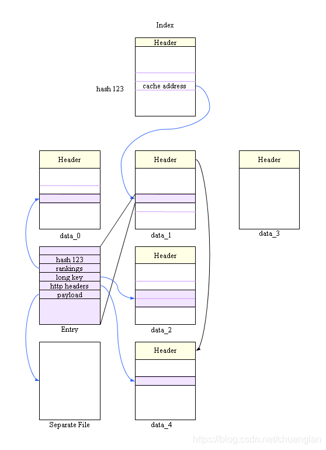

# Disk Cache Design Principles

This deep-dive covers Chromium’s on-disk cache: its goals, on-disk format, key interfaces, and implementation notes.

---

## 1. Overview

The disk cache stores web-fetched resources for fast later access. Key characteristics:

- **Size Bound**  
  The cache must not grow without limit; an eviction algorithm decides when to remove old entries.
- **Crash Resilience**  
  Survives application crashes by discarding only entries in use at crash time. A full system crash may still wipe the entire cache.
- **Efficient Access**  
  Supports both synchronous and asynchronous operations with low latency.
- **Conflict Avoidance**  
  Layout prevents simultaneous-store conflicts (cache thrashing).
- **Entry Removal**  
  Individual entries can be removed; existing handles continue to function, and new opens fail as if the entry never existed.
- **Single-threaded Assumption**  
  Callers share one thread; callbacks are posted on the thread’s message loop to avoid reentrancy.

---

## 2. External Interfaces

Chromium’s cache API (in `src/net/disk_cache/disk_cache.h`) exposes:

- **`disk_cache::Backend`**  
  Enumerate entries, open existing or create new entries.
- **`disk_cache::Entry`**  
  Read/write data streams for a single resource.

Each entry has a unique key (e.g., `http://example.com/favicon.ico`). Data is stored in separate streams (HTTP headers vs. payload), indexed by stream ID in `Entry::ReadData`/`WriteData`.

---

## 3. On-Disk Format

All cache files live under a `cache/` directory. Chromium uses at least:

- **1 Index File**  
  Contains a memory-mapped hash table mapping keys to addresses.
- **≥4 Block-Files** (`data_n`)  
  Store fixed-size blocks (e.g., 256 B). Each file grows by 1 KB-aligned increments and chains to same-size files via headers.
- **Separate Files** (`f_xx`)  
  Resources > 16 KB bypass block-files and live in standalone files.

### 3.1 Cache Address

A 32-bit value directing to:

- A block-file (file number, start block, block count, block type)
- A separate file (hex identifier)

Defined in `disk_cache/addr.h`, it enables unified handling of diverse data.

### 3.2 Index File Structure

Defined in `disk_cache/disk_format.h`:

```text
IndexHeader
HashTable (size ≥ kIndexTableSize, actual length in header.table_len)
```

- Memory-mapped for rapid key→address lookup (using low-order hash bits).
- Header includes magic number + major/minor version; a major bump is incompatible.

### 3.3 Block-File Structure

Also in `disk_cache/disk_format.h`:

- **Header (8 KB)**: memory-mapped bitmap tracks up to ~64K blocks.
- **Data blocks**: fixed size (e.g., 256 B). Files grow by 1 024 blocks until full, then link to a new file of same block size via `next_file`.

Blocks align on 4-block boundaries to simplify allocation:

1. A record uses 1–4 contiguous blocks.  
2. Allocations jump to the next aligned region if needed.  

Header fields `empty_slots` and `hints` optimize allocation and detect crashes mid-update.

### 3.4 Cache Entry Layout

Each entry splits into two structures:

- **`EntryStore`** (1–4 blocks of 256 B)  
  Stores key hash, stream addresses, pointer to next collision, and optional out-of-line key pointer.
- **`RankingsNode`** (36 B, its own block-files)  
  Tracks eviction metadata; marked in-use while open.

### 3.5 The Big Picture

A typical cache has:

1. One index file  
2. Multiple block-files (256 B, 1 KB, 4 KB) chained by size  
3. Separate files for large payloads

Entries link across streams and files via cache addresses.  


---

## 4. Implementation Notes

### 4.1 Two Backends

- **Disk-based** (`disk_cache/backend_impl.cc`, `entry_impl.cc`)  
- **In-memory** (`disk_cache/mem_backend_impl.cc`) for Incognito mode

Cache types (media, AppCache, general) share APIs but may differ in eviction.

### 4.2 Lower-Level I/O

OS abstractions in `disk_cache/file.h` & `mapped_file.h`.  
`disk_cache::BlockFiles` manages block-file access.  
`StorageBlock<T>` template handles loading/storing of `EntryStore` or `RankingsNode`.

### 4.3 Eviction

- **Ranking lists**: `disk_cache/rankings` (and `mem_rankings`).  
- **Eviction logic**: `disk_cache/eviction` implements LRU and reuse/age-aware variants.  
- **Transactions**: ensure consistency across crashes.  
- **Multiple lists** by reuse frequency plus a “recently evicted” list.

### 4.4 Buffering

- Buffers up to 16 KB per stream before first disk write.  
- Grows to 1 MB or a global cap.  
- Minimizes disk I/O for small entries and computes record size for address allocation.

### 4.5 Deleting Entries

- `Doom*()` methods mark entries for deferred deletion after all handles close.  
- Doomed entries removed from index; new opens create fresh entries.

### 4.6 Enumeration

- Example: `URLRequestViewCacheJob` iterates entries (order not guaranteed, can be slow).

### 4.7 Sparse Data

- Supports two streams: regular + sparse.  
- Sparse data split into child entries linked from a parent (`disk_cache/sparse_control`).

### 4.8 Dedicated Cache Thread

- A background cache thread handles file I/O, offloading the browser I/O thread (IPC/UI).  
- Uses task posting (`in_flight_io` / `in_flight_backend_io`).  
- No locking: some calls (e.g. `GetDataSize`) may race with writes.

---

## 5. Data Integrity

Balancing performance vs. crash resilience:

- Leverages OS file-cache; no journaling to avoid complexity.  
- Memory-mapped headers flush latest state on crash.  
- On system crash, eviction lists may corrupt; the fallback is to discard the cache rather than risk inconsistency.

*End of Disk Cache Design Principles Deep Dive*

