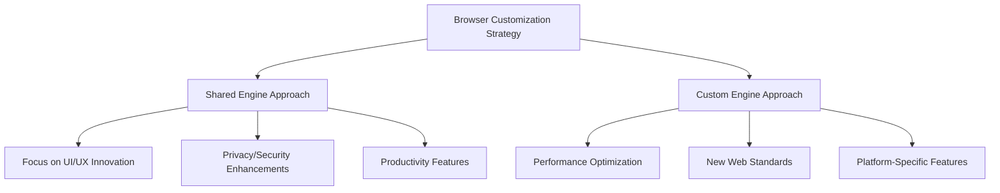

# Browser Customization and Implementation Tutorial

Learn how to create a differentiated Chromium-based browser by studying real-world implementation strategies. This comprehensive tutorial examines how browsers like Vivaldi successfully customize the Chromium foundation to create unique user experiences.

## 🎯 **Tutorial Overview**

**Duration**: 60 minutes  
**Difficulty**: Intermediate to Advanced  
**Prerequisites**: Understanding of Chromium architecture and build system

### **What You'll Learn**

1. **Browser Differentiation Strategies** - How to distinguish your browser from Chrome
2. **UI Customization Techniques** - Creating unique interfaces while maintaining compatibility
3. **Privacy-First Architecture** - Implementing user-centric privacy features
4. **Service Independence** - Building custom backend services and sync systems
5. **Business Model Integration** - Aligning technical decisions with revenue strategies

## 📋 **Case Study: Vivaldi Browser Architecture**

Vivaldi provides an excellent example of successful Chromium customization through their three-part architecture approach:

### **Part 1: Shared Foundation (Blink Engine)**
Vivaldi demonstrates the strategic advantage of maintaining engine compatibility:

- **Engine Selection**: Uses Chromium's Blink rendering engine unchanged
- **Compatibility Benefit**: Maintains 100% web standards compatibility
- **Development Efficiency**: Leverages Google's extensive engine development and testing
- **Security Advantage**: Benefits from Chromium's security updates and patches

**Key Insight**: *Focus customization efforts on areas that add user value rather than rebuilding core web technology.*

### **Part 2: Custom User Interface**

Vivaldi's approach to UI customization showcases advanced browser personalization:

#### **Web Technology-Based UI**
```javascript
// Example: Vivaldi's UI customization approach
class BrowserInterface {
  constructor() {
    this.customUI = new WebComponentUI();
    this.themeSystem = new AdvancedTheming();
    this.layoutManager = new FlexibleLayout();
  }

  initializeCustomInterface() {
    // Custom sidebar implementation
    this.createSidebar({
      panels: ['bookmarks', 'history', 'notes', 'downloads'],
      customizable: true,
      position: 'left' // User configurable
    });

    // Advanced tab management
    this.enhancedTabs = new TabGroupManager({
      stacking: true,
      workspaces: true,
      hibernation: true
    });
  }
}
```

#### **Theming and Personalization Features**
- **Adaptive Color Schemes**: Dynamic theming based on webpage content
- **Layout Flexibility**: Moveable toolbars, configurable panels
- **User-Centric Design**: Prioritizing power user features over simplicity

### **Part 3: Independent Services Architecture**

Vivaldi's service independence strategy demonstrates privacy-focused backend design:

#### **Custom Sync System**
```cpp
// Conceptual implementation of independent sync service
class VivaldiSyncService : public SyncServiceBase {
 public:
  VivaldiSyncService() : SyncServiceBase(false /* no_google_services */) {
    // Initialize privacy-focused sync infrastructure
    sync_backend_ = std::make_unique<PrivacySyncBackend>();
    encryption_manager_ = std::make_unique<E2EEncryption>();
  }

  void InitializeSync() override {
    // Use Vivaldi-hosted sync servers instead of Google's
    sync_backend_->SetEndpoint("https://sync.vivaldi.net/api/v1/");
    
    // Implement zero-knowledge encryption
    encryption_manager_->EnableClientSideEncryption();
    
    SyncServiceBase::InitializeSync();
  }

 private:
  std::unique_ptr<PrivacySyncBackend> sync_backend_;
  std::unique_ptr<E2EEncryption> encryption_manager_;
};
```

## 🏗️ **Implementation Guide: Building Your Custom Browser**

### **Step 1: Architecture Planning**

Before customizing Chromium, define your browser's unique value proposition:

#### **Differentiation Analysis**
1. **Target Audience**: Identify specific user needs not met by existing browsers
2. **Core Features**: Define 3-5 distinctive features that justify a new browser
3. **Technical Approach**: Choose between UI customization vs. engine modification
4. **Business Model**: Align technical decisions with revenue strategy

#### **Technical Strategy Selection**


**Recommendation**: Follow Vivaldi's shared engine approach for faster development and better compatibility.

### **Step 2: UI Customization Framework**

#### **Modern UI Architecture Setup**
```cpp
// browser/ui/views/custom_browser_view.h
#ifndef BROWSER_UI_VIEWS_CUSTOM_BROWSER_VIEW_H_
#define BROWSER_UI_VIEWS_CUSTOM_BROWSER_VIEW_H_

#include "chrome/browser/ui/views/frame/browser_view.h"
#include "ui/views/view.h"

class CustomBrowserView : public BrowserView {
 public:
  explicit CustomBrowserView(std::unique_ptr<Browser> browser);
  ~CustomBrowserView() override;

  // BrowserView overrides
  void InitViews() override;
  void Layout() override;
  
 private:
  void SetupCustomToolbar();
  void CreateSidePanels();
  void InitializeThemeSystem();
  
  // Custom UI components
  std::unique_ptr<views::View> custom_toolbar_;
  std::unique_ptr<views::View> side_panels_;
  std::unique_ptr<ThemeManager> theme_manager_;
  
  DISALLOW_COPY_AND_ASSIGN(CustomBrowserView);
};

#endif  // BROWSER_UI_VIEWS_CUSTOM_BROWSER_VIEW_H_
```

#### **Web-Based UI Components**
```typescript
// Example: Implementing flexible UI with web technologies
interface CustomUIComponent {
  readonly id: string;
  readonly position: 'toolbar' | 'sidebar' | 'statusbar';
  readonly configurable: boolean;
}

class BrowserCustomizer {
  private components: Map<string, CustomUIComponent> = new Map();
  
  registerComponent(component: CustomUIComponent): void {
    this.components.set(component.id, component);
    this.attachToUI(component);
  }
  
  private attachToUI(component: CustomUIComponent): void {
    const targetContainer = this.getContainer(component.position);
    const webview = new WebView({
      src: `chrome-extension://ui-components/${component.id}/index.html`,
      partition: 'ui-context',
      allowScripts: true
    });
    
    targetContainer.appendChild(webview);
  }
}
```

### **Step 3: Privacy-First Architecture**

#### **Data Collection Minimization**
```cpp
// Disabling Google services and telemetry
class PrivacyBrowserMainParts : public ChromeBrowserMainParts {
 public:
  void PreCreateMainMessageLoop() override {
    // Disable Google services
    command_line->AppendSwitch(switches::kDisableBackgroundNetworking);
    command_line->AppendSwitch(switches::kDisableDefaultApps);
    command_line->AppendSwitch(switches::kDisableSync);
    
    ChromeBrowserMainParts::PreCreateMainMessageLoop();
  }
  
  void PreMainMessageLoopRun() override {
    // Initialize privacy-focused alternatives
    browser_process()->SetSyncService(CreatePrivateSyncService());
    browser_process()->SetSafeBrowsingService(CreatePrivateSafeBrowsing());
    
    ChromeBrowserMainParts::PreMainMessageLoopRun();
  }
};
```

#### **Custom Search and Default Services**
```cpp
// Setting custom default search engine and services
class CustomProfileManager : public ProfileManager {
 public:
  void InitProfileUserPrefs(Profile* profile) override {
    // Set custom search engine as default
    TemplateURLService* template_url_service = 
        TemplateURLServiceFactory::GetForProfile(profile);
    
    TemplateURLData custom_search_data;
    custom_search_data.SetShortName(u"Custom Search");
    custom_search_data.SetKeyword(u"custom");
    custom_search_data.SetURL("https://yoursearch.com/search?q={searchTerms}");
    
    TemplateURL* custom_search = 
        template_url_service->Add(std::make_unique<TemplateURL>(custom_search_data));
    template_url_service->SetUserSelectedDefaultSearchProvider(custom_search);
  }
};
```

### **Step 4: Extension Compatibility Strategy**

#### **Chrome Extension Support**
```cpp
// Maintaining Chrome Web Store compatibility
class CustomExtensionSystem : public extensions::ExtensionSystem {
 public:
  void Init() override {
    // Enable Chrome Web Store access
    extension_service_->set_extensions_enabled(true);
    extension_service_->set_show_extensions_prompts(true);
    
    // Add custom extension sources
    extension_service_->AddProviderPinned(
        std::make_unique<CustomExtensionProvider>());
    
    extensions::ExtensionSystem::Init();
  }
};
```

### **Step 5: Build System Integration**

#### **Custom Browser Target Configuration**
```python
# BUILD.gn configuration for custom browser
executable("custom_browser") {
  sources = [
    "app/custom_main.cc",
    "browser/custom_browser_main_parts.cc",
    "browser/ui/views/custom_browser_view.cc",
  ]
  
  deps = [
    "//chrome/browser",
    "//chrome/browser/ui",
    "//content/public/app",
    "//ui/views",
  ]
  
  defines = [
    "CUSTOM_BROWSER_IMPLEMENTATION",
    "DISABLE_GOOGLE_SERVICES",
  ]
  
  # Custom branding
  if (custom_branding) {
    sources += [
      "app/custom_branding.cc",
      "app/theme/custom_theme_resources.cc",
    ]
    
    deps += [ "//custom/branding:resources" ]
  }
}
```

## 🔒 **Privacy Implementation Strategies**

### **Data Minimization Techniques**

#### **Network Request Filtering**
```cpp
// Implementing request interception for privacy
class PrivacyNetworkDelegate : public net::NetworkDelegateImpl {
 public:
  int OnBeforeURLRequest(net::URLRequest* request,
                        net::CompletionOnceCallback callback,
                        GURL* new_url) override {
    
    // Block tracking domains
    if (IsTrackingDomain(request->url().host())) {
      return net::ERR_BLOCKED_BY_CLIENT;
    }
    
    // Strip tracking parameters
    if (HasTrackingParams(request->url())) {
      *new_url = StripTrackingParams(request->url());
      return net::OK;
    }
    
    return net::OK;
  }
  
 private:
  bool IsTrackingDomain(const std::string& domain) {
    // Check against privacy filter lists
    return privacy_filter_->IsBlocked(domain);
  }
  
  std::unique_ptr<PrivacyFilterList> privacy_filter_;
};
```

### **Secure Sync Implementation**
```cpp
// Zero-knowledge sync service implementation
class SecureSyncService : public syncer::SyncService {
 public:
  void InitializeSync() override {
    // Client-side encryption setup
    crypto_->GenerateLocalKeys();
    crypto_->SetPassphraseRequired(true);
    
    // Use custom sync servers
    sync_client_->SetServerEndpoint(GetCustomSyncEndpoint());
    
    syncer::SyncService::InitializeSync();
  }
  
 private:
  std::string GetCustomSyncEndpoint() {
    return "https://your-sync-server.com/api/v1/sync";
  }
  
  std::unique_ptr<ClientSideCrypto> crypto_;
};
```

## 💰 **Business Model Integration**

### **Non-Advertising Revenue Strategies**

Understanding how business models affect technical implementation:

#### **Subscription-Based Features**
```cpp
class PremiumFeatureManager {
 public:
  bool IsFeatureAvailable(const std::string& feature_name) {
    if (!subscription_service_->HasActiveSubscription()) {
      return IsFreeFeature(feature_name);
    }
    return true;
  }
  
  void EnablePremiumFeatures() {
    feature_flags_->EnableFlag("advanced_tab_management");
    feature_flags_->EnableFlag("cloud_sync");
    feature_flags_->EnableFlag("advanced_theming");
  }
  
 private:
  std::unique_ptr<SubscriptionService> subscription_service_;
  std::unique_ptr<FeatureFlagManager> feature_flags_;
};
```

#### **Partnership Integration**
```cpp
// Example: Search engine revenue sharing
class RevenuePartnership {
 public:
  void SetDefaultSearchProvider(const std::string& partner_id) {
    if (partnerships_->HasActivePartnership(partner_id)) {
      search_service_->SetDefaultProvider(partner_id);
      analytics_->TrackRevenue(partner_id, "search_default");
    }
  }
  
 private:
  std::unique_ptr<PartnershipManager> partnerships_;
  std::unique_ptr<RevenueAnalytics> analytics_;
};
```

## 🧪 **Testing Your Custom Browser**

### **Compatibility Testing**
```cpp
// Automated testing framework for browser customization
class BrowserCompatibilityTest : public testing::Test {
 public:
  void SetUp() override {
    custom_browser_ = CreateCustomBrowser();
    test_server_ = CreateTestServer();
  }
  
  void TestWebStandardsCompliance() {
    // Run web platform tests
    WebPlatformTestRunner runner(custom_browser_);
    EXPECT_TRUE(runner.RunTests("css/", "html/", "dom/"));
  }
  
  void TestExtensionCompatibility() {
    // Test popular Chrome extensions
    ExtensionTester tester(custom_browser_);
    EXPECT_TRUE(tester.TestExtension("ublock-origin"));
    EXPECT_TRUE(tester.TestExtension("lastpass"));
  }
};
```

### **Performance Benchmarking**
```cpp
// Performance regression testing
class CustomBrowserBenchmarks {
 public:
  void RunStartupBenchmark() {
    auto start_time = base::TimeTicks::Now();
    custom_browser_->Launch();
    auto end_time = base::TimeTicks::Now();
    
    EXPECT_LT(end_time - start_time, base::Seconds(3));
  }
  
  void RunMemoryUsageBenchmark() {
    custom_browser_->LoadTestSites();
    size_t memory_usage = GetMemoryUsage(custom_browser_);
    
    // Should not exceed Chrome by more than 15%
    size_t chrome_usage = GetMemoryUsage(chrome_browser_);
    EXPECT_LT(memory_usage, chrome_usage * 1.15);
  }
};
```

## 🚀 **Deployment and Distribution**

### **Update System Implementation**
```cpp
// Custom update mechanism
class CustomUpdateService : public update_client::UpdateService {
 public:
  void CheckForUpdates() override {
    update_checker_->CheckForUpdates(
        GetCustomUpdateURL(),
        base::BindOnce(&CustomUpdateService::OnUpdateAvailable,
                      base::Unretained(this)));
  }
  
 private:
  std::string GetCustomUpdateURL() {
    return "https://updates.yourbrowser.com/check";
  }
  
  std::unique_ptr<CustomUpdateChecker> update_checker_;
};
```

### **Distribution Strategy**
- **Direct Distribution**: Bypass app stores for better control
- **Enterprise Deployment**: MSI packages, Group Policy support
- **Auto-Update System**: Secure, incremental updates
- **Crash Reporting**: Privacy-focused crash collection

## 📊 **Success Metrics and Analytics**

### **Privacy-Compliant Analytics**
```cpp
// Anonymous usage analytics
class PrivacyAnalytics {
 public:
  void TrackFeatureUsage(const std::string& feature) {
    if (!user_prefs_->GetBoolean("analytics_enabled")) {
      return;  // Respect user privacy preferences
    }
    
    // Hash and anonymize data
    std::string hashed_feature = crypto::SHA256HashString(feature);
    analytics_client_->SendAnonymousEvent(hashed_feature);
  }
  
 private:
  std::unique_ptr<AnonymousAnalyticsClient> analytics_client_;
  PrefService* user_prefs_;
};
```

## 🎯 **Key Takeaways**

### **Successful Browser Differentiation Strategies**

1. **Focus on User Value**: Solve specific problems that existing browsers don't address
2. **Maintain Compatibility**: Use shared engine approach for web standards compliance
3. **Privacy by Design**: Build privacy features into the architecture from day one
4. **Sustainable Business Model**: Align technical features with revenue strategy
5. **Iterative Development**: Start with core differentiating features, expand gradually

### **Common Pitfalls to Avoid**

1. **Over-Engineering**: Don't rebuild components that work well in Chromium
2. **Breaking Compatibility**: Avoid changes that break web standards or extensions
3. **Performance Regression**: Monitor performance impact of customizations
4. **Security Vulnerabilities**: Maintain security update cadence with upstream Chromium
5. **User Experience Complexity**: Keep interfaces intuitive despite advanced features

## 📚 **Additional Resources**

### **Related Documentation**
- [Chromium Architecture Overview](../architecture/overview.md) - Understanding the foundation
- [Extension API System](../features/extension-api-system.md) - Building compatible extension support
- [Privacy and Security](../security/security-model.md) - Implementing security best practices
- [Build System Guide](../getting-started/setup-build.md) - Custom build configurations

### **Real-World Examples**
- **Vivaldi**: Privacy-focused productivity browser with advanced UI customization
- **Brave**: Privacy and cryptocurrency integration
- **Edge**: Microsoft integration and enterprise features
- **Opera**: VPN, messaging, and productivity tools integration

### **Development Tools**
- Chromium source code analysis tools
- Browser compatibility testing frameworks
- Performance profiling and benchmarking suites
- Privacy audit and compliance verification tools

---

**Next Tutorial**: [Advanced IPC Customization](./advanced-ipc-customization.md) - Learn how to implement custom inter-process communication for unique browser features.